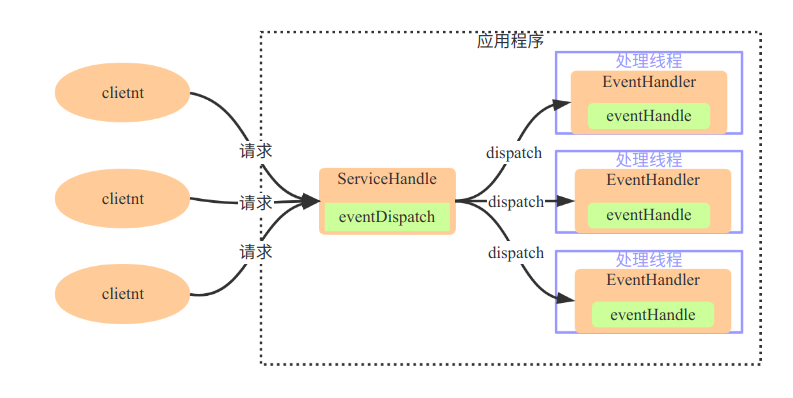
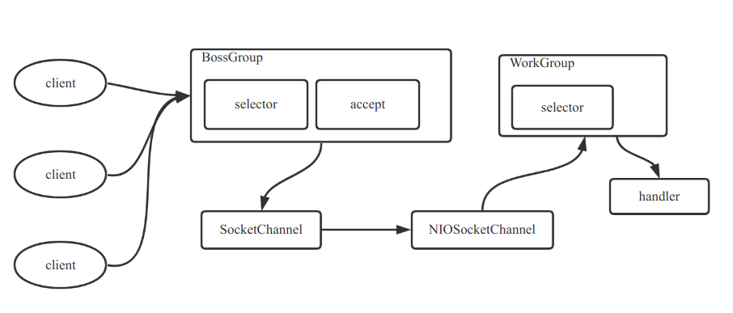
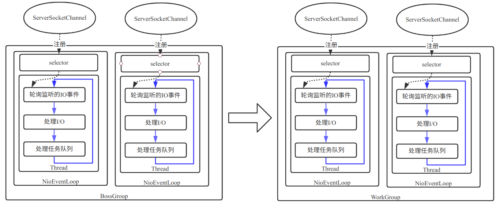
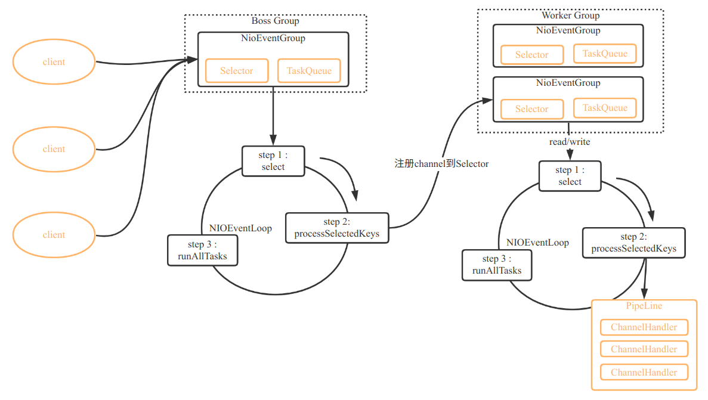
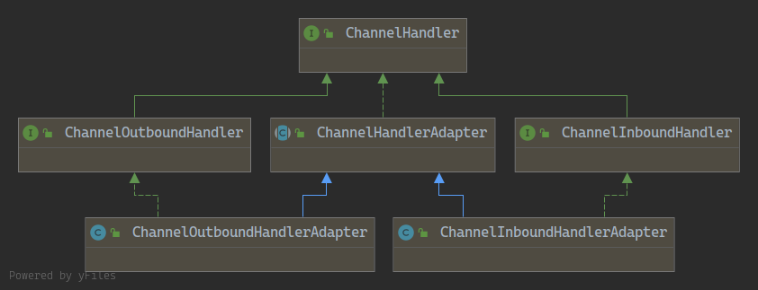
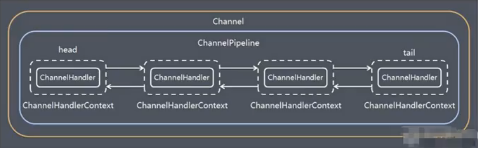
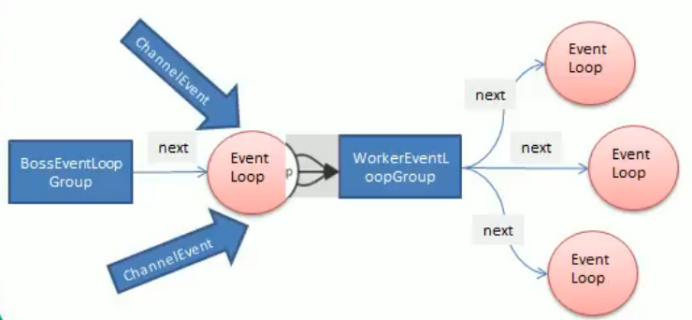
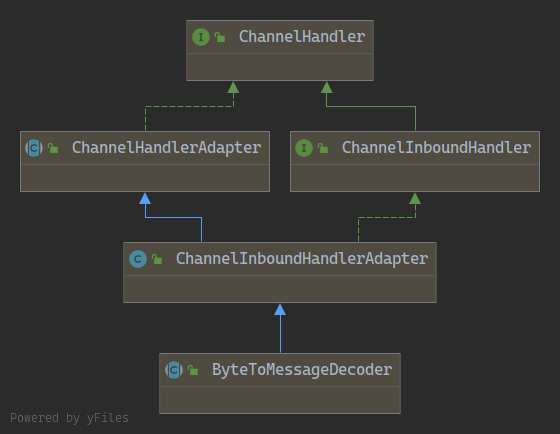
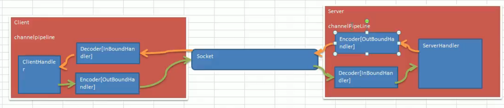
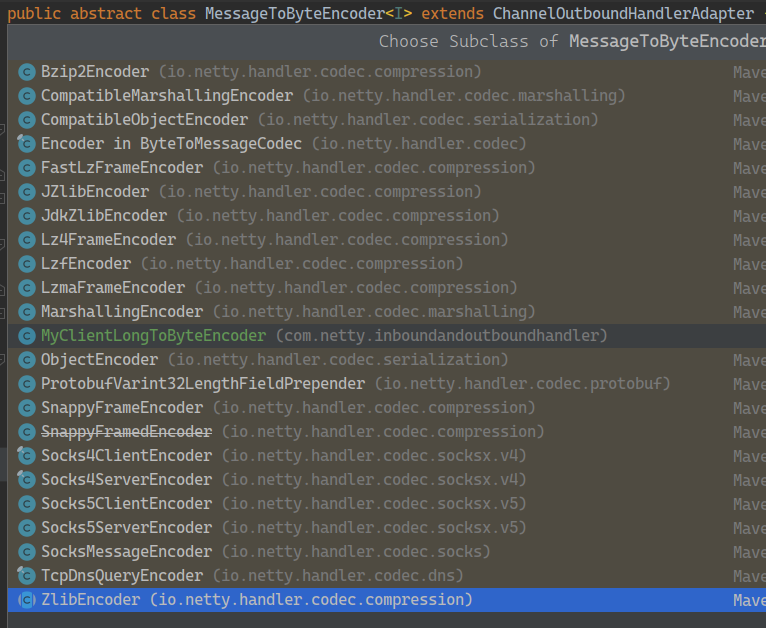

# Netty

**什么是Netty:**

- netty是异步的,基于事件驱动的网络应用框架,用以开发高性能,高可靠的网络IO程序
- netty主要针对在TCP协议下,面向Clients端的高并发应用,或者Peer-to-Peer场景下的大量数据持续传输的应用
- netty本质是一个NIO框架,适用于服务器通讯相关的多种应用场景

**netty的应用场景:**

- 在分布式系统中,各个节点之间需要远程服务调用,高性能的RPC框架必不可少,Netty作为异步高薪能的通信框架,往往作为基础通信组件被这些RPC框架使用
- 典型应用场景:Dubbo的RPC框架使用Dubbo协议,Dubbo协议默认使用Netty作为基础通信组件
- 游戏行业中,使用Netty作为通信组件
- 大数据领域 经典的Hadoop的高性能通信和序列话组件(AVRO实现数据文件共享)的RPC框架

# 官网说明

1. Netty是由JBOSS提供的一个Java开源框架,Netty提供异步,基于事件驱动的网络应用程序框架,用以快速开发高性能,高可靠的网络IO程序
2. Netty可以帮助你快速,简单的开发一个网络应用,相当于简化和流程化了NIO的开发过程
3. Netty是目前最流行的NIO框架,Netty在互联网领域,大数据分布式计算领域,游戏行业,通信行业等广泛应用,知名的ES,Dubbo框架内部都采用Netty

# Netty优点

1. 设计优雅:适用于各种传输类型的统一API阻塞和非阻塞Socket；基于灵活且可扩展的事件模型,可以清晰地分离关注点,高度可定制的线程模型,单线程,一个或者多个线程池
2. 使用方便:详细记录的JavaDoc,用户指南和示例,没有其他依赖项
3. 高性能,吞吐量更高:延迟更低,减少资源消耗,最小化不必要的内存复制
4. 安全: 完整的SSL/TLS和StartTLS支持
5. 社区活跃,不断更新:社区活跃,版本迭代周期短,发现的Bug可以被及时修复,同时,更多的新功能活被加入

# Netty线程模型

## 基本介绍

1. 不同的线程模型,对程序的性能有很大影响,为了搞清楚netty线程模型,我们来系统的讲解下各个线程模型,最后看看netty线程模型有什么优越性
2. 目前存在的线程模型:
   - 传统阻塞I/O服务模型
   - Reactor模式
3. 根据Reactor的数量和处理资源池线程的数量不同,有三种典型的实现
   - 单Rreactor单线程
   - 单Reactor多线程
   - 主从Reactor多线程
4. Netty线程模式(Netty主要基于主从Reactor多线程模型做了一定的改进,其中主从Reactor多线程模型有多个Reactor)

## 传统阻塞IO服务模型

## Reactor模式

针对传统阻塞IO服务模型的2个缺点,解决方案:

1. 基于I/O复用模型:多个连接共用一个阻塞对象,应用程序只需要在一个阻塞对象等待,无需阻塞等待所有连接,当某个链接有新的数据可以处理时,操作系统通知应用程序,线程从阻塞状态返回,开始处理业务
2. 基于线程池复用线程资源:不必再为每个连接创建线程,将连接完成后的业务处理任务分配给线程进行处理,一个线程可以处理多个连接的业务



**说明:**

1. Reactor模式,通过一个或镀铬输入同时传递给服务处理器的模式(基于事件驱动)
2. 服务器端程序,处理传入的多个请求并将他们同步分派到相应的处理线程,因此reactor模式也叫Disptatcher模式
3. reactor模式使用IO复用监听事件,收到事件后,分发给某个线程(进程),这点就是网络服务器高并发处理关键

## Reactor模式中核心组成

1. Reactor: reactor在一个单独的线程中运行,复杂监听和分发事件,分发适当的处理程序来对IO事件做出反应,它就像公司的电话接线员,它接听来自客户的电话并将线路转移到适当额联系人
2. Handlers: 处理程序执行I/O时间要前完成实际事件,类似于客户想要与之交谈的公司中的实际官员,reactor通过调度适当的处理程序来响应I/O事件,处理程序执行非阻塞操作

## Reacotr分类:

根据Reactor的数量和处理资源池线程的数量不同,有3中典型的实现

1. 单Reactor单线程
2. 单Reactor多线程
3. 主从Reactor多线程

### 单Reactor单线程

**工作原理示意图:**


**方案说明:**

1. Select是前面I/O复用模型介绍的标准网络编程API,可以实现应用程序通过一个阻塞对象监听多路连接请求
2. Reactor对象通过Select监听客户端请求事件,收到事件后通过Dispatch进行分发
3. 如果是建立连接请求事件,,则由Acceptor通过Accept处理连接请求,然后创建一个Handler对象处理连接完成后的后续业务处理
4. 如该不是建立连接事件,则Reactor分发调用连接对应的Handler来响应
5. Handler会完成Read -> 业务处理 -> Send的完整业务流程

**结合实例:** 服务器端用一个线程通过多路复用搞定所有的IO操作,(包括连接,,读,写等) 编码简单,但是如果客户端连接数量教多,将无法支撑,前面的NIO多人聊天案例就是属于这种模型..

**优缺点分析:**

1. **优点:** 模型简单,没有多线程,进程通信,竞争的问题,全部都在一个线程中完成
2. **缺点:** 性能问题,只有一个线程,无法完全发挥多CPU的性能,Handler在处理某个连接上的业务时,整个进程无法处理其他连接事件,很容易导致性能瓶颈
3. **缺点:** 可靠性问题,线程意外终止,或者进入死循环,会导致整个系统通信模块不可用,不能接受和处理外部消息,造成节点故障
4. **使用场景:** 客户端的数量有限,业务处理非常快速,比如Redis在业务处理的时间复杂度O(1)的情况

### 单Reactor多线程

**工作原理图示意图:**


**方案说明**:

1. Reactor对象通过select监控客户端请求事件,收到事件后,通过dispatch进行分发
2. 如果建立连接请求,则Acceptor通过accept处理连接请求,然后创建一个handler对象处理完成后的各种事件
3. 如果不是连接请求,则由reactor对象分发调用连接对应的Handler来处理,
4. handler只负责响应事件,不做具体的业务处理,通过read读取数据后,会分发给后面的worker线程池的某个线程处理业务
5. worker线程池会分配独立线程完成真正的业务,并将结果返回给handler
6. handler收到响应后,通过send将结果返回给client

**优点缺点分析:**

1. **优点:** 可以充分的利用多核CPU的处理能力
2. **缺点:** 多线程数据共享和访问比较复杂,reactor处理所有的事件监听和响应,在单线程运行,在高并发场景容易出现性能瓶颈

### 主从Reactor多线程

**工作原理示意图:**


针对单Reactor多线程模型中,Reactor在单线程中运行,高并发场景下容易出现性能瓶颈,可以让Reactor在多线程中运行

**方案说明:**

1. Reactor主线程MainReactor对象通过select监听连接事件,收到事件后,通过Accept处理连接事件
2. 当Acceptor处理连接事件后,MainReactor将连接分配给SubReactor
3. subReactor将连接加入到连接队列中进行监听,并创建handler进行各种事件处理
4. 当有新事件发生时,subReactor就会调用对应的handler处理
5. handler通过read读取数据,会分发给后面的worker线程处理
6. worker线程池会分配独立的worker线程进行业务处理,并返回结果
7. handler收到响应的结果后 , 再通过send将结果返回给client
8. Reactor住线程可以对应多个Reactor子线程,即MainReactor可以关联多个SubReactor

**方案优缺点:**

1. **优点:**  父线程与子线程的数据交互简单职责明确,父线程只需要接收新连接,子线程完成后续的业务处理
2. **优点:**父线程与子线程的数据交互简单,Reactor主线程只需要把新连接传给子线程,子线程无需返回结果
3. **缺点**: 编程复杂度比较高

---

## Netty模型

### 简单版:

**工作原理示意图:**



**说明:**

1. BossGroup线程维护Selector,只关注Accept
2. 当接收到Accept事件后,获取到对应的SocketChannel,进一步封装成NIOSocketChannel并注册到Worker线程(事件循环),并进行维护
3. 当Worker线程监听到selector中的通道,发生自己感兴趣的事件后,就进行处理(就由hanndler完成),注意handler已经加入到通道中

### 进阶版:

**工作原理示意图:**

Netty主要基于从Reactors多线程模型(如图)做了一定的改进,其中主从Reactor多线程模型有多个Reactor



### 详细模型:

**工作原理示意图:**



**说明:**

1. Netty抽象出两组线程池 BossGroup专门负责接收客户端的连接,WorkerGroup 专门负责网络的读写
2. BossGroup和WorkerGroup类型都是NioEventLoopGroup
3. NioEventLoopGroup相当于一个事件循环组,这个组中含有多个事件循环,每一个事件循环是NioEventLoop
4. NioEventLoop表示一个不断循环的执行处理任务的线程,每个NioEventLoop都有一个selector,用于监听绑定在其上的socket的网络通讯
5. NioEventLoopGroup可以有多个线程,即可以含有多个NioEventLoop
6. 每个Boss 下 NioEventLoop执行步骤有3步
   1. 轮询accept事件,
   2. 处理accept事件,与client建立连接,生成NioSocketChannel并将其注册到某个worker NioEventLoop上的Selector
   3. 处理任务队列的任务,即runAllTasks
7. 每个Worker  NioEventLoop循环执行的步骤
   1. 轮询read,write事件
   2. 处理I/O事件,即 read , write 事件,在NioSocketChannel处理
   3. 处理任务队列的任务,即runAllTasks
8. 每个Worker NIOEventLoop处理业务时,会使用pipline(管道),pipeline中包含了channel,,,,即通过pipeline可以获取到对应管道,管道中维护了很多的处理器

### Netty  入门案例 - TCP服务

**Server**

```java
package com.netty.simple;

import io.netty.bootstrap.ServerBootstrap;
import io.netty.channel.ChannelFuture;
import io.netty.channel.ChannelInitializer;
import io.netty.channel.ChannelOption;
import io.netty.channel.ChannelPipeline;
import io.netty.channel.nio.NioEventLoopGroup;
import io.netty.channel.socket.SocketChannel;
import io.netty.channel.socket.nio.NioServerSocketChannel;

public class NettyServer {
    public static void main(String[] args) throws InterruptedException {
        //1.创建boss和worker group
        //2.boss group 只处理连接请求,真正和客户端业务处理,会交给worker group
        //3.两个都是无限循环
        //4.boss group 和 workerGroup  含有的NioEventLoopGroup 的个数,默认是其核心数的2倍
        NioEventLoopGroup bossGroup = new NioEventLoopGroup(1);
        NioEventLoopGroup workerGroup = new NioEventLoopGroup(4);
        ServerBootstrap bootstrap = new ServerBootstrap();
        try {
           //使用链式编程来做
           bootstrap.group(bossGroup,workerGroup) //设置两个线程
                   .channel(NioServerSocketChannel.class) //使用NioSocketChannel 作为服务器的通道实现
                   .option(ChannelOption.SO_BACKLOG,128) // 设置线程队列得连接个数
                   .childOption(ChannelOption.SO_KEEPALIVE,true)//设置保持活动连接状态
                   .childHandler(new ChannelInitializer<SocketChannel>() { //创建一个通道测试对象(匿名对象)
                       //给pipeline设置处理器
                       @Override
                       protected void initChannel(SocketChannel sc) throws Exception {
                           ChannelPipeline pipeline = sc.pipeline();
                           pipeline.addLast(new NettyServerHandler());
                       }
                   });//给我们的worker group的EventLoop对应的管道设置处理器
           System.out.println("服务器 is ready .....");
           //绑定一个对象并同步,生成一个ChannelFuture对象
           //启动服务器(并绑定端口)
           ChannelFuture cf = bootstrap.bind(6668).sync();
           //对关闭通道进行监听
           cf.channel().closeFuture().sync();
       }finally {
            bossGroup.shutdownGracefully();
            workerGroup.shutdownGracefully();
       }
    }
}
```

**NettyServerHandler**

```java
package com.netty.simple;

import io.netty.buffer.ByteBuf;
import io.netty.buffer.Unpooled;
import io.netty.channel.Channel;
import io.netty.channel.ChannelHandlerContext;
import io.netty.channel.ChannelInboundHandlerAdapter;
import io.netty.channel.ChannelPipeline;
import io.netty.util.CharsetUtil;


/**
 * 1.自定义一个Handler 需要继续netty规定好的某个HandlerAdapter
 * 2. 这时我们自定义一个Handler,才能称为一个handler
 */
public class NettyServerHandler  extends ChannelInboundHandlerAdapter {
    //读取数据实际

    /**
     * 1.ChannelHandlerContext ctx;上下文对象,含有pipeline通道,channel 地址
     * 2.Object msg; 就是客户端发送的数据 默认Object
     *
     */
    @Override
    public void channelRead(ChannelHandlerContext ctx, Object msg) throws Exception {
        //super.channelRead(ctx, msg);
        System.out.println("服务器读取线程 : " + Thread.currentThread().getName());
        System.out.println("server ctx = " + ctx);
        System.out.println();
        Channel channel = ctx.channel();
        ChannelPipeline pipeline = channel.pipeline();

        //将msg转化成一个ByteBuf
        ByteBuf buf = (ByteBuf) msg;
        System.out.println("客户端发送消息是:" + buf.toString(CharsetUtil.UTF_8));
        System.out.println("客户端地址:" + channel.remoteAddress());
    }

    @Override
    public void channelReadComplete(ChannelHandlerContext ctx) throws Exception {
        //super.channelReadComplete(ctx);
        //write 方法 + flush方法
        //将数据写入到缓存,并刷新
        //一般讲,我们对发送的数据进行编码
        ctx.writeAndFlush(Unpooled.copiedBuffer("hello 客户端",CharsetUtil.UTF_8));

    }

    @Override
    public void exceptionCaught(ChannelHandlerContext ctx, Throwable cause) throws Exception {
        //super.exceptionCaught(ctx, cause);
        ctx.close();
    }
}
```

**Client**

```java
package com.netty.simple;

import io.netty.bootstrap.Bootstrap;
import io.netty.channel.ChannelFuture;
import io.netty.channel.ChannelInitializer;
import io.netty.channel.EventLoopGroup;
import io.netty.channel.nio.NioEventLoopGroup;
import io.netty.channel.socket.SocketChannel;
import io.netty.channel.socket.nio.NioSocketChannel;

public class NettyClient {
    public static void main(String[] args) throws InterruptedException {
        //客户端需要一个事件循环组
        EventLoopGroup eventLoopGroup = new NioEventLoopGroup();
        //注意客户端使用的不是ServerBootStrap而是Bootstrap
        Bootstrap bootstrap = new Bootstrap();
      try {
          bootstrap.group(eventLoopGroup)//设置线程组
                  .channel(NioSocketChannel.class)//设置客户端通道的实现类(反射)
                  .handler(new ChannelInitializer<SocketChannel>() {
                      @Override
                      protected void initChannel(SocketChannel sc) throws Exception {
                          sc.pipeline().addLast(new NettyClientHandler()); //加入自己的处理器
                      }
                  });
          System.out.println(" 客户端 is ok ...");
          ChannelFuture channelFuture = bootstrap.connect("127.0.0.1", 6668).sync();
          //关闭通道进行监听
          channelFuture.channel().closeFuture().sync();
      }finally {
          eventLoopGroup.shutdownGracefully();
      }
    }
}
```

**NettyClientHandler**

```java
package com.netty.simple;

import io.netty.buffer.ByteBuf;
import io.netty.buffer.Unpooled;
import io.netty.channel.ChannelHandlerContext;
import io.netty.channel.ChannelInboundHandlerAdapter;
import io.netty.util.CharsetUtil;

public class NettyClientHandler extends ChannelInboundHandlerAdapter {
    //当通道就绪就会触发该方法
    @Override
    public void channelActive(ChannelHandlerContext ctx) throws Exception {
        //super.channelActive(ctx);
        System.out.println("client = " + ctx);
        ctx.writeAndFlush(Unpooled.copiedBuffer("hello server 我是 客户端,", CharsetUtil.UTF_8));
    }

    //当通道有读取事件时,会触发
    @Override
    public void channelRead(ChannelHandlerContext ctx, Object msg) throws Exception {
        //super.channelRead(ctx, msg);
        ByteBuf buf = (ByteBuf) msg;
        System.out.println("服务器回复的消息 : = " + buf.toString(CharsetUtil.UTF_8));
        System.out.println("服务器的地址:" + ctx.channel().remoteAddress());
    }

    @Override
    public void exceptionCaught(ChannelHandlerContext ctx, Throwable cause) throws Exception {
        //super.exceptionCaught(ctx, cause);
        cause.printStackTrace();
        ctx.close();
    }
}
```

### 任务队列

**任务队列中的Task有3中典型的使用场景:**

1. 用户程序自动义的普通任务

   ```java
   public void channelRead(ChannelHandlerContext ctx, Object msg) throws Exception {
       ctx.writeAndFlush(Unpooled.copiedBuffer("hello 客户端,this is read ",CharsetUtil.UTF_8));
       //解决方案1 用户自定义普通任务
       ctx.channel().eventLoop().execute(()->{
           //这里有一个非常耗时的业务 -> 异步执行 -> 提交到channel对应的NioEventLoop 的taskQueue中
           try {
               Thread.sleep(10000);
               System.out.println("this is run taskQueue 1");
           } catch (InterruptedException e) {
               e.printStackTrace();
           }
       });
       ctx.channel().eventLoop().execute(()->{
           //这里有一个非常耗时的业务 -> 异步执行 -> 提交到channel对应的NioEventLoop 的taskQueue中
           try {
               Thread.sleep(20*1000);
               System.out.println("this is run taskQueue 2 ");
           } catch (InterruptedException e) {
               e.printStackTrace();
           }
       });
       System.out.println("go on ...");
   }
   ```
2. 用户定义定时任务

   ```java
   //解决方案2 用户自定义定时任务,该任务是提交到scheduleTaskQueue中
   ctx.channel().eventLoop().schedule(()->{
       try {
           Thread.sleep(20*1000);
           System.out.println("this is run scheduleTaskQueue");
       } catch (InterruptedException e) {
           e.printStackTrace();
       }
   },5, TimeUnit.SECONDS);
   ```
3. 非当前Reactor线程调用Channel的各种方法

   例如在**推送系统**的业务线程里面,根据**用户的标识**,找到对应的**Channel引用**,然后调用write类方法向该用户推送消息,就会进入到这种场景,最终的Write会提交到任务队列中被**异步消费**

**方案再说明:**

1. Netty抽象出两组线程池,BossGroup专门负责接受客户端连接,WorkerGroup专门负责网络读写操作
2. NioEventLoop表示一个不断循环执行处理任务的线程,每个NioEventLoop都有一个selector,用于监听绑定在其上的socket网络通道
3. NioEventLoop内部采用串行化设计,从消息的读取->解码->处理->编码->发送,始终由IO线程NioEventLoop负责
   - 每个NioEventLoopGroup下包含多个NioEventLoop
   - 每个NioEventLoop中包含有一个Selector,一个TaskQueue
   - 每个NioEventLoop的Selector上可以注册监听多个NioChannel
   - 每个NioChannel只会绑定在唯一的NioEventLoop上
   - 每个NioChannel都绑定有一个自己的ChannelPipeline

### 异步模型

**基本介绍:**

1. 异步的概念和同步相对,当一个异步过程调用发出后,调用者不能立刻得到结果.实际处理这个调用的组件在完成后,通过状态,通知和回调来通知调用者.
2. Netty中的I/O操作是异步的,包括Bind,Write,Connect等操作会简单的返回一个ChannelFuture
3. 调用者并不能立刻获得结果,而是通过Future-Listener机制,用户可以方便的主动获取或者通过通知机制获得IO操作结果
4. Netty的异步模型是建立在future和callback的之上的,callback就是回调,重点说Future,它的核心思想是: 假设一个方法fun,计算过程可能非常耗时,等待fun返回显然不合适,那么可以在调用fun的时候,立马返回一个Future,后续可以通过Future去监控方法fun的处理过程(即:Future-Listener机制)

**Future说明:**

1. 表示异步的执行结果,可以通过它提供的方法来检测执行是否完成,比如检索计算等
2. ChannelFuture是一个接口

**工作原理示意图:**

**说明:**

1. 在使用Netty进行编程时,拦截操作和转换出入站的数据只需您提供callback或利用future即可,这使得链式操作简单,高校,并有利于编写可重用的,通用的代码
2. Netty框架的目标就是让你的业务逻辑从网络基础应用编码中分离出来,解脱出来

**Future-Listener 机制 : **

1. 当Future对象刚刚创建时,处于非完成状态,调用者可以通过返回的ChannelFuture来获取操作执行执行的状态,注册监听函数来执行完成后的操作
2. 常见有如下操作:

   - 通过isDone方法来判断当前操作是否完成
   - 通过isSuccess方法来判断当前操作是否成功
   - 通过getCause方法来获取已完成的当前操作失败的原因
   - 通过isCancelled方法来判断已完成的当前操作是否被取消
   - 通过addListener方法来注册监听器,当操作已完成(isDone 方法返回完成),将会通知指定的监听器,如果Future对象已完成,则通知指定的监听器
3. 举例说明:

   示例: 绑定端口是异步操作,当绑定操作处理完,将会调用相应的监听器处理逻辑

   ```java
   serverBootstrap.bind(port).addListener(future->{
       if(future.isSuccess()){
           System.out.println("绑定成功!")
       }else{
           System.out.println("绑定失败!")
       }
   })
   ```

   **小结:** 相比传统阻塞I/O,执行I/O操作后会被阻塞住,直到操作完成,异步处理的好处是不会造成线程阻塞,线程在I/O操作期间可以执行别的程序,在高并发情形下会更加稳定和更高的吞吐量

### HttpServer 案例:

**TestHttpServer:**

```java
package com.http;

import io.netty.bootstrap.ServerBootstrap;
import io.netty.channel.ChannelFuture;
import io.netty.channel.nio.NioEventLoopGroup;
import io.netty.channel.socket.nio.NioServerSocketChannel;

public class TestHttpServer {
    public static void main(String[] args) {
        NioEventLoopGroup bossGroup = new NioEventLoopGroup(1);
        NioEventLoopGroup workerGroup = new NioEventLoopGroup(4);
        ServerBootstrap serverBootstrap = new ServerBootstrap();

        try {
            serverBootstrap.group(bossGroup,workerGroup).channel(NioServerSocketChannel.class)
                    .childHandler(new TestServerInitializer());
            ChannelFuture channelFuture = serverBootstrap.bind(12306).sync();
            channelFuture.channel().closeFuture().sync();
        } catch (InterruptedException e) {
            e.printStackTrace();
        }finally {
            bossGroup.shutdownGracefully();
            workerGroup.shutdownGracefully();
        }
    }
}
```

**TestHttpServerHandler:**

```java
package com.http;

import io.netty.buffer.ByteBuf;
import io.netty.buffer.Unpooled;
import io.netty.channel.ChannelHandlerContext;
import io.netty.channel.SimpleChannelInboundHandler;
import io.netty.handler.codec.http.*;
import io.netty.util.CharsetUtil;

/**
 * 1 SimpleChannelInboundHandler 是 ChannelInboundHandlerAdapter
 * 2. HttpObject 客户端和服务端相互通讯的数据被封装成HttpObject
 */
public class TestHttpServerHandler extends SimpleChannelInboundHandler<HttpObject> {

    @Override
    protected void channelRead0(ChannelHandlerContext ctx, HttpObject msg) throws Exception {

        // 判断msg是不是 httpRequest
        if(msg instanceof HttpRequest){
            System.out.println("msg 类型 = " + msg.getClass());
            System.out.println("客户端地址 = " + ctx.channel().remoteAddress());
            //回复信息给浏览器
            ByteBuf content = Unpooled.copiedBuffer("hello  我是服务器", CharsetUtil.UTF_8);

            //构造一个http响应 , 即 httpResponse
            DefaultFullHttpResponse response = new DefaultFullHttpResponse(HttpVersion.HTTP_1_1, HttpResponseStatus.OK,content);
            response.headers().set(HttpHeaderNames.CONTENT_TYPE,"text/plain");
            response.headers().set(HttpHeaderNames.CONTENT_LENGTH,content.readableBytes());
            response.headers().set(HttpHeaderNames.ACCEPT_CHARSET,CharsetUtil.UTF_8);
           //将构建好的response返回
            ctx.writeAndFlush(response);
        }
    }
}
```

**TestServerInitializer:**

```java
package com.http;

import io.netty.channel.ChannelInitializer;
import io.netty.channel.ChannelPipeline;
import io.netty.channel.socket.SocketChannel;
import io.netty.handler.codec.http.HttpServerCodec;

public class TestServerInitializer extends ChannelInitializer<SocketChannel> {
    @Override
    protected void initChannel(SocketChannel ch) throws Exception {
        //向管道加入处理器
        //得到管道
        ChannelPipeline pipeline = ch.pipeline();
        //加入一个netty提供的httpServerCodec codec = > [coder decoder]
        pipeline.addLast("MyHttpServerCodec",new HttpServerCodec());
        //2. 增加一个自己的地定义code
        pipeline.addLast("MyTestHttpServerHandler",new TestHttpServerHandler());
    }
}
```

## Netty 组件

### Bootstrap,ServerBootstrap

1. Bootstrap 意思是引导,一个Netty应用通常由一个Bootstrap开始,主要作用是配置整个Netty程序,串联各个组件,Netty中Bootstrap类是客户端程序的启动引导类,ServerBootstrap是服务端启动引导类
2. 常见的方法有:
   - public ServerBootstrap group(EventLoopGroup parentGroup, EventLoopGroup childGroup) ,该方法用于服务端,用来设置两个EventLoop
   - public B group(EventLoopGroup group),该方法用于客户端,用来设置一个EventLoop
   - public B channel(Class<? extends C> channelClass),该方法用来设置一个服务器端的通道实现
   - public <T> B option(ChannelOption<T> option, T value),用来给ServerChannel添加配置
   - public <T> ServerBootstrap childOption(ChannelOption<T> childOption, T value),用来给接收到的通道添加配置
   - public ServerBootstrap childHandler(ChannelHandler childHandler),该方法用来设置业务处理类(自定义handler)
   - public ChannelFuture bind(int inetPort),该方法用于服务器端,用来设置占用的端口号
   - public ChannelFuture connect(String inetHost, int inetPort) , 该方法用于客户端,用来连接服务器

### Future,ChannelFuture

1. Netty中所有的IO操作都是异步的,不能立刻得知消息是否被正确处理,但是可以过一会等它执行完成或者直接注册一个监听,具体的实现就是通过Future和ChannelFutures,他们可以注册一个监听,当操作执行成功或失败时监听会自动触发的监听事件
2. 常见的方法:
   - Channel  channel(),返回当前正在进行IO操作的通道
   - ChannelFuture    sync(), 等待异步操作执行完毕

### Channel

1. Netty网络通信的组件,能够用于执行网络I/O操作
2. 通过Channel可获得当前网络连接的通道的状态
3. 通过Channel可获得网络连接的配置参数(例如接收缓冲区大小)
4. Channel提供异步的网络I/O操作(如建立连接,读写,绑定端口),异步调用意味着任何I/O调用都将立即返回,并且不保证在调用结束时所请求的I/O操作已完成
5. 调用立即返回一个ChannelFuture实例,通过注册监听器到ChannelFuture上,可以将I/O操作成功,失败或取消时回调通知调用方
6. 支持关联I/O操作与对应的处理程序
7. 不同协议,不同的阻塞类型的连接都有不同的Channel类型与之对应,常用的Channel类型:
   - NioSocketChannel,异步的客户度TCP Socket连接
   - NioServerScoketChannel,异步的服务器端TCP Socket连接
   - NioSctpChannel, 异步的客户端Sctp连接
   - NioSctpServerChannel,异步的Sctp服务器端连接,这些通道涵盖了UDP和TCP网络IO以及文件IO

### Selector

1. Netty基于Selector对象实现I/O多路复用,通过Selector一个线程可以监听多个连接的Channel事件
2. 当向一个Selector中注册Channel后,Selector内部的机制就可以自动不断地产下(Select)这些注册的Channel是否有已就绪的I/O事件(例如可读,可写,网络连接完成等),这样程序就可以很简单地使用一个线程高效地管理多个Channel

### ChannelHandler 及其实现类

1. ChannelHandler 是一个接口,处理I/O事件或拦截I/O操作,并将其转发到其ChannelPipeLine(物业处理链)中的下一个处理程序
2. ChannelHandler本身并没有提供很多方法,因为这个接口有许多的方法需要实现,方便使用期间,可以继承它的子类
3. ChannelHandler及其实现类一览图(后)

   - ChannelInboundHandler用于处理入站I/O事件
   - ChannelOutboundHandler用于处理出站I/O操作
   - ChannelInboundHandlerAdapter用于处理入站I/O事件
   - ChannelOutboundHandlerAdapter用于处理出站I/O操作
   - ChannelDeplexHandler用于处理入站和出站事件

   
4. 我们经常需要自定义一个Handler类去继承CHannelInboundHandlerAdapter,然后通过重写相应方法实现业务逻辑,

   ```java
   /*
    * Copyright 2012 The Netty Project
    *
    * The Netty Project licenses this file to you under the Apache License,
    * version 2.0 (the "License"); you may not use this file except in compliance
    * with the License. You may obtain a copy of the License at:
    *
    *   http://www.apache.org/licenses/LICENSE-2.0
    *
    * Unless required by applicable law or agreed to in writing, software
    * distributed under the License is distributed on an "AS IS" BASIS, WITHOUT
    * WARRANTIES OR CONDITIONS OF ANY KIND, either express or implied. See the
    * License for the specific language governing permissions and limitations
    * under the License.
    */
   package io.netty.channel;

   import io.netty.channel.ChannelHandlerMask.Skip;

   /**
    * Abstract base class for {@link ChannelInboundHandler} implementations which provide
    * implementations of all of their methods.
    *
    * <p>
    * This implementation just forward the operation to the next {@link ChannelHandler} in the
    * {@link ChannelPipeline}. Sub-classes may override a method implementation to change this.
    * </p>
    * <p>
    * Be aware that messages are not released after the {@link #channelRead(ChannelHandlerContext, Object)}
    * method returns automatically. If you are looking for a {@link ChannelInboundHandler} implementation that
    * releases the received messages automatically, please see {@link SimpleChannelInboundHandler}.
    * </p>
    */
   public class ChannelInboundHandlerAdapter extends ChannelHandlerAdapter implements ChannelInboundHandler {

       public void channelRegistered(ChannelHandlerContext ctx) throws Exception {
           ctx.fireChannelRegistered();
       }


       public void channelUnregistered(ChannelHandlerContext ctx) throws Exception {
           ctx.fireChannelUnregistered();
       }
   	//通道就绪事件
       public void channelActive(ChannelHandlerContext ctx) throws Exception {
           ctx.fireChannelActive();
       }

       public void channelInactive(ChannelHandlerContext ctx) throws Exception {
           ctx.fireChannelInactive();
       }
   	//通道读取数据事件
       public void channelRead(ChannelHandlerContext ctx, Object msg) throws Exception {
           ctx.fireChannelRead(msg);
       }
   	//数据读取完毕事件
       public void channelReadComplete(ChannelHandlerContext ctx) throws Exception {
           ctx.fireChannelReadComplete();
       }

       public void userEventTriggered(ChannelHandlerContext ctx, Object evt) throws Exception {
           ctx.fireUserEventTriggered(evt);
       }

       public void channelWritabilityChanged(ChannelHandlerContext ctx) throws Exception {
           ctx.fireChannelWritabilityChanged();
       }


       public void exceptionCaught(ChannelHandlerContext ctx, Throwable cause)
               throws Exception {
           ctx.fireExceptionCaught(cause);
       }
   }

   ```

### Pipeline和ChannelPipeline

**ChannelPipeline是一个重点:**

1. ChannelPipeline是一个Handler集合,它负责处理和拦截inbound或者outbound的事件和操作,相当于一个贯穿Netty的链.(也可以这样理解: ChannelPipeline是保存ChannelHandler的List,用于处理或拦截Channel的入站事件和出站操作)
2. ChannelPipeline实现了一种高级形式的拦截过滤器模式,使用户可以完全控制事件的处理方式,以及Channle中各个的ChannelHandler如何相互交互
3. 在Netty中每个Channel都有且仅有一个ChannelPipeline与之对应,他们的组成关系如下:

   - 一个Channel包含了一个ChannelPipeline,而ChannelPipeline中又维护了一个由ChannelHandlerContext组成的双向链表,并且每个ChannelHandlerContext中又关联着一个ChannelHandler
   - 入站事件和出站事件在一个双向链表中,入站事件会从链表head往后传递到最后一个入站的handler,出站事件会从链表tail往前传递到最前一个出站的handler,两种类型的handler互不干扰

   
4. 常用方法

   - ChannelPipeline  addFirst(ChannelHandler ... handlers),把一个业务处理类(handler)添加到链中的第一个位置
   - ChannelPipeline  addLast(ChannelHandler ... handlers),把一个业务处理类(handler)添加到链中的最后一个位置

### ChannelHandlerContext

1. 保存Channel相关的所有上下文信息,同时关联一个ChannelHandler对象
2. 即CahnnelHandleContext中包含一个具体的事件处理器ChannelHandler,同时ChannelHandlerContext中也绑定了对应的pipeline和Channel的信息,方便对ChannelHandler进行调用
3. 常用方法
   - ChannelFuture  close(), 关闭通道
   - ChannelOutboundInvoker  flush(), 刷新
   - ChannelFuture  writeAndFlush(Object msg),将数据写到ChannelPipeline当中
   - ChannelHandler的下一个ChannelHandler开始处理(出站)

### ChannelOption

1. Netty在创建Channel实例后,一般都需要设置ChannelOptin参数
2. ChannelOption 参数如下:

   **ChannelOption.SO_BACKLOG**

   对应TCP/IP协议listen函数中的backlog参数,用来初始化服务器可连接队列大小,服务端处理客户端连接请求是顺序处理的,所以同一时间只能处理一个客户端连接.多个客户端来的时候,服务器将不能处理的客户端连接请求放在队列中等待处理,backlog参数指定了队列的大小

   **ChannelOption.SO_KEEPALIVE**

   一直保持连接活动状态

### EventLoopGroup和其它实现类NioEventLoopGroup

1. EventLoopGroup是一组EventLoop的抽象,Netty为了更好的利用多核CPU资源,一般会有多个EventLoop同时工作,每个EventLoop维护着一个Selector实例.
2. EventLoopGroup提供next接口,可以从组里面按照一定规则获取其中一个EventLoop来处理任务.在Netty服务端编程中,我们一般都需要提供两个EventLoopGroup,例如:BossEventLoopGroup和WorkerEventLoopGroup
3. 通常一个服务端口即一个ServerSocketChannel对应一个Selector和一个EventLoop线程,BossEventLoop负责接收客户端的连接并将SocketChannel交给WorkerEventLoopGroup来进行IO处理,如下图所示:

   

   - BossEventLoopGroup通常是一个单线程的EventLoop,EventLoop维护着一个注册了ServerSocketChannel的Selector实例BossEventLoop不断轮询Selector将连接事件分离出来
   - 通常是OP_ACCEPT事件,然后将接收到的SocketChannel交给WorkerEventLoopGroup
   - WorkerEventLoopGroup会由next选择其中一个EventLoopGroup来将这个SocketChannle注册到其维护的Selector并对其后续的IO事件进行处理
4. 常用方法

   - public NioEventLoopGroup(),构造方法
   - public Future<?> shutdownGracefully(),断开连接,关闭线程

### Unpooled类

1. Netty提供一个专门用来操作缓冲区(即Netty的数据容器)的工具类
2. 常用方法如下:
   - public static ByteBuf  copiedBuffer(CharSequence string, Charset charset)

### Netty心跳检测机制案例

**编写实例:**

1. 编写一个Netty心跳检测机制案例,当服务器超过3妙没有读取时,就提示空闲
2. 但服务器超过5妙没有写操作,就提示空闲
3. 实现当服务器超过7秒没有读或者写操作时,就提示读写空闲

```java
package com.netty.heartbeat;

import com.netty.simple.NettyServerHandler;
import io.netty.bootstrap.ServerBootstrap;
import io.netty.channel.ChannelFuture;
import io.netty.channel.ChannelInitializer;
import io.netty.channel.ChannelOption;
import io.netty.channel.ChannelPipeline;
import io.netty.channel.nio.NioEventLoopGroup;
import io.netty.channel.socket.SocketChannel;
import io.netty.channel.socket.nio.NioServerSocketChannel;
import io.netty.handler.logging.LogLevel;
import io.netty.handler.logging.LoggingHandler;
import io.netty.handler.timeout.IdleStateHandler;

import java.util.concurrent.TimeUnit;

public class ThisServer {
    public static void main(String[] args) throws InterruptedException {
        //1.创建boss和worker group
        //2.boss group 只处理连接请求,真正和客户端业务处理,会交给worker group
        //3.两个都是无限循环
        //4.boss group 和 workerGroup  含有的NioEventLoopGroup 的个数,默认是其核心数的2倍
        NioEventLoopGroup bossGroup = new NioEventLoopGroup(1);
        NioEventLoopGroup workerGroup = new NioEventLoopGroup(4);
        ServerBootstrap bootstrap = new ServerBootstrap();
        try {
            //使用链式编程来做
            bootstrap.group(bossGroup,workerGroup) //设置两个线程
                    .channel(NioServerSocketChannel.class) //使用NioSocketChannel 作为服务器的通道实现
                    .option(ChannelOption.SO_BACKLOG,128) // 设置线程队列得连接个数
                    .handler(new LoggingHandler(LogLevel.INFO)) //增加一个日志处理器
                    .childHandler(new ChannelInitializer<SocketChannel>() {
                        @Override
                        protected void initChannel(SocketChannel ch) throws Exception {
                            ChannelPipeline pipeline = ch.pipeline();
                            //加入一个netty提供的 IdleStateHandler :   是netty提供的处理空闲状态的处理器
                            /* 参数:
                             * 1. readerIdleTime : 表示多长时间没有读,就会发送一个心跳检测包检测是否连接
                             * 2. writerIdleTime : 表示多长时间没有写,就会发送一个心跳检测包检测是否连接
                             * 3. allIdleTime : 表示多长时间没有读写,就会发送一个心跳检测包检测是否连接
                             *
                             * 4. Triggers an {@link IdleStateEvent} when a {@link Channel} has not performed
                             * read, write, or both operation for a while.
                             * 5. 当IdleStateEvent触发后,就会传递给管道的一下handler去处理,通过调用下一个handler的userEventTriggered方法来处理具体的事件
                             */
                            pipeline.addLast(new IdleStateHandler(3,5,7, TimeUnit.SECONDS));
                            pipeline.addLast(new ThisIsServerHandler());
                        }
                    });
            System.out.println("服务器 is ready .....");
            //绑定一个对象并同步,生成一个ChannelFuture对象
            //启动服务器(并绑定端口)
            ChannelFuture cf = bootstrap.bind(7000).sync();
            //对关闭通道进行监听
            cf.channel().closeFuture().sync();
        }finally {
            bossGroup.shutdownGracefully();
            workerGroup.shutdownGracefully();
        }
    }
}
package com.netty.heartbeat;

import io.netty.channel.ChannelHandlerContext;
import io.netty.channel.ChannelInboundHandlerAdapter;
import io.netty.handler.timeout.IdleStateEvent;

public class ThisIsServerHandler extends ChannelInboundHandlerAdapter {

    @Override
    public void userEventTriggered(ChannelHandlerContext ctx, Object evt) throws Exception {
        //
        if(evt instanceof IdleStateEvent){
            IdleStateEvent event = (IdleStateEvent) evt;
            String eventType = "";
            switch (event.state()){
                case ALL_IDLE:
                    eventType = "读写空闲";
                    break;
                case READER_IDLE:
                    eventType = "读空闲";
                    break;
                case WRITER_IDLE:
                    eventType = "写空闲";
                    break;
                default:
                    break;
            }
            System.out.println(ctx.channel().remoteAddress() + "--超时时间-- " + eventType);
            System.out.println("服务器处理事件 ... ");
            ctx.close();
        }
    }
}
```

### WebSocket长连接案例:

**WebSocketServer:**

```java
public class WebSocketServer {
    public static void main(String[] args) throws InterruptedException {
        //1.创建boss和worker group
        //2.boss group 只处理连接请求,真正和客户端业务处理,会交给worker group
        //3.两个都是无限循环
        //4.boss group 和 workerGroup  含有的NioEventLoopGroup 的个数,默认是其核心数的2倍
        NioEventLoopGroup bossGroup = new NioEventLoopGroup(1);
        NioEventLoopGroup workerGroup = new NioEventLoopGroup(4);
        ServerBootstrap bootstrap = new ServerBootstrap();
        try {
            //使用链式编程来做
            bootstrap.group(bossGroup,workerGroup) //设置两个线程
                    .channel(NioServerSocketChannel.class) //使用NioSocketChannel 作为服务器的通道实现
                    .handler(new LoggingHandler(LogLevel.INFO))
                    .childHandler(new ChannelInitializer<SocketChannel>() { //创建一个通道测试对象(匿名对象)
                        //给pipeline设置处理器
                        @Override
                        protected void initChannel(SocketChannel sc) throws Exception {
                            ChannelPipeline pipeline = sc.pipeline();
                            //因为基于http协议,使用http的编码和解码器
                            pipeline.addLast(new HttpServerCodec());
                            // 是以块方式写 ,ChunkedWriteHandler处理器
                            pipeline.addLast(new ChunkedWriteHandler());
                            /*
                            说明:
                                1.http数据在传输过程中是分段的,HttpObjectAggregator,可以将多个段聚合
                                2.这就是为什么当浏览器发送大量数据时,就会发出多次http请求
                             */
                            pipeline.addLast(new HttpObjectAggregator(8192));
                            /*
                            1.对应webSocket,它的数据是以帧(frame)形式传递的
                            2.可以看到WebSocketFrame下面有6个子类
                            3.浏览器请求时 ws:localhost:7000/hello 表示请求的uri
                            4.WebSocketServerProtocolHandler 核心功能是将http协议升级为ws协议,保持长连接
                             */
                            pipeline.addLast(new WebSocketServerProtocolHandler("/hello"));

                            //自定义处理器
                            pipeline.addLast(new MyTextWebSocketFrameHandler());
                        }
                    });
            System.out.println("服务器 is ready .....");
            //绑定一个对象并同步,生成一个ChannelFuture对象
            //启动服务器(并绑定端口)
            ChannelFuture cf = bootstrap.bind(7000).sync();
            //对关闭通道进行监听
            cf.channel().closeFuture().sync();
        }finally {
            bossGroup.shutdownGracefully();
            workerGroup.shutdownGracefully();
        }
    }
}
```

**hello.html**

```html
<!DOCTYPE html>
<html lang="en">
<head>
    <meta charset="UTF-8">
    <title>hello</title>
</head>
<body>
<script>
    var socket;
    if(window.WebSocket){
        socket = new WebSocket("ws:/localhost:7000/hello");
        //
        socket.onmessage = function (ev) {
            const rt = document.getElementById("responseText");
            rt.value = rt.value + "\n" + ev.data;
        }
        socket.onopen = function (ev) {
            const rt = document.getElementById("responseText");
            rt.value = "连接开启了...."  + ev.data;
        }
        socket.onclose = function (ev) {
            const rt = document.getElementById("responseText");
            rt.value = rt.value  + "\n" + "连接关闭了...." + ev.data;
        }

    }else {
        alert("当前浏览器不支持webSocket")
    }
    //发送消息到服务器
    function send(message) {
        if(!window.socket){
            return;
        }
        if(socket.readyState === WebSocket.OPEN){
            socket.send(message)
        }else{
            alert("连接没有开启")
        }
    }
</script>
<form  onsubmit="return false">
    <textarea name="message" style="height: 300px ; width: 300px">    </textarea>
    <input type="button" value="发送消息" onclick="send(this.form.message.value)">
    <textarea id="responseText" style="height: 300px ; width: 300px">    </textarea>
    <input type="button" value="清空内容" onclick="document.getElementById('responseText').value=''">
</form>

</body>
</html>
```

**MyTextWebSocketFrameHandler**

```java
// 该类表示一个文本帧(frame)
public class MyTextWebSocketFrameHandler extends SimpleChannelInboundHandler<TextWebSocketFrame> {
    @Override
    protected void channelRead0(ChannelHandlerContext ctx, TextWebSocketFrame msg) throws Exception {
        System.out.println("服务器受到消息 " + msg);
        ctx.channel().writeAndFlush(new TextWebSocketFrame("服务器时间 " + LocalDateTime.now() + " ," + msg));
    }

    //客户端连接之后,触发的事件
    @Override
    public void handlerAdded(ChannelHandlerContext ctx) throws Exception {
        //id 表示唯一的值,asLongText 是唯一的, asShortText 不是唯一的
        System.out.println("handlerAdded 被调用了," + ctx.channel().id().asLongText());
        System.out.println("handlerAdded 被调用了," + ctx.channel().id().asShortText());
    }
    //客户端断开连接之后,触发的事件
    @Override
    public void handlerRemoved(ChannelHandlerContext ctx) throws Exception {
        System.out.println("handlerRemoved 被调用了," + ctx.channel().id().asLongText());
    }

    @Override
    public void exceptionCaught(ChannelHandlerContext ctx, Throwable cause) throws Exception {
        System.out.println("异常发生" + cause.getMessage());
        ctx.channel().close();
    }
}
```

# Google ProtoBuf

### 编码和解码的基本介绍

1. 在编写网路应用程序时,因为数据在网络中传输的都是二进制字节码数据,在发送数据时就需要编码,接收数据时就需要解码
2. codec(编码器)的组成部分有两个: decoder(解码器)和encoder(编码器),encoder负责把业务数据转换成字节码数据,decoder负责把字节码数据转换成业务数据

### Netty本身的编码解码的机制和问题分析

1. Netty自身提供了一些codec(编解码器)
2. Netty提供的编码器
   1. StringEncoder, 对字符串数据进行编码
   2. ObjectEncoder, 对Java对象进行编码
   3. ....
3. Netty提供的解码器
   1. StringDecoder, 对字符串数据进行解码
   2. ObjectDecoder, 对Java对象进行解码
   3. ....
4. Netty本身自带的ObjectDecoder和ObjectEncoder可以用来实现POJO对象或各种业务对象的编码和解码,底层使用的仍然是Java序列化技术,而Java序列化技术本身效率不高,存在如下问题:
   1. 无法夸语言
   2. 序列化后的体积太大,是二进制编码的5倍多
   3. 序列化性能太低

## Protobuf

### Protobuf基本介绍和使用示意图

1. Protobuf 是Google发布的开源项目,全称 Google Protocol Buffers, 是一种轻便高效的结构化数据存储格式,可以用于结构化数据串行化,或者说序列化,它很适合做数据存储或RPC数据交换格式
2. 参考文档:
3. Protobuf是以message的方式来管理数据的
4. 支持跨平台,夸语言,即[客户端和服务器端可以是不同的语言编写的]
5. 高性能,高可靠
6. 使用Protobuf 编译器能自动生成代码,Protobuf 是将类的定义使用.proto文件进行描述
7. 然后通过proto.exe编译器根据.proto自动生成.java文件
8.

# Netty编解码器和handler的调用机制

## 基本说明

1. netty的组件设计: netty的主要组件有Channel, EventLoop, ChannelFuture, ChannelHandler,ChannelPipe等
2. ChannelHandler充当了处理入站和出站数据的应用程序逻辑的容器,例如,实现ChannelInboundHandler接口(或ChannelInboundHandlerAdapter),你就可以接收入站事件和数据,这些数据会被业务逻辑处理,当给客户端发送响应时,也可以从ChannelInboundHandler冲刷数据,业务逻辑通常写在一个或多个ChannelInboundHandler中. ChannelOutboundHandler原理一样,只不过它是用来处理出站数据的.
3. ChannelPipeline提供了ChannelHandler链的容器,以客户端应用程序为例,如果事件的运动方向是从客户端到服务端的,那么我 ChannelOutboundHandler,们称这些事件为出站的,即客户端发送个服务端的数据会通过pipeline中的一系列,并被这些Handler处理,反之则称之为入站的

## 编解码器

1. 当netty发送或者接受一个消息的时候,就将会发生一次数据转换,入站消息会被解码: 从字节转换为另一种格式(比如java对象),如果是出站消息,它会被编码成字节.
2. netty提供了一系列实用的编解码器,他们都实现了ChannelInboundHandler或者ChannelOutboundHandler接口.在这些类中,channelRead方法已经被重写了,以入站为例,对于每个从入站Channel读取的消息,这个方法被调用,随后,它将调用由编码器所提供的decode()方法进行解码,并将已经解码的字节转发给ChannelPipeline中的下一个ChannelInboundHandler.

### 解码器-ByteToMessageDecoder

1. 关系继承图

   
2. 由于不可能知道远程节点是否会一次性发送一个完整的信息,tcp有可能出现粘包拆包的问题,这个类会对入站数据进行的缓冲,直到它准备好被处理

## Netty的handler的调用机制

### 实例要求:

1. 使用自定义的编码器和解码器来说明Netty的handler调用机制
2. 客户端发送long 到 服务器, 服务器端发送long 到  客户端

   - **示意图:**

     
   - **代码:**
3. 案例代码:
4. 结论:

   1. 不论解码器handler还是编码器handler即接收到的消息类型必须与待处理的消息类型一致,否则该handler不会被执行
   2. 在解码器进行数据解码时,需要判断缓存区(ByteBuf)的数据是否足够,否则接收到的结果会和期望值可能不一致

### 解码器-ReplayingDecoder

1. public abstract class ReplayingDecoder<S> extends ByteToMessageDecoder
2. ReplayingDecoder扩展了ByteToMesssageDecoder类,使用这个类,我们不必调用readableBytes()方法,参数S指定了用户状态管理的类型,其中Void代表不需要状态管理
3. 应用实例,使用ReplayingDecoder 对上个例子进行简化
4. ReplayingDecoder使用很方便,但它也有一些局限性:
   - 并不是所有的ByteBuf操作都被支持,如果调用了一个不被支持的方法,将会抛出一个UnsuppotedOptionException
   - ReplayingDecoder 在某些情况下可能稍慢与ByteToMessageDecoder, 例如网路缓慢并且消息格式复杂,消息会被拆成多个碎片,速度变慢

### 其他编解码器

**其他解码器**

- LineBasedFrameDecoder:这个类在Netty内部也有使用,它使用行尾控制字符(`\n`或者`\r\n`)作为分隔符来解析数据
- DelimiterBasedFrameDecoder: 使用自定义的特殊字符作为消息的分隔符.
- HttpObjectDecoder: 一个HTTP数据的解码器
- LengthFieldBasedFrameDecoder: 通过指定长度来标识整包消息,这样就可以自动的处理黏包和半半消息

**其他编码器**



### Log4j整合到Netty

1. 在maven中添加Log4j的依赖 在pom.xml中

   ```
    <dependency>
               <groupId>log4j</groupId>
               <artifactId>log4j</artifactId>
               <version>1.2.17</version>
           </dependency>
           <dependency>
               <groupId>org.slf4j</groupId>
               <artifactId>slf4j-api</artifactId>
               <version>1.7.30</version>
           </dependency>
           <dependency>
               <groupId>org.slf4j</groupId>
               <artifactId>slf4j-log4j12</artifactId>
               <version>1.7.25</version>
           </dependency>
           <dependency>
               <groupId>org.slf4j</groupId>
               <artifactId>slf4j-simple</artifactId>
               <version>1.7.25</version>
           </dependency>
   ```
2. 配置Log4j,在resources/log4j.properties

   ```properties
   log4j.rootLogger=DEBUG, stdout
   log4j.appender.stdout=org.apache.log4j.ConsoleAppender
   log4j.appender.stdout.layout=org.apache.log4j.PatternLayout
   log4j.appender.stdout.layout.ConversionPattern=[%p] %C{1} - %m%n
   ```
3. 运行即可

# TCP粘包和拆包及解决方案

### 基本介绍

1. TCP是面向连接的,面向流的,提供高可靠性服务,收发两端(客户端和服务端)都要有一一对应的socket,因此,发送端为了将多个发给接收端的包,更有效的发给对方,使用了优化方法(Nagle算法), 将多次间隔较小且数据量小的数据,合并成一个大的数据快,然后进行封包.这样做虽然提高了效率,但是接受端就难于分辨出完整的数据包,因为  **面向流的通信是无消息保护边界的**
2. 由于TCP無消息保护边界,需要在接受端处理消息边界问题,也就是我们所说的粘包,拆包问题
3. TCP粘包,拆包图解

   
4. 假设客户端分别发送两个数据包D1和D2给服务器,由于服务端一次读取数据是不确定的,故存在一下四种情况:

   1. 服务端分两次读取到了两个独立的数据包,分别是D1和D2,没有粘包和拆包
   2. 服务端一次接受到了两个数据包,D1和D2粘合在一起,称之为TCP粘包
   3. 服务端分别读取到了数据包,第一次读取到完整的D1包和D2包的部分内容,第二次读取到了D2包的剩余内容,这称之为TCP拆包
   4. 服务端分两次读取到了数据包,第一次读取到了D1包的部门内容D1_1,第二次读取到了D1包的剩余部门内容D1_2和完整的D2包.

### 现象实例

编写一个Netty程序,如果没有做处理,就会发生粘包和拆包的问题,具体实例:

核心代码:

**clientHandler**

```java
 public void channelActive(ChannelHandlerContext ctx) throws Exception {
        for (int i = 0; i < 5; i++) {
            ByteBuf buf = Unpooled.copiedBuffer("hello server" + i, CharsetUtil.UTF_8);
            ctx.writeAndFlush(buf);
        }
    }
  @Override
    protected void channelRead0(ChannelHandlerContext ctx, MessageProtocol msg) throws Exception {
       byte[] bytes = new byte[msg.readableBytes()];
        msg.readBytes(bytes);
        String message = new String(bytes,CharsetUtil.UTF_8);
        System.out.println("客户端受到消息:"+ message);
        System.out.println("消息接受量 : " + ++count);
    }
```

**serverHandler**

```java
 @Override
    protected void channelRead0(ChannelHandlerContext ctx, MessageProtocol msg) throws Exception {
        System.out.println("TcpServerHandler : channelRead0 2 ");
        System.out.println("从客户端 " + ctx.channel().remoteAddress().toString().substring(1) + ", long = " + msg);
        byte[] bytes = new byte[msg.readableBytes()];
        msg.readBytes(bytes);
        String message = new String(bytes, CharsetUtil.UTF_8);

        System.out.println("从服务器发来的消息:"+ message);
        System.out.println("消息接受量 : " + ++count);

        //服务器回送数据给客户端,回送一个随机数据
        ByteBuf response = Unpooled.copiedBuffer(UUID.randomUUID().toString(), CharsetUtil.UTF_8);
        ctx.writeAndFlush(response);
    }

```

多次运行client客户端,即可看到TCP粘包和粘包的现象

### 解决方案

1. 使用自定义协议 + 编解码器 来解决
2. 关键是要解决 **服务器端每次读取数据长度的问题,**这个问题解决,就不会出现服务器多读或少读数据的问题,从而避免TCP的粘包,拆包
3. 具体实例:

   1. 要求客户端发送5个message对象,客户端每次发送一个Message对象
   2. 服务器端每次接受一个Message,分5次进行解码,每读取到一个message,会回复一个message对象给客户端
   3. 核心代码:

      **实体类**

      ```java
      @Data
      public class MessageProtocol {
          private int len;
          private byte[] content;
      }
      ```

      **clientHandler**

      ```java
      public class TcpClientHandler extends SimpleChannelInboundHandler<MessageProtocol> {
          private int count;
          @Override
          protected void channelRead0(ChannelHandlerContext ctx, MessageProtocol msg) throws Exception {
              //客户端接收到数据
              int len = msg.getLen();
              byte[] content = msg.getContent();
              System.out.println("客户断接收到数据 : " + new String(content,CharsetUtil.UTF_8));
              System.out.println("长度 = " + len);
              System.out.println("客户端接收到的数据量 = " + (++count));

          }

          @Override
          public void channelActive(ChannelHandlerContext ctx) throws Exception {
              for (int i = 0; i < 5; i++) {
                  String msg = "今天天气冷了, 要吃火锅的~";
                  byte[] content = msg.getBytes(CharsetUtil.UTF_8);
                  int len = msg.getBytes(CharsetUtil.UTF_8).length;
                  MessageProtocol protocol = new MessageProtocol();
                  protocol.setContent(content);
                  protocol.setLen(len);
                  ctx.writeAndFlush(protocol);
              }
          }
      }
      ```

      **severHandler**

      ```java
      public class TcpServerHandler extends SimpleChannelInboundHandler<MessageProtocol> {
          private int count;
          @Override
          protected void channelRead0(ChannelHandlerContext ctx, MessageProtocol msg) throws Exception {
              //接受到数据并处理
              int len = msg.getLen();
              byte[] content = msg.getContent();
              System.out.println("服务器接收到数据 : " + new String(content,CharsetUtil.UTF_8));
              System.out.println("长度 = " + len);
              System.out.println("服务器接收到的数据量 = " + (++count));

              //服务器回送数据给客户端,回送一个随机数据
              String string = UUID.randomUUID().toString();
              byte[] bytes = string.getBytes(CharsetUtil.UTF_8);
              MessageProtocol protocol = new MessageProtocol();
              protocol.setLen(bytes.length);
              protocol.setContent(bytes);
              ctx.writeAndFlush(protocol);
          }


          @Override
          public void exceptionCaught(ChannelHandlerContext ctx, Throwable cause) throws Exception {
              //cause.printStackTrace();
              System.out.println(" 异常 " + cause.getMessage());
              ctx.close();
          }
      }
      ```

      **messageToDecoder**

      ```java
      public class TcpMessageToDecoder extends ReplayingDecoder<Void> {
          @Override
          protected void decode(ChannelHandlerContext ctx, ByteBuf in, List<Object> out) throws Exception {
              System.out.println("TcpMessageToDecoder 方法被掉用了");
              int len = in.readInt();
              byte[] content = new byte[len];
              in.readBytes(content);
              // 封装成MessageProtocol 对象,放入out,传递给下一个handler处理
              MessageProtocol protocol = new MessageProtocol();
              protocol.setLen(len);
              protocol.setContent(content);
              out.add(protocol);
          }
      }
      ```

      **messageToEncoder**

      ```java
      public class TcpMessageToEncoder extends MessageToByteEncoder<MessageProtocol> {
          @Override
          protected void encode(ChannelHandlerContext ctx, MessageProtocol msg, ByteBuf out) throws Exception {
              System.out.println("TcpMessageToEncoder  方法被调用了");
              out.writeInt(msg.getLen());
              out.writeBytes(msg.getContent());
          }
      }
      ```

# Netty核心原理

### 基本说明

1. 只有看过Netty源码,才能说是真的掌握了Netty框架
2. 在io.netty.example.echo包下,有很多netty源码案例,可以用来分析
3. 源码分析章节 需要一定的java基础

## 启动原理

**目的:** 用源码分析的方式走一下netty(服务器)的启动过程,更好的理解Netty的整体设计和运行机制

## 接受请求原理

## Pipeline源码剖析

## ChannelHander源码剖析

## 处理器上下文创建原理

## Pipeline调用Handler源码

## Netty三大核心组件源码

## Netty心跳机制

## EventLoop

## 任务加入异步线程池源码

# Netty实现DubboRPC

**基本介绍:**

1. RPC(Remote Procedure Call) - 远程过程调用,是一个计算机通信协议,该协议允许运行于一台计算机的程序调用另一台计算机的子程序,而程序员无需额外地为这个交互作用编程
2. 两个或多个应用程序都分布在不同的服务器上,它们之间的调用都像是本地方法调用一样
3. 常见的RPC框架有:比较知名的如阿里的Dubbo,google的gRPC,go语言的rpcx,Apache的thrift,Spring 旗下的Spring Cloud

**调用流程:**

RPC调用流程图


**术语说明:** 在RPC中,Client叫服务消费者,Server叫服务提供者

**RPC调用流程说明:**

1. 服务消费方(client)以本地调用方式调用服务
2. client stub 接收到调用后负责将方法,参数等封装成能够进行网络传输的消息体
3. client stub 将消息进行编码并发送到服务端
4. server stub 接收到消息后进行解码
5. server stub 根据解码结果调用本地的服务
6. 本地服务执行并将结果返回给server stub
7. server stub 将返回倒入结果进行编码并发送至消费方
8. client stub 接收到消息并进行解码
9. 服务消费方(client) 得到结果

小结: RPC的目标就是将2-8这些步骤都封装起来,用户无需关心这些细节,可以像调用本地方法一样即可完成远程服务调用.

### **自己实现Dubbo RPC 基于(Netty)**

**需求说明:**

1. dubbo底层使用了Netty作为网络通讯框架,要求用netty实现一个简单的RPC框架
2. 模仿dubbo,消费者和提供者约定接口和协议,消费者远程调用提供者,提供者返回一个字符串,消费者打印提供者返回的数据

**设计说明:**

1. 创建一个接口,定义抽象方法,用于消费者和提供者之间的约定.
2. 创建一个提供者,该类需要监听消费者的请求,并按照约定返回数据
3. 创建一个消费者,该类需要透明的调用自己不存在的方法,内部需要使用netty请求提供者返回数据
