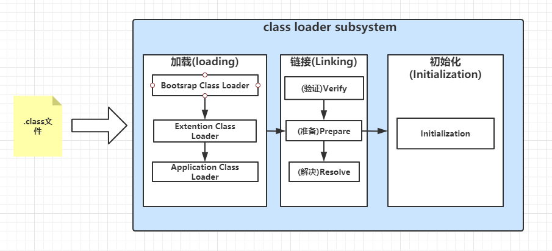
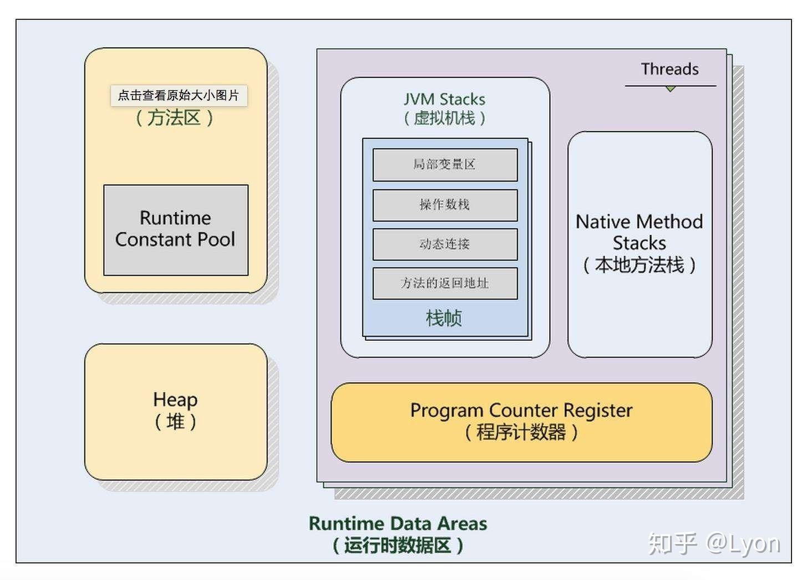
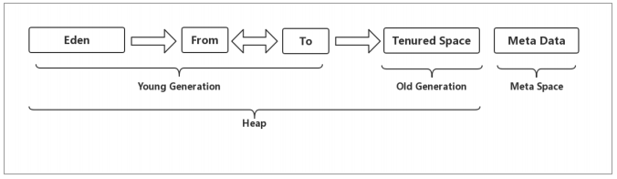
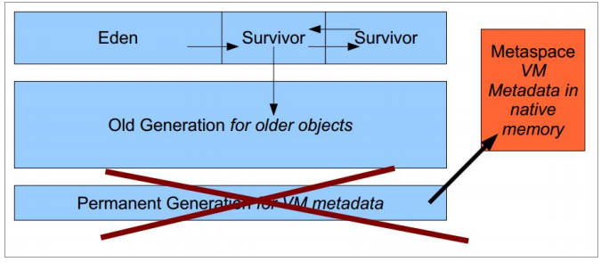

## JVM内存结构

JVM学习主要包括以下几个方面：

- JVM内存结构
- 类加载机制和JDK的调优工具命令
- GC日志格式
- GC调优实战

Java虚拟机（java virtual machine），一种能够运行java字节码的虚拟机。作为一种编程语言的虚拟机，实际上不只是专用于Java语言，只要生成的编译文件匹配JVM对加载编译文件格式要求，任何语言都可以由JVM编译运行。比如：kotlin、scala等。

jvm有很多，如Hotspot，还有JRockit、J9等

## JVM的基本结构

JVM由三个主要的子系统构成：

- 类加载子系统

  

- 运行时数据区（内存结构）

  

- 执行引擎


## 运行时数据区(内存结构)

### 1.方法区(Method Area)

类的所有字段和方法字节码，以及一些特殊方法如构造函数，接口代码也在这里定义。

包括：静态变量、常量、类信息(构造方法/接口定义)、运行时常量池

虽然java虚拟机规范把方法区描述为堆的一个逻辑部分，但是它却有一个别名叫做Non-Heap(非堆)，目的是为了和Java的堆区分开。

### 2.堆(Heap)

虚拟机启动时自动分配创建，用于存放对象的实例，几乎所有对象（包括常量池）都在堆上分配内存，当对象无法在该空间申请到内存是将抛出OutOfMemoryError异常。同时也是垃圾收集器管理的主要区域。



#### 2.1新生代(Young Generation)

类出生、成长、消亡的区域，一个类在这里产生，应用，最后被垃圾回收器收集，结束生命。

新生代分为两部分：伊甸区(Eden Space) 和幸存者区(Survivor space)，所有的类都是在伊甸区被new出来。

幸存区又分为From和To区，当Eden区的空间用完，程序又需要创建对象，JVM的垃圾回收器将Eden区进行垃圾回收(Minor GC)，将Eden区中的不在被其他对象应用的对象进行销毁，然后将Eden区中剩余的对象移到From Survivor区，若From Survivor区也满了，再对该区域进行垃圾回收，然后移动到To Survivor，这个过程如果交替执行，没有被回收的对象每次加1，当对象头中加到15次(head中变为 1111)时，将该对象放到老年代中。

#### 2.2老年代(Old Generation)

新生代金国多次GC仍然存活的对象移动到老年区，如老年代也满了，这时候将发生Major GC(也叫Full GC)，进行老年区的内存清理，如老年区执行了Full GC之后发现仍然无法进行对象的保存，就会抛出OOM异常。

#### 2.3 元空间(Meta Space)

在JDK1.8之后，元空间代替了永久代，它时对JVM规范中方法区的实现，区别在于元数据区不在虚拟机当中，而是在本地内存中，永久代则在虚拟机当中，永久代逻辑结构上也属于堆，但是物理上不属于。

为什么移除永久代？

参考官方解释http://openjdk.java.net/jeps/122

大概意思就是移除永久代时为融合HotSpot于JRockit而做出的努力，因为JRockit没有永久代，不需要配置永久代。



### 3.栈

#### 栈帧的概念：

栈帧(Stack Frame)： 是用于支持虚拟机进行方法调用和方法执行的数据结构。栈帧存储了方法的局部变量表，操作数栈、动态链接和方法返回地址等信息。每一个方法从调用至执行完成的过程，都对应着一个栈帧再虚拟机栈里从入栈到出栈的过程。

Java线程执行方法的内存模型，一个线程对应一个栈，每个方法的在执行的同时都会创建一个栈帧，不存在垃圾回收问题，只要线程已结束栈就释放，生命周期和下次你哼一致。

关于「栈帧」，《Java虚拟机规范》中的描述：

- 栈帧是用来存储数据和部分过程结果的数据结构，同时也用来处理动态连接、方法返回值和异常分派。
- 栈帧随着方法调用而创建，随着方法结束而销毁——无论方法正常完成还是异常完成都算作方法结束。
- 栈帧的存储空间由创建它的线程分配在Java虚拟机栈之中，每一个栈帧都有自己的本地变量表(局部变量表)、操作数栈和指向当前方法所属的类的运行时常量池的引用。

### 4.本地方法栈(Native Method Stack)

和栈作用类似，区别时Java栈为JVM执行Java方法提供的服务，而本地方法栈为JVM执行native方法服务。登记native方法，在Execution Engine执行时加载到本地方法库。

### 5.程序计数器(Program Counter Register)

就是一个指针，指向方法区中的方法字节码(用来存储指向下一条指令的地址，也就是即将要执行的指令代码)，由执行引擎读取下一条指令，是一个非常小的内存空间，几乎忽略不计。

### 测试：


测试的java代码：

```java
public class ByteCodeTest {
    static int method() {
        int a = 1;
        int b = 2;
        return (a + b) * 10;
    }

    public static void main(String[] args) {
        int result = method();
        System.out.println("result=" + result);
    }
}

```

**使用javap -c ByteCodeTest.class 对代码进行反汇编：**

```SAS
Compiled from "ByteCodeTest.java"
public class concur.ByteCodeTest {
  public concur.ByteCodeTest();
    Code:
       0: aload_0
       1: invokespecial #1                  // Method java/lang/Object."<init>":()V
       4: return

  static int method();
    Code:
       0: iconst_1
       1: istore_0
       2: iconst_2
       3: istore_1
       4: iload_0
       5: iload_1
       6: iadd
       7: bipush        10
       9: imul
      10: ireturn

  public static void main(java.lang.String[]);
    Code:
       0: invokestatic  #2                  // Method method:()I
       3: istore_1
       4: getstatic     #3                  // Field java/lang/System.out:Ljava/io/PrintStream;
       7: new           #4                  // class java/lang/StringBuilder
      10: dup
      11: invokespecial #5                  // Method java/lang/StringBuilder."<init>":()V
      14: ldc           #6                  // String result=
      16: invokevirtual #7                  // Method java/lang/StringBuilder.append:(Ljava/lang/String;)Ljava/lang/StringBuilder;
      19: iload_1
      20: invokevirtual #8                  // Method java/lang/StringBuilder.append:(I)Ljava/lang/StringBuilder;
      23: invokevirtual #9                  // Method java/lang/StringBuilder.toString:()Ljava/lang/String;
      26: invokevirtual #10                 // Method java/io/PrintStream.println:(Ljava/lang/String;)V
      29: return
}
```

###### 解释 static int method()中指令：

1. iconst_1 ：将int型1推送至栈顶（int=1）
2. istore_0 ：将栈顶int型数值存入第0个本地变量
3. iconst_2： 将int型2推送至栈顶
4. istore_1 ：将栈顶int型数值存入第1个本地变量
5. iload_0  ： 将第0个int型本地变量推送至栈顶
6. iload_1 ：将第1个int型本地变量推送至栈顶
7. iadd ：将栈顶两int型数值相加并将结果压入栈顶
8. bipush ：将单字节的常量值(-128~127)推送至栈顶      10：从运行时常量池中拿去这个数据
9. imul ： 将栈顶两int型数值相乘并将结果压入栈顶
10. ireturn ： 从当前方法返回int

###### 特殊指令解析：

- invokestatic：调用静态方法
- getstatic ：获取指定类的静态域，并将其值压入栈顶
- new ：创建一个对象，并将其引用值压入栈顶
- dup ：复制栈顶数值并将复制值压入栈顶
- invokespecial ： 调用超类构造方法，实例初始化方法，私有方法
- ldc ：将int, float或String型常量值从常量池中推送至栈顶
- invokevirtual ：调用实例方法

**使用javap -v ByteCodeTest.class 输出附加信息：**

这是详细的指令执行跳转流程：

```SAS
Classfile /D:/workspace/Spring_framework/java-virtual-machine/src/main/java/concur/ByteCodeTest.class
  Last modified 2020-4-25; size 725 bytes
  MD5 checksum 4cd0d8ae73ce3a39fc4f09374ae3d6a6
  Compiled from "ByteCodeTest.java"
public class concur.ByteCodeTest
  minor version: 0
  major version: 52
  flags: ACC_PUBLIC, ACC_SUPER
Constant pool:
   #1 = Methodref          #12.#23        // java/lang/Object."<init>":()V
   #2 = Methodref          #11.#24        // concur/ByteCodeTest.method:()I
   #3 = Fieldref           #25.#26        // java/lang/System.out:Ljava/io/PrintStream;
   #4 = Class              #27            // java/lang/StringBuilder
   #5 = Methodref          #4.#23         // java/lang/StringBuilder."<init>":()V
   #6 = String             #28            // result=
   #7 = Methodref          #4.#29         // java/lang/StringBuilder.append:(Ljava/lang/String;)Ljava/lang/StringBuilder;
   #8 = Methodref          #4.#30         // java/lang/StringBuilder.append:(I)Ljava/lang/StringBuilder;
   #9 = Methodref          #4.#31         // java/lang/StringBuilder.toString:()Ljava/lang/String;
  #10 = Methodref          #32.#33        // java/io/PrintStream.println:(Ljava/lang/String;)V
  #11 = Class              #34            // concur/ByteCodeTest
  #12 = Class              #35            // java/lang/Object
  #13 = Utf8               <init>
  #14 = Utf8               ()V
  #15 = Utf8               Code
  #16 = Utf8               LineNumberTable
  #17 = Utf8               method
  #18 = Utf8               ()I
  #19 = Utf8               main
  #20 = Utf8               ([Ljava/lang/String;)V
  #21 = Utf8               SourceFile
  #22 = Utf8               ByteCodeTest.java
  #23 = NameAndType        #13:#14        // "<init>":()V
  #24 = NameAndType        #17:#18        // method:()I
  #25 = Class              #36            // java/lang/System
  #26 = NameAndType        #37:#38        // out:Ljava/io/PrintStream;
  #27 = Utf8               java/lang/StringBuilder
  #28 = Utf8               result=
  #29 = NameAndType        #39:#40        // append:(Ljava/lang/String;)Ljava/lang/StringBuilder;
  #30 = NameAndType        #39:#41        // append:(I)Ljava/lang/StringBuilder;
  #31 = NameAndType        #42:#43        // toString:()Ljava/lang/String;
  #32 = Class              #44            // java/io/PrintStream
  #33 = NameAndType        #45:#46        // println:(Ljava/lang/String;)V
  #34 = Utf8               concur/ByteCodeTest
  #35 = Utf8               java/lang/Object
  #36 = Utf8               java/lang/System
  #37 = Utf8               out
  #38 = Utf8               Ljava/io/PrintStream;
  #39 = Utf8               append
  #40 = Utf8               (Ljava/lang/String;)Ljava/lang/StringBuilder;
  #41 = Utf8               (I)Ljava/lang/StringBuilder;
  #42 = Utf8               toString
  #43 = Utf8               ()Ljava/lang/String;
  #44 = Utf8               java/io/PrintStream
  #45 = Utf8               println
  #46 = Utf8               (Ljava/lang/String;)V
{
  public concur.ByteCodeTest();
    descriptor: ()V
    flags: ACC_PUBLIC
    Code:
      stack=1, locals=1, args_size=1
         0: aload_0
         1: invokespecial #1                  // Method java/lang/Object."<init>":()V
         4: return
      LineNumberTable:
        line 3: 0

  static int method();
    descriptor: ()I
    flags: ACC_STATIC
    Code:
      stack=2, locals=2, args_size=0
         0: iconst_1
         1: istore_0
         2: iconst_1
         3: istore_1
         4: iload_0
         5: iload_1
         6: iadd
         7: bipush        10
         9: imul
        10: ireturn
      LineNumberTable:
        line 5: 0
        line 6: 2
        line 7: 4

  public static void main(java.lang.String[]);
    descriptor: ([Ljava/lang/String;)V
    flags: ACC_PUBLIC, ACC_STATIC
    Code:
      stack=3, locals=2, args_size=1
         0: invokestatic  #2                  // Method method:()I
         3: istore_1
         4: getstatic     #3                  // Field java/lang/System.out:Ljava/io/PrintStream;
         7: new           #4                  // class java/lang/StringBuilder
        10: dup
        11: invokespecial #5                  // Method java/lang/StringBuilder."<init>":()V
        14: ldc           #6                  // String result=
        16: invokevirtual #7                  // Method java/lang/StringBuilder.append:(Ljava/lang/String;)Ljava/lang/StringBuilder;
        19: iload_1
        20: invokevirtual #8                  // Method java/lang/StringBuilder.append:(I)Ljava/lang/StringBuilder;
        23: invokevirtual #9                  // Method java/lang/StringBuilder.toString:()Ljava/lang/String;
        26: invokevirtual #10                 // Method java/io/PrintStream.println:(Ljava/lang/String;)V
        29: return
      LineNumberTable:
        line 11: 0
        line 12: 4
        line 13: 29
}
SourceFile: "ByteCodeTest.java"

```

###### 指令集：

[简书汇编指令](https://www.jianshu.com/p/bc91c6b46d7b) [维基百科指令集](https://en.wikipedia.org/wiki/Java_bytecode_instruction_listings)


