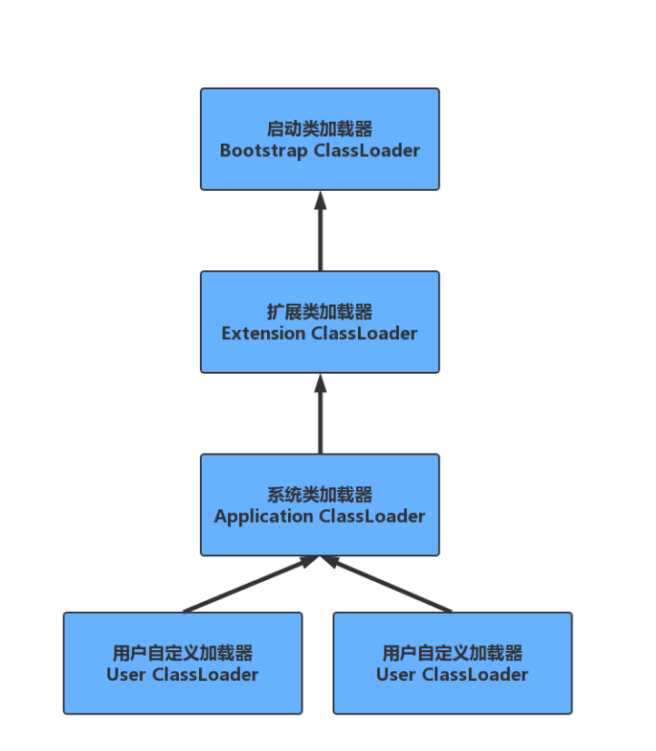
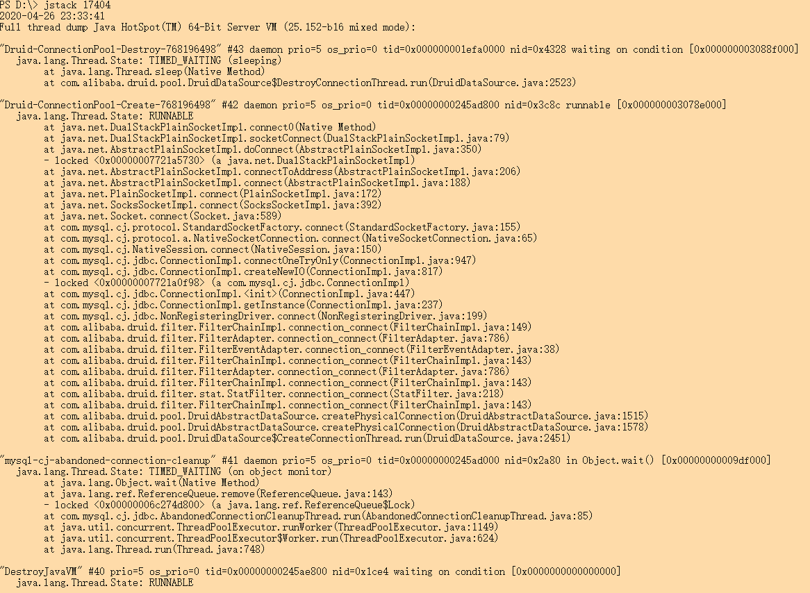

## 类加载机制与JDK调优监控工具

Java运行时编译源码.java成字节码，由jie运行，jre由java虚拟机实现，JVM分析字节码后解释并执行。


## 类的生命周期


#### 1. 加载（Loading）

将.class文*件从磁盘读取到内存*。（参考java.lang.ClassLoader的loadClass()方法），虚拟机完成三件事情：

1.  **通过 一个类的全限定名来获取定义此类的二进制字节流**(并没有指明要从一个Class文件中获取，也可以从其他渠道，譬如：网络、动态生成、数据库等);

2. **将这个字节流所代表的静态存储结构转化为方法区的运行时数据结构;**

3. **在内存中(对于HotSpot虚拟机而已就是方法区)生成一个代表这个类的java.lang.Class对象，作为方法区这个类的各种数据的访问入口**。

   加载阶段和连接阶段的部分类容(如一部分字节码文件格式验证动作)是交叉进行的，加载阶段尚未完成，连接阶段可能已经开始，但这些在加载阶段进行的动作，仍然属于连接阶段的内容，这两个阶段的开始时间仍然保持着固定的先后顺序。

#### 2. 验证（Verification）

验证是连接阶段的第一步，这一阶段的目的是为了确保Class文件的字节流中包含的信息符合当前虚拟机的要求，并且不会危害虚拟机的自身的安全，该阶段大致会完成4个验证动作：

- 文件格式验证：验证字节流是否符合Class文件格式的规范(例如，是否以魔术0xCAFEBABE开头，主次版本号是否在当前虚拟机的处理范围之内、常量池是否有不被支持的类型等)

- 元数据验证：对字节码描述的信息进行语义分析，以保证其描述的信息符合Java语言规范的要求（例如：这个类是否有父类，除了java.lang.Object之外）；

- 字节码验证：通过数据流和控制流分析，确定程序语义是合法的、符合逻辑的；

- 符号引用验证：确保解析动作能正确执行。

  **验证阶段是非常重要的，但不是必须的，它对程序运行期没有影响。**如果所引用的类经过反复验证，可以考虑采用Xverifynone参数来关闭大部分的类验证措施，以缩短虚拟机类加载的时间。

#### 3.准备（Preparation）

**准备阶段是正式为类变量（static成员变量）分配内存并设置类变量的初始化值（零值）的阶段，这些变量所使用的内存都将在方法区中进行分配。**这个时候进行内存分配的仅包括类变量，而不包括实例变量，实例变量将会在对象实例化时随着对象一起分配在堆中。其次，这里所说的初始值通常情况下是数据类型的零值，

假设一个类的变量定义为：

```java
public static int  value  = 123;
```

那么，变量value在准备阶段过后的值为0，而不是123。因为这个时候尚未开始执行任何的Java方法，而把value赋值为123的 `putstatic`指令是程序被编译后，存放与类构造方法`<clinit>()`之中，所以把value赋值为123动作将在初始化阶段才会执行。

```java
public static final int value  = 123;
```

特殊情况是：当类字段的字段属性是ConstantValue时，会在准备阶段初始化为指定的值，所以标注为`final`之后，value的值在准备阶段初始化为123而非0。

#### 4. 解析（Resolution）

**解析阶段是虚拟机将常量池内的符号引用替换为直接引用的过称。**解析动作主要针对类或接口、字段、类方法、接口方法、方法类型、方法句柄和调用点限定符7类符号引用进行。

#### 5. 初始化（Initialization）

类初始化阶段是类加载过程的最后一步，在前面的类加载过程中，除了在在加载阶段用户应用程序可以通过自定义类加载器参与之外，其余动作完全是由虚拟机主导和控制。到了初始化阶段，才真正开哦时执行类中定义的Java程序代码（字节码）。

在准备阶段，变量已经赋过一次系统要求的初始值（零值），而在初始化阶段，则根据程序猿通过程序制定的主观计划去初始化类变量和其他资源，或更直接地说：**初始化阶段是执行类构造器`<clinit>()`方法的过程。** `<clinit>()`方法是由编译器自动收集类中的所有类变量的赋值动作和静态语句块`static{}`中的语句合并产生的，编辑器收集的顺序是由语句在源文件中出现的顺序所决定的，静态语句块只能访问到定义在静态语句块之前的变量，定义在它之后的变量，在前面的静态语句块可以赋值但是不能访问。例如：

```java
 static {
        i = 10;
        System.out.println(i); //Error:IIlegal  foward reference
    }
    static  int i = 0;
```

如果将报错的代码，改成下面情形，程序就可以编译通过并可以正常执行了。

```java
 static {
        i = 10;
        //System.out.println(i);
        System.out.println("static代码块");
    }
    static  int i = 0;
    public static void main(String[] args) {
        System.out.println(i);
        //程序输出为0
    }
```

但此时输出的值仍然为0,因为**静态语句块只能访问到定义在静态语句块之前的变量**程序遵循happens-before原则。

类构造器`<clinit>()`与实例构造器`<init>()`不同，它不需要程序员显式调用，虚拟机会保证在子类类构造器`<clinit>()`执行前，父类的类构造`<clinit>()`执行完毕。由于父类的构造器`<clinit>()`先执行，也就意味着父类中定义的静态语句块/静态变量的初始化要优先于子类的静态语句块/静态变量的初始化执行。

特别地：类构造器`<clinit>()`对于类或者接口来说并不是必需的，如果一个类中没有静态语句块，也没对类变量的赋值操作，那么编译器可以不为这个类生产类构造器`<clinit>()`。

**虚拟机会保证一个类的类构造器`<clinit>()`在多线程环境中被正确的加锁、同步，如果多个线程同时去初始化一个类，那么只会有一个线程去执行这个类的类构造器`<clinit>()`，其他线程都需要阻塞等待，直到活动线程执行`<clinit>()`方法完毕。**

此时需要注意的是，在这种情形下，其他线程会被阻塞，但如果执行`<clinit>()`方法的那条线程退出后，其他线程在唤醒之后不会再次进入/执行`<clinit>()`方法，**因为在同一个类加载器下，一个类型只会被初始化一次**。如果一个类的`<clinit>()`

方法中有很长的操作，就可能造成多个线程阻塞，在实际应用中这种阻塞往往是隐藏的，如下所示：

```java
public class DealLoopTest {
    static {
        System.out.println("DealLoopTest...");
    }

    static class DealLoopClass {
        static {
            if (true) {
                System.out.println(Thread.currentThread()
                        + "init DeadLoopClass");
                while (true) {      // 模拟耗时很长的操作
                }
            }
        }
    }

    public static void main(String[] args) {
        new Thread(()->{
            System.out.println(Thread.currentThread() + " start");
            DealLoopClass dlc = new DealLoopClass();
            System.out.println(Thread.currentThread() + " run over");
        },"t1").start();

        new Thread(()->{
            System.out.println(Thread.currentThread() + " start");
            DealLoopClass dlc = new DealLoopClass();
            System.out.println(Thread.currentThread() + " run over");
        },"t2").start();
    }
}
打印结果：
DealLoopTest...
Thread[t1,5,main] start
Thread[t2,5,main] start
Thread[t1,5,main]init DeadLoopClass

```

#### 6.案例分析

再来看下程序启动发生顺序：

```java
public class Parent {
    {
        System.out.println("父类代码块");
    }
    static {
        System.out.println("父类static代码块");
    }
    public Parent() {
        System.out.println("父类构造器");
    }
}
```


```java
public class ObjectStartTest  extend Parent{
    public ObjectStartTest() {
        System.out.println("构造器");
    }
    public static void main(String[] args) {
        System.out.println(i);
        System.out.println("main 线程代码块");
        methodStatic();
        new ObjectStartTest().method();
    }
    static {
        i = 10;
        //System.out.println(i);
        System.out.println("static代码块");
    }
    static int i = 0;
    {
        i = 20;
        System.out.println(i);
        System.out.println("普通代码块");
    }

    static void methodStatic() {
        System.out.println("静态方法");
    }
    void method() {
        System.out.println("普通方法");
    }
}

```

程序打印结果：

```javascript
程序打印结果：
父类static代码块
static代码块
0
main 线程代码块
静态方法
父类代码块
父类构造器
20
普通代码块
构造器
普通方法
```

从程序打印的结果可知程序的执行顺序：父类static代码块 -> 当前对象的static代码块 -> 父类代码块 ->父类构造函数 -> 子类代码块 -> 子类构造函数 -> 子类方法。

**父类的类构造器() -> 子类的类构造器() -> 父类的成员变量和实例代码块 -> 父类的构造函数 -> 子类的成员变量和实例代码块 -> 子类的构造函数。**

特殊例子：

```java
public class ObjectStartTest extends Parent {
    static ObjectStartTest startTest = new ObjectStartTest();
    public ObjectStartTest() {
        System.out.println("子类构造器");
    }
    static {
        i = 10;
        System.out.println("子类static代码块");
    }
    {
        i = 20;
        System.out.println(i);
        System.out.println("子类普通代码块");
    }
    static void methodStatic() {
        System.out.println(i);
        System.out.println("子类静态方法");
    }
    void method() {
        System.out.println("子类普通方法");
    }
    static int i = 0;
    public static void main(String[] args) {
        System.out.println(i);
        System.out.println("main 线程代码块");
        methodStatic();
        startTest.method();
        System.out.println("================");
        new ObjectStartTest().method();
    }
}

/**打印结果：
父类static代码块
父类普通代码块
父类构造器
20
子类普通代码块
子类构造器
子类static代码块
0
main 线程代码块
0
子类静态方法
子类普通方法
================
父类普通代码块
父类构造器
20
子类普通代码块
子类构造器
子类普通方法
*/
```

在当前对象中使用static实例化当前对象，此时代码的执行顺序如下：

**父类的类构造器() -> 父类的成员变量和实例代码块 -> 父类的构造函数 -> 子类的成员变量和实例代码块 -> 子类的构造函数  -> 子类的类构造器()**

```java
static ObjectStartTest startTest = new ObjectStartTest();
```

也就是实例化ObjectStartTest对象，但这个时候类都没有初始化完毕，能直接实例化吗？事实上，这涉及到一个根本的问题就是：**实例初始化不一定要在类初始化结束之后才开始初始化。**下面来说明这个问题：

我们知道吗，类的生命周期是：**加载->验证->准备->解析->初始化->使用->卸载**，并且只有在准备阶段和初始化阶段才会涉及类变量的初始化和赋值，因此只针对这两个阶段进行分析：

首先，在类的准备阶段需要做的是为类变量（static变量）分配内存并设置默认值（零值），因此在该阶段结束后，类变量startTest将变为null，int类型b变为0。特别注意，**如果类的变量是final修饰的，那么编译器在编译时会为value生成ContantValue属性，并在准备阶段虚拟机就会根据ContstantValue的设置将变量设置为制定的值。**也就是说如果对变量采用如下定义的方式时：

```java
static  final  int  b = 112;
```

那么在准备阶段b的值就是112,而不是0；

此外，在类的初始化阶段需要做的是执行类构造器`<clinit>()`，需要指出的是，类构造器本质上是编译器收集所有静态语句块和类变量的赋值语句按语句在源码中的顺序合并生成类构造器`<clinit>()`。因此，对于上面程序而言，JVM先执行第一条静态变量的赋值语句：

```java
startTest = new ObjectStartTest();
```

此时有个疑问：**在类还没有初始化完成之前，能直接进行实例化相应的对象吗？** 

事实上，从Java角度看，我们知道一个类初始化的基本常识，那就是是：在同一个类加载器下，一个类型只会被初始化一次，所以，一旦开始初始化一个类型，无论是否完成，后续都不会在重新触发该类型的初始化阶段了（只考虑在同一个类加载器的情形下），一次，在实例化上述程序中的 startTest 变量时，**实际上是把实例初始化嵌入到静态初始化流程中，并且在上面的程序中，嵌入到了静态初始化的起始位置。**

经典面试题目：

```java
public class Foo {
    int i = 1;
    Foo(){
        System.out.println("1:"+i);
        int x = getValue();
        System.out.println("2:"+x);
    }
    {
        i = 2;
    }
    int getValue(){
          System.out.println("4:"+i);
        return i;
    }
}
class Bar extends  Foo{
    int j =1;
    Bar(){
        j=2;
    }
    {
        j=3;
    }
    @Override
    int getValue(){
        return j;
    }
    public static void main(String[] args) {
        Bar bar = new Bar();
        System.out.println("3:" + bar.getValue());
    }
    //程序执行正确结果：
    /**
    1:2
	2:0
	3:2
    */
}
```

打印第4步在构造函数中调用对象方法不会被执行。

## 类加载器的种类

#### 启动类加载器（Bootstrap ClassLoader）

负责加载JRE的核心类库，如JRE目录下的rt.jar,charset.jar等

#### 扩展类加载器（Extension ClassLoader）

负责加载JRE扩展目录ext中jar类包

#### 系统类加载器（Application ClassLoader)

负责加载Class Path路径下的类包

#### 自定义加载器（User ClassLoader）

负责加载用户自定义路径下的类包



## 类加载机制

### 全盘负责委托机制

当一个ClassLoader加载一个类的时候，除非显式的使用另外一个ClassLoader，该类所依赖和引用的类也由这个ClassLoader载入

### 双亲委派机制

指先委托父类加载器寻找目标类，在找不到的情况下，在自己路径中查找并载入目标类

**双亲委派模式的优势：**

- 沙箱安全机制：比如自己写的String.class类不会被加载，因为核心库中已经有了该类，而加载是先在核心库中加载，这样就可以防止核心库被随意篡改。
- 避免类的重复加载：当父ClassLoader已经加载了该类的时候，就不需要子ClassLoader再加载一次。

## JVM性能调优监控工具

### Jinfo

查看正在运行的Java程序的扩展参数：

**查看JVM的参数：**


**查看Java系统属性：**

等同于System.getProperties();


### Jstat

jstat命令可以查看堆内存各部分的使用量，以及加载类的数量。命令格式：

jstat [-命令选项] [vmid] [间隔时间/毫秒] [查询次数]

**类加载统计:** jstat -class [id]


| Loaded          | **Bytes**      | **Unloaded** | **Bytes**      | **Time** |
| --------------- | -------------- | ------------ | -------------- | -------- |
| 加载class的数量 | 所占用空间大小 | 未加载数量   | 未加载占用空间 | 时间     |

**垃圾回收统计：** jstat -gc [id]


SOC：第一个Survior区的空间

S1C：第二个Survivor区的空间

S0U：第一个Survivor区的使用空间

S1U：第二个Survivor区的使用空间

EC：Eden区的总空间

EU：Eden区的使用空间

OC：Old区的总空间

OU：Old区的已使用空间

MC：元空间的总空间

MU：元空间的使用空间

CCSC：压缩类的总空间

CCSU：压缩类的使用空间

YGC:年轻代垃圾回收消耗时间

YGCT：年轻代垃圾回收消耗时间

FGC：老年代垃圾回收次数

FGCT：老年代垃圾回收消耗的时间

GCT：垃圾回收消耗总时间

**堆内存统计:** jstat -gccapacity [id]


NGCMN:新生代最小空间

NGCMX：新生代最大空间

NGC：当前新生代空间

S0C:第一个Survivor区空间

S1C：第二个Survivor区空间

EC：Eden区的总空间

OGCMN：老爱年代最小空间

OGCMX:老年代最大空间

OGC：当前老年代空间

OC：当前老年代空间

MCMN：最小元空间大小

MCMX：最大元空间大小

MC：当前元空间大小

CCSMN：最小压缩类空间大小

CCSMX：最大压缩类空间大小

CCSC：当前压缩类空间大小

YGC：年轻代GC次数

FGC：老年代GC次数

**新生代垃圾统计：** 	jstat -gcnew [id]


S0C：第一个Survivor区空间

S1C：第二个Survivor区空间

S0U：第一个Survivor区的使用空间

S1U：第二个Survivor区的使用空间

TT：对象在新生代存活的次数

MTT：对象在新生代存活的最大次数

DSS：期望Survivor区大小

EC：Eden区的空间

EU：Eden区的使用空间

YGC：年轻代垃圾回收次数

YGCT：年轻代垃圾回收消耗时间

**新生代内存统计：**	jstat -gcnewcapacity [id]


NGCMN：新生代最小空间

NGCMX：新生代最大空间

NGC：当前新生代空间

S0CMX：最大第一个Survivor区空间

S0C：当前第一个Survivor区空间

S1CMX：最大第二个Survivor区空间

S1C：当前第二个Survivor区空间

ECMX：最大Eden区空间

EC：当前Eden区空间

YGC：年轻代垃圾回收次数

FGC：老年代垃圾回收次数

**老年代垃圾回收统计:**	jstat -gcold [id]


MC：元空间的总空间

MU：元空间的使用空间

CCSC：压缩类的总空间

CCSU：压缩类的使用空间

OC：Old区的总空间

OU：Old区的已使用空间

YGC：年轻代GC次数

FGC：老年代GC次数

FGCT：老年代垃圾回收消耗时间

GCT：垃圾回收消耗总时间

**老年代内存统计：**	jstat -gcoldcapacity [id]


OGCMN：老年代最小空间

OGCMX：老年代最大空间

OGC：当前老年代空间

OC：当前老年代空间

YGC：年轻代GC次数

FGC：老年代GC次数

FGCT：老年代垃圾回收消耗时间

GCT：垃圾回收消耗总时间

**元空间内存统计：**	jstat -gcmetacapacity [id]


MCMN：最小元空间大小

MCMX：最大元空间大小

MC：当前元空间大小

CCSMN：最小压缩类空间大小

CCSMX：最大压缩类空间大小

CCSC：当前压缩类空间大小

YGC：年轻代GC次数

FGC：老年代GC次数

FGCT：老年代垃圾回收消耗时间

GCT：垃圾回收消耗总时间

**总垃圾回收统计：**	jstat -gcutil [id]


S0：第一个Survivor区当前使用比例

S1：第二个Survivor区当前使用比例

E：Eden区使用比例

O：Old区使用比例

M：元空间使用比例

CCS：压缩使用比例

YGC：年轻代垃圾回收次数

YGCT：年轻代垃圾回收消耗时间

FGC：老年代垃圾回收次数

FGCT：老年代垃圾回收消耗时间

GCT：垃圾回收消耗总时间

### Jmap

可以用来查看内存信息

**堆的对象统计**

```
jmap -histo [id] > xxx.txt
```

如图：


num：序号

instances：实例数量

Bytes：占用空间大小

Class Name：类名

**堆信息**


**堆内存dump**	jmap -dump:format=b,file=xxx.hprof [id]


也可以在设置内存溢出的时候自动导出dump文件（内存很大的时候，可能会导不出来）

```
-XX:+HeapDumpOnOutOfMemoryError
-XX:HeapDumpPath=输出路径
-Xms10m -Xmx10m -XX:+PrintGCDetails 
-XX:+HeapDumpOnOutOfMemoryError
-XX:HeapDumpPath=d:\oomdump.dump
```

可以使用jvisualvm命令工具导入文件分析

### Jstack：

jstack用于生成java虚拟机当前时刻的线程快照。

