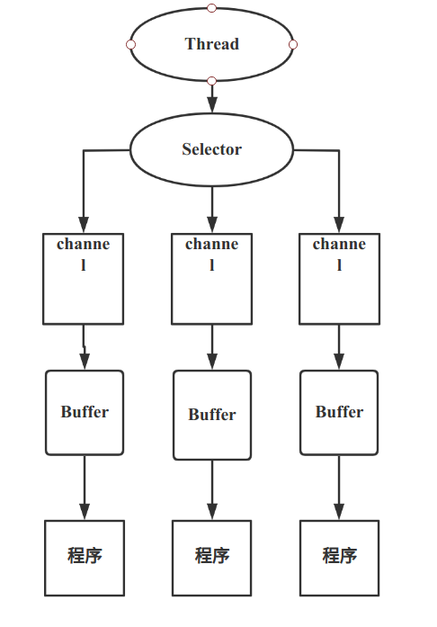
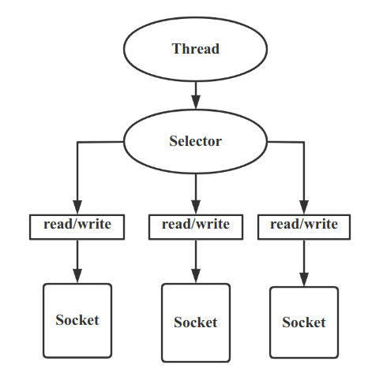
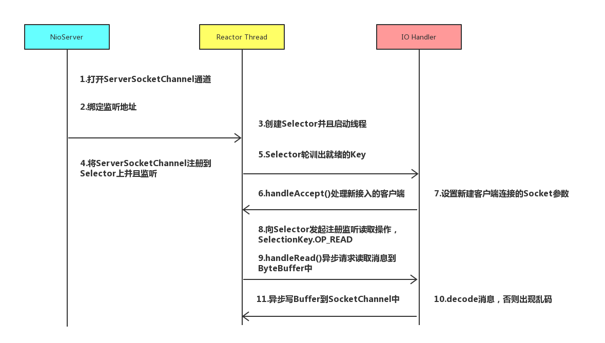

# IO模型

- I/O模型简单理解:就是什么样的通道进行数据发送和接收,很大程度上决定了程序通信的性能
- Java支持3种网络编程模型:BIO,NIO,AIO
- Java BIO :同步并阻塞(传统阻塞型),服务器实现模式为一个连接一个线程,即客户端有连接请求时服务端就需要启动一个线程进行处理,如果这个连接不做任何事情会造成不必要的线程开销
- Java NIO: **同步非阻塞**,服务器实现模式为一个线程处理多个请求,及客户端发送的连接请求都会注册到多路复用器上,多路复用器轮询每个连接请求有IO请求就进行处理
- Java AIO(NIO.2):**异步非阻塞**,AIO引入异步通道的概念,采用Proactor模式,简化了程序编写,有效的请求才启动线程,它的特点是先由操作系统完成后才通知服务端程序启动线程去处理,一般适用于连接数比较多且连接时间较长的应用

## BIO,NIO,AIO适用场景分析

- BIO方式适用于连接数比较小且固定的架构,这种方式对服务器资源要求比较高,并发局限于应用中,JDK1.4以前的唯一选择,但程序简单易理解
- NIO方式适用于连接数目多且连接比较短(轻操作)的架构,比如聊天服务器,弹幕系统,服务器间通信等.编程复杂,JDK1.4开始支持
- AIO方式适用于连接数目多且连接比较长(重操作)的架构,比如相册服务器,充分调用OS参与并发操作,编程复杂,JDK7开始支持

## BIO

- BIO就是传统的Java IO编程,其相关类和接口在java.io
- BIO(Blocking I/O):同步阻塞,服务器实现模式为一个连接一个线程,即客户端有连接请求时服务器就需要启动一个线程进行处理,如果这个连接不做任何事情会造成不要的线程开销,可以通过 **线程池机制改善**(实现多个客户连接服务器)
- BIO 方式适用于连接数目比较小且固定的架构,这种方式对服务器资源要求比较高,并发局限于应用中

### BIO 编程简单流程

- 服务器启动一个ServerSocket
- 客户端启动Socket对服务器进行通信,默认情况下服务器端需要对每个客户建立一个线程于之通讯
- 客户端发出请求后,先咨询服务器是否有线程响应,如果没有则会等待,或者被拒绝
- 如果有响应,客户端线程会等待请求结束后,再继续执行

### BIO 实例:

- 1.创建一个线程池
- 2.如果有客户端连接,就创建一个线程,与之通讯

```java
public static void main(String[] args) throws IOException {
        ExecutorService service = Executors.newCachedThreadPool();
        ServerSocket serverSocket =new ServerSocket(6666);
        System.out.println("启动服务器");
        while (true){
            //监听
            Socket socket = serverSocket.accept();
            System.out.println("连接到一个客户端");
            service.execute(() -> handler(socket));
        }
    }
    private static void handler(Socket socket){
        System.out.println("线程信息 id=" + Thread.currentThread().getId() + ",name="+Thread.currentThread().getName());
        byte[] bytes = new byte[1024];
        //通过socket 获取输入流
        try {
            InputStream inputStream = socket.getInputStream();
            while (true){
                int read = inputStream.read(bytes);
                if(read != -1){
                    //输出客户端发送的数据
                    System.out.println(new String(bytes,0,read));
                }else {
                    break;
                }
            }
        } catch (IOException e) {
            e.printStackTrace();
        }
        finally {
            System.out.println("关闭client的连接");
            try {
                socket.close();
            } catch (IOException e) {
                e.printStackTrace();
            }
        }
    }
```

## Java NIO 基本介绍

1. Java NIO 全称 java non-blocking IO, 是指JDK提供的新API,从JDK1.4开始,java提供了一系列改进的输入输出的新特性,被统称为NIO(即new IO),是同步非阻塞的

2. NIO相关类都放在java.nio包及子包下,并且对原生java.io包中的很多类进行了改写.

3. NIO有三大核心部分**:Channel(通道)**,**Buffer(缓冲区)**,**Selector(选择器)**

4. NIO是面向**缓冲区**,或者面**向块编程**的,数据读取到一个它稍后处理的缓冲区,需要时可在缓冲区中前后移动,这就增加了处理过程中的灵活性,使用它可以提供非阻塞式的高伸缩网络

5. Java NIO的非阻塞模式,使一个线程从某通道发送请求或者读取数据,但是他仅能得到目前可用的数据,如果目前没有可以用时,就什么都不获取,而不是保持阻塞,所以直到数据变的可以读取之前,该线程可以继续做其他的事情,非阻塞写也是如此,一个线程请求写入一些数据大某通道,但不需要等待它完全写入,这个线程同时可以去做别的事情

6. 通俗理解:NIO是可以做到用一个线程来处理多个操作的

7. HTTP2.0 使用了多路复用技术,做到同一个连接并发处理多个请求,而且并发请求的数量比http1.1大了好几个数量级

8. 案例说明

   ```java
   
   ```

### NIO 三大核心原理

一张图描述NIO的Selector ,Channel和Buffer的关系



1. 每个channel都会对应一个Buffer
2. Selector对应一个线程,一个线程对应多个channel
3. 该图反应了有三个channel注册到该selector
4. 程序切换到哪个channel是由事件决定的,event就是一个重要的概念
5. selector会根据不同的事件,在各个通道上切换
6. buffer就是一个内存块,底层是有一个数组
7. 数据的读取写入是通过buffer,这个和BIO不同,BIO中要么是输入流,或者是输出流,不能双向,但是NIO的buffer是可以读也可以写的,需要flip方法进行切换
8. channel是双向的,可以返回底层操作系统的情况,比如linux,底层的操作系统通道是双向的

### Buffer

#### 基本介绍

**缓冲区Buffer** : 缓冲区本质上是一个可以读写数据的内存块,,可以理解成是一个**容器对象(含数组)**,该对象提供了一组方法,可以更轻松地使用内存块,缓冲区对象内置了一些机制,能够跟踪和记录缓冲区的状态变化情况,Channel提供从文件,网络读取数据的渠道,但是读取或写入的数据都必须经由Buffer,

#### Buffer 类及其子类

Buffer类定义了所有的缓冲区都具有的四个属性来提供关于其包含的数据元素的信息:

| 属性     | 描述                                                         |
| -------- | ------------------------------------------------------------ |
| capacity | 容量,即可以容纳的最大数据量,在缓冲区创建时被设定并且不能改变 |
| limit    | 表示缓冲区的当前终点,不能对缓冲区超过极限的位置进行读写操作.且极限是可以修改的 |
| position | 位置 ,下一个要被读或写元素的索引,每次读写缓冲区数据时都会改变该值,为下次读写做准备 |
| mark     | 标记                                                         |

**Buffer类相关方法**

```java
public abstract class Buffer{
    //返回此缓冲区的容量
    public final int capacity();
    //返回此缓冲区的位置
    public final int position();
    public final Buffer position(int newPosition);
    public final int limit();

    public final Buffer limit(int newLimit);

    public final Buffer mark();

    public final Buffer reset();

    public final Buffer clear();

    public final Buffer flip();
   
    public final Buffer rewind();
    
    public final int remaining();
   
    public final boolean hasRemaining();
    
    public abstract boolean isReadOnly();
    public abstract boolean hasArray();

  
    public abstract Object array();

    public abstract int arrayOffset();

    public abstract boolean isDirect();

    final int nextGetIndex();

    final int nextGetIndex(int nb);

    final int nextPutIndex() ;

    final int nextPutIndex(int nb);

    final int checkIndex(int i) ;

    final int checkIndex(int i, int nb);

    final int markValue();

    final void truncate();

    final void discardMark();

    static void checkBounds(int off, int len, int size) ;
}
```

**ByteBuffer:** 最常用的,主要方法如下:

```java
public abstract class ByteBuffer{
     /**
     * Allocates a new direct byte buffer.
     */
    public static ByteBuffer allocateDirect(int capacity) {
        return new DirectByteBuffer(capacity);
    }
    /**
     * Allocates a new byte buffer.
     */
    public static ByteBuffer allocate(int capacity) {
        if (capacity < 0)
            throw new IllegalArgumentException();
        return new HeapByteBuffer(capacity, capacity);
    }
    /**
     * Wraps a byte array into a buffer.
     */
    public static ByteBuffer wrap(byte[] array,int offset, int length)
    {
        try {
            return new HeapByteBuffer(array, offset, length);
        } catch (IllegalArgumentException x) {
            throw new IndexOutOfBoundsException();
        }
    }
    /**
     * Wraps a byte array into a buffer.
     */
    public static ByteBuffer wrap(byte[] array) {
        return wrap(array, 0, array.length);
    }
        /**
     * Relative <i>get</i> method.  Reads the byte at this buffer's
     * current position, and then increments the position.
     */
    public abstract byte get();

    /**
     * <p> Writes the given byte into this buffer at the current
     * position, and then increments the position. </p>
     */
    public abstract ByteBuffer put(byte b);

    /**
     * Absolute <i>get</i> method.  Reads the byte at the given
     * index.
     */
    public abstract byte get(int index);
    /**
     * <p> Writes the given byte into this buffer at the given
     * index. </p>
     */
    public abstract ByteBuffer put(int index, byte b);

}
```

### Channel

#### 基本介绍:

1. NIO的通道类似于流,但有些区别如下:
   - 通道可以同时进行读写,而流只能读或者只能写
   - 通道可以实现异步读写数据
   - 通道可以从缓冲读数据,也可以写数据到缓冲
2. BIO中的stream是单向的,例如FileInputStream对象只能进行读取数据的操作,而NIO中的通道Channel是双向的,可以读操作,也可以写操作.
3. Channel在NIO中是一个接口 public interface Channel extends Closeable
4. 常用的Channel类有:**FileChannel**,**DatagramChannel**,**ServerSocketChannel**和**SocketChannel**.{ServerSocketChannel类似ServerSocket,SocketChannel类似Socket}
5. FileChannel用于文件的数据读写,DaatgramChannel用于UDP的数据读写,ServerSocketChannel和SocketChannel用于TCP的数据读写

#### FileChannel

FileChannel主要用来对本地文件进行IO操作,常见的方法有:

1. public int read(ByteBuffer dst); 从通道读取数据并放到缓存区中
2. public int write(ByteBuffer src);把缓冲区的数据写到通道中
3. public long transferFrom(ReadableByteChannel src,long position,long count);从目标通道中复制数据到当前通道
4. public long transferTo(long position,long count,WritableByteChannel target);把数据从当前通道复制给目标通道

**本地文件写数据实例:**

```java
package com.NIO;

import java.io.FileOutputStream;
import java.nio.ByteBuffer;
import java.nio.channels.FileChannel;

public class NIOFileChannel01 {
    public static void main(String[] args) throws Exception {
        String str = "hello file Channel";
        //获取输出流
        FileOutputStream fileOutputStream = new FileOutputStream("/home/workspace/Spring_framework/netty/a.txt");
        //获取文件管道
        FileChannel channel = fileOutputStream.getChannel();
        //创建一个byteBuffer,并将数据写入
        ByteBuffer buffer = ByteBuffer.allocate(1024);
        buffer.put(str.getBytes());
        //读写切换
        buffer.flip();
        channel.write(buffer);
    }
}
```

**本地文件读数据实例:**

```java
package com.NIO;

import java.io.File;
import java.io.FileInputStream;
import java.nio.ByteBuffer;
import java.nio.channels.FileChannel;

public class NIOFileChannel02 {
    public static void main(String[] args) throws Exception {
        File file = new File("/home/workspace/Spring_framework/netty/a.txt");
        FileInputStream fileInputStream = new FileInputStream(file);
        //获取输入流通道
        FileChannel channel = fileInputStream.getChannel();
        ByteBuffer buffer = ByteBuffer.allocate((int) file.length());
        // 将通道的数据读到buffer
        channel.read(buffer);
        //将byteBuffer的数据输出
        System.out.println(new String(buffer.array()));
        fileInputStream.close();
    }
}
```

**使用一个buffer完成数据的读取写入实例:**

```java
package com.NIO;

import java.io.FileInputStream;
import java.io.FileOutputStream;
import java.nio.ByteBuffer;
import java.nio.channels.FileChannel;

public class NIOFileChannel03 {
    public static void main(String[] args) throws Exception {
        FileInputStream fileInputStream = new FileInputStream("/home/workspace/Spring_framework/netty/a.txt");
        FileOutputStream outputStream = new FileOutputStream("/home/workspace/Spring_framework/netty/out.txt");

        FileChannel in = fileInputStream.getChannel();
        FileChannel out =   outputStream.getChannel();

        ByteBuffer allocate = ByteBuffer.allocate(1024);
        while (true){
            //这里有一个重要的操作,重置
            allocate.clear();//清空buffer
            int read = in.read(allocate);
            //表示读完
            if(read == -1){
                break;
            }
            //将文件写入 out.txt
            allocate.flip();
            out.write(allocate);
        }
        fileInputStream.close();
        outputStream.close();
    }
}
```

**文件拷贝实例:**

```java
package com.NIO;

import java.io.FileInputStream;
import java.io.FileOutputStream;
import java.nio.ByteBuffer;
import java.nio.channels.FileChannel;

public class NIOFileChannel04 {
    public static void main(String[] args) throws Exception {
        FileInputStream fileInputStream = new FileInputStream("/home/workspace/Spring_framework/images/netty/NIO-selector-buffer-channel.png");
        FileOutputStream outputStream = new FileOutputStream("copy.png");

        FileChannel in = fileInputStream.getChannel();
        FileChannel dest =   outputStream.getChannel();

        dest.transferFrom(in,0,in.size());

        fileInputStream.close();
        outputStream.close();
    }
}
```

#### 关于Buffer和Channel的注意事项

- ByteBuffer支持类型化的put和get,put放入的是什么类型数据,get就应该使用相应的数据类型来取出,否则可能有BufferUnderflowException异常,如下代码:

  ```java
  package com.NIO;
  
  import java.nio.ByteBuffer;
  
  public class NIOByteBufferPutGet {
      public static void main(String[] args) {
          ByteBuffer allocate = ByteBuffer.allocate(64);
          allocate.putInt(100);
          allocate.putLong(1232L);
          allocate.putChar('中');
          allocate.putShort((short) 6);
          allocate.flip();
          System.out.println(allocate.getInt());
          System.out.println(allocate.getLong());
          System.out.println(allocate.getChar());
          System.out.println(allocate.getShort());
          System.out.println(allocate.getShort());
      }
  }
  ```

- 可以将一个普通Buffer转成只读Buffer

  ```java
  package com.NIO;
  
  import java.nio.ByteBuffer;
  
  public class ReadOnlyBuffer {
      public static void main(String[] args) {
  
          ByteBuffer allocate = ByteBuffer.allocate(64);
          for (int i = 0; i < 64; i++) {
              allocate.put((byte) i);
          }
          //读取
          allocate.flip();
          //得到一个只读buffer
          ByteBuffer buffer = allocate.asReadOnlyBuffer();
          System.out.println(buffer);
          while (buffer.hasRemaining()){
              System.out.println(buffer.get());
          }
          //ReadOnlyBufferException
          buffer.put((byte) 1000);
      }
  }
  ```

- NIO还提供了MappedByteBuffer,可以让文件直接在内存(堆外的内存)中进行修改,而如何同步大到文件由NIO来完成

  ```java
  package com.NIO;
  
  import java.io.RandomAccessFile;
  import java.nio.MappedByteBuffer;
  import java.nio.channels.FileChannel;
  
  /**
   * 说明
   * 1.MappedByteBuffer  可让文件直接在内存(堆外内存)中修改,操作系统不需要拷贝一次
   */
  public class MappedByteBufferTest {
      public static void main(String[] args) throws Exception {
          RandomAccessFile accessFile = new RandomAccessFile("/home/workspace/Spring_framework/netty/a.txt","rw");
          //获取通道
          FileChannel channel = accessFile.getChannel();
          /**
           * 参数1: FileChannel.MapMode.READ_WRITE 使用读写模式
           * 参数2: 0, 可以直接修改的起始位置
           * 参数3: 5, 是映射到内存的大小,即将a.txt的多少个字节映射到内存
           * 可以直接修改的范围是0 - 5
           * 实际类型是 DirectByteBuffer
           */
          MappedByteBuffer mappedByteBuffer = channel.map(FileChannel.MapMode.READ_WRITE, 0, 5);
          mappedByteBuffer.put(0, (byte) 'H');
          mappedByteBuffer.put(3, (byte) '9');
          //上面参数5 是大小位置,而不是索引位置5,IndexOutOfBoundsException
          mappedByteBuffer.put(5, (byte) 'X');
          accessFile.close();
      }
  }
  ```

  

- 前面我们讲的读写操作,都是通过一个Buffer完成的,NIO还支持通过多个Buffer(即Buffer数组)完成读写操作,即Scattering和Gatering

```java
package com.NIO;

import java.net.InetSocketAddress;
import java.nio.Buffer;
import java.nio.ByteBuffer;
import java.nio.channels.ServerSocketChannel;
import java.nio.channels.SocketChannel;
import java.util.Arrays;

/**
 * scattering:将数据写入到buffer时,可以采用buffer数组,依次写入[[分散]
 * gathering:从buffer读取数据时,可以采用buffer数组,依次读
 *
 */
public class ScatteringAndGatheringTest {
    public static void main(String[] args)throws Exception {
        ServerSocketChannel serverSocketChannel = ServerSocketChannel.open();
        InetSocketAddress address = new InetSocketAddress(6666);
        //绑定端口到socket,并启动
        serverSocketChannel.socket().bind(address);
        //创建buffer数组
        ByteBuffer[] byteBuffers = new ByteBuffer[2];
        byteBuffers[0] = ByteBuffer.allocate(5);
        byteBuffers[1] = ByteBuffer.allocate(3);
        SocketChannel socketChannel = serverSocketChannel.accept();
        //
        int messageLength = 8;
        while (true){
            int byteRead = 0;
            while(byteRead < messageLength){
                long read = socketChannel.read(byteBuffers);
                byteRead +=read;
                System.out.println("byteRead:=" + byteRead);
                Arrays.stream(byteBuffers).map(buffer -> "position = " + buffer.position() + ",limit = " + buffer.limit()).forEach(
                        System.out::println
                );
                //将所有的buffer进行flip
                Arrays.stream(byteBuffers).forEach(Buffer::flip);
                //将数据读取显示到客户端
                long byteWrite= 0;
                while (byteWrite < messageLength){
                    long write = socketChannel.write(byteBuffers);
                    byteWrite += write;
                }
                //将所有的buffer进行clear
                Arrays.asList(byteBuffers).forEach(Buffer::clear);
                System.out.println("byteRead = " + byteRead + ",byteWrite = " + byteWrite + ",messageLength = " + messageLength);
            }
        }
    }
}
```

### Selector(选择器)

#### 基本介绍

1. Java的NIO,用非阻塞的IO方式,可以用一个线程,处理多个客户端连接,就会使用到Selector
2. **Selector能够检测多个注册的通道上是否有事件发生(注意:多个Channel以事件的方式可以注册到同一个Selector),**如果有事件发生,便获取事件然后针对每个事件进行相应的处理,这样可以只用一个单线程去管理多个通道,也就是管理多个连接和请求
3. 只有在连接真正有读写事件发生时,才会进行读写,就大大减少了系统开销,并且不必为每个连接都创建一个线程,不用去维护多个线程
4. 避免了多个线程上下文切换带来的系统开销

#### Selector示意图和特殊说明



**特殊说明:**

1. Netty的IO线程NioEventLoop聚合了Selector(选择器,也叫多路复用器).可以同时并发处理成百上千个客户端连接.
2. 当线程从某客户端Socket通道进行读写数据时,若没有数据可用时,该线程可以进行其他任务
3. 线程通常将非阻塞IO的空闲时间用于在其他通道上执行IO操作,所以单独的线程可以管理多个输入和输出通道
4. 由于读写操作都是非阻塞的,这就可以充分提升IO线程的运行效率,避免由于频繁I/O阻塞导致的线程挂起
5. 一个I/O线程可以并发处理N个客户端连接和读写操作,这从根本上解决了传统同步阻塞I/O一连接一线程模型,架构的性能,弹性伸缩能力和可靠性都得到了极大提升.

#### Selector类和常用方法

```java
public abstract class selector implements Closeable{
    public static Selector open();//得到一个选择器对象
    public int select(long timeout);//监控多有注册的通道,当其中有IO操作可以进行时,将对应的selectorKey加入到内部集合中并返回,参数用来设置超时时间
    public Set<SelectorKey> selectedKeys();//从内部集合中得到所有的SelectionKey
}
```

#### 注意事项

1. NIO 中的ServerSocketChannel功能类似ServerSocket,SocketChannel功能类似Socket
2. selector相关方法说明
   - selector.select() //阻塞获取
   - selector.select(1000);//阻塞1000毫秒,在1000毫秒后返回
   - selector.wakeup();//唤醒selector
   - selector.selectNow(); //不阻塞,立马返还

#### NIO 非阻塞网路编程原理分析图

NIO非阻塞网络编程相关的(Selector,SelectorKey,ServerSocketChannel和SocketChannel)关系梳理图



**说明:**

1. 当客户端连接时 会通过ServerSocketChannel得到SocketChannel
2. 将SocketChannel注册到Selector上 register(Selector sel,int ops);一个selector上可以注册多个SocketChannel
3. 注册后返回一个SelectinoKey,会和该Selector关联(集合)
4. Selector进行监听select方法,会返回有事件发生的通道到的个数
5. 进一步得到各个SelectionKey(有事件发生的)
6. 再通过SelectionKey反向获取SocketChannel ,方法channel();
7. 可以通过得到的channel,完成业务处理

**NIOServer:**

```java
    package com.NIO;
    
    import java.net.InetSocketAddress;
    import java.nio.ByteBuffer;
    import java.nio.channels.*;
    import java.util.Iterator;
    import java.util.Set;
    
    public class NIOServer {
        public static void main(String[] args) throws  Exception{
            //创建serverSocketChannel -> serverSocket
            ServerSocketChannel serverSocketChannel = ServerSocketChannel.open();
            //得到一个selector对象
            Selector selector = Selector.open();
            //绑定端口
            serverSocketChannel.socket().bind(new InetSocketAddress(6666));
            //设置为非阻塞
            serverSocketChannel.configureBlocking(false);
            //把serverSocketChannel 注册到selector 关心事件为OP_ACCEPT
            serverSocketChannel.register(selector, SelectionKey.OP_ACCEPT);
    
            //循环等待连接
            while (true){
                if(selector.select(1000) == 0){ //没有事件发生
                    System.out.println("服务器等待了1s,无连接");
                    continue;
                }
                //如果返回的 > 0 就获取到相关的selectionKey集合
                //1.如果返回的 > 0 ,表示获取到关注的事件
                //2.selector.selectedKeys 方法返回的关注事件的集合
                // 通过 selectionKeys 反向获取通道
                Set<SelectionKey> selectionKeys = selector.selectedKeys();
    
                //selectionKeys 遍历
                Iterator<SelectionKey> it = selectionKeys.iterator();
                while (it.hasNext()){
                    //获取selectionKey
                    SelectionKey selectionKey = it.next();
                    // 根据key 对应的通道发生的相关事件做相应的处理
                    if(selectionKey.isAcceptable()){ //如果是OP_ACCEPT ,有新的客户端连接
                        //该客户端生成一个SocketChannel
                        SocketChannel socketChannel = serverSocketChannel.accept();
                        System.out.println("客户端连接成功,生成了socketChannel = " + socketChannel.hashCode());
                        //将socketChannel设置为非阻塞
                        socketChannel.configureBlocking(false);
                        //将socketChannel 注册到selector,关注事件为OP_READ ,同时给该socketChannel 关联一个buffer
                        socketChannel.register(selector,SelectionKey.OP_READ, ByteBuffer.allocate(1024));
                    }
                    if(selectionKey.isReadable()){ // 发生OP_READ
                        //通过key反向获取对应的channel
                        SocketChannel channel = (SocketChannel) selectionKey.channel();
                        //获取到该channel关联的buffer
                        ByteBuffer byteBuffer = (ByteBuffer) selectionKey.attachment();
                        channel.read(byteBuffer);
                        System.out.println("从客户端发出来数据: " + new String(byteBuffer.array()));
                        channel.close();
                    }
                    //手动从集合中移除selectionKey,防止重复操作
                    it.remove();
                }
            }
        }
    }
```

**NIOClient:**

```java
package com.NIO;

import java.net.InetSocketAddress;
import java.nio.ByteBuffer;
import java.nio.channels.SocketChannel;

public class NIOClient {
    public static void main(String[] args) throws Exception{
        // 得到一个网络通道
        SocketChannel socketChannel = SocketChannel.open();
        //设置非阻塞
        socketChannel.configureBlocking(false);
        //提供服务器端的ip和端口
        InetSocketAddress address = new InetSocketAddress("127.0.0.1", 6666);
        //连接服务器
        if(!socketChannel.connect(address)){
            while (!socketChannel.finishConnect()){
                System.out.println("因为连接需要时间,客户端不会阻塞,可以做其他工作..");
            }
        }
        //如果连接成功,就发送数据
        String str = "hello,这是数据";
        //Wraps a byte array into a buffer.
        ByteBuffer buffer = ByteBuffer.wrap(str.getBytes());
        //发送数据,将buffer的数据,写入到channel
        socketChannel.write(buffer);
        socketChannel.close();
    }
}
```

#### SelectionKey API

1. SelectionKey,表示Selector和网络通道的注册关系,共四种:

    int OP_READ: 有新的网络连接可以accept,值为16

   int OP_CONNECT: 代表连接已经建立,值为8,

   int OP_WRITE : 代表写操作,值为4

   int OP_READ : 代表读操作,值为1

   源码:

   ```java
   public static final int OP_READ = 1 << 0;
   
   public static final int OP_WRITE = 1 << 2;
   
   public static final int OP_CONNECT = 1 << 3;
   
   public static final int OP_ACCEPT = 1 << 4;
   ```

2. SelectionKey相关方法:

   ```java
   public abstract class SelectionKey {
   
       // -- Channel and selector operations --
   
       /**
        * Returns the channel for which this key was created.  This method will
        * continue to return the channel even after the key is cancelled.
        * 得到与之关联的通道
        */
       public abstract SelectableChannel channel();
   
       /**
        * Returns the selector for which this key was created.  This method will
        * continue to return the selector even after the key is cancelled.
        * 得到与之关联的Selector对象
        */
       public abstract Selector selector();
   
       /**
        * Tells whether or not this key is valid.
        *
        */
       public abstract boolean isValid();
   
       /**
        * Requests that the registration of this key's channel with its selector
        * be cancelled.  Upon return the key will be invalid and will have been
        * added to its selector's cancelled-key set.  The key will be removed from
        * all of the selector's key sets during the next selection operation.
        *
        */
       public abstract void cancel();
   
   
       // -- Operation-set accessors --
   
       /**
        * Retrieves this key's interest set.
        *
        */
       public abstract int interestOps();
   
       /**
        * Sets this key's interest set to the given value.
        * 设置或改变监听事件
        */
       public abstract SelectionKey interestOps(int ops);
   
       /**
        * Retrieves this key's ready-operation set.
        *
        */
       public abstract int readyOps();
   
   
       /**
        * Tests whether this key's channel is ready for reading.
        * 是否可读
        */
       public final boolean isReadable() {
           return (readyOps() & OP_READ) != 0;
       }
   
       /**
        * Tests whether this key's channel is ready for writing.
        * 是否可写
        */
       public final boolean isWritable() {
           return (readyOps() & OP_WRITE) != 0;
       }
   
       /**
        * Tests whether this key's channel has either finished, or failed to
        * finish, its socket-connection operation.
        * 是否和channel建立连接
        */
       public final boolean isConnectable() {
           return (readyOps() & OP_CONNECT) != 0;
       }
   
       /**
        * Tests whether this key's channel is ready to accept a new socket
        * connection.
        * 是否可以accept
        */
       public final boolean isAcceptable() {
           return (readyOps() & OP_ACCEPT) != 0;
       }
   
   
       // -- Attachments --
   
       private volatile Object attachment = null;
   
       private static final AtomicReferenceFieldUpdater<SelectionKey,Object>
           attachmentUpdater = AtomicReferenceFieldUpdater.newUpdater(
               SelectionKey.class, Object.class, "attachment"
           );
   
       /**
        * Attaches the given object to this key.
        */
       public final Object attach(Object ob) {
           return attachmentUpdater.getAndSet(this, ob);
       }
   
       /**
        * Retrieves the current attachment.
        * 得到与之关联的共享数据
        */
       public final Object attachment() {
           return attachment;
       }
   ```

### ServerSocketChannel

1. ServerSocketChannel在服务器端监听新的**客户端Socket连接**

2. 相关方法如下

   **ServerSocketChannel:**

   ```java
   public abstract class ServerSocketChannel extends AbstractSelectableChannel implements NetworkChannel{
   
       /**
        * Initializes a new instance of this class.
        *
        */
       protected ServerSocketChannel(SelectorProvider provider) {
           super(provider);
       }
   
       /**
        * Opens a server-socket channel.
        * 得到一个ServerSocketChannel通道
        */
       public static ServerSocketChannel open() throws IOException {
           return SelectorProvider.provider().openServerSocketChannel();
       }
   
       /**
        * Returns an operation set identifying this channel's supported
        * operations.
        * 
        */
       public final int validOps() {
           return SelectionKey.OP_ACCEPT;
       }
   
   
       /**
        * Binds the channel's socket to a local address and configures the socket
        * to listen for connections.
        * 设置服务器端口号
        * @since 1.7
        */
       public final ServerSocketChannel bind(SocketAddress local)
           throws IOException
       {
           return bind(local, 0);
       }
   
       /**
        * Binds the channel's socket to a local address and configures the socket to
        * listen for connections.
        *
        * @since 1.7
        */
       public abstract ServerSocketChannel bind(SocketAddress local, int backlog)
           throws IOException;
   
   
       public abstract <T> ServerSocketChannel setOption(SocketOption<T> name, T value)
           throws IOException;
   
       /**
        * Retrieves a server socket associated with this channel.
        *
        */
       public abstract ServerSocket socket();
   
       /**
        * Accepts a connection made to this channel's socket.
        *
        */
       public abstract SocketChannel accept() throws IOException;
   
       @Override
       public abstract SocketAddress getLocalAddress() throws IOException;
   }
   ```

   **AbstractSelectableChannel :**

   ```java
   /**
    * Adjusts this channel's blocking mode.
    * 设置阻塞或非阻塞模式,取值false表示采用非阻塞模式
    */
   public final SelectableChannel configureBlocking(boolean block)
       throws IOException
   {
       synchronized (regLock) {
           if (!isOpen())
               throw new ClosedChannelException();
           if (blocking == block)
               return this;
           if (block && haveValidKeys())
               throw new IllegalBlockingModeException();
           implConfigureBlocking(block);
           blocking = block;
       }
       return this;
   }
    /**
        * Registers this channel with the given selector, returning a selection key.
        *
        */
       public final SelectionKey register(Selector sel, int ops,
                                          Object att)
           throws ClosedChannelException
       {
           synchronized (regLock) {
               if (!isOpen())
                   throw new ClosedChannelException();
               if ((ops & ~validOps()) != 0)
                   throw new IllegalArgumentException();
               if (blocking)
                   throw new IllegalBlockingModeException();
               SelectionKey k = findKey(sel);
               if (k != null) {
                   k.interestOps(ops);
                   k.attach(att);
               }
               if (k == null) {
                   // New registration
                   synchronized (keyLock) {
                       if (!isOpen())
                           throw new ClosedChannelException();
                       k = ((AbstractSelector)sel).register(this, ops, att);
                       addKey(k);
                   }
               }
               return k;
           }
       }
   ```

**SelectableChannel:**

```java
/**
     * Registers this channel with the given selector, returning a selection
     * key.
     *
     */
    public abstract SelectionKey register(Selector sel, int ops, Object att)
        throws ClosedChannelException;


    /**
     * Registers this channel with the given selector, returning a selection
     * key.
     * 
     */
    public final SelectionKey register(Selector sel, int ops)
        throws ClosedChannelException
    {
        return register(sel, ops, null);
    }
```

### SocketChannel

1. SocketChannel,**网络IO通道,具体负责进行读写操作,NIO缓冲区的数据写入通道,或者把通道里额数据读到缓冲区**

2. 相关方法如下:

   ```java
   public abstract class SocketChannel
       extends AbstractSelectableChannel
       implements ByteChannel, ScatteringByteChannel, GatheringByteChannel, NetworkChannel
   {
       /**
        * Opens a socket channel.
        * 得到一个SocketChannel通道
        */
       public static SocketChannel open() throws IOException {
           return SelectorProvider.provider().openSocketChannel();
       }
   
       /**
        * Opens a socket channel and connects it to a remote address.
        * 
        */
       public static SocketChannel open(SocketAddress remote)
           throws IOException
       {
           SocketChannel sc = open();
           try {
               sc.connect(remote);
           } catch (Throwable x) {
               try {
                   sc.close();
               } catch (Throwable suppressed) {
                   x.addSuppressed(suppressed);
               }
               throw x;
           }
           assert sc.isConnected();
           return sc;
       }
   
       /**
        * Returns an operation set identifying this channel's supported
        * operations.
        *
        */
       public final int validOps() {
           return (SelectionKey.OP_READ
                   | SelectionKey.OP_WRITE
                   | SelectionKey.OP_CONNECT);
       }
       @Override
       public abstract SocketChannel bind(SocketAddress local)
           throws IOException;
       @Override
       public abstract <T> SocketChannel setOption(SocketOption<T> name, T value)
           throws IOException;
   
       /**
        * Shutdown the connection for reading without closing the channel.
        *
        * @since 1.7
        */
       public abstract SocketChannel shutdownInput() throws IOException;
   
       /**
        * Shutdown the connection for writing without closing the channel.
        *
        * @since 1.7
        */
       public abstract SocketChannel shutdownOutput() throws IOException;
   
       /**
        * Retrieves a socket associated with this channel.
        *
        */
       public abstract Socket socket();
   
       /**
        * Tells whether or not this channel's network socket is connected.
        *
        */
       public abstract boolean isConnected();
   
       /**
        * Tells whether or not a connection operation is in progress on this
        * channel.
        */
       public abstract boolean isConnectionPending();
   
       /**
        * Connects this channel's socket.
        * 连接服务器
        */
       public abstract boolean connect(SocketAddress remote) throws IOException;
   
       /**
        * Finishes the process of connecting a socket channel.
        * 如该上面的connect方法连接失败,接下来就要通过该方法完成连接操作
        */
       public abstract boolean finishConnect() throws IOException;
   
       /**
        * Returns the remote address to which this channel's socket is connected.
        *
        * @since 1.7
        */
       public abstract SocketAddress getRemoteAddress() throws IOException;
   	//从通道里读数据
       public abstract int read(ByteBuffer dst) throws IOException;
       public abstract long read(ByteBuffer[] dsts, int offset, int length)
           throws IOException;
       public final long read(ByteBuffer[] dsts) throws IOException {
           return read(dsts, 0, dsts.length);
       }
       //往通道里写数据
       public abstract int write(ByteBuffer src) throws IOException;
       public abstract long write(ByteBuffer[] srcs, int offset, int length)
           throws IOException;
       public final long write(ByteBuffer[] srcs) throws IOException {
           return write(srcs, 0, srcs.length);
       }
       @Override
       public abstract SocketAddress getLocalAddress() throws IOException;
   }
   ```


### NIO网络编程实例 - 群聊系统

**实例要求**:

1. 编写一个NIO群聊系统,实现服务器端和客户端之间的数据简单通讯(非阻塞)
2. 实现多人群聊
3. 服务器端:可以监测用户上线,离线,并实现消息转发功能
4. 客户端:通过channel可以无阻塞发送消息给其他所有用户,同时可以接受其他用户发送的消息(有服务器转发得到)

**GroupChatServer:**

```java
package com.NIO.groupchat;

import java.io.IOException;
import java.net.InetSocketAddress;
import java.nio.ByteBuffer;
import java.nio.channels.*;
import java.util.Iterator;

public class GroupChatServer {
    //定义属性
    private Selector selector;
    private ServerSocketChannel listenChannel;
    private static final  int PORT = 6667;
    //初始化
    public GroupChatServer(){
        try {
            //得到选择器
            selector = Selector.open();
            listenChannel = ServerSocketChannel.open();
            //绑定端口
            listenChannel.bind(new InetSocketAddress(PORT));
            //设置非阻塞模式
            listenChannel.configureBlocking(false);
            listenChannel.register(selector, SelectionKey.OP_ACCEPT);
        }catch (IOException e){
            e.printStackTrace();
        }
    }

    public void listen(){
        try {
            while(true){
                int count = selector.select();
                if(count > 0){ //有事件处理
                    Iterator<SelectionKey> iterator = selector.selectedKeys().iterator();
                    while (iterator.hasNext()){
                        //取出SelectionKey
                        SelectionKey key = iterator.next();
                        if(key.isAcceptable()){
                            SocketChannel sc = listenChannel.accept();
                            sc.configureBlocking(false);
                            sc.register(selector,SelectionKey.OP_READ);
                            //提示
                            System.out.println(sc.getRemoteAddress() + " 上线了 ");
                        }
                        if(key.isReadable()){//通道发生read事件,即通道中的数据可读状态
                            //处理读
                            readData(key);
                        }
                        //remove防止重复处理
                        iterator.remove();
                    }
                }else {
                    System.out.println("等待....");
                }
            }
        }catch (Exception e){
            e.printStackTrace();
        }
    }
    //读取客户端消息
    private void readData(SelectionKey key){
        //定义一个socketChannel
        SocketChannel channel = null;
        try{
            //得到channel
            channel = (SocketChannel) key.channel();
            //创建一个buffer
            ByteBuffer buffer = ByteBuffer.allocate(1024);
            int count = channel.read(buffer);
            //根据count的值处理
            if(count > 0){
                String msg = new String(buffer.array());
                System.out.println("from 客户端 : " + msg.trim());
                //向其他的客户端转发消息
                sendInfoToOtherClients(msg,channel);
            }
        }catch (Exception e){
            e.printStackTrace();
            try {
                assert channel != null;
                System.out.println(channel.getRemoteAddress() + "  离线了");
                //取消注册
                key.cancel();;
                //关闭通道
                channel.close();
            } catch (IOException ioException) {
                ioException.printStackTrace();
            }
        }
    }
    //转发消息给其他客户(通道)
    private void sendInfoToOtherClients(String msg,SocketChannel self) throws Exception{
        System.out.println("服务器转发消息中....");
        //遍历 所有注册到selector上的SocketChannel,并排除自己
        Iterator<SelectionKey> iterator = selector.keys().iterator();
        while(iterator.hasNext()) {
            SelectionKey key = iterator.next();
            //通过key取出socketChannel
            Channel channel = key.channel();
            if(channel instanceof SocketChannel && channel != self){
                SocketChannel dest = (SocketChannel) key.channel();
                //将msg存储到buffer
                ByteBuffer buffer = ByteBuffer.wrap(msg.getBytes());
                //将buffer的数据写入通道
                dest.write(buffer);
            }
        }
    }
    public static void main(String[] args) {
        GroupChatServer server = new GroupChatServer();
        server.listen();
    }
}

```

**GroupChatClient:**

```java
package com.NIO.groupchat;

import sun.security.rsa.RSAUtil;

import java.io.IOException;
import java.net.InetSocketAddress;
import java.nio.ByteBuffer;
import java.nio.channels.SelectionKey;
import java.nio.channels.Selector;
import java.nio.channels.SocketChannel;
import java.util.Iterator;
import java.util.Scanner;

public class GroupChatClient {

    //定义属性
    private final String HOST = "127.0.0.1";
    private final int PORT = 6667;
    private Selector selector;
    private SocketChannel socketChannel;
    private String userName;

    public GroupChatClient() {
        try {
            this.selector = Selector.open();
            //链接服务器
            socketChannel = SocketChannel.open(new InetSocketAddress(HOST, PORT));
            socketChannel.configureBlocking(false);
            socketChannel.register(selector, SelectionKey.OP_READ);
            //得到 userName
            this.userName = socketChannel.getLocalAddress().toString().substring(1);
            System.out.println(userName + " is ok ...");
        } catch (IOException e) {
            e.printStackTrace();
        }
    }

    public void sendInfo(String info) throws IOException {
        info = userName + " 说 " + info;
        socketChannel.write(ByteBuffer.wrap(info.getBytes()));
    }

    public void readInfo() throws IOException {
        int select = selector.select();
        if (select > 0) { //有可用的通道
            Iterator<SelectionKey> iterator = selector.selectedKeys().iterator();
            while (iterator.hasNext()) {
                SelectionKey key = iterator.next();
                if (key.isReadable()) {
                    //得到相关通道
                    SocketChannel sc = (SocketChannel) key.channel();
                   // sc.configureBlocking(false);
                    ByteBuffer buffer = ByteBuffer.allocate(1024);
                    //读取
                    sc.read(buffer);
                    System.out.println("发送消息--");
                    System.out.println(userName + " : " + new String(buffer.array()).trim());
                    iterator.remove();
                }
            }

        }
    }

    public static void main(String[] args) throws IOException {
        GroupChatClient client = new GroupChatClient();
        //启动一个线程
        new Thread(() -> {
            while (true) {
                try {
                    client.readInfo();
                    try {
                        Thread.currentThread().sleep(2000);
                    } catch (InterruptedException e) {
                        e.printStackTrace();
                    }
                } catch (IOException e) {
                    e.printStackTrace();
                }
            }
        }).start();
        //发送数据哥服务器端
        Scanner scanner = new Scanner(System.in);
        String ss = scanner.nextLine();
        client.sendInfo(ss);

    }
}
```

### NIO与零拷贝

### 介绍:

1. 零拷贝是网络编程的关键,很多性能优化都离不开
2. 在Java程序中,常用的零拷贝有mmap(内存映射)和sendFile.在OS里 ,到底是怎么样的设计,分析mmap和sendFile这两个零拷贝
3. 在NIO中如何使用零拷贝

### 传统IO数据读写

Java传统IO和网络编程的一段代码

```java
File file = new File("a.txt");
RandomAccessFile raf = new RandomAccessFile(file,"rw");
byte[] arr = new byte[(int)file.length()];
raf.read(arr);
Socket socket = new ServerSocket(8080).accept();
socket.getOutputStream().write(arr);
```

### 传统IO

### MMAP优化

1. mmap通过内存映射,将文件映射到内核缓冲区,同时,用户空间可以共享内核空间的数据,这样,在进行网络传输时,就可以减少内核空间到用户空间的拷贝次数

### SendFile优化

1. Linux 2.1 版本 提供了sendFile 函数,其基本原理如下: 数据不需要进过用户态,直接从内核缓冲区进入到SocketBuffer,同时,由于和用户态完全无关,就减少了一次上下文切换
2. Linux在2.4版本中,做了一些修改,避免了从内核缓冲区拷贝到SocketBuffer的操作,直接拷贝到协议栈,从而再一次减少了数据拷贝;
3. 2.4版本中这里其实有一次CPU拷贝kernel buffer -> socket buffer 但是,拷贝的信息很少,比如length,offeset,消耗低,可以忽略

**提示: 零拷贝从操作系统角度看,是没有CPU拷贝的**

### MMAP和sendFile的区别

1. mmap适合小数据量读写,sendFile适合大文件传输
2. mmap需要4次上下文切换,3次数据拷贝；sendFile需要3次上下文切换,最少2次数据拷贝
3. sendFile可以利用DMA方式,减少CPU拷贝,mmap则不能(必须从内核拷贝到Socket缓冲区)

**DMA:直接内存拷贝,不使用CPU**

### 零拷贝的理解

1. 我们所说的零拷贝,是从操作系统的角度来说的.因为内核缓冲区之间 数据是没有重复的(只有kernel buffer 有一份数据)
2. 零拷贝不仅仅带来更少的数据复制,还能带来其他的性能优势,例如更少的上下文切换,更少的CPU缓存伪共享以及无CPU校验和计算

### NIO零拷贝案例

**旧IO实现文件copy:**

client:

```java
package com.NIO.zerocopy;

import java.io.DataOutputStream;
import java.io.FileInputStream;
import java.io.InputStream;
import java.net.Socket;

public class OldIOClient {
    public static void main(String[] args) throws Exception{
        Socket socket = new Socket("127.0.0.1",7001);
        String fileName = "/home/workspace/Spring_framework/algorithm/src/main/java/leetcode/editor/cn/all.json";
        InputStream inputStream = new FileInputStream(fileName);
        DataOutputStream dataOutputStream = new DataOutputStream(socket.getOutputStream());
        byte[] buffer = new byte[4096];
        long readCount ;
        long total = 0;
        long startTime = System.currentTimeMillis();
        while((readCount = inputStream.read(buffer)) >= 0){
            total += readCount;
            dataOutputStream.write(buffer);
        }
        System.out.println("发送字节总数:" + total + ",耗时=" + (System.currentTimeMillis() - startTime));
        dataOutputStream.close();
        inputStream.close();
        socket.close();
    }
}
```

server:

```java
package com.NIO.zerocopy;

import java.io.DataInputStream;
import java.io.IOException;
import java.net.ServerSocket;
import java.net.Socket;

/**
 * java IO 的服务器
 */
public class OldIOServer {
    public static void main(String[] args) throws IOException {
        ServerSocket serverSocket = new ServerSocket(7001);
        Socket socket = serverSocket.accept();
        DataInputStream dataInputStream = new DataInputStream(socket.getInputStream());
        byte[] bytes = new byte[4096];
        while(true){
            int readCount = dataInputStream.read(bytes,0,bytes.length);
            if(-1 == readCount){
                break;
            }
        }
    }
}
```

**NIO实现文件COPY:**

client:

```java
package com.NIO.zerocopy;

import java.io.FileInputStream;
import java.net.InetSocketAddress;
import java.nio.channels.FileChannel;
import java.nio.channels.SocketChannel;

public class NewIOClient {
    public static void main(String[] args)throws Exception {
        SocketChannel socketChannel = SocketChannel.open();
        socketChannel.connect(new InetSocketAddress("127.0.0.1",7001));
        String fileName = "/home/workspace/Spring_framework/algorithm/src/main/java/leetcode/editor/cn/all.json";
        FileChannel fileChannel = new FileInputStream(fileName).getChannel();
        //准备发送
        long startTime = System.currentTimeMillis();
        //在linux下一个transferTo 方法就可以完成传输
        //在windows 下一次调用transferTo 只能发送8M数据,就需要分段传输文件,
       //transferTo 底层使用的是零拷贝
        long transfer = fileChannel.transferTo(0, fileChannel.size(), socketChannel);
        System.out.println("发送的总的字节数 = " + transfer + ",耗时 : " + (System.currentTimeMillis() - startTime));
    }
}
```

sever:

```java
package com.NIO.zerocopy;

import java.io.IOException;
import java.net.InetSocketAddress;
import java.net.ServerSocket;
import java.nio.ByteBuffer;
import java.nio.channels.ServerSocketChannel;
import java.nio.channels.SocketChannel;

public class NewIOServer {
    public static void main(String[] args) throws IOException {
        InetSocketAddress address = new InetSocketAddress(7001);
        ServerSocketChannel serverSocketChannel = ServerSocketChannel.open();
        ServerSocket socket = serverSocketChannel.socket();
        socket.bind(address);
        ByteBuffer buffer = ByteBuffer.allocate(4096);
        while(true){
            SocketChannel socketChannel = serverSocketChannel.accept();
            int readCount = 0;
            while (-1 != readCount){
                readCount = socketChannel.read(buffer);
                //
                buffer.rewind();//倒带 position=0,mark作废
            }
        }
    }
}
```

## Java AIO

1. JDK7 引入了Asynchronous I/O ,即 AIO,在进行I/O编程中,常用到两种模式:Reactor和Proactor,Java的NIO就是Reactor,当有事件触发时,服务器端得到通知,进行相应的处理
2. AIO即NIO2.0,叫做异步不阻塞的IO,AIO引入异步通道的概念,采用了Proactor模式,简化了程序编写,有效的请求才启动线程,它的特点是先由操作系统完成后才通知服务器端程序启动线程去处理,一般适用于连接数多且连接时间比较长的应用
3. 目前AIO还没有广泛应用,Netty也是基于NIO,而不是AIO,详细介绍可以参考:**Java新一代网络编程模型AIO原理及Linux系统AIO介绍** -> http://www.52im.net/thread-306-1-1.html

### BIO,NIO,AIO 对比

|          | BIO      | NIO                  | AIO        |
| -------- | -------- | -------------------- | ---------- |
| IO模型   | 同步阻塞 | 同步非阻塞(多路复用) | 异步非阻塞 |
| 编程难度 | 简单     | 复杂                 | 复杂       |
| 可靠性   | 差       | 好                   | 好         |
| 吞吐量   | 低       | 高                   | 高         |

## 原生NIO存在的问题

1. NIO的类库和API复杂,使用麻烦,需要熟练掌握Selector,ServerSocketChannel,SocketChannel,ByteBuffer等
2. 需要具备其他额外的技能:要熟悉Java多线程编程,因为NIO编程涉及到Reactor模式,必须对多线程和网络编程非常熟悉,才能编写除高质量的NIO程序
3. 开发工作量和难度都非常大:例如客户端面临断连重连,网络闪断,半包读写,失败缓存,网络拥塞和异常流的处理等
4. JDK NIO的Bug:例如臭名昭著的Epoll Bug,它会导致Selector空轮询,最终导致CPU100%等