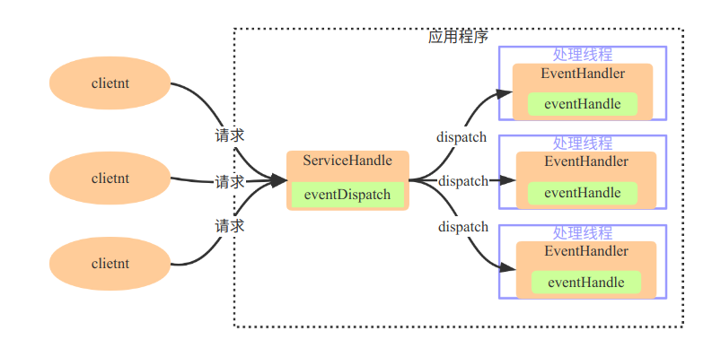
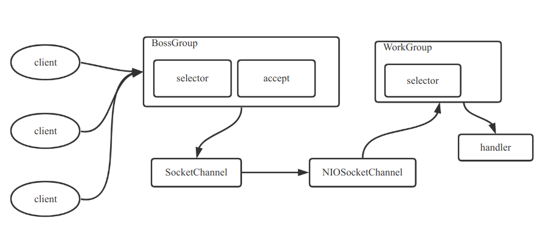
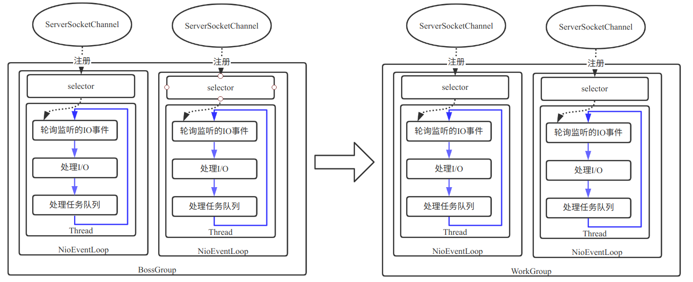
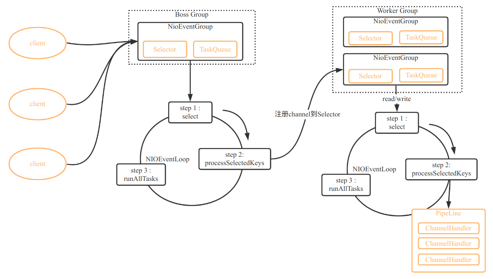
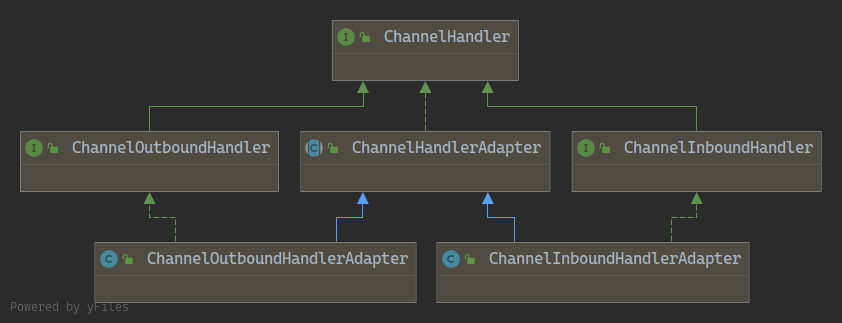
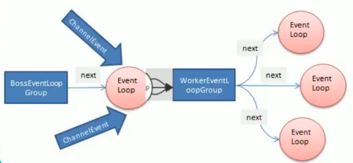
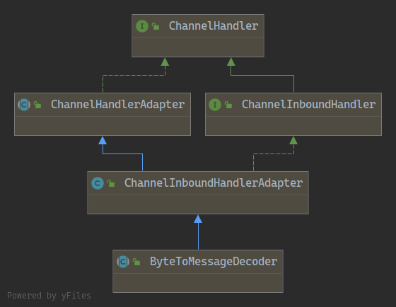
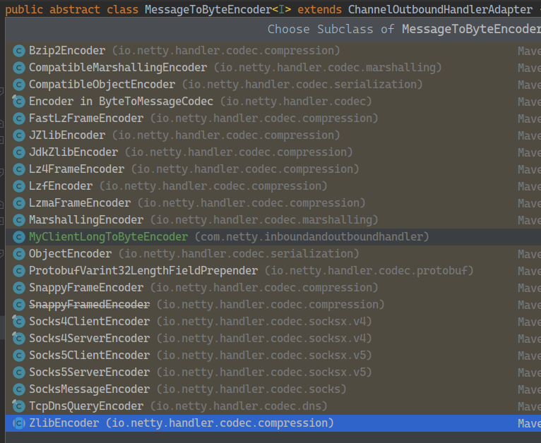

# Netty

**什么是Netty:** 

- netty是异步的,基于事件驱动的网络应用框架,用以开发高性能,高可靠的网络IO程序

- netty主要针对在TCP协议下,面向Clients端的高并发应用,或者Peer-to-Peer场景下的大量数据持续传输的应用
- netty本质是一个NIO框架,适用于服务器通讯相关的多种应用场景

**netty的应用场景:**

- 在分布式系统中,各个节点之间需要远程服务调用,高性能的RPC框架必不可少,Netty作为异步高薪能的通信框架,往往作为基础通信组件被这些RPC框架使用
- 典型应用场景:Dubbo的RPC框架使用Dubbo协议,Dubbo协议默认使用Netty作为基础通信组件
- 游戏行业中,使用Netty作为通信组件
- 大数据领域 经典的Hadoop的高性能通信和序列话组件(AVRO实现数据文件共享)的RPC框架

# 官网说明

1. Netty是由JBOSS提供的一个Java开源框架,Netty提供异步,基于事件驱动的网络应用程序框架,用以快速开发高性能,高可靠的网络IO程序
2. Netty可以帮助你快速,简单的开发一个网络应用,相当于简化和流程化了NIO的开发过程
3. Netty是目前最流行的NIO框架,Netty在互联网领域,大数据分布式计算领域,游戏行业,通信行业等广泛应用,知名的ES,Dubbo框架内部都采用Netty

# Netty优点

1. 设计优雅:适用于各种传输类型的统一API阻塞和非阻塞Socket；基于灵活且可扩展的事件模型,可以清晰地分离关注点,高度可定制的线程模型,单线程,一个或者多个线程池
2. 使用方便:详细记录的JavaDoc,用户指南和示例,没有其他依赖项
3. 高性能,吞吐量更高:延迟更低,减少资源消耗,最小化不必要的内存复制
4. 安全: 完整的SSL/TLS和StartTLS支持
5. 社区活跃,不断更新:社区活跃,版本迭代周期短,发现的Bug可以被及时修复,同时,更多的新功能活被加入

# Netty线程模型

## 基本介绍

1. 不同的线程模型,对程序的性能有很大影响,为了搞清楚netty线程模型,我们来系统的讲解下各个线程模型,最后看看netty线程模型有什么优越性
2. 目前存在的线程模型:
   - 传统阻塞I/O服务模型
   - Reactor模式
3. 根据Reactor的数量和处理资源池线程的数量不同,有三种典型的实现
   - 单Rreactor单线程
   - 单Reactor多线程
   - 主从Reactor多线程
4. Netty线程模式(Netty主要基于主从Reactor多线程模型做了一定的改进,其中主从Reactor多线程模型有多个Reactor)

## 传统阻塞IO服务模型

## Reactor模式

针对传统阻塞IO服务模型的2个缺点,解决方案:

1. 基于I/O复用模型:多个连接共用一个阻塞对象,应用程序只需要在一个阻塞对象等待,无需阻塞等待所有连接,当某个链接有新的数据可以处理时,操作系统通知应用程序,线程从阻塞状态返回,开始处理业务
2. 基于线程池复用线程资源:不必再为每个连接创建线程,将连接完成后的业务处理任务分配给线程进行处理,一个线程可以处理多个连接的业务



**说明:**

1. Reactor模式,通过一个或镀铬输入同时传递给服务处理器的模式(基于事件驱动)
2. 服务器端程序,处理传入的多个请求并将他们同步分派到相应的处理线程,因此reactor模式也叫Disptatcher模式
3. reactor模式使用IO复用监听事件,收到事件后,分发给某个线程(进程),这点就是网络服务器高并发处理关键

## Reactor模式中核心组成

1. Reactor: reactor在一个单独的线程中运行,复杂监听和分发事件,分发适当的处理程序来对IO事件做出反应,它就像公司的电话接线员,它接听来自客户的电话并将线路转移到适当额联系人
2. Handlers: 处理程序执行I/O时间要前完成实际事件,类似于客户想要与之交谈的公司中的实际官员,reactor通过调度适当的处理程序来响应I/O事件,处理程序执行非阻塞操作

## Reacotr分类:

根据Reactor的数量和处理资源池线程的数量不同,有3中典型的实现

1. 单Reactor单线程
2. 单Reactor多线程
3. 主从Reactor多线程

### 单Reactor单线程

**工作原理示意图:**


**方案说明:**

1. Select是前面I/O复用模型介绍的标准网络编程API,可以实现应用程序通过一个阻塞对象监听多路连接请求
2. Reactor对象通过Select监听客户端请求事件,收到事件后通过Dispatch进行分发
3. 如果是建立连接请求事件,,则由Acceptor通过Accept处理连接请求,然后创建一个Handler对象处理连接完成后的后续业务处理
4. 如该不是建立连接事件,则Reactor分发调用连接对应的Handler来响应
5. Handler会完成Read -> 业务处理 -> Send的完整业务流程

**结合实例:** 服务器端用一个线程通过多路复用搞定所有的IO操作,(包括连接,,读,写等) 编码简单,但是如果客户端连接数量教多,将无法支撑,前面的NIO多人聊天案例就是属于这种模型..

**优缺点分析:**

1. **优点:** 模型简单,没有多线程,进程通信,竞争的问题,全部都在一个线程中完成
2. **缺点:** 性能问题,只有一个线程,无法完全发挥多CPU的性能,Handler在处理某个连接上的业务时,整个进程无法处理其他连接事件,很容易导致性能瓶颈
3. **缺点:** 可靠性问题,线程意外终止,或者进入死循环,会导致整个系统通信模块不可用,不能接受和处理外部消息,造成节点故障
4. **使用场景:** 客户端的数量有限,业务处理非常快速,比如Redis在业务处理的时间复杂度O(1)的情况

### 单Reactor多线程

**工作原理图示意图:**


**方案说明**:

1. Reactor对象通过select监控客户端请求事件,收到事件后,通过dispatch进行分发
2. 如果建立连接请求,则Acceptor通过accept处理连接请求,然后创建一个handler对象处理完成后的各种事件
3. 如果不是连接请求,则由reactor对象分发调用连接对应的Handler来处理,
4. handler只负责响应事件,不做具体的业务处理,通过read读取数据后,会分发给后面的worker线程池的某个线程处理业务
5. worker线程池会分配独立线程完成真正的业务,并将结果返回给handler
6. handler收到响应后,通过send将结果返回给client

**优点缺点分析:**

1. **优点:** 可以充分的利用多核CPU的处理能力
2. **缺点:** 多线程数据共享和访问比较复杂,reactor处理所有的事件监听和响应,在单线程运行,在高并发场景容易出现性能瓶颈

### 主从Reactor多线程

**工作原理示意图:**


针对单Reactor多线程模型中,Reactor在单线程中运行,高并发场景下容易出现性能瓶颈,可以让Reactor在多线程中运行

**方案说明:**

1. Reactor主线程MainReactor对象通过select监听连接事件,收到事件后,通过Accept处理连接事件
2. 当Acceptor处理连接事件后,MainReactor将连接分配给SubReactor
3. subReactor将连接加入到连接队列中进行监听,并创建handler进行各种事件处理
4. 当有新事件发生时,subReactor就会调用对应的handler处理
5. handler通过read读取数据,会分发给后面的worker线程处理
6. worker线程池会分配独立的worker线程进行业务处理,并返回结果
7. handler收到响应的结果后 , 再通过send将结果返回给client
8. Reactor住线程可以对应多个Reactor子线程,即MainReactor可以关联多个SubReactor

**方案优缺点:**

1. **优点:**  父线程与子线程的数据交互简单职责明确,父线程只需要接收新连接,子线程完成后续的业务处理
2. **优点:**父线程与子线程的数据交互简单,Reactor主线程只需要把新连接传给子线程,子线程无需返回结果
3. **缺点**: 编程复杂度比较高

****

## Netty模型

### 简单版:

**工作原理示意图:**



**说明:**

1. BossGroup线程维护Selector,只关注Accept
2. 当接收到Accept事件后,获取到对应的SocketChannel,进一步封装成NIOSocketChannel并注册到Worker线程(事件循环),并进行维护
3. 当Worker线程监听到selector中的通道,发生自己感兴趣的事件后,就进行处理(就由hanndler完成),注意handler已经加入到通道中

### 进阶版:

**工作原理示意图:**

Netty主要基于从Reactors多线程模型(如图)做了一定的改进,其中主从Reactor多线程模型有多个Reactor



### 详细模型:

**工作原理示意图:**



**说明:**

1. Netty抽象出两组线程池 BossGroup专门负责接收客户端的连接,WorkerGroup 专门负责网络的读写
2. BossGroup和WorkerGroup类型都是NioEventLoopGroup
3. NioEventLoopGroup相当于一个事件循环组,这个组中含有多个事件循环,每一个事件循环是NioEventLoop
4. NioEventLoop表示一个不断循环的执行处理任务的线程,每个NioEventLoop都有一个selector,用于监听绑定在其上的socket的网络通讯
5. NioEventLoopGroup可以有多个线程,即可以含有多个NioEventLoop
6. 每个Boss 下 NioEventLoop执行步骤有3步
   1. 轮询accept事件,
   2. 处理accept事件,与client建立连接,生成NioSocketChannel并将其注册到某个worker NioEventLoop上的Selector
   3. 处理任务队列的任务,即runAllTasks
7. 每个Worker  NioEventLoop循环执行的步骤
   1. 轮询read,write事件
   2. 处理I/O事件,即 read , write 事件,在NioSocketChannel处理
   3. 处理任务队列的任务,即runAllTasks
8. 每个Worker NIOEventLoop处理业务时,会使用pipline(管道),pipeline中包含了channel,,,,即通过pipeline可以获取到对应管道,管道中维护了很多的处理器

### Netty  入门案例 - TCP服务

**Server**

```java
package com.netty.simple;

import io.netty.bootstrap.ServerBootstrap;
import io.netty.channel.ChannelFuture;
import io.netty.channel.ChannelInitializer;
import io.netty.channel.ChannelOption;
import io.netty.channel.ChannelPipeline;
import io.netty.channel.nio.NioEventLoopGroup;
import io.netty.channel.socket.SocketChannel;
import io.netty.channel.socket.nio.NioServerSocketChannel;

public class NettyServer {
    public static void main(String[] args) throws InterruptedException {
        //1.创建boss和worker group
        //2.boss group 只处理连接请求,真正和客户端业务处理,会交给worker group
        //3.两个都是无限循环
        //4.boss group 和 workerGroup  含有的NioEventLoopGroup 的个数,默认是其核心数的2倍
        NioEventLoopGroup bossGroup = new NioEventLoopGroup(1);
        NioEventLoopGroup workerGroup = new NioEventLoopGroup(4);
        ServerBootstrap bootstrap = new ServerBootstrap();
        try {
           //使用链式编程来做
           bootstrap.group(bossGroup,workerGroup) //设置两个线程
                   .channel(NioServerSocketChannel.class) //使用NioSocketChannel 作为服务器的通道实现
                   .option(ChannelOption.SO_BACKLOG,128) // 设置线程队列得连接个数
                   .childOption(ChannelOption.SO_KEEPALIVE,true)//设置保持活动连接状态
                   .childHandler(new ChannelInitializer<SocketChannel>() { //创建一个通道测试对象(匿名对象)
                       //给pipeline设置处理器
                       @Override
                       protected void initChannel(SocketChannel sc) throws Exception {
                           ChannelPipeline pipeline = sc.pipeline();
                           pipeline.addLast(new NettyServerHandler());
                       }
                   });//给我们的worker group的EventLoop对应的管道设置处理器
           System.out.println("服务器 is ready .....");
           //绑定一个对象并同步,生成一个ChannelFuture对象
           //启动服务器(并绑定端口)
           ChannelFuture cf = bootstrap.bind(6668).sync();
           //对关闭通道进行监听
           cf.channel().closeFuture().sync();
       }finally {
            bossGroup.shutdownGracefully();
            workerGroup.shutdownGracefully();
       }
    }
}
```

**NettyServerHandler**

```java
package com.netty.simple;

import io.netty.buffer.ByteBuf;
import io.netty.buffer.Unpooled;
import io.netty.channel.Channel;
import io.netty.channel.ChannelHandlerContext;
import io.netty.channel.ChannelInboundHandlerAdapter;
import io.netty.channel.ChannelPipeline;
import io.netty.util.CharsetUtil;


/**
 * 1.自定义一个Handler 需要继续netty规定好的某个HandlerAdapter
 * 2. 这时我们自定义一个Handler,才能称为一个handler
 */
public class NettyServerHandler  extends ChannelInboundHandlerAdapter {
    //读取数据实际

    /**
     * 1.ChannelHandlerContext ctx;上下文对象,含有pipeline通道,channel 地址
     * 2.Object msg; 就是客户端发送的数据 默认Object
     *
     */
    @Override
    public void channelRead(ChannelHandlerContext ctx, Object msg) throws Exception {
        //super.channelRead(ctx, msg);
        System.out.println("服务器读取线程 : " + Thread.currentThread().getName());
        System.out.println("server ctx = " + ctx);
        System.out.println();
        Channel channel = ctx.channel();
        ChannelPipeline pipeline = channel.pipeline();

        //将msg转化成一个ByteBuf
        ByteBuf buf = (ByteBuf) msg;
        System.out.println("客户端发送消息是:" + buf.toString(CharsetUtil.UTF_8));
        System.out.println("客户端地址:" + channel.remoteAddress());
    }

    @Override
    public void channelReadComplete(ChannelHandlerContext ctx) throws Exception {
        //super.channelReadComplete(ctx);
        //write 方法 + flush方法
        //将数据写入到缓存,并刷新
        //一般讲,我们对发送的数据进行编码
        ctx.writeAndFlush(Unpooled.copiedBuffer("hello 客户端",CharsetUtil.UTF_8));

    }

    @Override
    public void exceptionCaught(ChannelHandlerContext ctx, Throwable cause) throws Exception {
        //super.exceptionCaught(ctx, cause);
        ctx.close();
    }
}
```

**Client**

```java
package com.netty.simple;

import io.netty.bootstrap.Bootstrap;
import io.netty.channel.ChannelFuture;
import io.netty.channel.ChannelInitializer;
import io.netty.channel.EventLoopGroup;
import io.netty.channel.nio.NioEventLoopGroup;
import io.netty.channel.socket.SocketChannel;
import io.netty.channel.socket.nio.NioSocketChannel;

public class NettyClient {
    public static void main(String[] args) throws InterruptedException {
        //客户端需要一个事件循环组
        EventLoopGroup eventLoopGroup = new NioEventLoopGroup();
        //注意客户端使用的不是ServerBootStrap而是Bootstrap
        Bootstrap bootstrap = new Bootstrap();
      try {
          bootstrap.group(eventLoopGroup)//设置线程组
                  .channel(NioSocketChannel.class)//设置客户端通道的实现类(反射)
                  .handler(new ChannelInitializer<SocketChannel>() {
                      @Override
                      protected void initChannel(SocketChannel sc) throws Exception {
                          sc.pipeline().addLast(new NettyClientHandler()); //加入自己的处理器
                      }
                  });
          System.out.println(" 客户端 is ok ...");
          ChannelFuture channelFuture = bootstrap.connect("127.0.0.1", 6668).sync();
          //关闭通道进行监听
          channelFuture.channel().closeFuture().sync();
      }finally {
          eventLoopGroup.shutdownGracefully();
      }
    }
}
```

**NettyClientHandler**

```java
package com.netty.simple;

import io.netty.buffer.ByteBuf;
import io.netty.buffer.Unpooled;
import io.netty.channel.ChannelHandlerContext;
import io.netty.channel.ChannelInboundHandlerAdapter;
import io.netty.util.CharsetUtil;

public class NettyClientHandler extends ChannelInboundHandlerAdapter {
    //当通道就绪就会触发该方法
    @Override
    public void channelActive(ChannelHandlerContext ctx) throws Exception {
        //super.channelActive(ctx);
        System.out.println("client = " + ctx);
        ctx.writeAndFlush(Unpooled.copiedBuffer("hello server 我是 客户端,", CharsetUtil.UTF_8));
    }

    //当通道有读取事件时,会触发
    @Override
    public void channelRead(ChannelHandlerContext ctx, Object msg) throws Exception {
        //super.channelRead(ctx, msg);
        ByteBuf buf = (ByteBuf) msg;
        System.out.println("服务器回复的消息 : = " + buf.toString(CharsetUtil.UTF_8));
        System.out.println("服务器的地址:" + ctx.channel().remoteAddress());
    }

    @Override
    public void exceptionCaught(ChannelHandlerContext ctx, Throwable cause) throws Exception {
        //super.exceptionCaught(ctx, cause);
        cause.printStackTrace();
        ctx.close();
    }
}
```

### 任务队列

**任务队列中的Task有3中典型的使用场景:**

1. 用户程序自动义的普通任务

   ```java
   public void channelRead(ChannelHandlerContext ctx, Object msg) throws Exception {
       ctx.writeAndFlush(Unpooled.copiedBuffer("hello 客户端,this is read ",CharsetUtil.UTF_8));
       //解决方案1 用户自定义普通任务
       ctx.channel().eventLoop().execute(()->{
           //这里有一个非常耗时的业务 -> 异步执行 -> 提交到channel对应的NioEventLoop 的taskQueue中
           try {
               Thread.sleep(10000);
               System.out.println("this is run taskQueue 1");
           } catch (InterruptedException e) {
               e.printStackTrace();
           }
       });
       ctx.channel().eventLoop().execute(()->{
           //这里有一个非常耗时的业务 -> 异步执行 -> 提交到channel对应的NioEventLoop 的taskQueue中
           try {
               Thread.sleep(20*1000);
               System.out.println("this is run taskQueue 2 ");
           } catch (InterruptedException e) {
               e.printStackTrace();
           }
       });
       System.out.println("go on ...");
   }
   ```

2. 用户定义定时任务

   ```java
   //解决方案2 用户自定义定时任务,该任务是提交到scheduleTaskQueue中
   ctx.channel().eventLoop().schedule(()->{
       try {
           Thread.sleep(20*1000);
           System.out.println("this is run scheduleTaskQueue");
       } catch (InterruptedException e) {
           e.printStackTrace();
       }
   },5, TimeUnit.SECONDS);
   ```

3. 非当前Reactor线程调用Channel的各种方法

   例如在**推送系统**的业务线程里面,根据**用户的标识**,找到对应的**Channel引用**,然后调用write类方法向该用户推送消息,就会进入到这种场景,最终的Write会提交到任务队列中被**异步消费**

**方案再说明:**

1. Netty抽象出两组线程池,BossGroup专门负责接受客户端连接,WorkerGroup专门负责网络读写操作
2. NioEventLoop表示一个不断循环执行处理任务的线程,每个NioEventLoop都有一个selector,用于监听绑定在其上的socket网络通道
3. NioEventLoop内部采用串行化设计,从消息的读取->解码->处理->编码->发送,始终由IO线程NioEventLoop负责
   - 每个NioEventLoopGroup下包含多个NioEventLoop
   - 每个NioEventLoop中包含有一个Selector,一个TaskQueue
   - 每个NioEventLoop的Selector上可以注册监听多个NioChannel
   - 每个NioChannel只会绑定在唯一的NioEventLoop上
   - 每个NioChannel都绑定有一个自己的ChannelPipeline

### 异步模型

**基本介绍:**

1. 异步的概念和同步相对,当一个异步过程调用发出后,调用者不能立刻得到结果.实际处理这个调用的组件在完成后,通过状态,通知和回调来通知调用者.
2. Netty中的I/O操作是异步的,包括Bind,Write,Connect等操作会简单的返回一个ChannelFuture
3. 调用者并不能立刻获得结果,而是通过Future-Listener机制,用户可以方便的主动获取或者通过通知机制获得IO操作结果
4. Netty的异步模型是建立在future和callback的之上的,callback就是回调,重点说Future,它的核心思想是: 假设一个方法fun,计算过程可能非常耗时,等待fun返回显然不合适,那么可以在调用fun的时候,立马返回一个Future,后续可以通过Future去监控方法fun的处理过程(即:Future-Listener机制)

**Future说明:**

1. 表示异步的执行结果,可以通过它提供的方法来检测执行是否完成,比如检索计算等
2. ChannelFuture是一个接口

**工作原理示意图:**


**说明:**

1. 在使用Netty进行编程时,拦截操作和转换出入站的数据只需您提供callback或利用future即可,这使得链式操作简单,高校,并有利于编写可重用的,通用的代码
2. Netty框架的目标就是让你的业务逻辑从网络基础应用编码中分离出来,解脱出来

**Future-Listener 机制 : **

1. 当Future对象刚刚创建时,处于非完成状态,调用者可以通过返回的ChannelFuture来获取操作执行执行的状态,注册监听函数来执行完成后的操作

2. 常见有如下操作:

   - 通过isDone方法来判断当前操作是否完成
   - 通过isSuccess方法来判断当前操作是否成功
   - 通过getCause方法来获取已完成的当前操作失败的原因
   - 通过isCancelled方法来判断已完成的当前操作是否被取消
   - 通过addListener方法来注册监听器,当操作已完成(isDone 方法返回完成),将会通知指定的监听器,如果Future对象已完成,则通知指定的监听器

3. 举例说明:

   示例: 绑定端口是异步操作,当绑定操作处理完,将会调用相应的监听器处理逻辑

   ```java
   serverBootstrap.bind(port).addListener(future->{
       if(future.isSuccess()){
           System.out.println("绑定成功!")
       }else{
           System.out.println("绑定失败!")
       }
   })
   ```

   **小结:** 相比传统阻塞I/O,执行I/O操作后会被阻塞住,直到操作完成,异步处理的好处是不会造成线程阻塞,线程在I/O操作期间可以执行别的程序,在高并发情形下会更加稳定和更高的吞吐量

### HttpServer 案例:

**TestHttpServer:**

```java
package com.http;

import io.netty.bootstrap.ServerBootstrap;
import io.netty.channel.ChannelFuture;
import io.netty.channel.nio.NioEventLoopGroup;
import io.netty.channel.socket.nio.NioServerSocketChannel;

public class TestHttpServer {
    public static void main(String[] args) {
        NioEventLoopGroup bossGroup = new NioEventLoopGroup(1);
        NioEventLoopGroup workerGroup = new NioEventLoopGroup(4);
        ServerBootstrap serverBootstrap = new ServerBootstrap();

        try {
            serverBootstrap.group(bossGroup,workerGroup).channel(NioServerSocketChannel.class)
                    .childHandler(new TestServerInitializer());
            ChannelFuture channelFuture = serverBootstrap.bind(12306).sync();
            channelFuture.channel().closeFuture().sync();
        } catch (InterruptedException e) {
            e.printStackTrace();
        }finally {
            bossGroup.shutdownGracefully();
            workerGroup.shutdownGracefully();
        }
    }
}
```

**TestHttpServerHandler:**

```java
package com.http;

import io.netty.buffer.ByteBuf;
import io.netty.buffer.Unpooled;
import io.netty.channel.ChannelHandlerContext;
import io.netty.channel.SimpleChannelInboundHandler;
import io.netty.handler.codec.http.*;
import io.netty.util.CharsetUtil;

/**
 * 1 SimpleChannelInboundHandler 是 ChannelInboundHandlerAdapter
 * 2. HttpObject 客户端和服务端相互通讯的数据被封装成HttpObject
 */
public class TestHttpServerHandler extends SimpleChannelInboundHandler<HttpObject> {

    @Override
    protected void channelRead0(ChannelHandlerContext ctx, HttpObject msg) throws Exception {

        // 判断msg是不是 httpRequest
        if(msg instanceof HttpRequest){
            System.out.println("msg 类型 = " + msg.getClass());
            System.out.println("客户端地址 = " + ctx.channel().remoteAddress());
            //回复信息给浏览器
            ByteBuf content = Unpooled.copiedBuffer("hello  我是服务器", CharsetUtil.UTF_8);

            //构造一个http响应 , 即 httpResponse
            DefaultFullHttpResponse response = new DefaultFullHttpResponse(HttpVersion.HTTP_1_1, HttpResponseStatus.OK,content);
            response.headers().set(HttpHeaderNames.CONTENT_TYPE,"text/plain");
            response.headers().set(HttpHeaderNames.CONTENT_LENGTH,content.readableBytes());
            response.headers().set(HttpHeaderNames.ACCEPT_CHARSET,CharsetUtil.UTF_8);
           //将构建好的response返回
            ctx.writeAndFlush(response);
        }
    }
}
```

**TestServerInitializer:**

```java
package com.http;

import io.netty.channel.ChannelInitializer;
import io.netty.channel.ChannelPipeline;
import io.netty.channel.socket.SocketChannel;
import io.netty.handler.codec.http.HttpServerCodec;

public class TestServerInitializer extends ChannelInitializer<SocketChannel> {
    @Override
    protected void initChannel(SocketChannel ch) throws Exception {
        //向管道加入处理器
        //得到管道
        ChannelPipeline pipeline = ch.pipeline();
        //加入一个netty提供的httpServerCodec codec = > [coder decoder]
        pipeline.addLast("MyHttpServerCodec",new HttpServerCodec());
        //2. 增加一个自己的地定义code
        pipeline.addLast("MyTestHttpServerHandler",new TestHttpServerHandler());
    }
}
```

## Netty 组件

### Bootstrap,ServerBootstrap

1. Bootstrap 意思是引导,一个Netty应用通常由一个Bootstrap开始,主要作用是配置整个Netty程序,串联各个组件,Netty中Bootstrap类是客户端程序的启动引导类,ServerBootstrap是服务端启动引导类
2. 常见的方法有:
   - public ServerBootstrap group(EventLoopGroup parentGroup, EventLoopGroup childGroup) ,该方法用于服务端,用来设置两个EventLoop
   - public B group(EventLoopGroup group),该方法用于客户端,用来设置一个EventLoop
   - public B channel(Class<? extends C> channelClass),该方法用来设置一个服务器端的通道实现
   - public <T> B option(ChannelOption<T> option, T value),用来给ServerChannel添加配置
   - public <T> ServerBootstrap childOption(ChannelOption<T> childOption, T value),用来给接收到的通道添加配置
   - public ServerBootstrap childHandler(ChannelHandler childHandler),该方法用来设置业务处理类(自定义handler)
   - public ChannelFuture bind(int inetPort),该方法用于服务器端,用来设置占用的端口号
   - public ChannelFuture connect(String inetHost, int inetPort) , 该方法用于客户端,用来连接服务器

### Future,ChannelFuture

1. Netty中所有的IO操作都是异步的,不能立刻得知消息是否被正确处理,但是可以过一会等它执行完成或者直接注册一个监听,具体的实现就是通过Future和ChannelFutures,他们可以注册一个监听,当操作执行成功或失败时监听会自动触发的监听事件
2. 常见的方法:
   - Channel  channel(),返回当前正在进行IO操作的通道
   - ChannelFuture    sync(), 等待异步操作执行完毕

### Channel

1. Netty网络通信的组件,能够用于执行网络I/O操作
2. 通过Channel可获得当前网络连接的通道的状态
3. 通过Channel可获得网络连接的配置参数(例如接收缓冲区大小)
4. Channel提供异步的网络I/O操作(如建立连接,读写,绑定端口),异步调用意味着任何I/O调用都将立即返回,并且不保证在调用结束时所请求的I/O操作已完成
5. 调用立即返回一个ChannelFuture实例,通过注册监听器到ChannelFuture上,可以将I/O操作成功,失败或取消时回调通知调用方
6. 支持关联I/O操作与对应的处理程序
7. 不同协议,不同的阻塞类型的连接都有不同的Channel类型与之对应,常用的Channel类型:
   - NioSocketChannel,异步的客户度TCP Socket连接
   - NioServerScoketChannel,异步的服务器端TCP Socket连接
   - NioSctpChannel, 异步的客户端Sctp连接
   - NioSctpServerChannel,异步的Sctp服务器端连接,这些通道涵盖了UDP和TCP网络IO以及文件IO

### Selector

1. Netty基于Selector对象实现I/O多路复用,通过Selector一个线程可以监听多个连接的Channel事件
2. 当向一个Selector中注册Channel后,Selector内部的机制就可以自动不断地产下(Select)这些注册的Channel是否有已就绪的I/O事件(例如可读,可写,网络连接完成等),这样程序就可以很简单地使用一个线程高效地管理多个Channel

### ChannelHandler 及其实现类

1. ChannelHandler 是一个接口,处理I/O事件或拦截I/O操作,并将其转发到其ChannelPipeLine(物业处理链)中的下一个处理程序

2. ChannelHandler本身并没有提供很多方法,因为这个接口有许多的方法需要实现,方便使用期间,可以继承它的子类

3. ChannelHandler及其实现类一览图(后)

   - ChannelInboundHandler用于处理入站I/O事件
   - ChannelOutboundHandler用于处理出站I/O操作
   - ChannelInboundHandlerAdapter用于处理入站I/O事件
   - ChannelOutboundHandlerAdapter用于处理出站I/O操作
   - ChannelDeplexHandler用于处理入站和出站事件

   

4. 我们经常需要自定义一个Handler类去继承CHannelInboundHandlerAdapter,然后通过重写相应方法实现业务逻辑,

   ```java
   /*
    * Copyright 2012 The Netty Project
    *
    * The Netty Project licenses this file to you under the Apache License,
    * version 2.0 (the "License"); you may not use this file except in compliance
    * with the License. You may obtain a copy of the License at:
    *
    *   http://www.apache.org/licenses/LICENSE-2.0
    *
    * Unless required by applicable law or agreed to in writing, software
    * distributed under the License is distributed on an "AS IS" BASIS, WITHOUT
    * WARRANTIES OR CONDITIONS OF ANY KIND, either express or implied. See the
    * License for the specific language governing permissions and limitations
    * under the License.
    */
   package io.netty.channel;
   
   import io.netty.channel.ChannelHandlerMask.Skip;
   
   /**
    * Abstract base class for {@link ChannelInboundHandler} implementations which provide
    * implementations of all of their methods.
    *
    * <p>
    * This implementation just forward the operation to the next {@link ChannelHandler} in the
    * {@link ChannelPipeline}. Sub-classes may override a method implementation to change this.
    * </p>
    * <p>
    * Be aware that messages are not released after the {@link #channelRead(ChannelHandlerContext, Object)}
    * method returns automatically. If you are looking for a {@link ChannelInboundHandler} implementation that
    * releases the received messages automatically, please see {@link SimpleChannelInboundHandler}.
    * </p>
    */
   public class ChannelInboundHandlerAdapter extends ChannelHandlerAdapter implements ChannelInboundHandler {
   
       public void channelRegistered(ChannelHandlerContext ctx) throws Exception {
           ctx.fireChannelRegistered();
       }
   
   
       public void channelUnregistered(ChannelHandlerContext ctx) throws Exception {
           ctx.fireChannelUnregistered();
       }
   	//通道就绪事件
       public void channelActive(ChannelHandlerContext ctx) throws Exception {
           ctx.fireChannelActive();
       }
   
       public void channelInactive(ChannelHandlerContext ctx) throws Exception {
           ctx.fireChannelInactive();
       }
   	//通道读取数据事件
       public void channelRead(ChannelHandlerContext ctx, Object msg) throws Exception {
           ctx.fireChannelRead(msg);
       }
   	//数据读取完毕事件
       public void channelReadComplete(ChannelHandlerContext ctx) throws Exception {
           ctx.fireChannelReadComplete();
       }
   
       public void userEventTriggered(ChannelHandlerContext ctx, Object evt) throws Exception {
           ctx.fireUserEventTriggered(evt);
       }
   
       public void channelWritabilityChanged(ChannelHandlerContext ctx) throws Exception {
           ctx.fireChannelWritabilityChanged();
       }
   
   
       public void exceptionCaught(ChannelHandlerContext ctx, Throwable cause)
               throws Exception {
           ctx.fireExceptionCaught(cause);
       }
   }
   
   ```

### Pipeline和ChannelPipeline

**ChannelPipeline是一个重点:**

1. ChannelPipeline是一个Handler集合,它负责处理和拦截inbound或者outbound的事件和操作,相当于一个贯穿Netty的链.(也可以这样理解: ChannelPipeline是保存ChannelHandler的List,用于处理或拦截Channel的入站事件和出站操作)

2. ChannelPipeline实现了一种高级形式的拦截过滤器模式,使用户可以完全控制事件的处理方式,以及Channle中各个的ChannelHandler如何相互交互

3. 在Netty中每个Channel都有且仅有一个ChannelPipeline与之对应,他们的组成关系如下:

   - 一个Channel包含了一个ChannelPipeline,而ChannelPipeline中又维护了一个由ChannelHandlerContext组成的双向链表,并且每个ChannelHandlerContext中又关联着一个ChannelHandler
   - 入站事件和出站事件在一个双向链表中,入站事件会从链表head往后传递到最后一个入站的handler,出站事件会从链表tail往前传递到最前一个出站的handler,两种类型的handler互不干扰

   

4. 常用方法

   - ChannelPipeline  addFirst(ChannelHandler ... handlers),把一个业务处理类(handler)添加到链中的第一个位置
   - ChannelPipeline  addLast(ChannelHandler ... handlers),把一个业务处理类(handler)添加到链中的最后一个位置

   

### ChannelHandlerContext

1. 保存Channel相关的所有上下文信息,同时关联一个ChannelHandler对象
2. 即CahnnelHandleContext中包含一个具体的事件处理器ChannelHandler,同时ChannelHandlerContext中也绑定了对应的pipeline和Channel的信息,方便对ChannelHandler进行调用
3. 常用方法
   - ChannelFuture  close(), 关闭通道
   - ChannelOutboundInvoker  flush(), 刷新
   - ChannelFuture  writeAndFlush(Object msg),将数据写到ChannelPipeline当中
   - ChannelHandler的下一个ChannelHandler开始处理(出站)

### ChannelOption

1. Netty在创建Channel实例后,一般都需要设置ChannelOptin参数

2. ChannelOption 参数如下:

   **ChannelOption.SO_BACKLOG**

   对应TCP/IP协议listen函数中的backlog参数,用来初始化服务器可连接队列大小,服务端处理客户端连接请求是顺序处理的,所以同一时间只能处理一个客户端连接.多个客户端来的时候,服务器将不能处理的客户端连接请求放在队列中等待处理,backlog参数指定了队列的大小

   **ChannelOption.SO_KEEPALIVE**

   一直保持连接活动状态

### EventLoopGroup和其实现类NioEventLoopGroup

1. EventLoopGroup是一组EventLoop的抽象,Netty为了更好的利用多核CPU资源,一般会有多个EventLoop同时工作,每个EventLoop维护着一个Selector实例.

2. EventLoopGroup提供next接口,可以从组里面按照一定规则获取其中一个EventLoop来处理任务.在Netty服务端编程中,我们一般都需要提供两个EventLoopGroup,例如:BossEventLoopGroup和WorkerEventLoopGroup

3. 通常一个服务端口即一个ServerSocketChannel对应一个Selector和一个EventLoop线程,BossEventLoop负责接收客户端的连接并将SocketChannel交给WorkerEventLoopGroup来进行IO处理,如下图所示:

   

   - BossEventLoopGroup通常是一个单线程的EventLoop,EventLoop维护着一个注册了ServerSocketChannel的Selector实例BossEventLoop不断轮询Selector将连接事件分离出来
   - 通常是OP_ACCEPT事件,然后将接收到的SocketChannel交给WorkerEventLoopGroup
   - WorkerEventLoopGroup会由next选择其中一个EventLoopGroup来将这个SocketChannle注册到其维护的Selector并对其后续的IO事件进行处理

4. 常用方法

   - public NioEventLoopGroup(),构造方法
   - public Future<?> shutdownGracefully(),断开连接,关闭线程

### Unpooled类

1. Netty提供一个专门用来操作缓冲区(即Netty的数据容器)的工具类
2. 常用方法如下:
   - public static ByteBuf  copiedBuffer(CharSequence string, Charset charset)

### Netty心跳检测机制案例

**编写实例:**

1. 编写一个Netty心跳检测机制案例,当服务器超过3妙没有读取时,就提示空闲
2. 但服务器超过5妙没有写操作,就提示空闲
3. 实现当服务器超过7秒没有读或者写操作时,就提示读写空闲

```java
package com.netty.heartbeat;

import com.netty.simple.NettyServerHandler;
import io.netty.bootstrap.ServerBootstrap;
import io.netty.channel.ChannelFuture;
import io.netty.channel.ChannelInitializer;
import io.netty.channel.ChannelOption;
import io.netty.channel.ChannelPipeline;
import io.netty.channel.nio.NioEventLoopGroup;
import io.netty.channel.socket.SocketChannel;
import io.netty.channel.socket.nio.NioServerSocketChannel;
import io.netty.handler.logging.LogLevel;
import io.netty.handler.logging.LoggingHandler;
import io.netty.handler.timeout.IdleStateHandler;

import java.util.concurrent.TimeUnit;

public class ThisServer {
    public static void main(String[] args) throws InterruptedException {
        //1.创建boss和worker group
        //2.boss group 只处理连接请求,真正和客户端业务处理,会交给worker group
        //3.两个都是无限循环
        //4.boss group 和 workerGroup  含有的NioEventLoopGroup 的个数,默认是其核心数的2倍
        NioEventLoopGroup bossGroup = new NioEventLoopGroup(1);
        NioEventLoopGroup workerGroup = new NioEventLoopGroup(4);
        ServerBootstrap bootstrap = new ServerBootstrap();
        try {
            //使用链式编程来做
            bootstrap.group(bossGroup,workerGroup) //设置两个线程
                    .channel(NioServerSocketChannel.class) //使用NioSocketChannel 作为服务器的通道实现
                    .option(ChannelOption.SO_BACKLOG,128) // 设置线程队列得连接个数
                    .handler(new LoggingHandler(LogLevel.INFO)) //增加一个日志处理器
                    .childHandler(new ChannelInitializer<SocketChannel>() {
                        @Override
                        protected void initChannel(SocketChannel ch) throws Exception {
                            ChannelPipeline pipeline = ch.pipeline();
                            //加入一个netty提供的 IdleStateHandler :   是netty提供的处理空闲状态的处理器
                            /* 参数:
                             * 1. readerIdleTime : 表示多长时间没有读,就会发送一个心跳检测包检测是否连接
                             * 2. writerIdleTime : 表示多长时间没有写,就会发送一个心跳检测包检测是否连接
                             * 3. allIdleTime : 表示多长时间没有读写,就会发送一个心跳检测包检测是否连接
                             *
                             * 4. Triggers an {@link IdleStateEvent} when a {@link Channel} has not performed
                             * read, write, or both operation for a while.
                             * 5. 当IdleStateEvent触发后,就会传递给管道的一下handler去处理,通过调用下一个handler的userEventTriggered方法来处理具体的事件
                             */
                            pipeline.addLast(new IdleStateHandler(3,5,7, TimeUnit.SECONDS));
                            pipeline.addLast(new ThisIsServerHandler());
                        }
                    });
            System.out.println("服务器 is ready .....");
            //绑定一个对象并同步,生成一个ChannelFuture对象
            //启动服务器(并绑定端口)
            ChannelFuture cf = bootstrap.bind(7000).sync();
            //对关闭通道进行监听
            cf.channel().closeFuture().sync();
        }finally {
            bossGroup.shutdownGracefully();
            workerGroup.shutdownGracefully();
        }
    }
}
package com.netty.heartbeat;

import io.netty.channel.ChannelHandlerContext;
import io.netty.channel.ChannelInboundHandlerAdapter;
import io.netty.handler.timeout.IdleStateEvent;

public class ThisIsServerHandler extends ChannelInboundHandlerAdapter {

    @Override
    public void userEventTriggered(ChannelHandlerContext ctx, Object evt) throws Exception {
        //
        if(evt instanceof IdleStateEvent){
            IdleStateEvent event = (IdleStateEvent) evt;
            String eventType = "";
            switch (event.state()){
                case ALL_IDLE:
                    eventType = "读写空闲";
                    break;
                case READER_IDLE:
                    eventType = "读空闲";
                    break;
                case WRITER_IDLE:
                    eventType = "写空闲";
                    break;
                default:
                    break;
            }
            System.out.println(ctx.channel().remoteAddress() + "--超时时间-- " + eventType);
            System.out.println("服务器处理事件 ... ");
            ctx.close();
        }
    }
}
```

### WebSocket长连接案例:

**WebSocketServer:**

```java
public class WebSocketServer {
    public static void main(String[] args) throws InterruptedException {
        //1.创建boss和worker group
        //2.boss group 只处理连接请求,真正和客户端业务处理,会交给worker group
        //3.两个都是无限循环
        //4.boss group 和 workerGroup  含有的NioEventLoopGroup 的个数,默认是其核心数的2倍
        NioEventLoopGroup bossGroup = new NioEventLoopGroup(1);
        NioEventLoopGroup workerGroup = new NioEventLoopGroup(4);
        ServerBootstrap bootstrap = new ServerBootstrap();
        try {
            //使用链式编程来做
            bootstrap.group(bossGroup,workerGroup) //设置两个线程
                    .channel(NioServerSocketChannel.class) //使用NioSocketChannel 作为服务器的通道实现
                    .handler(new LoggingHandler(LogLevel.INFO))
                    .childHandler(new ChannelInitializer<SocketChannel>() { //创建一个通道测试对象(匿名对象)
                        //给pipeline设置处理器
                        @Override
                        protected void initChannel(SocketChannel sc) throws Exception {
                            ChannelPipeline pipeline = sc.pipeline();
                            //因为基于http协议,使用http的编码和解码器
                            pipeline.addLast(new HttpServerCodec());
                            // 是以块方式写 ,ChunkedWriteHandler处理器
                            pipeline.addLast(new ChunkedWriteHandler());
                            /*
                            说明:
                                1.http数据在传输过程中是分段的,HttpObjectAggregator,可以将多个段聚合
                                2.这就是为什么当浏览器发送大量数据时,就会发出多次http请求
                             */
                            pipeline.addLast(new HttpObjectAggregator(8192));
                            /*
                            1.对应webSocket,它的数据是以帧(frame)形式传递的
                            2.可以看到WebSocketFrame下面有6个子类
                            3.浏览器请求时 ws:localhost:7000/hello 表示请求的uri
                            4.WebSocketServerProtocolHandler 核心功能是将http协议升级为ws协议,保持长连接
                             */
                            pipeline.addLast(new WebSocketServerProtocolHandler("/hello"));

                            //自定义处理器
                            pipeline.addLast(new MyTextWebSocketFrameHandler());
                        }
                    });
            System.out.println("服务器 is ready .....");
            //绑定一个对象并同步,生成一个ChannelFuture对象
            //启动服务器(并绑定端口)
            ChannelFuture cf = bootstrap.bind(7000).sync();
            //对关闭通道进行监听
            cf.channel().closeFuture().sync();
        }finally {
            bossGroup.shutdownGracefully();
            workerGroup.shutdownGracefully();
        }
    }
}
```

**hello.html**

```html
<!DOCTYPE html>
<html lang="en">
<head>
    <meta charset="UTF-8">
    <title>hello</title>
</head>
<body>
<script>
    var socket;
    if(window.WebSocket){
        socket = new WebSocket("ws:/localhost:7000/hello");
        //
        socket.onmessage = function (ev) {
            const rt = document.getElementById("responseText");
            rt.value = rt.value + "\n" + ev.data;
        }
        socket.onopen = function (ev) {
            const rt = document.getElementById("responseText");
            rt.value = "连接开启了...."  + ev.data;
        }
        socket.onclose = function (ev) {
            const rt = document.getElementById("responseText");
            rt.value = rt.value  + "\n" + "连接关闭了...." + ev.data;
        }

    }else {
        alert("当前浏览器不支持webSocket")
    }
    //发送消息到服务器
    function send(message) {
        if(!window.socket){
            return;
        }
        if(socket.readyState === WebSocket.OPEN){
            socket.send(message)
        }else{
            alert("连接没有开启")
        }
    }
</script>
<form  onsubmit="return false">
    <textarea name="message" style="height: 300px ; width: 300px">    </textarea>
    <input type="button" value="发送消息" onclick="send(this.form.message.value)">
    <textarea id="responseText" style="height: 300px ; width: 300px">    </textarea>
    <input type="button" value="清空内容" onclick="document.getElementById('responseText').value=''">
</form>

</body>
</html>
```

**MyTextWebSocketFrameHandler**

```java
// 该类表示一个文本帧(frame)
public class MyTextWebSocketFrameHandler extends SimpleChannelInboundHandler<TextWebSocketFrame> {
    @Override
    protected void channelRead0(ChannelHandlerContext ctx, TextWebSocketFrame msg) throws Exception {
        System.out.println("服务器受到消息 " + msg);
        ctx.channel().writeAndFlush(new TextWebSocketFrame("服务器时间 " + LocalDateTime.now() + " ," + msg));
    }

    //客户端连接之后,触发的事件
    @Override
    public void handlerAdded(ChannelHandlerContext ctx) throws Exception {
        //id 表示唯一的值,asLongText 是唯一的, asShortText 不是唯一的
        System.out.println("handlerAdded 被调用了," + ctx.channel().id().asLongText());
        System.out.println("handlerAdded 被调用了," + ctx.channel().id().asShortText());
    }
    //客户端断开连接之后,触发的事件
    @Override
    public void handlerRemoved(ChannelHandlerContext ctx) throws Exception {
        System.out.println("handlerRemoved 被调用了," + ctx.channel().id().asLongText());
    }

    @Override
    public void exceptionCaught(ChannelHandlerContext ctx, Throwable cause) throws Exception {
        System.out.println("异常发生" + cause.getMessage());
        ctx.channel().close();
    }
}
```

# Google ProtoBuf

### 编码和解码的基本介绍

1. 在编写网路应用程序时,因为数据在网络中传输的都是二进制字节码数据,在发送数据时就需要编码,接收数据时就需要解码
2. codec(编码器)的组成部分有两个: decoder(解码器)和encoder(编码器),encoder负责把业务数据转换成字节码数据,decoder负责把字节码数据转换成业务数据

### Netty本身的编码解码的机制和问题分析

1. Netty自身提供了一些codec(编解码器)
2. Netty提供的编码器
   1. StringEncoder, 对字符串数据进行编码
   2. ObjectEncoder, 对Java对象进行编码
   3. ....
3. Netty提供的解码器
   1. StringDecoder, 对字符串数据进行解码
   2. ObjectDecoder, 对Java对象进行解码
   3. ....
4. Netty本身自带的ObjectDecoder和ObjectEncoder可以用来实现POJO对象或各种业务对象的编码和解码,底层使用的仍然是Java序列化技术,而Java序列化技术本身效率不高,存在如下问题:
   1. 无法夸语言
   2. 序列化后的体积太大,是二进制编码的5倍多
   3. 序列化性能太低

## Protobuf

### Protobuf基本介绍和使用示意图

1. Protobuf 是Google发布的开源项目,全称 Google Protocol Buffers, 是一种轻便高效的结构化数据存储格式,可以用于结构化数据串行化,或者说序列化,它很适合做数据存储或RPC数据交换格式
2. 参考文档:
3. Protobuf是以message的方式来管理数据的
4. 支持跨平台,夸语言,即[客户端和服务器端可以是不同的语言编写的]
5. 高性能,高可靠
6. 使用Protobuf 编译器能自动生成代码,Protobuf 是将类的定义使用.proto文件进行描述
7. 然后通过proto.exe编译器根据.proto自动生成.java文件
8. 

# Netty编解码器和handler的调用机制

## 基本说明

1. netty的组件设计: netty的主要组件有Channel, EventLoop, ChannelFuture, ChannelHandler,ChannelPipe等
2. ChannelHandler充当了处理入站和出站数据的应用程序逻辑的容器,例如,实现ChannelInboundHandler接口(或ChannelInboundHandlerAdapter),你就可以接收入站事件和数据,这些数据会被业务逻辑处理,当给客户端发送响应时,也可以从ChannelInboundHandler冲刷数据,业务逻辑通常写在一个或多个ChannelInboundHandler中. ChannelOutboundHandler原理一样,只不过它是用来处理出站数据的.
3. ChannelPipeline提供了ChannelHandler链的容器,以客户端应用程序为例,如果事件的运动方向是从客户端到服务端的,那么我 ChannelOutboundHandler,们称这些事件为出站的,即客户端发送个服务端的数据会通过pipeline中的一系列,并被这些Handler处理,反之则称之为入站的

## 编解码器

1. 当netty发送或者接受一个消息的时候,就将会发生一次数据转换,入站消息会被解码: 从字节转换为另一种格式(比如java对象),如果是出站消息,它会被编码成字节.
2. netty提供了一系列实用的编解码器,他们都实现了ChannelInboundHandler或者ChannelOutboundHandler接口.在这些类中,channelRead方法已经被重写了,以入站为例,对于每个从入站Channel读取的消息,这个方法被调用,随后,它将调用由编码器所提供的decode()方法进行解码,并将已经解码的字节转发给ChannelPipeline中的下一个ChannelInboundHandler.

### 解码器-ByteToMessageDecoder

1. 关系继承图

   

2. 由于不可能知道远程节点是否会一次性发送一个完整的信息,tcp有可能出现粘包拆包的问题,这个类会对入站数据进行的缓冲,直到它准备好被处理


## Netty的handler的调用机制

### 实例要求:

1. 使用自定义的编码器和解码器来说明Netty的handler调用机制

2. 客户端发送long 到 服务器, 服务器端发送long 到  客户端

   - **示意图:**

     

   - **代码:**

3. 案例代码:

4. 结论:

   1. 不论解码器handler还是编码器handler即接收到的消息类型必须与待处理的消息类型一致,否则该handler不会被执行
   2. 在解码器进行数据解码时,需要判断缓存区(ByteBuf)的数据是否足够,否则接收到的结果会和期望值可能不一致

### 解码器-ReplayingDecoder

1. public abstract class ReplayingDecoder<S> extends ByteToMessageDecoder
2. ReplayingDecoder扩展了ByteToMesssageDecoder类,使用这个类,我们不必调用readableBytes()方法,参数S指定了用户状态管理的类型,其中Void代表不需要状态管理
3. 应用实例,使用ReplayingDecoder 对上个例子进行简化
4. ReplayingDecoder使用很方便,但它也有一些局限性:
   - 并不是所有的ByteBuf操作都被支持,如果调用了一个不被支持的方法,将会抛出一个UnsuppotedOptionException
   - ReplayingDecoder 在某些情况下可能稍慢与ByteToMessageDecoder, 例如网路缓慢并且消息格式复杂,消息会被拆成多个碎片,速度变慢

### 其他编解码器

**其他解码器**

- LineBasedFrameDecoder:这个类在Netty内部也有使用,它使用行尾控制字符(`\n`或者`\r\n`)作为分隔符来解析数据
- DelimiterBasedFrameDecoder: 使用自定义的特殊字符作为消息的分隔符.
- HttpObjectDecoder: 一个HTTP数据的解码器
- LengthFieldBasedFrameDecoder: 通过指定长度来标识整包消息,这样就可以自动的处理黏包和半半消息

**其他编码器**



### Log4j整合到Netty

1. 在maven中添加Log4j的依赖 在pom.xml中

   ```
    <dependency>
               <groupId>log4j</groupId>
               <artifactId>log4j</artifactId>
               <version>1.2.17</version>
           </dependency>
           <dependency>
               <groupId>org.slf4j</groupId>
               <artifactId>slf4j-api</artifactId>
               <version>1.7.30</version>
           </dependency>
           <dependency>
               <groupId>org.slf4j</groupId>
               <artifactId>slf4j-log4j12</artifactId>
               <version>1.7.25</version>
           </dependency>
           <dependency>
               <groupId>org.slf4j</groupId>
               <artifactId>slf4j-simple</artifactId>
               <version>1.7.25</version>
           </dependency>
   ```

   

2. 配置Log4j,在resources/log4j.properties

   ```properties
   log4j.rootLogger=DEBUG, stdout
   log4j.appender.stdout=org.apache.log4j.ConsoleAppender
   log4j.appender.stdout.layout=org.apache.log4j.PatternLayout
   log4j.appender.stdout.layout.ConversionPattern=[%p] %C{1} - %m%n
   ```

3. 运行即可


# TCP粘包和拆包及解决方案

### 基本介绍

1. TCP是面向连接的,面向流的,提供高可靠性服务,收发两端(客户端和服务端)都要有一一对应的socket,因此,发送端为了将多个发给接收端的包,更有效的发给对方,使用了优化方法(Nagle算法), 将多次间隔较小且数据量小的数据,合并成一个大的数据快,然后进行封包.这样做虽然提高了效率,但是接受端就难于分辨出完整的数据包,因为  **面向流的通信是无消息保护边界的**

2. 由于TCP無消息保护边界,需要在接受端处理消息边界问题,也就是我们所说的粘包,拆包问题

3. TCP粘包,拆包图解

   

4. 假设客户端分别发送两个数据包D1和D2给服务器,由于服务端一次读取数据是不确定的,故存在一下四种情况:

   1. 服务端分两次读取到了两个独立的数据包,分别是D1和D2,没有粘包和拆包
   2. 服务端一次接受到了两个数据包,D1和D2粘合在一起,称之为TCP粘包
   3. 服务端分别读取到了数据包,第一次读取到完整的D1包和D2包的部分内容,第二次读取到了D2包的剩余内容,这称之为TCP拆包
   4. 服务端分两次读取到了数据包,第一次读取到了D1包的部门内容D1_1,第二次读取到了D1包的剩余部门内容D1_2和完整的D2包.

### 现象实例

编写一个Netty程序,如果没有做处理,就会发生粘包和拆包的问题,具体实例:

核心代码:

**clientHandler**

```java
 public void channelActive(ChannelHandlerContext ctx) throws Exception {
        for (int i = 0; i < 5; i++) {
            ByteBuf buf = Unpooled.copiedBuffer("hello server" + i, CharsetUtil.UTF_8);
            ctx.writeAndFlush(buf);
        }
    }
  @Override
    protected void channelRead0(ChannelHandlerContext ctx, MessageProtocol msg) throws Exception {
       byte[] bytes = new byte[msg.readableBytes()];
        msg.readBytes(bytes);
        String message = new String(bytes,CharsetUtil.UTF_8);
        System.out.println("客户端受到消息:"+ message);
        System.out.println("消息接受量 : " + ++count);
    }
```

**serverHandler**

```java
 @Override
    protected void channelRead0(ChannelHandlerContext ctx, MessageProtocol msg) throws Exception {
        System.out.println("TcpServerHandler : channelRead0 2 ");
        System.out.println("从客户端 " + ctx.channel().remoteAddress().toString().substring(1) + ", long = " + msg);
        byte[] bytes = new byte[msg.readableBytes()];
        msg.readBytes(bytes);
        String message = new String(bytes, CharsetUtil.UTF_8);

        System.out.println("从服务器发来的消息:"+ message);
        System.out.println("消息接受量 : " + ++count);

        //服务器回送数据给客户端,回送一个随机数据
        ByteBuf response = Unpooled.copiedBuffer(UUID.randomUUID().toString(), CharsetUtil.UTF_8);
        ctx.writeAndFlush(response);
    }

```

多次运行client客户端,即可看到TCP粘包和粘包的现象

### 解决方案

1. 使用自定义协议 + 编解码器 来解决

2. 关键是要解决 **服务器端每次读取数据长度的问题,**这个问题解决,就不会出现服务器多读或少读数据的问题,从而避免TCP的粘包,拆包

3. 具体实例:

   1. 要求客户端发送5个message对象,客户端每次发送一个Message对象

   2. 服务器端每次接受一个Message,分5次进行解码,每读取到一个message,会回复一个message对象给客户端

   3. 核心代码:

      **实体类**

      ```java
      @Data
      public class MessageProtocol {
          private int len;
          private byte[] content;
      }
      ```

      **clientHandler**

      ```java
      public class TcpClientHandler extends SimpleChannelInboundHandler<MessageProtocol> {
          private int count;
          @Override
          protected void channelRead0(ChannelHandlerContext ctx, MessageProtocol msg) throws Exception {
              //客户端接收到数据
              int len = msg.getLen();
              byte[] content = msg.getContent();
              System.out.println("客户断接收到数据 : " + new String(content,CharsetUtil.UTF_8));
              System.out.println("长度 = " + len);
              System.out.println("客户端接收到的数据量 = " + (++count));
      
          }
      
          @Override
          public void channelActive(ChannelHandlerContext ctx) throws Exception {
              for (int i = 0; i < 5; i++) {
                  String msg = "今天天气冷了, 要吃火锅的~";
                  byte[] content = msg.getBytes(CharsetUtil.UTF_8);
                  int len = msg.getBytes(CharsetUtil.UTF_8).length;
                  MessageProtocol protocol = new MessageProtocol();
                  protocol.setContent(content);
                  protocol.setLen(len);
                  ctx.writeAndFlush(protocol);
              }
          }
      }
      ```

      **severHandler**

      ```java
      public class TcpServerHandler extends SimpleChannelInboundHandler<MessageProtocol> {
          private int count;
          @Override
          protected void channelRead0(ChannelHandlerContext ctx, MessageProtocol msg) throws Exception {
              //接受到数据并处理
              int len = msg.getLen();
              byte[] content = msg.getContent();
              System.out.println("服务器接收到数据 : " + new String(content,CharsetUtil.UTF_8));
              System.out.println("长度 = " + len);
              System.out.println("服务器接收到的数据量 = " + (++count));
      
              //服务器回送数据给客户端,回送一个随机数据
              String string = UUID.randomUUID().toString();
              byte[] bytes = string.getBytes(CharsetUtil.UTF_8);
              MessageProtocol protocol = new MessageProtocol();
              protocol.setLen(bytes.length);
              protocol.setContent(bytes);
              ctx.writeAndFlush(protocol);
          }
      
      
      
          @Override
          public void exceptionCaught(ChannelHandlerContext ctx, Throwable cause) throws Exception {
              //cause.printStackTrace();
              System.out.println(" 异常 " + cause.getMessage());
              ctx.close();
          }
      }
      ```

      **messageToDecoder**

      ```java
      public class TcpMessageToDecoder extends ReplayingDecoder<Void> {
          @Override
          protected void decode(ChannelHandlerContext ctx, ByteBuf in, List<Object> out) throws Exception {
              System.out.println("TcpMessageToDecoder 方法被掉用了");
              int len = in.readInt();
              byte[] content = new byte[len];
              in.readBytes(content);
              // 封装成MessageProtocol 对象,放入out,传递给下一个handler处理
              MessageProtocol protocol = new MessageProtocol();
              protocol.setLen(len);
              protocol.setContent(content);
              out.add(protocol);
          }
      }
      ```

      **messageToEncoder**

      ```java
      public class TcpMessageToEncoder extends MessageToByteEncoder<MessageProtocol> {
          @Override
          protected void encode(ChannelHandlerContext ctx, MessageProtocol msg, ByteBuf out) throws Exception {
              System.out.println("TcpMessageToEncoder  方法被调用了");
              out.writeInt(msg.getLen());
              out.writeBytes(msg.getContent());
          }
      }
      ```

# Netty核心原理

### 基本说明

1. 只有看过Netty源码,才能说是真的掌握了Netty框架
2. 在io.netty.example.echo包下,有很多netty源码案例,可以用来分析
3. 源码分析章节 需要一定的java基础

## 启动原理

**目的:** 用源码分析的方式走一下netty(服务器)的启动过程,更好的理解Netty的整体设计和运行机制

## 接受请求原理

## Pipeline源码剖析

## ChannelHander源码剖析

## 处理器上下文创建原理

## Pipeline调用Handler源码

## Netty三大核心组件源码

## Netty心跳机制

## EventLoop

## 任务加入异步线程池源码

# Netty实现DubboRPC