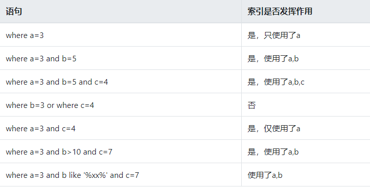

# 索引的基本知识

## 索引的优点

1、大大减少了服务器需要扫描的数据量

2、帮助服务器避免排序和临时表

3、将随机io变成顺序io

## 索引的用处

1、快速查找匹配WHERE子句的行

2、从consideration中消除行,如果可以在多个索引之间进行选择，mysql通常会使用找到最少行的索引

3、如果表具有多列索引，则优化器可以使用索引的任何最左前缀来查找行

4、当有表连接的时候，从其他表检索行数据

5、查找特定索引列的min或max值

6、如果排序或分组时在可用索引的最左前缀上完成的，则对表进行排序和分组

7、在某些情况下，可以优化查询以检索值而无需查询数据行

## 索引分类

- 主键索引
- 唯一索引
- 普通索引
- 全文索引
- 组合索引

## 面试的技术名词

- 回表
- 覆盖索引
- 最左匹配
- 索引下推

## 索引采用的数据结构

hash表，哈希表

B+树

## 索引匹配的方式

# 哈希索引

- **基于哈希表的实现，只有精确匹配索引所有列的查询才有效**
- **在mysql中，只有memory的存储引擎显式支持哈希索引**

- **哈希索引自身只需存储对应的hash值，所以索引的结构十分紧凑，这让哈希索引查找的速度非常快**

- **哈希索引的限制：**
  - 1、哈希索引只包含哈希值和行指针，而不存储字段值，索引不能使用索引中的值来避免读取行
  - 2、哈希索引数据并不是按照索引值顺序存储的，所以无法进行排序
  - 3、哈希索引不支持部分列匹配查找，哈希索引是使用索引列的全部内容来计算哈希值
  - 4、哈希索引支持等值比较查询，也不支持任何范围查询
  - 5、访问哈希索引的数据非常快，除非有很多哈希冲突，当出现哈希冲突的时候，存储引擎必须遍历链表中的所有行指针，逐行进行比较，直到找到所有符合条件的行
  - 6、哈希冲突比较多的话，维护的代价也会很高

- 案例：

  当需要存储大量的URL，并且根据URL进行搜索查找，如果使用B+树，存储的内容就会很大
  select id from url where url=""
  也可以利用将url使用CRC32做哈希，可以使用以下查询方式：
  select id fom url where url="" and url_crc=CRC32("")
  此查询性能较高原因是使用体积很小的索引来完成查找

# 组合索引

- **当包含多个列作为索引，需要注意的是正确的顺序依赖于该索引的查询，同时需要考虑如何更好的满足排序和分组的需要**

- 案例，建立组合索引a,b,c

  不同SQL语句使用索引情况

  

# 聚簇索引与非聚簇索引

## 聚簇索引

不是单独的索引类型，而是一种数据存储方式，指的是数据行跟相邻的键值紧凑的存储在一起

## 非聚簇索引

数据文件跟索引文件分开存放

# 覆盖索引

## 基本介绍

- 1、如果一个索引包含所有需要查询的字段的值，我们称之为覆盖索引
- 2、不是所有类型的索引都可以称为覆盖索引，覆盖索引必须要存储索引列的值
- 3、不同的存储实现覆盖索引的方式不同，不是所有的引擎都支持覆盖索引，memory不支持覆盖索引

## 优势

## 案例演示