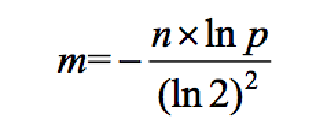
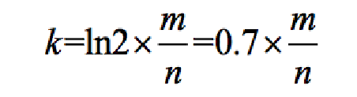
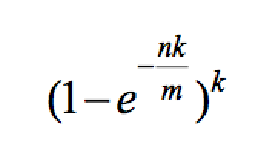

## 认识哈希函数 ->    out  f(in data)

1）输入参数data，假设是in类型，特征：可能性无穷大，比如str类型的参数

2）输出参数类型out，特征：可能性可以很大，但一定是有穷尽的

3）哈希函数没有任何随机的机制，固定的输入一定是固定的输出
4）输入无穷多但输出值有限，所以不同输入也可能输出相同（哈希碰撞）
5）再相似的不同输入，得到的输出值，会几乎均匀的分布在out域上
**重点：第5条！**

## 哈希函数作用：可以把数据根据不同值，几乎均匀的分开

举个例子：

哈希表的设计

## 布隆过滤器

### 什么是布隆过滤器

1）利用哈希函数的性质

2）每一条数据提取特征

3）加入描黑库

**原理：** 规定2两个哈希函数，将需要过滤得所有数据进行哈希运算，然后将可以出现值，在一个规定得区域中出现位置描黑（入库）（库得数据使用bit标记），将需要检查得数据同样进行哈希，得出得值，去看看是否全部都是描黑得，如果是那么这个就是要过滤得数据，否则就不是

### 布隆过滤器重要的三个公式

1，假设数据量为n，预期的失误率为p（布隆过滤器大小和每个样本的大小无关）
2，根据n和p，算出Bloom Filter一共需要多少个bit位，向上取整，记为m

3，根据m和n，算出Bloom Filter需要多少个哈希函数，向上取整，记为k

4，根据修正公式，算出真实的失误率p_true

 

## 一致性哈希

分布式存储结构最常见的结构

1）哈希域变成环的设计

2）虚拟节点技术