# Mybatis源码解析

## JDBC连接数据源

JDBC查询数据库数据，

```java
package com;

import java.sql.*;

public class JDBCTest {

  public static void main(String[] args) throws Exception {
    //1.加载驱动
    Class.forName(Driver.class.getName());
    //2.获取链接
    Connection connection = DriverManager.getConnection("jdbc:mysql://localhost:3308/mydb?characterEncoding=utf-8", "root", "123456");
    //3.创建statement对象
    PreparedStatement prepareStatement = connection.prepareStatement("select * from user_info where id = ?");
    //4.设置sql语句传入参数
    prepareStatement.setString(1, "1");
    //5.执行获取结果
    ResultSet resultSet = prepareStatement.executeQuery();
    //6.处理解雇集并返回
    ResultSetMetaData data = resultSet.getMetaData();
    int count = data.getColumnCount();
    while (resultSet.next()) {
      for (int i = 0; i < count; i++) {
        String columnName = data.getColumnName(i + 1);
        String value = resultSet.getString(columnName);
        System.out.println(columnName + ":" + value);
      }
    }
    //7.关闭链接，释放资源
    resultSet.close();
    prepareStatement.close();
    connection.close();
  }
}

```

## JDBC演变到Mybatis的过程

- 1、连接获取和释放
- 2、SQL统一存取
- 3、传入参数映射和动态SQL
- 4、结果映射和结果缓存
- 5、解决重复SQL语句问题

## Mybatis有待改进之处

Mybatis所有的数据库操作都是基于SQL语句，导致什么样的数据库操作都要写SQL语句，一个系统要写的SQL语句可能会特别多。

改进方法：

我们对数据库进行的操作大部分都哦时对表数据的增删改查，很多都是对单表的数据进行操作，由这点可以想到一个问题：单表操作可不可以不写SQL语句，通过JavaBean的默认映射器生成对应的SQL语句

比如：一个类UserInfo对应user_info表，userId属性对应于USER_ID字段。

最新版本的Mybatis就可以实现这个功能。

## 框架支撑层

1、事务管理机制

**事务管理机制对于ORM框架而言是不可缺少的一部分**，事务管理机制的质量也是考量一个ORM框架是否优秀的一个标准。

2、连接池管理机制

由于创建一个数据库连接所占用的资源比较大，对于数据吞吐量大和访问量非常大的应用而言，连接池的设计就显得非常重要。

3、缓存机制

为了提高数据库利用率和减小服务器和数据库的压力，Mybatis会对于一些查询提供会话级别的数据缓存，会将对某一次查询，放置到SqlSession中，在允许的时间间隔内，对于完全相同的查询，Mybatis会直接将缓存结果返回给用户，而不需要在去查询数据库。

4、SQL语言的配置方式

传统的MyBatis 配置SQL语句方式就是使用XML文件进行配置的，但是这种方式不能很好地支持面向接口编程的理念，**为了支持面向接口的编程，MyBatis 引入了Mapper接口的概念，面向接口的引入，对使用注解来配置SQL语句成为可能，用户只需要在接口上添加必要的注解即可，不用再去配置XML文件了**，但是，目前的MyBatis 只是对注解配置SQL语句提供了有限的支持，某些高级功能还是要依赖XML配置文件配置SQL 语句。


## 主要构件及其相互关系

- SqlSession：作为Mybatis工作的主要顶层API，表示和数据库交互的会话，完成必要数据库增删改查。
- Executor：Mybatis执行器，是Mybatis调度的核心，负责SQL语句的生成和查询缓存的维护。
- StatementHandle：封装了JDBC Statement操作，负责JDBC statement的操作，如设置参数，将statement结果转换成List集合。
- ParameterHandler：负责对用户传递的参数转换成JDBC statement所需要的参数。
- ResultSetHandle：负责将JDBC返回的ResultSet结果集对象转换成List类型的集合。
- TypeHandle：负责Java数据类型和JDBC数据类型之间的映射和转换。
- MappedStatement：MappedStatement维护了一条<select | update | delete | insert>节点的封装。
- SqlSource：负责根据用户传递的parameterObject，动态地生成SQL语句，将信息封装到BoundSql对象中，并发回。
- BoundSql：表示动态生成的SQL语句以及相应的参数信息。
- Configuration：Mybatis所有的配置信息都维持在Configuration对象中。

## Mybatis初始化流程

### 加载配置文件并创建SqlSessionFactory对象

```java
SqlSessionFactory sqlSessionFactory = new SqlSessionFactoryBuilder().build(inputStream);
```

这一步比较简单，是将配置文件以流的形式读取到程序中，并将其作为参数传递给SqlSessionFactoryBuilder以提供都面创建SqlSessionFactory。

imgae

核心方法：

```java
public SqlSessionFactory build(InputStream inputStream, String environment, Properties properties) {
  try {
    XMLConfigBuilder parser = new XMLConfigBuilder(inputStream, environment, properties);
    return build(parser.parse());
  } catch (Exception e) {
    throw ExceptionFactory.wrapException("Error building SqlSession.", e);
  } finally {
    ErrorContext.instance().reset();
    try {
      inputStream.close();
    } catch (IOException e) {
      // Intentionally ignore. Prefer previous error.
    }
  }
}
```

流程：

从SqlSessionFactoryBuilder.build()开始

1、XMLConfigBuilder：

new了一个XMLConfigBuilder对象，

```java
XMLConfigBuilder parser = new XMLConfigBuilder(inputStream, environment, properties);
```

进入代码：

```java
public XMLConfigBuilder(InputStream inputStream, String environment, Properties props) {
  this(new XPathParser(inputStream, true, props, new XMLMapperEntityResolver()), environment, props);
}
```

从上面可以看出想先构建XMLConfigBuilder对象，首先创建XMLMapperEntityResolver、并以其作为创建XPathPaser对象的参数之一。

2、XMLMapperEntityResolver：

是Mybatis的DTD

3、XPathParser:

```java
public XPathParser(InputStream inputStream, boolean validation, Properties variables, EntityResolver entityResolver) {
  commonConstructor(validation, variables, entityResolver);
  this.document = createDocument(new InputSource(inputStream));
}
```

- EntityResolver就是上个方法的XMLMapperEntityResolver

- InputStream是配置文件流信息

  ```java
  private void commonConstructor(boolean validation, Properties variables, EntityResolver entityResolver) {
    this.validation = validation;
    this.entityResolver = entityResolver;
    this.variables = variables;
    XPathFactory factory = XPathFactory.newInstance();
    this.xpath = factory.newXPath();
  }
  ```

- 设置解析xml文件时使用的属性

```java
private Document createDocument(InputSource inputSource) {
  // important: this must only be called AFTER common constructor
  try {
    DocumentBuilderFactory factory = DocumentBuilderFactory.newInstance();
    factory.setFeature(XMLConstants.FEATURE_SECURE_PROCESSING, true);
    factory.setValidating(validation);

    factory.setNamespaceAware(false);
    factory.setIgnoringComments(true);
    factory.setIgnoringElementContentWhitespace(false);
    factory.setCoalescing(false);
    factory.setExpandEntityReferences(true);

    DocumentBuilder builder = factory.newDocumentBuilder();
    builder.setEntityResolver(entityResolver);
    builder.setErrorHandler(new ErrorHandler() {
      @Override
      public void error(SAXParseException exception) throws SAXException {
        throw exception;
      }

      @Override
      public void fatalError(SAXParseException exception) throws SAXException {
        throw exception;
      }

      @Override
      public void warning(SAXParseException exception) throws SAXException {
        // NOP
      }
    });
    return builder.parse(inputSource);
  } catch (Exception e) {
    throw new BuilderException("Error creating document instance.  Cause: " + e, e);
  }
}
```

- 根据InputSource创建Document

4、XmlConfigBuilder

```java
private XMLConfigBuilder(XPathParser parser, String environment, Properties props) {
  super(new Configuration());
  ErrorContext.instance().resource("SQL Mapper Configuration");
  this.configuration.setVariables(props);
    //解析文件代码只能执行一次，当解析之后此值将变为true
  this.parsed = false;
  this.environment = environment;
    //实例化好的XPathParser
  this.parser = parser;
}
```

- 调用Configuration无参数构造创建其实例对象
- 设置XMLConfigBuilder解析装配Configuration需要用到的属性、其中最关键的this.parser=parser也就是前面实例化好的XPathParser。
- Configuration无参数构造初始化了以下内容：

```java
public Configuration() {
  typeAliasRegistry.registerAlias("JDBC", JdbcTransactionFactory.class);
  typeAliasRegistry.registerAlias("MANAGED", ManagedTransactionFactory.class);

  typeAliasRegistry.registerAlias("JNDI", JndiDataSourceFactory.class);
  typeAliasRegistry.registerAlias("POOLED", PooledDataSourceFactory.class);
  typeAliasRegistry.registerAlias("UNPOOLED", UnpooledDataSourceFactory.class);

  typeAliasRegistry.registerAlias("PERPETUAL", PerpetualCache.class);
  typeAliasRegistry.registerAlias("FIFO", FifoCache.class);
  typeAliasRegistry.registerAlias("LRU", LruCache.class);
  typeAliasRegistry.registerAlias("SOFT", SoftCache.class);
  typeAliasRegistry.registerAlias("WEAK", WeakCache.class);

  typeAliasRegistry.registerAlias("DB_VENDOR", VendorDatabaseIdProvider.class);

  typeAliasRegistry.registerAlias("XML", XMLLanguageDriver.class);
  typeAliasRegistry.registerAlias("RAW", RawLanguageDriver.class);

  typeAliasRegistry.registerAlias("SLF4J", Slf4jImpl.class);
  typeAliasRegistry.registerAlias("COMMONS_LOGGING", JakartaCommonsLoggingImpl.class);
  typeAliasRegistry.registerAlias("LOG4J", Log4jImpl.class);
  typeAliasRegistry.registerAlias("LOG4J2", Log4j2Impl.class);
  typeAliasRegistry.registerAlias("JDK_LOGGING", Jdk14LoggingImpl.class);
  typeAliasRegistry.registerAlias("STDOUT_LOGGING", StdOutImpl.class);
  typeAliasRegistry.registerAlias("NO_LOGGING", NoLoggingImpl.class);

  typeAliasRegistry.registerAlias("CGLIB", CglibProxyFactory.class);
  typeAliasRegistry.registerAlias("JAVASSIST", JavassistProxyFactory.class);

  languageRegistry.setDefaultDriverClass(XMLLanguageDriver.class);
  languageRegistry.register(RawLanguageDriver.class);
}
```


5、XmlConfigBuilder实例化好之后，就是解析配置文件、装配Configuration。

```java
public Configuration parse() {
  if (parsed) {
    throw new BuilderException("Each XMLConfigBuilder can only be used once.");
  }
  parsed = true;
    //解析XML中configuration节点的数据
  parseConfiguration(parser.evalNode("/configuration"));
  return configuration;
}
```

获取配置文件中configuration节点所有信息包括其子节点。

```java
private void parseConfiguration(XNode root) {
  try {
    // issue #117 read properties first
    propertiesElement(root.evalNode("properties"));
    Properties settings = settingsAsProperties(root.evalNode("settings"));
    loadCustomVfs(settings);
    loadCustomLogImpl(settings);
      //处理别名
    typeAliasesElement(root.evalNode("typeAliases"));
      //插件
    pluginElement(root.evalNode("plugins"));
      //默认对象objectFactory
    objectFactoryElement(root.evalNode("objectFactory"));
    objectWrapperFactoryElement(root.evalNode("objectWrapperFactory"));
    reflectorFactoryElement(root.evalNode("reflectorFactory"));
    settingsElement(settings);
    // read it after objectFactory and objectWrapperFactory issue #631
    environmentsElement(root.evalNode("environments"));
    databaseIdProviderElement(root.evalNode("databaseIdProvider"));
    typeHandlerElement(root.evalNode("typeHandlers"));
      //扫描所有的mapper文件
    mapperElement(root.evalNode("mappers"));
  } catch (Exception e) {
    throw new BuilderException("Error parsing SQL Mapper Configuration. Cause: " + e, e);
  }
}
```

从这里很明显看出此方法就是将Mybatis配置文件各个配置项解析并装配到Configuration对象中。

6、这里只看其中一个最简单的`settingsElement(settings);`方法，就是将配置文件中的`<settings>...</settings>`解析并设置到Configuration中。

```java
private void settingsElement(Properties props) {
  configuration.setAutoMappingBehavior(AutoMappingBehavior.valueOf(props.getProperty("autoMappingBehavior", "PARTIAL")));
  configuration.setAutoMappingUnknownColumnBehavior(AutoMappingUnknownColumnBehavior.valueOf(props.getProperty("autoMappingUnknownColumnBehavior", "NONE")));
  configuration.setCacheEnabled(booleanValueOf(props.getProperty("cacheEnabled"), true));
  configuration.setProxyFactory((ProxyFactory) createInstance(props.getProperty("proxyFactory")));
  configuration.setLazyLoadingEnabled(booleanValueOf(props.getProperty("lazyLoadingEnabled"), false));
  configuration.setAggressiveLazyLoading(booleanValueOf(props.getProperty("aggressiveLazyLoading"), false));
  configuration.setMultipleResultSetsEnabled(booleanValueOf(props.getProperty("multipleResultSetsEnabled"), true));
  configuration.setUseColumnLabel(booleanValueOf(props.getProperty("useColumnLabel"), true));
  configuration.setUseGeneratedKeys(booleanValueOf(props.getProperty("useGeneratedKeys"), false));
  configuration.setDefaultExecutorType(ExecutorType.valueOf(props.getProperty("defaultExecutorType", "SIMPLE")));
  configuration.setDefaultStatementTimeout(integerValueOf(props.getProperty("defaultStatementTimeout"), null));
  configuration.setDefaultFetchSize(integerValueOf(props.getProperty("defaultFetchSize"), null));
  configuration.setDefaultResultSetType(resolveResultSetType(props.getProperty("defaultResultSetType")));
  configuration.setMapUnderscoreToCamelCase(booleanValueOf(props.getProperty("mapUnderscoreToCamelCase"), false));
  configuration.setSafeRowBoundsEnabled(booleanValueOf(props.getProperty("safeRowBoundsEnabled"), false));
  configuration.setLocalCacheScope(LocalCacheScope.valueOf(props.getProperty("localCacheScope", "SESSION")));
  configuration.setJdbcTypeForNull(JdbcType.valueOf(props.getProperty("jdbcTypeForNull", "OTHER")));
  configuration.setLazyLoadTriggerMethods(stringSetValueOf(props.getProperty("lazyLoadTriggerMethods"), "equals,clone,hashCode,toString"));
  configuration.setSafeResultHandlerEnabled(booleanValueOf(props.getProperty("safeResultHandlerEnabled"), true));
  configuration.setDefaultScriptingLanguage(resolveClass(props.getProperty("defaultScriptingLanguage")));
  configuration.setDefaultEnumTypeHandler(resolveClass(props.getProperty("defaultEnumTypeHandler")));
  configuration.setCallSettersOnNulls(booleanValueOf(props.getProperty("callSettersOnNulls"), false));
  configuration.setUseActualParamName(booleanValueOf(props.getProperty("useActualParamName"), true));
  configuration.setReturnInstanceForEmptyRow(booleanValueOf(props.getProperty("returnInstanceForEmptyRow"), false));
  configuration.setLogPrefix(props.getProperty("logPrefix"));
  configuration.setConfigurationFactory(resolveClass(props.getProperty("configurationFactory")));
}
```

7、最后解析装配完成，返回Configuration对象

```java
public SqlSessionFactory build(Configuration config) {
  return new DefaultSqlSessionFactory(config);
}
```


## SqlSession工作流程分析


### SqlSession初始化

```java
SqlSession sqlSession = sqlSessionFactory.openSession();
```

1、根据configuration对象开启SqlSession对象

```java
private SqlSession openSessionFromDataSource(ExecutorType execType, TransactionIsolationLevel level, boolean autoCommit) {
  Transaction tx = null;
  try {
    final Environment environment = configuration.getEnvironment();
      //获取事务工厂
    final TransactionFactory transactionFactory = getTransactionFactoryFromEnvironment(environment);
      //根据配置文件中是否开启事务来通过事务工厂创建事务对象
    tx = transactionFactory.newTransaction(environment.getDataSource(), level, autoCommit);
    final Executor executor = configuration.newExecutor(tx, execType);
    return new DefaultSqlSession(configuration, executor, autoCommit);
  } catch (Exception e) {
    closeTransaction(tx); // may have fetched a connection so lets call close()
    throw ExceptionFactory.wrapException("Error opening session.  Cause: " + e, e);
  } finally {
    ErrorContext.instance().reset();
  }
}
```

2、创建执行器Executor:

```java
public Executor newExecutor(Transaction transaction, ExecutorType executorType) {
  executorType = executorType == null ? defaultExecutorType : executorType;
  executorType = executorType == null ? ExecutorType.SIMPLE : executorType;
  Executor executor;
  if (ExecutorType.BATCH == executorType) {
       //创建执行器类型，批量
    executor = new BatchExecutor(this, transaction);
  } else if (ExecutorType.REUSE == executorType) {
       //创建执行器类型，重用
    executor = new ReuseExecutor(this, transaction);
  } else {
      //创建执行器类型，simple
    executor = new SimpleExecutor(this, transaction);
  }
    //是否开启缓存，默认情况下是开启一级缓存的
  if (cacheEnabled) {
    executor = new CachingExecutor(executor);
  }
    //加载插件
  executor = (Executor) interceptorChain.pluginAll(executor);
  return executor;
}
```

3、创建默认的DefaultSqlSession对象

```java
public DefaultSqlSession(Configuration configuration, Executor executor, boolean autoCommit) {
  this.configuration = configuration;
  this.executor = executor;
  this.dirty = false;
  this.autoCommit = autoCommit;
}
```

4、日志处理，具体原理后续会继续学习

```java
ErrorContext.instance().reset();
```

这里是将一些属性重置，因为程序走到这里没有出错，所以将其reset

### SqlSession执行

#### select执行流程

以下面代码为例：

```java
DemoMapper mapper = sqlSession.getMapper(DemoMapper.class);
Map mas = new HashMap();
mas.put("id","1");
List all = mapper.selectAll(mas);
```

根据DemoMapper.class获取对于的DemoMapper对象，因为在初始化的时候，Configuration已经将所有扫描的到的Mapper接口，如果是XML配置的话，将会放入到`private final Map<Class<?>, MapperProxyFactory<?>> knownMappers = new HashMap<>();`集合中，如果是Mapper对象中还配置了注解的话，将会使用该` MapperAnnotationBuilder(config, type);`方法解析注解。

```java
public <T> void addMapper(Class<T> type) {
  if (type.isInterface()) {
    if (hasMapper(type)) {
      throw new BindingException("Type " + type + " is already known to the MapperRegistry.");
    }
    boolean loadCompleted = false;
    try {
      knownMappers.put(type, new MapperProxyFactory<>(type));
      // It's important that the type is added before the parser is run
      // otherwise the binding may automatically be attempted by the
      // mapper parser. If the type is already known, it won't try.
      MapperAnnotationBuilder parser = new MapperAnnotationBuilder(config, type);
        //解析mapper接口中的注解
      parser.parse();
      loadCompleted = true;
    } finally {
      if (!loadCompleted) {
        knownMappers.remove(type);
      }
    }
  }
}
```

parse（）方法：

```java
public void parse() {
  String resource = type.toString();
  if (!configuration.isResourceLoaded(resource)) {
    loadXmlResource();
    configuration.addLoadedResource(resource);
    assistant.setCurrentNamespace(type.getName());
    parseCache();
    parseCacheRef();
    for (Method method : type.getMethods()) {
      if (!canHaveStatement(method)) {
        continue;
      }
      if (getSqlCommandType(method) == SqlCommandType.SELECT && method.getAnnotation(ResultMap.class) == null) {
        parseResultMap(method);
      }
      try {
        parseStatement(method);
      } catch (IncompleteElementException e) {
        configuration.addIncompleteMethod(new MethodResolver(this, method));
      }
    }
  }
  parsePendingMethods();
}
```

执行到`List all = mapper.selectAll(mas);`方法，其实真正调用的MapperProxy代理对象的invoke（）方法，

```java
 @Override
  public Object invoke(Object proxy, Method method, Object[] args) throws Throwable {
    try {
      if (Object.class.equals(method.getDeclaringClass())) {
        return method.invoke(this, args);
      } else {
        return cachedInvoker(method).invoke(proxy, method, args, sqlSession);
      }
    } catch (Throwable t) {
      throw ExceptionUtil.unwrapThrowable(t);
    }
  }
```

`cachedInvoker(method).invoke(proxy, method, args, sqlSession);`该方法的实现如下：

```java
interface MapperMethodInvoker {
  Object invoke(Object proxy, Method method, Object[] args, SqlSession sqlSession) throws Throwable;
}

private static class PlainMethodInvoker implements MapperMethodInvoker {
  private final MapperMethod mapperMethod;

  public PlainMethodInvoker(MapperMethod mapperMethod) {
    super();
    this.mapperMethod = mapperMethod;
  }

  @Override
  public Object invoke(Object proxy, Method method, Object[] args, SqlSession sqlSession) throws Throwable {
    return mapperMethod.execute(sqlSession, args);
  }
}
```

真正是`mapperMethod.execute(sqlSession, args)`来执行：

实际调用：

```java
public Object execute(SqlSession sqlSession, Object[] args) {
  Object result;
    //根据command类型执行对应方法
  switch (command.getType()) {
    case INSERT: {
      Object param = method.convertArgsToSqlCommandParam(args);
      result = rowCountResult(sqlSession.insert(command.getName(), param));
      break;
    }
    case UPDATE: {
      Object param = method.convertArgsToSqlCommandParam(args);
      result = rowCountResult(sqlSession.update(command.getName(), param));
      break;
    }
    case DELETE: {
      Object param = method.convertArgsToSqlCommandParam(args);
      result = rowCountResult(sqlSession.delete(command.getName(), param));
      break;
    }
    case SELECT:
      if (method.returnsVoid() && method.hasResultHandler()) {
        executeWithResultHandler(sqlSession, args);
        result = null;
      } else if (method.returnsMany()) {
          //根据mapper方法的返回类型来执行对应的方法
        result = executeForMany(sqlSession, args);
      } else if (method.returnsMap()) {
        result = executeForMap(sqlSession, args);
      } else if (method.returnsCursor()) {
        result = executeForCursor(sqlSession, args);
      } else {
        Object param = method.convertArgsToSqlCommandParam(args);
        result = sqlSession.selectOne(command.getName(), param);
        if (method.returnsOptional()
            && (result == null || !method.getReturnType().equals(result.getClass()))) {
          result = Optional.ofNullable(result);
        }
      }
      break;
    case FLUSH:
      result = sqlSession.flushStatements();
      break;
    default:
      throw new BindingException("Unknown execution method for: " + command.getName());
  }
  if (result == null && method.getReturnType().isPrimitive() && !method.returnsVoid()) {
    throw new BindingException("Mapper method '" + command.getName()
        + " attempted to return null from a method with a primitive return type (" + method.getReturnType() + ").");
  }
  return result;
}
```

当前method对象是`private final MethodSignature method;`，这是根据当前Mapper对象方法的返回值类型来执行对应的方法，此时因为返回的collection对象，所以调用的`executeForMany(sqlSession, args);`方法，

```java
private <E> Object executeForMany(SqlSession sqlSession, Object[] args) {
    List<E> result;
    //获取参数对象
    Object param = method.convertArgsToSqlCommandParam(args);
    //判断是否有边界限制
    if (method.hasRowBounds()) {
      RowBounds rowBounds = method.extractRowBounds(args);
      result = sqlSession.selectList(command.getName(), param, rowBounds);
    } else {
        //当前真正执行的查询操作
      result = sqlSession.selectList(command.getName(), param);
    }
    // issue #510 Collections & arrays support
    if (!method.getReturnType().isAssignableFrom(result.getClass())) {
      if (method.getReturnType().isArray()) {
        return convertToArray(result);
      } else {
        return convertToDeclaredCollection(sqlSession.getConfiguration(), result);
      }
    }
    return result;
  }
```

获取参数方法`convertArgsToSqlCommandParam(args)` args是当前接口方法的参数数组元素使用的是HashMap对象存放对应参数id和对应的值：

```java
public Object getNamedParams(Object[] args) {
    final int paramCount = names.size();
    if (args == null || paramCount == 0) {
      return null;
    } else if (!hasParamAnnotation && paramCount == 1) {
      Object value = args[names.firstKey()];
      return wrapToMapIfCollection(value, useActualParamName ? names.get(0) : null);
    } else {
      final Map<String, Object> param = new ParamMap<>();
      int i = 0;
      for (Map.Entry<Integer, String> entry : names.entrySet()) {
        param.put(entry.getValue(), args[entry.getKey()]);
        // add generic param names (param1, param2, ...)
        final String genericParamName = GENERIC_NAME_PREFIX + (i + 1);
        // ensure not to overwrite parameter named with @Param
        if (!names.containsValue(genericParamName)) {
          param.put(genericParamName, args[entry.getKey()]);
        }
        i++;
      }
      return param;
    }
  }
```

真正进行SqlSession对象的selectList()方法：

```java
@Override
  public <E> List<E> selectList(String statement, Object parameter, RowBounds rowBounds) {
    try {
        //获取mapperstatement对象，类似JDBC的statement对象，该对象包括xml的resource，id=com.DemoMapper.selectAll，等等等，很多属性
      MappedStatement ms = configuration.getMappedStatement(statement);
      return executor.query(ms, wrapCollection(parameter), rowBounds, Executor.NO_RESULT_HANDLER);
    } catch (Exception e) {
      throw ExceptionFactory.wrapException("Error querying database.  Cause: " + e, e);
    } finally {
      ErrorContext.instance().reset();
    }
  }
```

该方法中executor.query()方法：

```java
 @Override
  public <E> List<E> query(MappedStatement ms, Object parameterObject, RowBounds rowBounds, ResultHandler resultHandler) throws SQLException {
      //根据参数Object，获取当前数据库可以识别的sql语句
    BoundSql boundSql = ms.getBoundSql(parameterObject);
      //是否开启缓存，key对应的mapper方法id，如com.DemoMapper.selectAll
    CacheKey key = createCacheKey(ms, parameterObject, rowBounds, boundSql);
    return query(ms, parameterObject, rowBounds, resultHandler, key, boundSql);
  }
```

getBoundSql方法是将原生sql根据设置的参数替换成数据库可以识别的Sql语句：

```java
public BoundSql getBoundSql(Object parameterObject) {
    //获取sql原生语句如：select * from test where id = ? 对象，该对象包括参数list，和参数hashmap对应的值
  BoundSql boundSql = sqlSource.getBoundSql(parameterObject);
  List<ParameterMapping> parameterMappings = boundSql.getParameterMappings();
  if (parameterMappings == null || parameterMappings.isEmpty()) {
    boundSql = new BoundSql(configuration, boundSql.getSql(), parameterMap.getParameterMappings(), parameterObject);
  }
```

createCacheKey()方法缓存当前执行的方法，和对应的参数，数据是放在ArrayList对象中的：

```java
@Override
public CacheKey createCacheKey(MappedStatement ms, Object parameterObject, RowBounds rowBounds, BoundSql boundSql) {
  if (closed) {
    throw new ExecutorException("Executor was closed.");
  }
  CacheKey cacheKey = new CacheKey();
  cacheKey.update(ms.getId());
  cacheKey.update(rowBounds.getOffset());
  cacheKey.update(rowBounds.getLimit());
  cacheKey.update(boundSql.getSql());
  List<ParameterMapping> parameterMappings = boundSql.getParameterMappings();
  TypeHandlerRegistry typeHandlerRegistry = ms.getConfiguration().getTypeHandlerRegistry();
  // mimic DefaultParameterHandler logic
  for (ParameterMapping parameterMapping : parameterMappings) {
    if (parameterMapping.getMode() != ParameterMode.OUT) {
      Object value;
      String propertyName = parameterMapping.getProperty();
      if (boundSql.hasAdditionalParameter(propertyName)) {
        value = boundSql.getAdditionalParameter(propertyName);
      } else if (parameterObject == null) {
        value = null;
      } else if (typeHandlerRegistry.hasTypeHandler(parameterObject.getClass())) {
        value = parameterObject;
      } else {
        MetaObject metaObject = configuration.newMetaObject(parameterObject);
        value = metaObject.getValue(propertyName);
      }
      cacheKey.update(value);
    }
  }
  if (configuration.getEnvironment() != null) {
    // issue #176
    cacheKey.update(configuration.getEnvironment().getId());
  }
  return cacheKey;
}
```

`query(ms, parameterObject, rowBounds, resultHandler, key, boundSql);`方法:

```java
public <E> List<E> query(MappedStatement ms, Object parameterObject, RowBounds rowBounds, ResultHandler resultHandler, CacheKey key, BoundSql boundSql)
    throws SQLException {
  Cache cache = ms.getCache();
    //开始缓存后执行的代码
  if (cache != null) {
    flushCacheIfRequired(ms);
    if (ms.isUseCache() && resultHandler == null) {
      ensureNoOutParams(ms, boundSql);
      @SuppressWarnings("unchecked")
      List<E> list = (List<E>) tcm.getObject(cache, key);
      if (list == null) {
        list = delegate.query(ms, parameterObject, rowBounds, resultHandler, key, boundSql);
        tcm.putObject(cache, key, list); // issue #578 and #116
      }
      return list;
    }
  }
  return delegate.query(ms, parameterObject, rowBounds, resultHandler, key, boundSql);
}
```

`delegate.query(ms, parameterObject, rowBounds, resultHandler, key, boundSql);`方法:

```java
public <E> List<E> query(MappedStatement ms, Object parameter, RowBounds rowBounds, ResultHandler resultHandler, CacheKey key, BoundSql boundSql) throws SQLException {
  ErrorContext.instance().resource(ms.getResource()).activity("executing a query").object(ms.getId());
  if (closed) {
    throw new ExecutorException("Executor was closed.");
  }
  if (queryStack == 0 && ms.isFlushCacheRequired()) {
    clearLocalCache();
  }
  List<E> list;
  try {
    queryStack++;
      //判断是否有缓存对象
    list = resultHandler == null ? (List<E>) localCache.getObject(key) : null;
    if (list != null) {
      handleLocallyCachedOutputParameters(ms, key, parameter, boundSql);
    } else {
      list = queryFromDatabase(ms, parameter, rowBounds, resultHandler, key, boundSql);
    }
  } finally {
    queryStack--;
  }
  if (queryStack == 0) {
    for (DeferredLoad deferredLoad : deferredLoads) {
      deferredLoad.load();
    }
    // issue #601
    deferredLoads.clear();
    if (configuration.getLocalCacheScope() == LocalCacheScope.STATEMENT) {
      // issue #482
      clearLocalCache();
    }
  }
  return list;
}
```

`queryFromDatabase(ms, parameter, rowBounds, resultHandler, key, boundSql);`方法:

```java
  private <E> List<E> queryFromDatabase(MappedStatement ms, Object parameter, RowBounds rowBounds, ResultHandler resultHandler, CacheKey key, BoundSql boundSql) throws SQLException {
    List<E> list;
      //初始化缓存
    localCache.putObject(key, EXECUTION_PLACEHOLDER);
    try {
      list = doQuery(ms, parameter, rowBounds, resultHandler, boundSql);
    } finally {
      localCache.removeObject(key);
    }
    localCache.putObject(key, list);
    if (ms.getStatementType() == StatementType.CALLABLE) {
      localOutputParameterCache.putObject(key, parameter);
    }
    return list;
  }

```

`doQuery(ms, parameter, rowBounds, resultHandler, boundSql);`方法：

```java
public <E> List<E> doQuery(MappedStatement ms, Object parameter, RowBounds rowBounds, ResultHandler resultHandler, BoundSql boundSql) throws SQLException {
  Statement stmt = null;
  try {
      //获取config对象，
    Configuration configuration = ms.getConfiguration();
      //获取StatementHandler对象
    StatementHandler handler = configuration.newStatementHandler(wrapper, ms, parameter, rowBounds, resultHandler, boundSql);
      //获取JDBC的statement对象
    stmt = prepareStatement(handler, ms.getStatementLog());
      //最后调用query方法
    return handler.query(stmt, resultHandler);
  } finally {
    closeStatement(stmt);
  }
}
```


```java
private Statement prepareStatement(StatementHandler handler, Log statementLog) throws SQLException {
  Statement stmt;
    //获取数据库连接
  Connection connection = getConnection(statementLog);
    //获取statement对象
  stmt = handler.prepare(connection, transaction.getTimeout());
    //将参数设置到handler操作对象中 底层调用的是下面的的setParameter（）方法
  handler.parameterize(stmt);
  return stmt;
}
```


```java
public void setParameter(PreparedStatement ps, int i, T parameter, JdbcType jdbcType) throws SQLException {
  if (parameter == null) {
    if (jdbcType == null) {
      throw new TypeException("JDBC requires that the JdbcType must be specified for all nullable parameters.");
    }
    try {
      ps.setNull(i, jdbcType.TYPE_CODE);
    } catch (SQLException e) {
      throw new TypeException("Error setting null for parameter #" + i + " with JdbcType " + jdbcType + " . "
            + "Try setting a different JdbcType for this parameter or a different jdbcTypeForNull configuration property. "
            + "Cause: " + e, e);
    }
  } else {
    try {
      setNonNullParameter(ps, i, parameter, jdbcType);
    } catch (Exception e) {
      throw new TypeException("Error setting non null for parameter #" + i + " with JdbcType " + jdbcType + " . "
            + "Try setting a different JdbcType for this parameter or a different configuration property. "
            + "Cause: " + e, e);
    }
  }
}
```


setNonNullParameter（）底层实现的方法：

```java
private TypeHandler<?> resolveTypeHandler(Object parameter, JdbcType jdbcType) {
  TypeHandler<?> handler;
  if (parameter == null) {
    handler = OBJECT_TYPE_HANDLER;
  } else {
    handler = typeHandlerRegistrySupplier.get().getTypeHandler(parameter.getClass(), jdbcType);
    // check if handler is null (issue #270)
    if (handler == null || handler instanceof UnknownTypeHandler) {
      handler = OBJECT_TYPE_HANDLER;
    }
  }
  return handler;
}
```


`setParameters(PreparedStatement ps) `方法：	

```java
public void setParameters(PreparedStatement ps) {
  ErrorContext.instance().activity("setting parameters").object(mappedStatement.getParameterMap().getId());
  List<ParameterMapping> parameterMappings = boundSql.getParameterMappings();
  if (parameterMappings != null) {
    for (int i = 0; i < parameterMappings.size(); i++) {
      ParameterMapping parameterMapping = parameterMappings.get(i);
      if (parameterMapping.getMode() != ParameterMode.OUT) {
        Object value;
        String propertyName = parameterMapping.getProperty();
        if (boundSql.hasAdditionalParameter(propertyName)) { // issue #448 ask first for additional params
          value = boundSql.getAdditionalParameter(propertyName);
        } else if (parameterObject == null) {
          value = null;
        } else if (typeHandlerRegistry.hasTypeHandler(parameterObject.getClass())) {
          value = parameterObject;
        } else {
            // ？？ 
          MetaObject metaObject = configuration.newMetaObject(parameterObject);
          value = metaObject.getValue(propertyName);
        }
        TypeHandler typeHandler = parameterMapping.getTypeHandler();
          //获取jdbc对应的数据类型
        JdbcType jdbcType = parameterMapping.getJdbcType();
        if (value == null && jdbcType == null) {
          jdbcType = configuration.getJdbcTypeForNull();
        }
        try {
            //根据ps对象，设置参数，
          typeHandler.setParameter(ps, i + 1, value, jdbcType);
        } catch (TypeException | SQLException e) {
          throw new TypeException("Could not set parameters for mapping: " + parameterMapping + ". Cause: " + e, e);
        }
      }
    }
  }
}
```

真正方法数据的是` handler.query(stmt, resultHandler);`方法：底层调用的是：

```java
public <E> List<E> query(Statement statement, ResultHandler resultHandler) throws SQLException {
  PreparedStatement ps = (PreparedStatement) statement;
    //实际调用数据库
  ps.execute();
    //处理结果集并返回list对象
  return resultSetHandler.handleResultSets(ps);
}
```

`resultSetHandler.handleResultSets(ps);`处理结果的方法：

```java
@Override
public List<Object> handleResultSets(Statement stmt) throws SQLException {
  ErrorContext.instance().activity("handling results").object(mappedStatement.getId());

  final List<Object> multipleResults = new ArrayList<>();

  int resultSetCount = 0;
    //处理结果集合，并将metaResult数据放入到对应容器中，包括列名，数据，数据类型等等
  ResultSetWrapper rsw = getFirstResultSet(stmt);
	//获取的ResultMap集合，
  List<ResultMap> resultMaps = mappedStatement.getResultMaps();
  int resultMapCount = resultMaps.size();
  validateResultMapsCount(rsw, resultMapCount);
  while (rsw != null && resultMapCount > resultSetCount) {
    ResultMap resultMap = resultMaps.get(resultSetCount);
      //？？？？
    handleResultSet(rsw, resultMap, multipleResults, null);
      //是否有更多的结果集，Retrieves whether this database supports getting multiple ResultSet objects from a single call to the method execute；
      //并将rsw置空
    rsw = getNextResultSet(stmt);
    cleanUpAfterHandlingResultSet();
    resultSetCount++;
  }

  String[] resultSets = mappedStatement.getResultSets();
  if (resultSets != null) {
    while (rsw != null && resultSetCount < resultSets.length) {
      ResultMapping parentMapping = nextResultMaps.get(resultSets[resultSetCount]);
      if (parentMapping != null) {
        String nestedResultMapId = parentMapping.getNestedResultMapId();
        ResultMap resultMap = configuration.getResultMap(nestedResultMapId);
        handleResultSet(rsw, resultMap, null, parentMapping);
      }
      rsw = getNextResultSet(stmt);
      cleanUpAfterHandlingResultSet();
      resultSetCount++;
    }
  }

  return collapseSingleResultList(multipleResults);
}
```


```java
public ResultSetWrapper(ResultSet rs, Configuration configuration) throws SQLException {
  super();
  this.typeHandlerRegistry = configuration.getTypeHandlerRegistry();
  this.resultSet = rs;
  final ResultSetMetaData metaData = rs.getMetaData();
  final int columnCount = metaData.getColumnCount();
  for (int i = 1; i <= columnCount; i++) {
    columnNames.add(configuration.isUseColumnLabel() ? metaData.getColumnLabel(i) : metaData.getColumnName(i));
    jdbcTypes.add(JdbcType.forCode(metaData.getColumnType(i)));
    classNames.add(metaData.getColumnClassName(i));
  }
}
```


数据真正的的通过` StatementHandler handler`下的` handler.query(stmt, resultHandler);`下的` PreparedStatement ps = (PreparedStatement) statement;`对象执行ps.execute(),获取数据库数据，使用`ResultHandler resultHandler`对象的`resultSetHandler.handleResultSets(ps)`方法，将获取的数据集处理为list对象返回。

至此，sqlSession真正操作了对象的初始化，执行等方法，从数据库获取对象。其原理：


## Mybatis缓存

### 一级缓存

1. 关系：

sqlsession和Executor以及Cache的关系图：

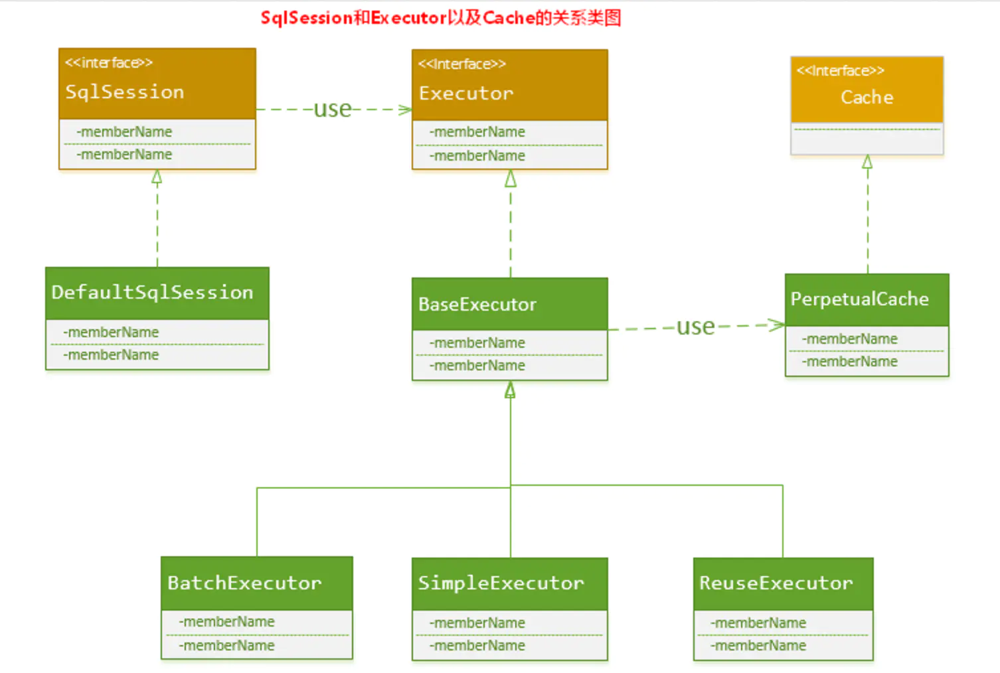

如上述的类图所示，Executor接口的实现类BaseExecutor中拥有一个Cache接口的实现类PerpetualCache，**则对于BaseExecutor对象而言，它将使用PerpetualCache对象维护缓存**

综上，SqlSession对象、Executor对象、Cache对象之间的关系如下图所示：

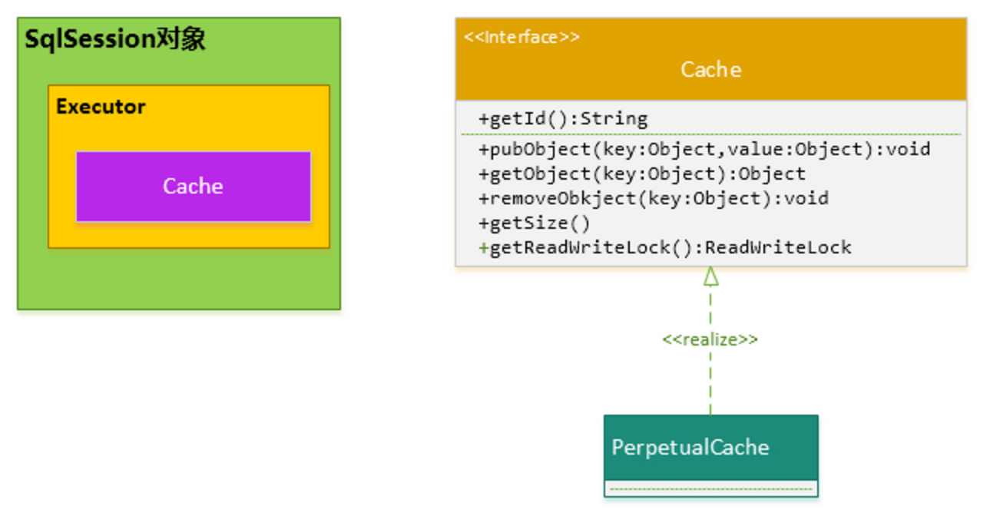

2. PerpetualCache:

**PerpetualCache实现原理其实很简单，其内部就是通过一个简单的HashMap 来实现的，没有其他的任何限制。如下是PerpetualCache的实现代码：**

```java
public class PerpetualCache implements Cache {

  private final String id;

  private final Map<Object, Object> cache = new HashMap<>();

  public PerpetualCache(String id) {
    this.id = id;
  }

  @Override
  public String getId() {
    return id;
  }

  @Override
  public int getSize() {
    return cache.size();
  }

  @Override
  public void putObject(Object key, Object value) {
    cache.put(key, value);
  }

  @Override
  public Object getObject(Object key) {
    return cache.get(key);
  }

  @Override
  public Object removeObject(Object key) {
    return cache.remove(key);
  }

  @Override
  public void clear() {
    cache.clear();
  }

  @Override
  public boolean equals(Object o) {
    if (getId() == null) {
      throw new CacheException("Cache instances require an ID.");
    }
    if (this == o) {
      return true;
    }
    if (!(o instanceof Cache)) {
      return false;
    }

    Cache otherCache = (Cache) o;
    return getId().equals(otherCache.getId());
  }

  @Override
  public int hashCode() {
    if (getId() == null) {
      throw new CacheException("Cache instances require an ID.");
    }
    return getId().hashCode();
  }

}
```

3. **一级缓存的生命周期有多长？**

   - Mybatis在开启一个数据库会话时，会创建一个新的SqlSession对象，SqlSession对象中会有一个新的Executor对象，Executor对象中持有一个新的PerpetualCache对象；**当会话结束时，SqlSession对象及其内部的Executor对象还有PerpetualCache对象也一并释放掉**。
   - **如果SqlSession调用了close()方法**，会释放掉一级缓存PerpetualCache对象，一级缓存将不可用；
   - **如果SqlSession调用了clearCache()**，会清空PerpetualCache对象中的数据，但是该对象仍可使用；
   - **SqlSession中执行了任何一个update操作(update()、delete()、insert()) **，都会清空PerpetualCache对象的数据，但是该对象可以继续使用；

4. ## SqlSession 一级缓存的工作流程

   - 于某个查询，**根据statementId,params,rowBounds来构建一个key值**，根据这个key值去缓存Cache中取出对应的key值存储的缓存结果；
   - 判断从Cache中根据特定的key值取的数据数据是否为空，即是否命中；
   - 如果命中，则直接将缓存结果返回；
   - 如果没命中：
     - 去数据库中查询数据，得到查询结果；
     -  将key和查询到的结果分别作为key,value对存储到Cache中；
     - 将查询结果返回；
   - 结束。

   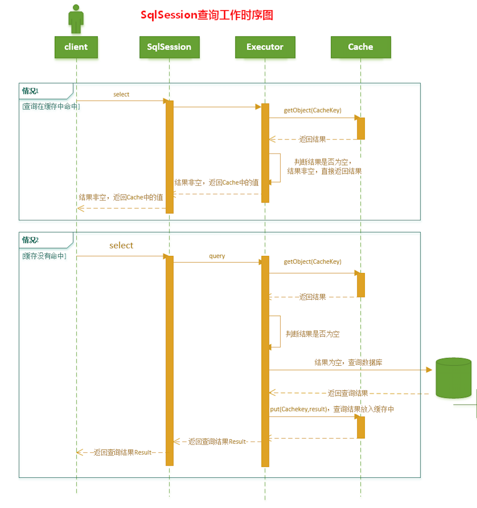

#### Cache接口的设计以及CacheKey的定义

实际上，**在SqlSession对象里的Executor对象内维护的Cache类型实例对象，就是PerpetualCache子类创建的**。

MyBatis内部还有很多Cache接口的实现，**一级缓存只会涉及到这一个PerpetualCache子类**，Cache的其他实现将会放到二级缓存中介绍。

现在最核心的问题出现了：**怎样来确定一次查询的特征值？换句话说就是：怎样判断某两次查询是完全相同的查询？也可以这样说：如何确定Cache中的key值？**

**获取CacheKey的四个条件：**

1. 传入的statementId,对于Mybatis而言，你要使用它，必须需要一个statementId，它代表你执行什么样的Sql
2. Mybatis自身提供的分页功能是通过RowBounds来实现的，它通过rowBounds.offset和rowBounds.limit来过滤查询出来的结果集，这种分页功能是基于查询结果的再过滤，而不是进行数据库的物理分页。
3. 由于Mybatis底层还是依赖JDBC实现的，那么，对于两次完全一模一样的查询，Mybatis要保证对于底层JDBC而言，也是完全一致的查询才行，而对于JDBC而言，**两次查询，只要传入给JDBC的SQL语句完全一致，传入的参数也完全一致**，就认为是两次查询是完全一致的。
4. 上述的第3个条件正是要求保证传递给JDBC的SQL语句完全一致；第4条则是保证传递给JDBC的参数也完全一致；即3、4两条MyBatis最本质的要求就是：**调用JDBC的时候，传入的SQL语句要完全相同，传递给JDBC的参数值也要完全相同**。

CacheKey由以下条件决定：**statementId + rowBounds + 传递给JDBC的SQL + 传递给JDBC的参数值**；

**CacheKey的创建**：

**CacheKey的构建被放置到了Executor接口的实现类BaseExecutor中，定义如下：**

```java
public CacheKey createCacheKey(MappedStatement ms, Object parameterObject, RowBounds rowBounds, BoundSql boundSql) {
  if (closed) {
    throw new ExecutorException("Executor was closed.");
  }
  CacheKey cacheKey = new CacheKey();
    //1.statementId
  cacheKey.update(ms.getId());
    //2.rowBounds.offset
  cacheKey.update(rowBounds.getOffset());
    //3.rowBounds.limit
  cacheKey.update(rowBounds.getLimit());
    //4. sql语句
  cacheKey.update(boundSql.getSql());
    //5.参数
  List<ParameterMapping> parameterMappings = boundSql.getParameterMappings();
  TypeHandlerRegistry typeHandlerRegistry = ms.getConfiguration().getTypeHandlerRegistry();
  // mimic DefaultParameterHandler logic
  for (ParameterMapping parameterMapping : parameterMappings) {
    if (parameterMapping.getMode() != ParameterMode.OUT) {
      Object value;
      String propertyName = parameterMapping.getProperty();
      if (boundSql.hasAdditionalParameter(propertyName)) {
        value = boundSql.getAdditionalParameter(propertyName);
      } else if (parameterObject == null) {
        value = null;
      } else if (typeHandlerRegistry.hasTypeHandler(parameterObject.getClass())) {
        value = parameterObject;
      } else {
        MetaObject metaObject = configuration.newMetaObject(parameterObject);
        value = metaObject.getValue(propertyName);
      }
        //将每一个要传递给JDBC的参数值更新到CacheKey中
      cacheKey.update(value);
    }
  }
  if (configuration.getEnvironment() != null) {
    // issue #176
    cacheKey.update(configuration.getEnvironment().getId());
  }
  return cacheKey;
}
```

**CacheKey的hashcode生成算法**：

**Cache接口的实现，本质上是使用的HashMap,而构建CacheKey的目的就是为了作为HashMap中的key值**。**而HashMap是通过key值的hashcode 来组织和存储的，那么，构建CacheKey的过程实际上就是构造其hashCode的过程**。下面的代码就是CacheKey的核心hashcode生成算法：

```java
public void update(Object object) {
  	//1.得到对象的hashCode
    int baseHashCode = object == null ? 1 : ArrayUtil.hashCode(object);
	//对象计数器递增
  count++;
  checksum += baseHashCode;
  //2.对象的hashcode过大count倍
  baseHashCode *= count;
	//3.hashcode * 拓展因子(默认37) + 拓展扩大后的对象hashcode
  hashcode = multiplier * hashcode + baseHashCode;
  updateList.add(object);
}
```

MyBatis认为的完全相同的查询，不是指使用sqlSession查询时传递给算起来Session的所有参数值完完全全相同，你只要保证statementId，rowBounds,最后生成的SQL语句，以及这个SQL语句所需要的参数完全一致就可以了。

#### 一级缓存的性能分析

**MyBatis对会话（Session）级别的一级缓存设计的比较简单，就简单地使用了HashMap来维护，并没有对HashMap的容量和大小进行限制**

读者有可能就觉得不妥了：如果我一直使用某一个SqlSession对象查询数据，这样会不会导致HashMap太大，而导致 java.lang.OutOfMemoryError错误啊？读者这么考虑也不无道理，不过MyBatis的确是这样设计的。

**MyBatis这样设计也有它自己的理由：**

a. **一般而言SqlSession的生存时间很短。**一般情况下使用一个SqlSession对象执行的操作不会太多，执行完就会消亡；

b. **对于某一个SqlSession对象而言，只要执行update操作（update、insert、delete），都会将这个SqlSession对象中对应的一级缓存清空掉**，所以一般情况下不会出现缓存过大，影响JVM内存空间的问题；

c. **可以手动地释放掉SqlSession对象中的缓存。**

**一级缓存是一个粗粒度的缓存，没有更新缓存和缓存过期的概念**：

MyBatis的一级缓存就是使用了简单的HashMap，MyBatis只负责将查询数据库的结果存储到缓存中去， 不会去判断缓存存放的时间是否过长、是否过期，因此也就没有对缓存的结果进行更新这一说了。

注意：

1. 对于数据变化频率很大，并且需要高时效准确性的数据要求，我们使用SqlSession查询的时候，**要控制好SqlSession的生存时间，SqlSession的生存时间越长，它其中缓存的数据有可能就越旧，从而造成和真实数据库的误差**；同时对于这种情况，**用户也可以手动地适时清空SqlSession中的缓存**；
2. 对于只执行、并且频繁执行大范围的select操作的SqlSession对象，SqlSession对象的生存时间不应过长。


### 二级缓存

**MyBatis的二级缓存是Application级别的缓存**，它可以提高对数据库查询的效率，以提高应用的性能。

#### MyBatis的缓存机制整体设计以及二级缓存的工作模式

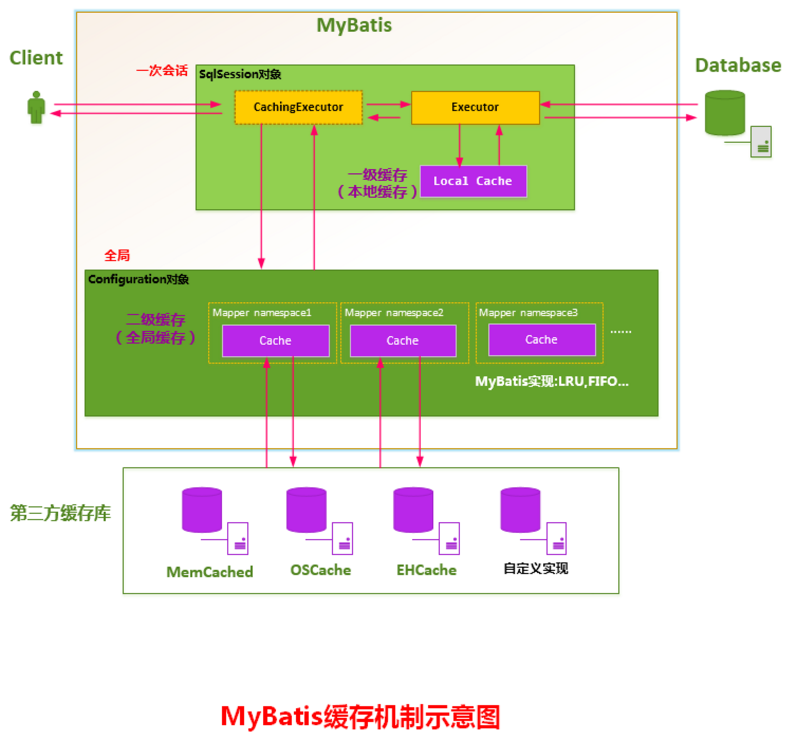

如果用户配置了"cacheEnabled=true"，那么MyBatis在为SqlSession对象创建Executor对象时，**会对Executor对象加上一个装饰者：CachingExecutor**，这时SqlSession使用CachingExecutor对象来完成操作请求。**CachingExecutor对于查询请求，会先判断该查询请求在Application级别的二级缓存中是否有缓存结果**，如果有查询结果，则直接返回缓存结果；如果缓存中没有，再交给真正的Executor对象来完成查询操作，**之后CachingExecutor会将真正Executor返回的查询结果放置到缓存中**，然后在返回给用户。

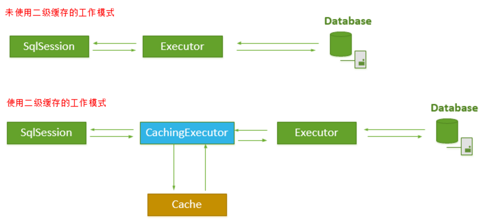

CachingExecutor是Executor的装饰者，以增强Executor的功能，使其具有缓存查询的功能，这里用到了设计模式中的装饰者模式，

#### MyBatis二级缓存的划分

MyBatis并不是简单地对整个Application就只有一个Cache缓存对象，它将缓存划分的更细，**即是Mapper级别的，即每一个Mapper都可以拥有一个Cache对象**，具体如下：

1. **为每一个Mapper分配一个Cache缓存对象（使用节点配置）**

   **MyBatis将Application级别的二级缓存细分到Mapper级别，即对于每一个Mapper.xml,如果在其中使用了 节点，则MyBatis会为这个Mapper创建一个Cache缓存对象**，如下图所示：

   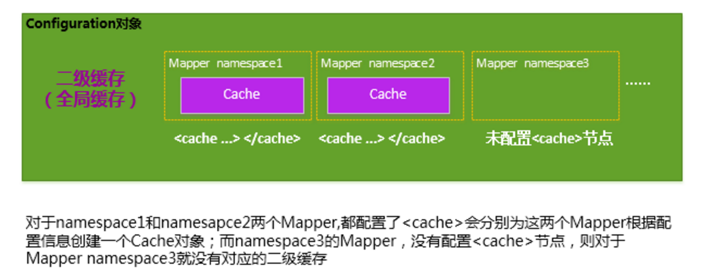

   注：**上述的每一个Cache对象，都会有一个自己所属的namespace命名空间，并且会将Mapper的 namespace作为它们的ID；**

2. **多个Mapper共用一个Cache缓存对象（使用节点配置）**

   如果你想让多个Mapper公用一个Cache的话，**你可以使用节点，来指定你的这个Mapper使用到了哪一个Mapper的Cache缓存**。

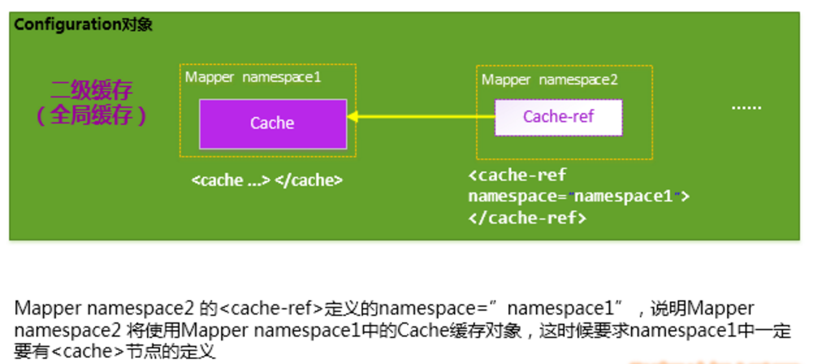

#### 使用二级缓存，必须要具备的条件

MyBatis对二级缓存的支持粒度很细，**它会指定某一条查询语句是否使用二级缓存**。

虽然在Mapper中配置了<cache>,并且为此Mapper分配了Cache对象，**这并不表示我们使用Mapper中定义的查询语句查到的结果都会放置到Cache对象之中**，我们必须指定Mapper中的某条选择语句是否支持缓存，**即如下所示，在 节点中配置useCache="true"，Mapper才会对此Select的查询支持缓存特性，否则，不会对此Select查询，不会经过Cache缓存**。如下所示，Select语句配置了useCache="true"，则表明这条Select语句的查询会使用二级缓存。

```csharp
<select id="selectByMinSalary" resultMap="BaseResultMap" parameterType="java.tank.util.Map" useCache="true">
```

**要想使某条Select查询支持二级缓存，你需要保证：**

1. Mybatis支持二级缓存的总开关，全局配置参数cacheEnabled = true;
2. 该select语句所在的Mapper，配置了<cache>或<cahced-ref>节点，并且有效;
3. 该select语句的参数useCache=true.

### 一级缓存和二级缓存的使用顺序

请注意，如果你的MyBatis使用了二级缓存，并且你的Mapper和select语句也配置使用了二级缓存，那么**在执行select查询的时候，MyBatis会先从二级缓存中取输入，其次才是一级缓存，即MyBatis查询数据的顺序是：二级缓存 ———> 一级缓存 ——> 数据库**。

## 二级缓存实现的选择

**MyBatis对二级缓存的设计非常灵活，它自己内部实现了一系列的Cache缓存实现类，并提供了各种缓存刷新策略如LRU，FIFO等等**；另外，**MyBatis还允许用户自定义Cache接口实现，用户是需要实现org.apache.ibatis.cache.Cache接口，然后将Cache实现类配置在节点的type属性上即可**；除此之外，MyBatis还支持跟第三方内存缓存库如Memecached的集成，总之，使用MyBatis的二级缓存有三个选择:

1. Mybatis自身提供的缓存实现。
2. 用户自定义的Cache接口实现。
3. 跟第三方内存缓存库的集成

## MyBatis自身提供的二级缓存的实现

**MyBatis定义了大量的Cache的装饰器来增强Cache缓存的功能**，如下类图所示。

**对于每个Cache而言，都有一个容量限制，MyBatis各供了各种策略来对Cache缓存的容量进行控制，以及对Cache中的数据进行刷新和置换。MyBatis主要提供了以下几个刷新和置换策略：**

- **LRU：（Least Recently Used),最近最少使用算法**，即如果缓存中容量已经满了，会将缓存中最近最少被使用的缓存记录清除掉，然后添加新的记录
- **FIFO：（First in first out),先进先出算法**，如果缓存中的容量已经满了，那么会将最先进入缓存中的数据清除掉。
- **Scheduled：指定时间间隔清空算法**，该算法会以指定的某一个时间间隔将Cache缓存中的数据清空；

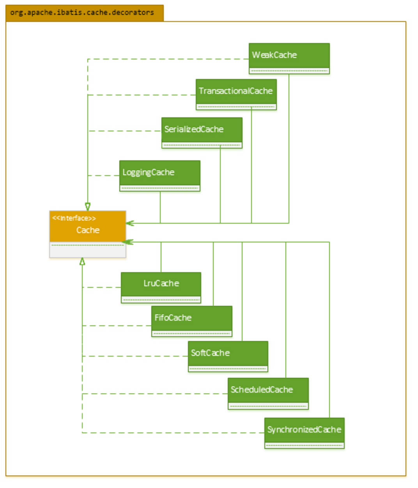

## 当前MyBatis二级缓存的工作机制

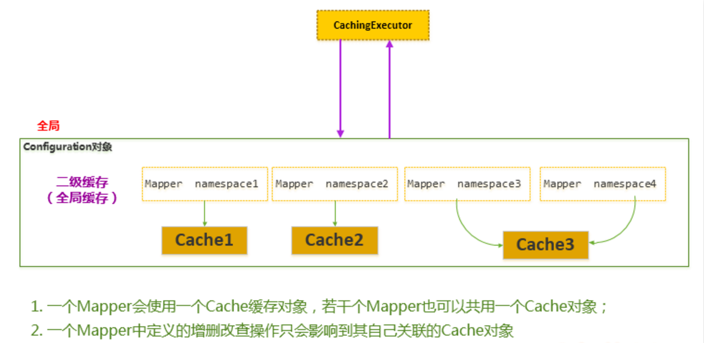

MyBatis二级缓存的一个重要特点：**即松散的Cache缓存管理和维护**。

**一个Mapper中定义的增删改查操作只能影响到自己关联的Cache对象。**如上图所示的Mapper namespace1中定义的若干CRUD语句，产生的缓存只会被放置到相应关联的Cache1中，即Mapper namespace2,namespace3,namespace4 中的CRUD的语句不会影响到Cache1。

**对于某些使用了 join连接的查询，如果其关联的表数据发生了更新，join连接的查询由于先前缓存的原因，导致查询结果和真实数据不同步；**

**最理想的解决方案就是：**

**对于某些表执行了更新(update、delete、insert)操作后，如何去清空跟这些表有关联的查询语句所造成的缓存；**这样，就是以很细的粒度管理MyBatis内部的缓存，使得缓存的使用率和准确率都能大大地提升。


缓存机制：eviction配置缓存机制 flush

## Mybatis连接池

因为底层创建数据库连接的时候需要大量的资源开销，故需要使用连接池来管理连接。以达到数据的快速访问。

### 数据源分类

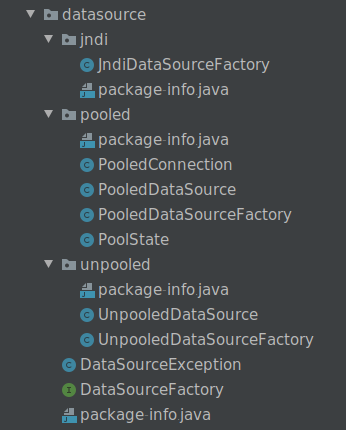

upooled:  不使用连接池的数据源

pooled: 使用连接池的数据源

jndi: 使用JNDI实现的数据源

相应地，MyBatis内部分别定义了实现了java.sql.DataSource接口的UnpooledDataSource，PooledDataSource类来表示UNPOOLED、POOLED类型的数据源。 如下图所示：

```xml
<dataSource type="POOLED">
   <property name="driver" value="com.mysql.cj.jdbc.Driver" />
      <property name="url" value="jdbc:mysql://localhost:3308/mydb?characterEncoding=utf-8" />
      <property name="username" value="root" />
   <property name="password" value="123456" />
</dataSource>
```


1. MyBatis在初始化时，解析此文件，根据<dataSource>的type属性来创建相应类型的的数据源DataSource，即：PooledDataSource连接池
   - type=”POOLED” ：MyBatis会创建PooledDataSource实例
   - type=”UNPOOLED” ：MyBatis会创建UnpooledDataSource实例
   - type=”JNDI”   ：MyBatis会从JNDI服务上查找DataSource实例，然后返回使用
2. 顺便说一下，MyBatis是通过工厂模式来创建数据源DataSource对象的，MyBatis定义了抽象的工厂接口:org.apache.ibatis.datasource.DataSourceFactory,通过其getDataSource()方法返回数据源DataSource：
3. MyBatis创建了DataSource实例后，会将其放到Configuration对象内的Environment对象中， 供以后使用。

我们是使用PooledDataSource的getConnection()方法来返回Connection对象的，

**PooledDataSource将java.sql.Connection对象包裹成PooledConnection对象放到了PoolState类型的容器中维护**。Mybatis将连接池中的PooledConnection分为两种状态：**空闲状态（idle）和活动状态(active)**，这两种状态的PooledConnection对象分别被存储到PoolState容器内的**idleConnections和activeConnections两个List集合中**：

- **idleConnections：空闲(idle)状态PooledConnection对象被放置到此集合中**，表示当前闲置的没有被使用的PooledConnection集合，调用PooledDataSource的getConnection()方法时，**会优先从此集合中取PooledConnection对象**。当用完一个java.sql.Connection对象时，MyBatis会将其包裹成PooledConnection对象放到此集合中。
- **activeConnections：活动(active)状态的PooledConnection对象被放置到名为activeConnections的ArrayList中**，表示当前正在被使用的PooledConnection集合，调用PooledDataSource的getConnection()方法时，**会优先从idleConnections集合中取PooledConnection对象,如果没有，则看此集合是否已满，如果未满，PooledDataSource会创建出一个PooledConnection，添加到此集合中，并返回**。

**PoolState连接池的大致结构如下所示：**

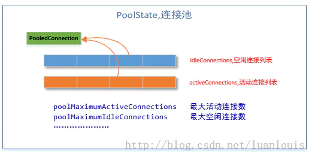

```java
@Override
public Connection getConnection() throws SQLException {
  return popConnection(dataSource.getUsername(), dataSource.getPassword()).getProxyConnection();
}

@Override
public Connection getConnection(String username, String password) throws SQLException {
  return popConnection(username, password).getProxyConnection();
}
```

上述的popConnection()方法，会**从连接池中返回一个可用的PooledConnection对象，然后再调用getProxyConnection()方法最终返回Conection对象**。

**现在让我们看一下popConnection()方法到底做了什么：**

1. **先看是否有空闲(idle)状态下的PooledConnection对象**，如果有，就直接返回一个可用的PooledConnection对象；否则进行第2步。

2. **查看活动状态的PooledConnection池activeConnections是否已满；**如果没有满，则创建一个新的PooledConnection对象，然后放到activeConnections池中，然后返回此PooledConnection对象；否则进行第三步；
3. **看最先进入activeConnections池中的PooledConnection对象是否已经过期：**如果已经过期，从activeConnections池中移除此对象，然后创建一个新的PooledConnection对象，添加到activeConnections中，然后将此对象返回；否则进行第4步。
4. **线程等待，**循环至第1步

```java
private PooledConnection popConnection(String username, String password) throws SQLException {
  boolean countedWait = false;
  PooledConnection conn = null;
  long t = System.currentTimeMillis();
  int localBadConnectionCount = 0
  while (conn == null) {
    synchronized (state) {
      if (!state.idleConnections.isEmpty()) {
        // Pool has available connection
        conn = state.idleConnections.remove(0);
        if (log.isDebugEnabled()) {
          log.debug("Checked out connection " + conn.getRealHashCode() + " from pool.");
        }
      } else {
        // Pool does not have available connection
        if (state.activeConnections.size() < poolMaximumActiveConnections) {
          // Can create new connection
          conn = new PooledConnection(dataSource.getConnection(), this);
          if (log.isDebugEnabled()) {
            log.debug("Created connection " + conn.getRealHashCode() + ".");
          }
        } else {
          // Cannot create new connection
          PooledConnection oldestActiveConnection = state.activeConnections.get(0);
          long longestCheckoutTime = oldestActiveConnection.getCheckoutTime();
          if (longestCheckoutTime > poolMaximumCheckoutTime) {
            // Can claim overdue connection
            state.claimedOverdueConnectionCount++;
            state.accumulatedCheckoutTimeOfOverdueConnections += longestCheckoutTime;
            state.accumulatedCheckoutTime += longestCheckoutTime;
            state.activeConnections.remove(oldestActiveConnection);
            if (!oldestActiveConnection.getRealConnection().getAutoCommit()) {
              try {
                oldestActiveConnection.getRealConnection().rollback();
              } catch (SQLException e) {
                /*
                   Just log a message for debug and continue to execute the following
                   statement like nothing happened.
                   Wrap the bad connection with a new PooledConnection, this will help
                   to not interrupt current executing thread and give current thread a
                   chance to join the next competition for another valid/good database
                   connection. At the end of this loop, bad {@link @conn} will be set as null.
                 */
                log.debug("Bad connection. Could not roll back");
              }
            }
            conn = new PooledConnection(oldestActiveConnection.getRealConnection(), this);
            conn.setCreatedTimestamp(oldestActiveConnection.getCreatedTimestamp());
            conn.setLastUsedTimestamp(oldestActiveConnection.getLastUsedTimestamp());
            oldestActiveConnection.invalidate();
            if (log.isDebugEnabled()) {
              log.debug("Claimed overdue connection " + conn.getRealHashCode() + ".");
            }
          } else {
            // Must wait
            try {
              if (!countedWait) {
                state.hadToWaitCount++;
                countedWait = true;
              }
              if (log.isDebugEnabled()) {
                log.debug("Waiting as long as " + poolTimeToWait + " milliseconds for connection.");
              }
              long wt = System.currentTimeMillis();
              state.wait(poolTimeToWait);
              state.accumulatedWaitTime += System.currentTimeMillis() - wt;
            } catch (InterruptedException e) {
              break;
            }
          }
        }
      }
      if (conn != null) {
        // ping to server and check the connection is valid or not
        if (conn.isValid()) {
          if (!conn.getRealConnection().getAutoCommit()) {
            conn.getRealConnection().rollback();
          }
          conn.setConnectionTypeCode(assembleConnectionTypeCode(dataSource.getUrl(), username, password));
          conn.setCheckoutTimestamp(System.currentTimeMillis());
          conn.setLastUsedTimestamp(System.currentTimeMillis());
          state.activeConnections.add(conn);
          state.requestCount++;
          state.accumulatedRequestTime += System.currentTimeMillis() - t;
        } else {
          if (log.isDebugEnabled()) {
            log.debug("A bad connection (" + conn.getRealHashCode() + ") was returned from the pool, getting another connection.");
          }
          state.badConnectionCount++;
          localBadConnectionCount++;
          conn = null;
          if (localBadConnectionCount > (poolMaximumIdleConnections + poolMaximumLocalBadConnectionTolerance)) {
            if (log.isDebugEnabled()) {
              log.debug("PooledDataSource: Could not get a good connection to the database.");
            }
            throw new SQLException("PooledDataSource: Could not get a good connection to the database.");
          }
        }
      }
    }
  }
  if (conn == null) {
    if (log.isDebugEnabled()) {
      log.debug("PooledDataSource: Unknown severe error condition.  The connection pool returned a null connection.");
    }
    throw new SQLException("PooledDataSource: Unknown severe error condition.  The connection pool returned a null connection.");
  }
  return conn;
}
```

流程图：

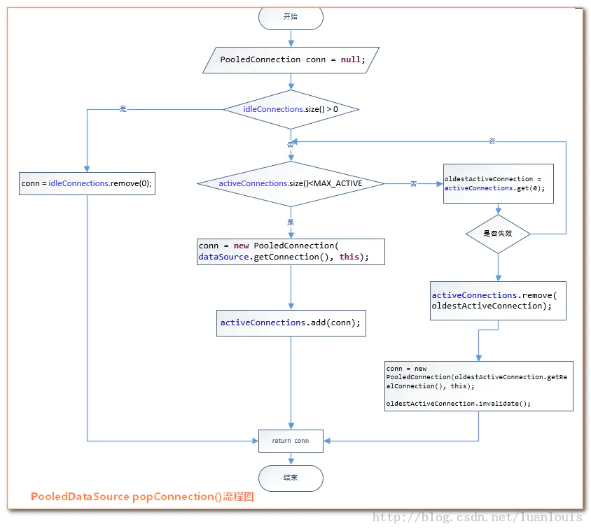

如上所示,对于PooledDataSource的getConnection()方法内，**先是调用类PooledDataSource的popConnection()方法返回了一个PooledConnection对象，然后调用了PooledConnection的getProxyConnection()来返回Connection对象**。

**那么，如果我们使用了连接池，我们在用完了Connection对象时，需要将它放在连接池中，该怎样做呢？**

为了和一般的使用Conneciton对象的方式保持一致，我们希望**当Connection使用完后，调用.close()方法，而实际上Connection资源并没有被释放，而实际上被添加到了连接池中**。这样可以做到吗？答案是可以。上述的要求从另外一个角度来描述就是：**能否提供一种机制，让我们知道Connection对象调用了什么方法，从而根据不同的方法自定义相应的处理机制。恰好代理机制就可以完成上述要求**.

**怎样实现Connection对象调用了close()方法，而实际是将其添加到连接池中：**

这是要使用代理模式，为真正的Connection对象创建一个代理对象，代理对象所有的方法都是调用相应的真正Connection对象的方法实现。**当代理对象执行close()方法时，要特殊处理，不调用真正Connection对象的close()方法，而是将Connection对象添加到连接池中**。

MyBatis的PooledDataSource的PoolState内部维护的对象是PooledConnection类型的对象，而**PooledConnection则是对真正的数据库连接java.sql.Connection实例对象的包裹器**。

**PooledConnection对象内持有一个真正的数据库连接java.sql.Connection实例对象和一个java.sql.Connection的代理**，其部分定义如下：

```java
class PooledConnection implements InvocationHandler {  
      //......  
      //所创建它的datasource引用  
      private PooledDataSource dataSource;  
      //真正的Connection对象  
      private Connection realConnection;  
      //代理自己的代理Connection  
      private Connection proxyConnection;  
      //......  
}  
```

**PooledConenction实现了InvocationHandler接口**，并且，proxyConnection对象也是根据这个它来生成的代理对象：

```java
public PooledConnection(Connection connection, PooledDataSource dataSource) {  
     this.hashCode = connection.hashCode();  
     this.realConnection = connection;  
     this.dataSource = dataSource;  
     this.createdTimestamp = System.currentTimeMillis();  
     this.lastUsedTimestamp = System.currentTimeMillis();  
     this.valid = true;  
     this.proxyConnection = (Connection) Proxy.newProxyInstance(Connection.class.getClassLoader(), IFACES, this);  
} 
```

实际上，我们调用PooledDataSource的getConnection()方法返回的就是这个proxyConnection对象。**当我们调用此proxyConnection对象上的任何方法时，都会调用PooledConnection对象内invoke()方法**。

PooledConnection类中的invoke()方法定义：

```java
public Object invoke(Object proxy, Method method, Object[] args) throws Throwable {
  String methodName = method.getName();
     //当调用关闭的时候，回收此Connection到PooledDataSource中  
  if (CLOSE.equals(methodName)) {
    dataSource.pushConnection(this);
    return null;
  }
  try {
    if (!Object.class.equals(method.getDeclaringClass())) {
      // issue #579 toString() should never fail
      // throw an SQLException instead of a Runtime
      checkConnection();
    }
    return method.invoke(realConnection, args);
  } catch (Throwable t) {
    throw ExceptionUtil.unwrapThrowable(t);
  }

}
```


### JNDI类型的数据源

对于JNDI类型的数据源DataSource的获取就比较简单，**MyBatis定义了一个JndiDataSourceFactory工厂来创建通过JNDI形式生成的DataSource**。下面让我们看一下JndiDataSourceFactory的关键代码：

```java

if (properties.containsKey(INITIAL_CONTEXT) && properties.containsKey(DATA_SOURCE))  
{  
    //从JNDI上下文中找到DataSource并返回  
    Context ctx = (Context) initCtx.lookup(properties.getProperty(INITIAL_CONTEXT));  
    dataSource = (DataSource) ctx.lookup(properties.getProperty(DATA_SOURCE));  
}  
else if (properties.containsKey(DATA_SOURCE))  
{  
    //从JNDI上下文中找到DataSource并返回  
    dataSource = (DataSource) initCtx.lookup(properties.getProperty(DATA_SOURCE));  
} 
```

多数据源配置方案：

https://juejin.im/post/5d773babe51d4561ba48fe68

https://juejin.im/post/5e65fbed51882549122abda0

设置多数据源的两种方式：

1. 这个很容易理解,我们在使用 @MapperScan 指定了 不同的扫面包下面的 mapper层接口 使用不同的数据源.就是那个sqlSessionTemplateRef参数,所以说**方式一**是在mapper层接口被代理之前就确定了数据源,不同的包的mapper接口使用不同的数据源,非常符合我上面提到的**场景一**使用。
2. 这个就有点意思了,问题就在于我们现在创建的 sqlSessionFactory 是使用了我们实现的DataSource 就是AbstractRoutingDataSource，AbstractRoutingDataSource 这个其实从名字也能看出点不一样的地方 路由先说先我当时看代码时候的结题思路：
   - 首先我要看看mybatis执行的时候吃使用的那个数据源创建的 Connection 因为你操作数据源不就得使用 jdbc的连接吗
   - 然后看看这或者连接之前经历了什么,是实现的数据源切换

```java
//org.apache.ibatis.transaction.managed.ManagedTransaction.openConnection()
//看下这个方法
protected void openConnection() throws SQLException {
    if (log.isDebugEnabled()) {
      log.debug("Opening JDBC Connection");
    }
    //根据数据源 获取 连接
    //我们现在的数据源为 AbstractRoutingDataSource
    //那就去看看AbstractRoutingDataSource.getConnection();
    this.connection = this.dataSource.getConnection();
    if (this.level != null) {
      this.connection.setTransactionIsolation(this.level.getLevel());
    }
  }
@Override
public Connection getConnection() throws SQLException {
    //关键代码 determineTargetDataSource() 
    //啥意思呢  就是这个方法返回一个具体可执行的数据源 然后再去调用数据源的 getConnection()
    //由此可得知 determineTargetDataSource() 就是我们动态获取数据源的额关键
	return determineTargetDataSource().getConnection();
}
```


```java
protected DataSource determineTargetDataSource() {
	Assert.notNull(this.resolvedDataSources, "DataSource router not initialized");
	//记得这个方法吧 我们重写的方法,能获取当当前执行的方法 要使用的数据源的 标志
	Object lookupKey = determineCurrentLookupKey();
	//这里获取数据源  你可能会问 resolvedDataSources 是个啥 好吧看下下面的afterPropertiesSet()
	DataSource dataSource = this.resolvedDataSources.get(lookupKey);
	if (dataSource == null && (this.lenientFallback || lookupKey == null)) {
		dataSource = this.resolvedDefaultDataSource;
	}
	if (dataSource == null) {
		throw new IllegalStateException("Cannot determine target DataSource for lookup key [" + lookupKey + "]");
	}
	//返回切换的DataSource
	return dataSource;
}

//初始化方法
@Override
public void afterPropertiesSet() {
	if (this.targetDataSources == null) {
		throw new IllegalArgumentException("Property 'targetDataSources' is required");
	}
	this.resolvedDataSources = new HashMap<>(this.targetDataSources.size());
	//把我们设置的 targetDataSources 放入 resolvedDataSources中
	this.targetDataSources.forEach((key, value) -> {
		Object lookupKey = resolveSpecifiedLookupKey(key);
		DataSource dataSource = resolveSpecifiedDataSource(value);
		this.resolvedDataSources.put(lookupKey, dataSource);
	});
	if (this.defaultTargetDataSource != null) {
		this.resolvedDefaultDataSource = resolveSpecifiedDataSource(this.defaultTargetDataSource);
	}
}
```


## Mybatis事务

概述：**创建（create）、提交（commit）、回滚（rollback）、关闭（close）**。

**MyBatis的事务管理分为两种形式：**

1. 使用JDBC的事务管理机制：即利用了java.sql.Connection对象完成对事务的提交，回滚，关闭等。
2. 使用MANAGED的事务管理机制：这种机制Mybatis自身不会去实现事务管理，而是让程序的容器来实现对事务的管理。

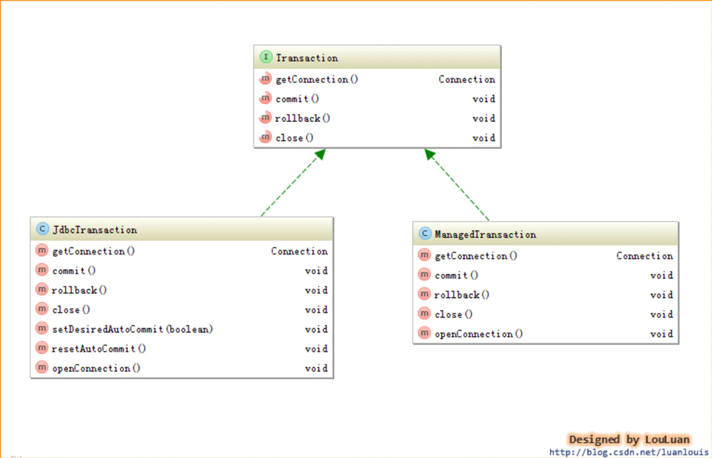

### 事务的配置、创建和使用

1、**事务的配置**

可以使用配置文件制定：

```xml
<environments default="development">
    <environment id="development">
        <!-- 使用jdbc事务管理 -->
        <transactionManager type="JDBC" />
         <!-- 使用外接整合的程序来进行事务管理 -->
          <!--<transactionManager type="MANAGED" />-->
        <!-- 数据库连接池 -->
        <dataSource type="POOLED">
            <property name="driver" value="com.mysql.cj.jdbc.Driver" />
            <property name="url"
                      value="jdbc:mysql://localhost:3308/mydb?characterEncoding=utf-8" />
            <property name="username" value="root" />
            <property name="password" value="123456" />
        </dataSource>
    </environment>
</environments>
```

<environment>节点定义了连接某个数据库的信息，**其子节点 的type会决定我们用什么类型的事务管理机制**。

2、**事务工厂的创建**

**MyBatis事务的创建是交给TransactionFactory 事务工厂来创建的**，如果我们将<transactionManager>的type 配置为"JDBC",那么，在MyBatis初始化解析<environment>节点时，会根据type="JDBC"创建一个JdbcTransactionFactory工厂，其源码如下：

```java
//根据TransactionFactory和DataSource创建一个Environment对象
private void environmentsElement(XNode context) throws Exception {
  if (context != null) {
    if (environment == null) {
      environment = context.getStringAttribute("default");
    }
    for (XNode child : context.getChildren()) {
      String id = child.getStringAttribute("id");
      if (isSpecifiedEnvironment(id)) {
        TransactionFactory txFactory = transactionManagerElement(child.evalNode("transactionManager"));
        DataSourceFactory dsFactory = dataSourceElement(child.evalNode("dataSource"));
        DataSource dataSource = dsFactory.getDataSource();
        Environment.Builder environmentBuilder = new Environment.Builder(id)
            .transactionFactory(txFactory)
            .dataSource(dataSource);
        configuration.setEnvironment(environmentBuilder.build());
      }
    }
  }
}
```

```java
//解析transactionManager节点
private TransactionFactory transactionManagerElement(XNode context) throws Exception {
  if (context != null) {
      
   //根据节点type类型，创建对于的事务管理TransactionFactory实例
    String type = context.getStringAttribute("type");
    Properties props = context.getChildrenAsProperties();
    TransactionFactory factory = (TransactionFactory) resolveClass(type).getDeclaredConstructor().newInstance();
    factory.setProperties(props);
    return factory;
  }
  throw new BuilderException("Environment declaration requires a TransactionFactory.");
}
```

**Environment表示着一个数据库的连接，生成后的Environment对象会被设置到Configuration实例中**，以供后续的使用。

3、**事务工厂TransactionFactory**

事务工厂Transaction定义了创建Transaction的两个方法：**一个是通过指定的Connection对象创建Transaction，另外是通过数据源DataSource来创建Transaction**。与JDBC 和MANAGED两种Transaction相对应，TransactionFactory有两个对应的实现的子类：


4、**事务Transaction的创建**

通过事务工厂TransactionFactory很容易获取到Transaction对象实例。我们以JdbcTransaction为例，看一下JdbcTransactionFactory是怎样生成JdbcTransaction的，代码如下：

```java
public class JdbcTransactionFactory implements TransactionFactory {

  @Override
  public Transaction newTransaction(Connection conn) {
    return new JdbcTransaction(conn);
  }

  @Override
  public Transaction newTransaction(DataSource ds, TransactionIsolationLevel level, boolean autoCommit) {
    return new JdbcTransaction(ds, level, autoCommit);
  }
}
```

如上说是，**JdbcTransactionFactory会创建JDBC类型的Transaction，即JdbcTransaction。类似地，ManagedTransactionFactory也会创建ManagedTransaction**。下面我们会分别深入JdbcTranaction 和ManagedTransaction，看它们到底是怎样实现事务管理的。

5、**JdbcTransaction**

**JdbcTransaction直接使用JDBC的提交和回滚事务管理机制。**它依赖与从dataSource中取得的连接connection 来管理transaction 的作用域，connection对象的获取被延迟到调用getConnection()方法。如果autocommit设置为on，开启状态的话，它会忽略commit和rollback。

**就是JdbcTransaction是使用的java.sql.Connection 上的commit和rollback功能**，JdbcTransaction只是相当于对java.sql.Connection事务处理进行了一次包装（wrapper），**Transaction的事务管理都是通过java.sql.Connection实现的**。JdbcTransaction的代码实现如下：

```java
public class JdbcTransaction implements Transaction {

  private static final Log log = LogFactory.getLog(JdbcTransaction.class);

  protected Connection connection;
  protected DataSource dataSource;
  protected TransactionIsolationLevel level;
  protected boolean autoCommit;

  public JdbcTransaction(DataSource ds, TransactionIsolationLevel desiredLevel, boolean desiredAutoCommit) {
    dataSource = ds;
    level = desiredLevel;
    autoCommit = desiredAutoCommit;
  }

  public JdbcTransaction(Connection connection) {
    this.connection = connection;
  }

  @Override
  public Connection getConnection() throws SQLException {
    if (connection == null) {
      openConnection();
    }
    return connection;
  }

  @Override
  public void commit() throws SQLException {
    if (connection != null && !connection.getAutoCommit()) {
      if (log.isDebugEnabled()) {
        log.debug("Committing JDBC Connection [" + connection + "]");
      }
      connection.commit();
    }
  }

  @Override
  public void rollback() throws SQLException {
    if (connection != null && !connection.getAutoCommit()) {
      if (log.isDebugEnabled()) {
        log.debug("Rolling back JDBC Connection [" + connection + "]");
      }
      connection.rollback();
    }
  }

  @Override
  public void close() throws SQLException {
    if (connection != null) {
      resetAutoCommit();
      if (log.isDebugEnabled()) {
        log.debug("Closing JDBC Connection [" + connection + "]");
      }
      connection.close();
    }
  }

  protected void setDesiredAutoCommit(boolean desiredAutoCommit) {
    try {
      if (connection.getAutoCommit() != desiredAutoCommit) {
        if (log.isDebugEnabled()) {
          log.debug("Setting autocommit to " + desiredAutoCommit + " on JDBC Connection [" + connection + "]");
        }
        connection.setAutoCommit(desiredAutoCommit);
      }
    } catch (SQLException e) {
      // Only a very poorly implemented driver would fail here,
      // and there's not much we can do about that.
      throw new TransactionException("Error configuring AutoCommit.  "
          + "Your driver may not support getAutoCommit() or setAutoCommit(). "
          + "Requested setting: " + desiredAutoCommit + ".  Cause: " + e, e);
    }
  }

  protected void resetAutoCommit() {
    try {
      if (!connection.getAutoCommit()) {
        // MyBatis does not call commit/rollback on a connection if just selects were performed.
        // Some databases start transactions with select statements
        // and they mandate a commit/rollback before closing the connection.
        // A workaround is setting the autocommit to true before closing the connection.
        // Sybase throws an exception here.
        if (log.isDebugEnabled()) {
          log.debug("Resetting autocommit to true on JDBC Connection [" + connection + "]");
        }
        connection.setAutoCommit(true);
      }
    } catch (SQLException e) {
      if (log.isDebugEnabled()) {
        log.debug("Error resetting autocommit to true "
            + "before closing the connection.  Cause: " + e);
      }
    }
  }

  protected void openConnection() throws SQLException {
    if (log.isDebugEnabled()) {
      log.debug("Opening JDBC Connection");
    }
    connection = dataSource.getConnection();
    if (level != null) {
      connection.setTransactionIsolation(level.getLevel());
    }
    setDesiredAutoCommit(autoCommit);
  }

  @Override
  public Integer getTimeout() throws SQLException {
    return null;
  }

}
```

6、**ManagedTransaction**

ManagedTransaction让容器来管理事务Transaction的整个生命周期，意思就是说，**使用ManagedTransaction的commit和rollback功能不会对事务有任何的影响，它什么都不会做，它将事务管理的权利移交给了容器来实现**。看如下Managed的实现代码大家就会一目了然：

```java
public class ManagedTransaction implements Transaction {

  private static final Log log = LogFactory.getLog(ManagedTransaction.class);

  private DataSource dataSource;
  private TransactionIsolationLevel level;
  private Connection connection;
  private final boolean closeConnection;

  public ManagedTransaction(Connection connection, boolean closeConnection) {
    this.connection = connection;
    this.closeConnection = closeConnection;
  }

  public ManagedTransaction(DataSource ds, TransactionIsolationLevel level, boolean closeConnection) {
    this.dataSource = ds;
    this.level = level;
    this.closeConnection = closeConnection;
  }

  @Override
  public Connection getConnection() throws SQLException {
    if (this.connection == null) {
      openConnection();
    }
    return this.connection;
  }

  @Override
  public void commit() throws SQLException {
    // Does nothing
  }

  @Override
  public void rollback() throws SQLException {
    // Does nothing
  }

  @Override
  public void close() throws SQLException {
    if (this.closeConnection && this.connection != null) {
      if (log.isDebugEnabled()) {
        log.debug("Closing JDBC Connection [" + this.connection + "]");
      }
      this.connection.close();
    }
  }

  protected void openConnection() throws SQLException {
    if (log.isDebugEnabled()) {
      log.debug("Opening JDBC Connection");
    }
    this.connection = this.dataSource.getConnection();
    if (this.level != null) {
      this.connection.setTransactionIsolation(this.level.getLevel());
    }
  }

  @Override
  public Integer getTimeout() throws SQLException {
    return null;
  }

}
```

注意：**如果我们使用MyBatis构建本地程序，即不是WEB程序，若将type设置成"MANAGED"，那么，我们执行的任何update操作，即使我们最后执行了commit操作，数据也不会保留，不会对数据库造成任何影响**。因为我们将MyBatis配置成了“MANAGED”，**即MyBatis自己不管理事务，而我们又是运行的本地程序，没有事务管理功能**，所以对数据库的update操作都是无效的。


## Mybatis日志

日志打印技术

为什么要用该技术

架构日志:

1. 不能使用具体实现的日志，如jul，log4j


日志切换：jcl:commons-logging

如果有log4j的jar包，就是用log4j打印，没有的话使用jul。

日志整合：slf4j:解决了日志切换和整合，基本上支持主流的日志实现。

slf4j:默认打印不了日志，smple log facate for java ,需要相应的日志实现facate

绑定器：log4j,jul,jcl

桥接器：用来统一输出日志格式

mybatis 选取日志原理：

有配置，选择配置的，没有的话就选择

## Mybatis插件

自定义插件：

```java
/**
 * type：StatementHandler:拦截的对象，method：拦截的方法是prepare方法，args：传入的参数类型args是，Connection和Integer
 */
@Intercepts(@Signature(type = StatementHandler.class,method = "prepare",args = {Connection.class,Integer.class}))
public class MyPagePlugin implements Interceptor {

    private  String databaseType;
    private  String pageSqlId;

    public String getDatabaseType() {
        return databaseType;
    }

    public void setDatabaseType(String databaseType) {
        this.databaseType = databaseType;
    }

    public String getPageSqlId() {
        return pageSqlId;
    }

    public void setPageSqlId(String pageSqlId) {
        this.pageSqlId = pageSqlId;
    }

    //需要自己实现的逻辑
    @Override
    public Object intercept(Invocation invocation) throws Throwable {
        if(!(invocation.getTarget() instanceof StatementHandler))
            return null;
        StatementHandler target = (StatementHandler) invocation.getTarget();
        //需要拿到StatementHandler对象里面的delegate,再从delegate对象里拿到mappedStatement，然后才能得到对象，
        // 该方法太麻烦
        //需要下面方法
        MetaObject metaObject = MetaObject.forObject(target, SystemMetaObject.DEFAULT_OBJECT_FACTORY, SystemMetaObject.DEFAULT_OBJECT_WRAPPER_FACTORY, new DefaultReflectorFactory());
        String sqlId  = (String) metaObject.getValue("delegate.mappedStatement.id");
        //1.判断是否有分页
        //2.拿到连接
        //3.预编译SQL语句，拿到绑定的sql语句
        //4.执行count语句，怎么返回需要执行的count结果呢？ 就是使用 select count(0) from (sqlId(执行的sql语句))
        //重写sql select * from test limit start ,limit
        //2.1 如何知道start和limit
        //2.2 拼接 start 和 limit
        //2.3 替换原来绑定的sql
        //
        if(sqlId.matches(pageSqlId)){
            ParameterHandler parameterHandler = target.getParameterHandler();
            //拿到原来的sql
            String sql = target.getBoundSql().getSql();
            //sql= select * from  product    select count(0) from (select * from  product) as a
            //select * from luban_product where name = #{name}
            //执行一条count语句
            //拿到数据库连接对象
            Connection connection = (Connection) invocation.getArgs()[0];
            String countSql = "select count(0) from ("+ sql+")a";
            System.out.println(countSql);
            //重新渲染参数
            PreparedStatement preparedStatement = connection.prepareStatement(countSql);
            //条件交给mybatis
            parameterHandler.setParameters(preparedStatement);
            ResultSet resultSet = preparedStatement.executeQuery();
            int count = 0;
            if (resultSet.next()){
                count = resultSet.getInt(1);
            }
            resultSet.close();
            preparedStatement.close();
            Map<String, Object> parameterObject = (Map<String, Object>) parameterHandler.getParameterObject();
            //limit  page
            PageUtil pageUtil = (PageUtil) parameterObject.get("page");
            //limit 1 ,10  十条数据   总共可能有100   count 要的是 后面的100
            pageUtil.setCount(count);
            String pageSql = getPageSql(sql, pageUtil);
            metaObject.setValue("delegate.boundSql.sql",pageSql);
            System.out.println(pageSql);
        }
        return null;
    }
    public String getPageSql(String sql,PageUtil pageUtil){
        if(databaseType.equals("mysql")){
            return sql+" limit "+pageUtil.getStart()+","+pageUtil.getLimit();
        }else if(databaseType.equals("oracle")){
            //拼接oracle的分语句
        }

        return sql+" limit "+pageUtil.getStart()+","+pageUtil.getLimit();
    }
    //需要你返回一个动态代理后的对象  target :StatementHandler
    @Override
    public Object plugin(Object target) {

        return Plugin.wrap(target,this);
    }

    @Override
    public void setProperties(Properties properties) {

    }
}
```

## Mybatis总结

spring整合mybatis一级缓存失效原因：因为每次调用完dao方法就直接销毁

如果开启了事务，一级缓存就会生效：因为开启了事务，执行完dao就不会销毁，因为一旦销毁，事务也就销毁了

因为开启了事务，spring是知道你需要什么时候需要结束的。

2.二级缓存需要注意的点：

​	二级缓存里的数据不能存那种一直累加到很大的数据

​	二级缓存是基于命令空间来的

​	是最好


当你项目中会有多个命名空间操作同一个表时，最好不要用二级缓存。