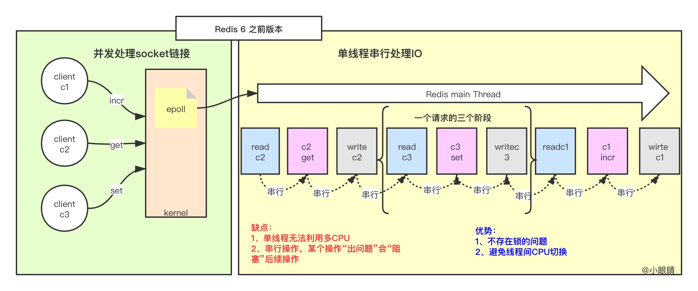
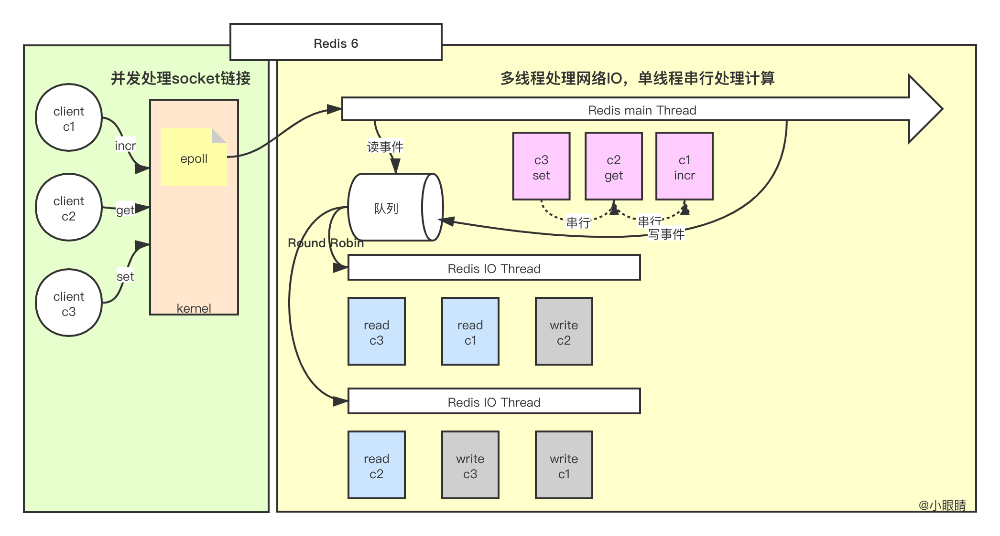
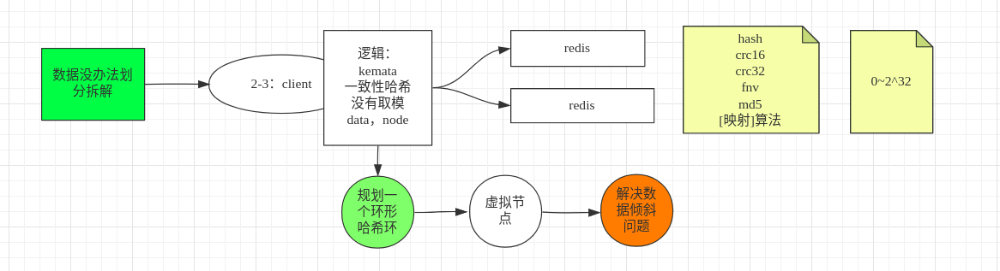
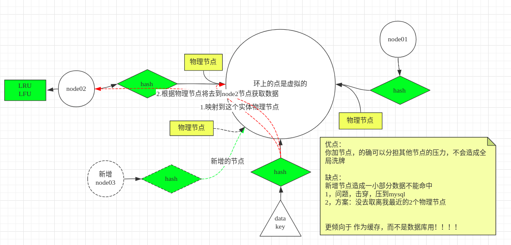
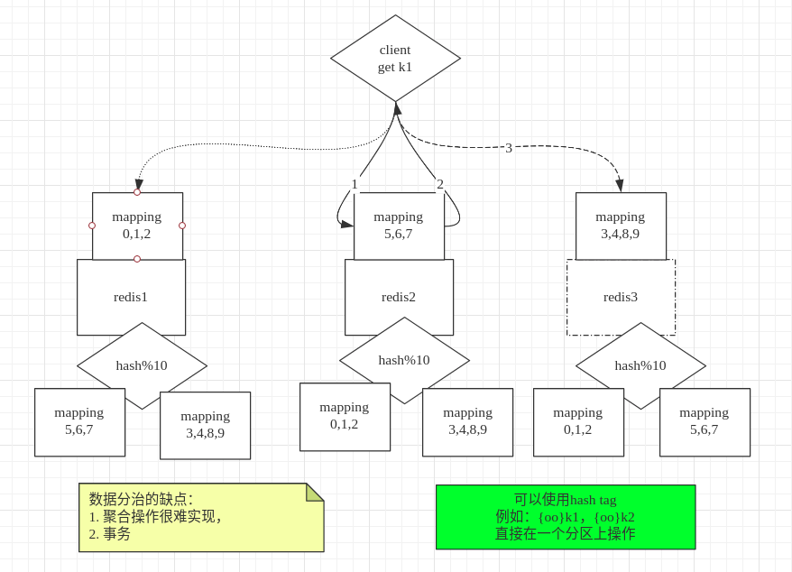
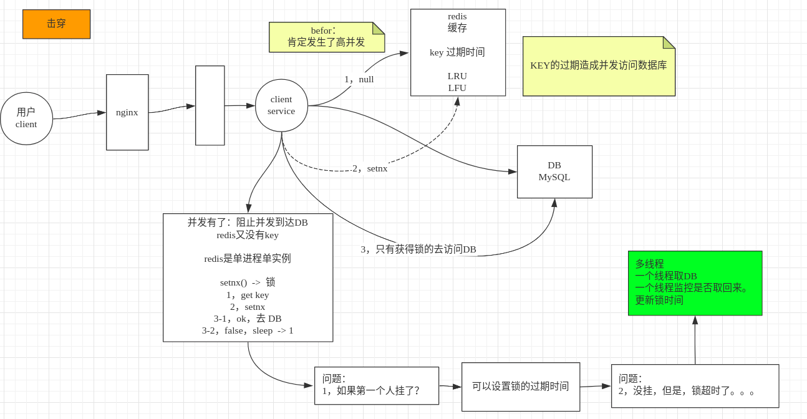
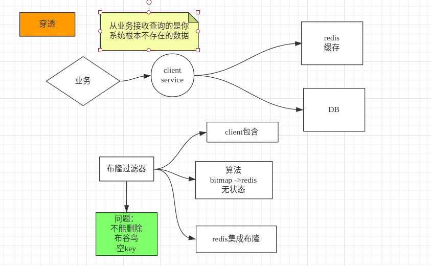
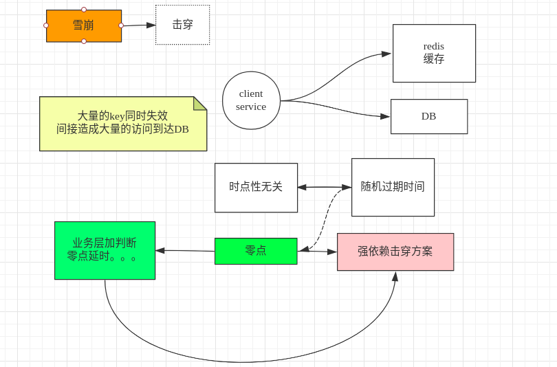

 INCRBY key incrementRedis:

问题：

1. redis为什么是key，value的，为什么不是支持SQL的
2. redis是多线程还是单线程，（回答单线程的可以回家了...）
3. redis的持久化开启热RDB和AOF下重启服务是如何加载的？（10个9个人会答错）
4. redis如果做集群如何规划？AKF/CAP如何实现和设计的？
5. 10万用户一年365天登陆情况如何用redis存储，并快速检索任意时间窗内的活跃用户？
6. redis的5中value类型用过几种？能举例吗？
7. 100万并发4G数据，10万并发400G数据，如何设计redis存储方式？


学习目录：

1、redis的前世今生

2、redis为什么是key，value的，为什么不是支持SQL的

redis db 写同步？

Value是 五种类型：

本地方法：计算向数据移动，I/O优化

整体模型是串行化，原子：并行 和 串行 谁更优？

分布式，一致性，CAP？一致性，可用性 ，分区容错性

3、redis的NIO&线程模型

4、redis是多线程还是但线程？

worker是单线程， I/O是多线程的，支持并发，连接数很多，在Linux是使用的epoll多路，


5、redis5.x的安装部署方式

6、redis的5大数据类型

7、10万用户一年365天登陆情况如何用redis存储，并快速检索任意时间窗内的活跃用户？

使用bitset 设置哪天登录了set一次，然后通过bitcount获取记录为1的次数，Strlen才46位

8、细节见真知：计算向数据移动、而非数据向计算移动

9、linux系统的支持：fork、copy on write

redis 6.x以后IO是多路

mencached：是key，value类型，都是value只支持String类型

JSON可以表示任何数据。

String ：

- 字符串操作 STRLEN key1 取的是字节数‘

  使用场景：session，kv缓存，数值计数器，fs文件系统（小文件系统，）内存

- 数值操作

- 二进制位 -> bitmap -> 什么二进制？如何操作二进制？

  - 二进制：

List：

Hash：

Set：

Sorted Set:

zset:

epoll:多路复用。也是一种NIO。

为什么要出现多路复用：

```
JVM：一个线程的成本大概1M。1.线程多了cpu调度成本浪费 2.内存成本
```


用户空间和内核空间提供了共享空间，

共享空间：

- 其中包括红黑树
- 链表

**顺序性**：每个连接内的命令是顺序处理的

Hbase：二进制安全的

redis：也是二进制安全的

## DB-Engines [DataBase](https://db-engines.com/en/)

# 什么是Reids？

Redis is an open source (BSD licensed), in-memory data structure store, used as a database, cache and message broker. It supports data structures such as strings, hashes, lists, sets, sorted sets with range queries, bitmaps, hyperloglogs, geospatial indexes with radius queries and streams. Redis has built-in replication, Lua scripting, LRU eviction, transactions and different levels of on-disk persistence, and provides high availability via Redis Sentinel and automatic partitioning with Redis Cluster.

译文：

Redis 是一个开源（BSD许可）的，内存中的数据结构存储系统，它可以用作数据库、缓存和消息中间件。 它支持多种类型的数据结构，如 [字符串（strings）](http://www.redis.cn/topics/data-types-intro.html#strings)， [散列（hashes）](http://www.redis.cn/topics/data-types-intro.html#hashes)， [列表（lists）](http://www.redis.cn/topics/data-types-intro.html#lists)， [集合（sets）](http://www.redis.cn/topics/data-types-intro.html#sets)， [有序集合（sorted sets）](http://www.redis.cn/topics/data-types-intro.html#sorted-sets) 与范围查询， [bitmaps](http://www.redis.cn/topics/data-types-intro.html#bitmaps)， [hyperloglogs](http://www.redis.cn/topics/data-types-intro.html#hyperloglogs) 和 [地理空间（geospatial）](http://www.redis.cn/commands/geoadd.html) 索引半径查询。 Redis 内置了 [复制（replication）](http://www.redis.cn/topics/replication.html)，[LUA脚本（Lua scripting）](http://www.redis.cn/commands/eval.html)， [LRU驱动事件（LRU eviction）](http://www.redis.cn/topics/lru-cache.html)，[事务（transactions）](http://www.redis.cn/topics/transactions.html) 和不同级别的 [磁盘持久化（persistence）](http://www.redis.cn/topics/persistence.html)， 并通过 [Redis哨兵（Sentinel）](http://www.redis.cn/topics/sentinel.html)和自动 [分区（Cluster）](http://www.redis.cn/topics/cluster-tutorial.html)提供高可用性（high availability）。

# Redis intstall Tutorial

## Centos教程

1. 配置环境：

   ```shell
   yum install wget gcc make
   ```

2. cd ~ && mkdir software

3. wget http://download.redis.io/releases/redis-5.0.5.tar.gz

4. tar xf/-zxvf redis**.tar.gz

5. cd redis-5.0.5/src

6. cat README.md

7. cd ..

8. 将客户端，服务器执行文件跟源码分离开：make PREFIX=/application/redis install

9. 配置环境变量：

   ```shell
   vi /etc/profile
   export REDIS_HOME=/application/redis
   export PATH=$PATH:$REDIS_HOME/bin
   ```

10. 配置为一个linux服务：

    ```shell
    cd utils
    ./install_server.sh
    ## 根据提示配置即可
    ```

11. 查看redis服务：

    ```shell
    ps -fe | grep redis	
    ```

# Redis 6.0之前的执行流程



# Redis 6.x新特性：

Redis 6 加入多线程，**Redis 的多线程部分只是用来处理网络数据的读写和协议解析，执行命令仍然是单线程。**

加入多线程 IO 之后，整体的读流程如下:

1. 主线程负责接受建立请求，读事件到来(收到请求)，则放到一个全局等待读处理队列
2. 主线程处理完读事件之后，通过RR（round robin）将这些连接分配给这些IO线程，然后主线程等待状态
3. IO线程将请求数据读取并解析完成（这里只是读数据和解析并不执行）
4. 主线程执行所有命令并清空整个请求等待读处理队列（执行部分串行）

执行流程：



默认并不开启多线程，需要参数设置，IO_THREADS_MAX_NUM 最大为128

networking.c文件

```c
/* Initialize the data structures needed for threaded I/O. */
void initThreadedIO(void) {
    io_threads_active = 0; /* We start with threads not active. */

    /* Don't spawn any thread if the user selected a single thread:
     * we'll handle I/O directly from the main thread. */
    if (server.io_threads_num == 1) return;

    if (server.io_threads_num > IO_THREADS_MAX_NUM) {
        serverLog(LL_WARNING,"Fatal: too many I/O threads configured. "
                             "The maximum number is %d.", IO_THREADS_MAX_NUM);
        exit(1);
    }

    /* Spawn and initialize the I/O threads. */
    for (int i = 0; i < server.io_threads_num; i++) {
        /* Things we do for all the threads including the main thread. */
        io_threads_list[i] = listCreate();
        if (i == 0) continue; /* Thread 0 is the main thread. */

        /* Things we do only for the additional threads. */
        pthread_t tid;
        pthread_mutex_init(&io_threads_mutex[i],NULL);
        io_threads_pending[i] = 0;
        pthread_mutex_lock(&io_threads_mutex[i]); /* Thread will be stopped. */
        if (pthread_create(&tid,NULL,IOThreadMain,(void*)(long)i) != 0) {
            serverLog(LL_WARNING,"Fatal: Can't initialize IO thread.");
            exit(1);
        }
        io_threads[i] = tid;
    }
}
```

加入队列:

```c
/* Return 1 if we want to handle the client read later using threaded I/O.
 * This is called by the readable handler of the event loop.
 * As a side effect of calling this function the client is put in the
 * pending read clients and flagged as such. */
int postponeClientRead(client *c) {
    if (io_threads_active &&
        server.io_threads_do_reads &&
        !ProcessingEventsWhileBlocked &&
        !(c->flags & (CLIENT_MASTER|CLIENT_SLAVE|CLIENT_PENDING_READ)))
    {
        c->flags |= CLIENT_PENDING_READ;
        listAddNodeHead(server.clients_pending_read,c);
        return 1;
    } else {
        return 0;
    }
}

/* When threaded I/O is also enabled for the reading + parsing side, the
 * readable handler will just put normal clients into a queue of clients to
 * process (instead of serving them synchronously). This function runs
 * the queue using the I/O threads, and process them in order to accumulate
 * the reads in the buffers, and also parse the first command available
 * rendering it in the client structures. */
int handleClientsWithPendingReadsUsingThreads(void) {
    /**...*/
}
```


# Redis中value的类型

## String

### 字符串类型：

- SET key value [EX seconds|PX milliseconds] [NX|XX] [KEEPTTL]

- SETNX：

- SETEX key seconds value：

  Set the value and expiration of a key。（设置key的有效期）

- GETSET key value

- get:

- append:

- setrange:

- GETRANGE:

- STRLEN

**note:**

1. 命令前M：multiple，表示多个操作。
2. 命令后EX:expiration 表示设置一个失效时间。
3. 命令后NX：Set the value of a key, only if the key does not exist.

### 数值类型：

-  INCR key：
-  INCRBY key increment
- INCRBYFLOAT key increment
-  DECR key
- DECRBY key decrement

note: set k1 999 STRLEN k1 :3 incr k1 STRLEN k1 4

**使用场景：**抢购，秒杀，详情页，点赞数，加评论，可以降低数据库的压力。

### BitMap类型：

-  SETBIT key offset value

  Sets or clears the bit at offset in the string value stored at key

- BITCOUNT key [start end]

  Count set bits in a string.[start 和 end]指的是字节，一个字节8位

- BITOP operation destkey key [key ...]

   Perform bitwise operations between strings。

   eg：BITOP and/or destkey k1 k2

-  BITFIELD key [GET type offset] [SET type offset value] [INCRBY type offset increment] [OVERFLOW WRAP|SAT|FAIL]

**使用场景：**

1. 统计用户一年的登陆天数，
2. 活跃用户统计，根据登陆后将某一个bit为设置为1,根据操作bit为来统计

## List

-  LPUSH key element [element ...]

  Prepend one or multiple elements to a list

**使用场景：**

1. 可以当作栈类型，使用同向命令
2. 可以当作队列类型，使用反向队列
3. 可以当作数组类型，
4. 可以做阻塞队列，单播队列，多个redis服务连接起来，读取某个key的值，如果该key不存在或者没有值，则等待到另外一个redis服务往这个key中set值，然后另外一个redis服务就可以获取这个key中的值。

## Hash

- Hset key name "zhangsan"
- Hget key

**note:**可以对field中的值进行数值计算,redis的value是key-value形式。

**使用场景：**比如点赞，收藏，详情页

## Set

- SDIFF key [key ...]

  Subtract multiple sets

- SDIFFSTORE destination key [key ...]

   Subtract multiple sets and store the resulting set in a key

- SADD key member [member ...]

  Add one or more members to a set

- SCARD key

  Get the number of members in a set

- SINTER key [key ...]

  Intersect multiple sets.求集合的交集

- SUNION key [key ...]

  Add multiple sets。求并集

- SMEMBERS key

   Get all the members in a set

- SRANDMEMBER key [count]

  Get one or multiple random members from a set

  count类型：

  正数：取出一个去重的结果集合，（不能超过总的结果集）

  负数：取出一个带重复的结果集，count是多少就取出多少个，跟结果集的多少无关

   0 ： 不返回数据

**使用场景：**

1. 无序性，随机性。
2. 集合操作，并集合，交集合，例如共同好友，共同关注等等
3. 做随机时间，抽奖等，

## Sorted_sets

BZPOPMAX key [key ...] timeout
  summary: Remove and return the member with the highest score from one or more sorted sets, or block until one is available
  since: 5.0.0

  BZPOPMIN key [key ...] timeout
  summary: Remove and return the member with the lowest score from one or more sorted sets, or block until one is available
  since: 5.0.0

  ZADD key [NX|XX] [CH] [INCR] score member [score member ...]
  summary: Add one or more members to a sorted set, or update its score if it already exists
  since: 1.2.0

  ZCARD key
  summary: Get the number of members in a sorted set
  since: 1.2.0

  ZCOUNT key min max
  summary: Count the members in a sorted set with scores within the given values
  since: 2.0.0

  ZINCRBY key increment member
  summary: Increment the score of a member in a sorted set
  since: 1.2.0

  ZINTERSTORE destination numkeys key [key ...] [WEIGHTS weight] [AGGREGATE SUM|MIN|MAX]
  summary: Intersect multiple sorted sets and store the resulting sorted set in a new key
  since: 2.0.0

  ZLEXCOUNT key min max
  summary: Count the number of members in a sorted set between a given lexicographical range
  since: 2.8.9

  ZPOPMAX key [count]
  summary: Remove and return members with the highest scores in a sorted set
  since: 5.0.0

  ZPOPMIN key [count]
  summary: Remove and return members with the lowest scores in a sorted set
  since: 5.0.0

  ZRANGE key start stop [WITHSCORES]
  summary: Return a range of members in a sorted set, by index
  since: 1.2.0

  ZRANGEBYLEX key min max [LIMIT offset count]
  summary: Return a range of members in a sorted set, by lexicographical range
  since: 2.8.9

  ZRANGEBYSCORE key min max [WITHSCORES] [LIMIT offset count]
  summary: Return a range of members in a sorted set, by score
  since: 1.0.5

  ZRANK key member
  summary: Determine the index of a member in a sorted set
  since: 2.0.0

  ZREM key member [member ...]
  summary: Remove one or more members from a sorted set
  since: 1.2.0

  ZREMRANGEBYLEX key min max
  summary: Remove all members in a sorted set between the given lexicographical range
  since: 2.8.9

  ZREMRANGEBYRANK key start stop
  summary: Remove all members in a sorted set within the given indexes
  since: 2.0.0

  ZREMRANGEBYSCORE key min max
  summary: Remove all members in a sorted set within the given scores
  since: 1.2.0

  ZREVRANGE key start stop [WITHSCORES]
  summary: Return a range of members in a sorted set, by index, with scores ordered from high to low
  since: 1.2.0

  ZREVRANGEBYLEX key max min [LIMIT offset count]
  summary: Return a range of members in a sorted set, by lexicographical range, ordered from higher to lower strings.
  since: 2.8.9

  ZREVRANGEBYSCORE key max min [WITHSCORES] [LIMIT offset count]
  summary: Return a range of members in a sorted set, by score, with scores ordered from high to low
  since: 2.2.0

  ZREVRANK key member
  summary: Determine the index of a member in a sorted set, with scores ordered from high to low
  since: 2.0.0

  ZSCAN key cursor [MATCH pattern] [COUNT count]
  summary: Incrementally iterate sorted sets elements and associated scores
  since: 2.8.0

  ZSCORE key member
  summary: Get the score associated with the given member in a sorted set
  since: 1.2.0

  ZUNIONSTORE destination numkeys key [key ...] [WEIGHTS weight] [AGGREGATE SUM|MIN|MAX]
  summary: Add multiple sorted sets and store the resulting sorted set in a new key
  since: 2.0.0

**note:** 

1. 物理内存左小右大，不随命令发生变化，zrang，zrevrang
2. 集合操作，并集，交集，可以进行权重/或者聚合，例如：根据score的权重进行并集计算，ZINTERSTORE destination numkeys key [key ...] [WEIGHTS weight] [AGGREGATE SUM|MIN|MAX]
3. 排序的底层实现是**Skip List（跳跃表）**。

# Redis的进阶使用

## Programming with Redis

[The full list of commands](https://redis.io/commands) implemented by Redis, along with thorough documentation for each of them.

### Pipelining:

Learn how to send multiple commands at once, saving on round trip time.

可建立socket连接跟redis进行通信，命令：

```shell
printf "ping\nPing\nping\n" | nc localhost 6379
## 每个命令直接需要换行符\n。window中需要\t\n。
```


### Redis Pus/Sub:

Redis is a fast and stable Publish/Subscribe messaging system! Check it out.

### Redis Lua scripting:

Redis 3.2 introduces a native Lua debugger for Redis scripts.

### Debugging Lua scripts:

Redis 3.2 introduces a native Lua debugger for Redis scripts.

### Memory optimization:

Understand how Redis uses RAM and learn some tricks to use less of it.

### Expires:

 Redis allows to set a time to live different for every key so that the key will be automatically removed from the server when it expires.

### Redis as an LRU cache:

How to configure and use Redis as a cache with a fixed amount of memory and auto eviction of keys.

### Redis transactions:

It is possible to group commands together so that they are executed as a single transaction.

### Client side caching:

Starting with version 6 Redis supports server assisted client side caching. This document describes how to use it.

### Mass inertion fo data:

How to add a big amount of pre existing or generated data to a Redis instance in a short time.

### Partitioning:

How to distribute your data among multiple Redis instances.

### Distributed locks:

Implementing a distributed lock manager with Redis.

### Redis keyspace notifications:

Get notifications of keyspace events via Pub/Sub (Redis 2.8 or greater).

### Creating secondary indexes with Redis:

Use Redis data structures to create secondary indexes, composed indexes and traverse graphs.


## RDB and AOF

RDB:Relation DataBase

是指能够在指定的时间间隔对redis的数据进行快照存储

1. save命令

   save是一个同步操作，当服务器发送save命令请求进行持久化时，服务器会阻塞save命令之后的其他客户端的请求，直到数据同步完成。

   **note:如果数据量大，一般不要在生产环境使用save命令。**

2. bgsave命令

   bgsave是一个异步操作，当执行bgsave命令时，redis服务器主进程会fork一个子进程来数据同，直到子进程执行结束。**Redis服务器在处理bgsave采用子进程进行IO写入，而主进程仍然可以接受其他请求，但fork子进程是同步的，所以fork子进程时，一样不能接受其他请求，所以，如果子进程花费时间太久，bgsave也是阻塞其客户端的请求。**

3. 服务配置自动触发

   ```config
   # 900s内至少达到一条写命令
   save 900 1
   # 300s内至少达至10条写命令
   save 300 10
   # 60s内至少达到10000条写命令
   save 60 10000
   ```

   通过命令生效：

   ```shell
   redis-server redis.conf
   ```

   通过服务器配置文件触发RDB的方式，与bgsave命令类似，达到触发条件时，会forks一个子进程进行数据同步，不过最好不要通过这方式来触发RDB持久化，因为设置触发的时间太短，则容易频繁写入rdb文件，影响服务器性能，时间设置太长则会造成数据丢失。

4. 配置RDB文件

   ```
   # 是否压缩rdb文件
   rdbcompression yes
   
   # rdb文件的名称
   dbfilename redis-6379.rdb
   
   # rdb文件保存目录
   dir ~/redis/
   ```

AOF:Append-Only File

`AOF`持久化方式会记录客户端对服务器的每一次写操作命令，并将这些写操作以`Redis`协议追加保存到以后缀为`aof`文件末尾，在Redis服务器重启时，会加载并运行`aof`文件的命令，以达到恢复数据的目的。

```
# 默认是每100个执行一次
auto-aof-rewrite-percentage 100
# 默认是每增加64M就重新写
auto-aof-rewrite-min-size 64m
```


1. 开启AOF持久化方式

   redis默认不开启AOF持久化方式，可以在配置文件中配置

   ```
   # 开启aof机制
   appendonly yes
   
   # aof文件名
   appendfilename "appendonly.aof"
   
   # 写入策略,always表示每个写操作都保存到aof文件中,也可以是everysec或no
   appendfsync always
   
   # 默认不重写aof文件
   no-appendfsync-on-rewrite no
   
   # 保存目录
   dir ~/redis/
   ```

   

2. 写入策略

   ```
   appendfsync always
   # appendfsync everysec
   # appendfsync no
   ```

   1. always

      客户端的每一个写操作都保存到aof文件中，这种方法很安全，每个操作都有IO操作，比较慢

   2. everysec

      默认的写入策略，每秒写入一次aof文件，因此，最多可能丢失1s的数据。

   3. no

      redis服务器不负责写入aof，而是交由操作系统来处理什么时候写入aof文件，更快，但是最不安全，不推荐使用。

3. AOF文件重写

         aof文件太大，加载会慢，所以redis支持aof文件的重写，将aof文件重写为一个较小的文件。合并一些操作，或者删除过期key操作等等。

4. 通过redis.conf配置文件中的配置设置是否开启重写，这种方式会在每次fsync时都重写，影响服务器性能，默认no，不推荐使用

         ```
         # 默认不重写aof文件
         no-appendfsync-on-rewrite no
         ```
        
         也可以使用bgrewriteaof命令，让服务器进行AOF重写
        
         ```
         # 让服务器异步重写追加aof文件命令
         > bgrewriteaof
         ```
        
         AOF的重写也是异步操作，如果要写入aof文件，则Redis主进程会forks一个子进程来处理。

5. AOF文件重写的好处

6. AOF文件损坏

   在写入aof日志文件时，如果Redis服务器宕机，则aof日志文件文件会出格式错误，在重启Redis服务器时，Redis服务器会拒绝载入这个aof文件，可以通过以下步骤修复aof并恢复数据。

   1. 备份现在aof文件，以防万一。

   2. 使用redis-check-aof命令修复aof文件，该命令格式如下：

    ```shell
    # 修复aof日志文件
    $ redis-check-aof -fix file.aof
    ```

    3. 重启Redis服务器，加载已经修复的aof文件，恢复数据。

#### RDB优点

   1. 与AOF方式相比，通过rdb文件恢复数据比较快。
   2. rdb文件非常紧凑，适合于数据备份。
   3. 通过RDB进行数据备，由于使用子进程生成，所以对Redis服务器性能影响较小。

#### RDB缺点

   1. 如果服务器宕机的话，采用`RDB`的方式会造成某个时段内数据的丢失，比如我们设置10分钟同步一次或5分钟达到1000次写入就同步一次，那么如果还没达到触发条件服务器就死机了，那么这个时间段的数据会丢失。
   2. 使用save命令会造成服务器阻塞，直接数据同步完成才能接收后续请求。
   3. 使用bgsave命令在forks子进程时，如果数据量太大，forks的过程也会发生阻塞，另外，forks子进程会耗费内存。

#### AOF优点

   AOF只是追加日志文件，因此对服务器性能影响较小，速度比RDB要快，消耗的内存较少。

#### AOF的缺点

   1. AOF方式生成的日志文件太大，即使通过AFO重写，文件体积仍然很大。
   2. 恢复速度比RDB慢

### 如何选择：

一般可以使用如下命令开启AOF和RDB混合使用，可以体现出AOF的数据的全，RDB速度的快，它们优点的结合：

```shell
//默认情况下是no，表示不同时开启aof和rbd同时备份
aof-use-rdb-preamble yes
```

# Redis 集群

## 为什么要使用redis集群

单机的问题：

1. 单点故障
2. 容量有限
3. 压力

##  解决单节点的一般方案

1、数据根据业务进行拆分


2、以下都是业务没法进行拆分的时候，使用hash+modula方法，将数据分配到对应节点，此时根据取模操作，所以在分布式下影响其扩展性


3、 使用random进行redis的分区，对数据进行sharding

4、使用一致性哈希(kemata)进行redis分区，性能较好，可扩展性较好，



一致性哈希的原理：



## AKF：

1. 单点故障的解决方案：

   redis 水平扩展 redis-> redis -> redis

   读写分离

X: 全量，镜像

Y：业务功能，每个实例对应不同的功能

Z：优先级，逻辑再拆分

通过AKF一变多，造成的问题：

1.  强一致性

   通过同步方式阻塞进行，数据一致性？

   所有节点阻塞，直到数据全部一致，->

   此时会出现的问题：

   1. 破坏可以用性，
   2. 想想为什么要一变多，解决可以用性

2. 弱一致性

   通过异步方式：容忍数据丢失一部分

3. 最终一致性：

   通过中间技术，让数据最终一致性

   客户端可能取到不一致的数据

主从复制：


主备：

因为主做读写，自己又是一个单点，因此需要对主做高可用：自动的故障转移。


## CAP 原则

1. 一致性（Consistency）
2. 可用性（Availability）
3. 分区容错性（Partition tolerance)

CAP原则指的是：这个三个要素最多只能同时实现两点，不可能三者兼顾。

## 搭建集群方案

## Twemproxy

**twemproxy** (pronounced "two-em-proxy"), aka **nutcracker** is a fast and lightweight proxy for [memcached](http://www.memcached.org/) and [redis](http://redis.io/) protocol. It was built primarily to reduce the number of connections to the caching servers on the backend. This, together with protocol pipelining and sharding enables you to horizontally scale your distributed caching architecture.

Tutorials:https://github.com/twitter/twemproxy

### predixy

参考文档：https://github.com/joyieldInc/predixy/blob/master/doc/config_CN.md


### cluster

redis 安装目录下 utils中cd cluster-redis/cluster-redis

根据当前目录下README来操作。

该模式下的模型：



解释：三个主节点，第一步，get k1 ，数据去redis2主节点去找，但是这个数据不在2节点上，这时候直接重定向到例如是3节点上，此时数据就是从3节点上获取的。

# Redis 常见问题

## 击穿

是大量key过期导致的，



当大量请求，如果请求的key为空，setnx，此时获取这个setnx的锁的人 ，去访问数据库，其他人等待这个数据访问成功并返回。此时其他的请求直接从redis中获取并返回，不去访问DB。

使用这种方式的问题：

1.如果第一个去访问的第一个人挂了，此时可以设置锁的过期时间，

2.如果第一去访问数据库的人没挂，但是锁超时了，可以使用多线程一个线程去访问DB，一个线程监控是否取回来，更新锁的时间。

## 穿透

是从业务接收查询的是你系统中根本不存在的数据。



可以使用布隆过滤器。它的缺点：

还可以使用布谷鸟过滤器。

## 雪崩

大量的key同时失效，间接造成大量的访问到达DB，



解决办法：

1.种时跟时点性无关性的，**可以设置随机过期时间**

2.种是跟时间有关的：，比如0点大量访问，此时可以在业务上做判读，在0点的时候进行延时(等到高访问时间点进行延时，过了0点再去请求后台)。


## Redis分布式锁

## 分布式锁

使用setnx做

1.setnx

2.设置过期时间

3.多线程(守护)延长过期

此时可以使用redisson技术。但是zookeeper做分布式锁最好，可靠性，

**①常见的一种方案就是使用 Redis 做分布式锁**

Redis 做分布式锁的思路大概是这样的：在 Redis 中设置一个值表示加了锁，然后释放锁的时候就把这个 Key 删除。

```text
// 获取锁 
// NX是指如果key不存在就成功，key存在返回false，PX可以指定过期时间 
SET anyLock unique_value NX PX 30000 
 
 
// 释放锁：通过执行一段lua脚本 
// 释放锁涉及到两条指令，这两条指令不是原子性的 
// 需要用到redis的lua脚本支持特性，redis执行lua脚本是原子性的 
if redis.call("get",KEYS[1]) == ARGV[1] then 
return redis.call("del",KEYS[1]) 
else 
return 0 
end 
```

这种方式有几大要点：

- 一定要用 SET key value NX PX milliseconds 命令。如果不用，先设置了值，再设置过期时间，这个不是原子性操作，有可能在设置过期时间之前宕机，会造成死锁(Key 永久存在)
- Value 要具有唯一性。这个是为了在解锁的时候，需要验证 Value 是和加锁的一致才删除 Key。

Redis 有 3 种部署方式：

- 单机模式
- Master-Slave+Sentinel 选举模式
- Redis Cluster 模式

使用 Redis 做分布式锁的缺点在于：如果采用单机部署模式，会存在单点问题，只要 Redis 故障了。加锁就不行了。

采用 Master-Slave 模式，加锁的时候只对一个节点加锁，即便通过 Sentinel 做了高可用，但是如果 Master 节点故障了，发生主从切换，此时就会有可能出现锁丢失的问题。

基于以上的考虑，Redis 的作者也考虑到这个问题，他提出了一个 RedLock 的算法。

这个算法的意思大概是这样的：假设 Redis 的部署模式是 Redis Cluster，总共有 5 个 Master 节点。

通过以下步骤获取一把锁：

- 获取当前时间戳，单位是毫秒。
- 轮流尝试在每个 Master 节点上创建锁，过期时间设置较短，一般就几十毫秒。
- 尝试在大多数节点上建立一个锁，比如 5 个节点就要求是 3 个节点（n / 2 +1）。
- 要是锁建立失败了，那么就依次删除这个锁。
- 只要别人建立了一把分布式锁，你就得不断轮询去尝试获取锁。

**但是这样的这种算法还是颇具争议的，可能还会存在不少的问题，无法保证加锁的过程一定正确。**

**②另一种方式：Redisson**

此外，实现 Redis 的分布式锁，除了自己基于 Redis Client 原生 API 来实现之外，还可以使用开源框架：Redission。

Redisson 是一个企业级的开源 Redis Client，也提供了分布式锁的支持。我也非常推荐大家使用，为什么呢？

回想一下上面说的，如果自己写代码来通过 Redis 设置一个值，是通过下面这个命令设置的：

```text
SET anyLock unique_value NX PX 30000 
```


这里设置的超时时间是 30s，假如我超过 30s 都还没有完成业务逻辑的情况下，Key 会过期，其他线程有可能会获取到锁。

这样一来的话，第一个线程还没执行完业务逻辑，第二个线程进来了也会出现线程安全问题。

所以我们还需要额外的去维护这个过期时间，太麻烦了~我们来看看 Redisson 是怎么实现的？

先感受一下使用 Redission 的爽：

先感受一下使用 Redission 的爽：

```text
Config config = new Config(); 
config.useClusterServers() 
.addNodeAddress("redis://192.168.31.101:7001") 
.addNodeAddress("redis://192.168.31.101:7002") 
.addNodeAddress("redis://192.168.31.101:7003") 
.addNodeAddress("redis://192.168.31.102:7001") 
.addNodeAddress("redis://192.168.31.102:7002") 
.addNodeAddress("redis://192.168.31.102:7003"); 
 
RedissonClient redisson = Redisson.create(config); 
 
 
RLock lock = redisson.getLock("anyLock"); 
lock.lock(); 
lock.unlock(); 
```


就是这么简单，我们只需要通过它的 API 中的 Lock 和 Unlock 即可完成分布式锁，他帮我们考虑了很多细节：

- Redisson 所有指令都通过 Lua 脚本执行，Redis 支持 Lua 脚本原子性执行。
- Redisson 设置一个 Key 的默认过期时间为 30s，如果某个客户端持有一个锁超过了 30s 怎么办？
- Redisson 中有一个 Watchdog 的概念，翻译过来就是看门狗，它会在你获取锁之后，每隔 10s 帮你把 Key 的超时时间设为 30s。

这样的话，就算一直持有锁也不会出现 Key 过期了，其他线程获取到锁的问题了。

Redisson 的“看门狗”逻辑保证了没有死锁发生。(如果机器宕机了，看门狗也就没了。此时就不会延长 Key 的过期时间，到了 30s 之后就会自动过期了，其他线程可以获取到锁)

这里稍微贴出来其实现代码：

```java
// 加锁逻辑 
private <T> RFuture<Long> tryAcquireAsync(long leaseTime, TimeUnit unit, final long threadId) { 
    if (leaseTime != -1) { 
 return tryLockInnerAsync(leaseTime, unit, threadId, RedisCommands.EVAL_LONG); 
    } 
    // 调用一段lua脚本，设置一些key、过期时间 
    RFuture<Long> ttlRemainingFuture = tryLockInnerAsync(commandExecutor.getConnectionManager().getCfg().getLockWatchdogTimeout(), TimeUnit.MILLISECONDS, threadId, RedisCommands.EVAL_LONG); 
    ttlRemainingFuture.addListener(new FutureListener<Long>() { 
        @Override 
 public void operationComplete(Future<Long> future) throws Exception { 
            if (!future.isSuccess()) { 
 return; 
            } 
 
            Long ttlRemaining = future.getNow(); 
            // lock acquired 
            if (ttlRemaining == null) { 
                // 看门狗逻辑 
                scheduleExpirationRenewal(threadId); 
            } 
        } 
    }); 
 return ttlRemainingFuture; 
} 
 
 
<T> RFuture<T> tryLockInnerAsync(long leaseTime, TimeUnit unit, long threadId, RedisStrictCommand<T> command) { 
    internalLockLeaseTime = unit.toMillis(leaseTime); 
 
 return commandExecutor.evalWriteAsync(getName(), LongCodec.INSTANCE, command, 
 "if (redis.call('exists', KEYS[1]) == 0) then " + 
 "redis.call('hset', KEYS[1], ARGV[2], 1); " + 
 "redis.call('pexpire', KEYS[1], ARGV[1]); " + 
 "return nil; " + 
 "end; " + 
 "if (redis.call('hexists', KEYS[1], ARGV[2]) == 1) then " + 
 "redis.call('hincrby', KEYS[1], ARGV[2], 1); " + 
 "redis.call('pexpire', KEYS[1], ARGV[1]); " + 
 "return nil; " + 
 "end; " + 
 "return redis.call('pttl', KEYS[1]);", 
 Collections.<Object>singletonList(getName()), internalLockLeaseTime, getLockName(threadId)); 
} 
 
 
 
// 看门狗最终会调用了这里 
private void scheduleExpirationRenewal(final long threadId) { 
    if (expirationRenewalMap.containsKey(getEntryName())) { 
 return; 
    } 
 
    // 这个任务会延迟10s执行 
    Timeout task = commandExecutor.getConnectionManager().newTimeout(new TimerTask() { 
        @Override 
 public void run(Timeout timeout) throws Exception { 
 
            // 这个操作会将key的过期时间重新设置为30s 
            RFuture<Boolean> future = renewExpirationAsync(threadId); 
 
            future.addListener(new FutureListener<Boolean>() { 
                @Override 
 public void operationComplete(Future<Boolean> future) throws Exception { 
                    expirationRenewalMap.remove(getEntryName()); 
                    if (!future.isSuccess()) { 
                        log.error("Can't update lock " + getName() + " expiration", future.cause()); 
 return; 
                    } 
 
                    if (future.getNow()) { 
                        // reschedule itself 
                        // 通过递归调用本方法，无限循环延长过期时间 
                        scheduleExpirationRenewal(threadId); 
                    } 
                } 
            }); 
        } 
 
    }, internalLockLeaseTime / 3, TimeUnit.MILLISECONDS); 
 
    if (expirationRenewalMap.putIfAbsent(getEntryName(), new ExpirationEntry(threadId, task)) != null) { 
        task.cancel(); 
    } 
} 
```


另外，Redisson 还提供了对 Redlock 算法的支持，它的用法也很简单：

```java
RedissonClient redisson = Redisson.create(config); 
RLock lock1 = redisson.getFairLock("lock1"); 
RLock lock2 = redisson.getFairLock("lock2"); 
RLock lock3 = redisson.getFairLock("lock3"); 
RedissonRedLock multiLock = new RedissonRedLock(lock1, lock2, lock3); 
multiLock.lock(); 
multiLock.unlock(); 
```


小结：本节分析了使用 Redis 作为分布式锁的具体落地方案以及其一些局限性，然后介绍了一个 Redis 的客户端框架 Redisson，这也是我推荐大家使用的，比自己写代码实现会少 Care 很多细节。

## zookeeper分布式锁

在介绍 Zookeeper(下文用 ZK 代替)实现分布式锁的机制之前，先粗略介绍一下 ZK 是什么东西：ZK 是一种提供配置管理、分布式协同以及命名的中心化服务。

ZK 的模型是这样的：ZK 包含一系列的节点，叫做 Znode，就好像文件系统一样，每个 Znode 表示一个目录。

然后 Znode 有一些特性：

- 有序节点：假如当前有一个父节点为 /lock，我们可以在这个父节点下面创建子节点，ZK 提供了一个可选的有序特性。

例如我们可以创建子节点“/lock/node-”并且指明有序，那么 ZK 在生成子节点时会根据当前的子节点数量自动添加整数序号。

也就是说，如果是第一个创建的子节点，那么生成的子节点为 /lock/node-0000000000，下一个节点则为 /lock/node-0000000001，依次类推。

- 临时节点：客户端可以建立一个临时节点，在会话结束或者会话超时后，ZK 会自动删除该节点。
- 事件监听：在读取数据时，我们可以同时对节点设置事件监听，当节点数据或结构变化时，ZK 会通知客户端。

当前 ZK 有如下四种事件：

- 节点创建
- 节点删除
- 节点数据修改
- 子节点变更

基于以上的一些 ZK 的特性，我们很容易得出使用 ZK 实现分布式锁的落地方案：

- 使用 ZK 的临时节点和有序节点，每个线程获取锁就是在 ZK 创建一个临时有序的节点，比如在 /lock/ 目录下。
- 创建节点成功后，获取 /lock 目录下的所有临时节点，再判断当前线程创建的节点是否是所有的节点的序号最小的节点。
- 如果当前线程创建的节点是所有节点序号最小的节点，则认为获取锁成功。
- 如果当前线程创建的节点不是所有节点序号最小的节点，则对节点序号的前一个节点添加一个事件监听。

比如当前线程获取到的节点序号为 /lock/003，然后所有的节点列表为[/lock/001，/lock/002，/lock/003]，则对 /lock/002 这个节点添加一个事件监听器。

如果锁释放了，会唤醒下一个序号的节点，然后重新执行第 3 步，判断是否自己的节点序号是最小。

比如 /lock/001 释放了，/lock/002 监听到时间，此时节点集合为[/lock/002，/lock/003]，则 /lock/002 为最小序号节点，获取到锁。

**Curator 介绍**

Curator 是一个 ZK 的开源客户端，也提供了分布式锁的实现。它的使用方式也比较简单：

```java
InterProcessMutex interProcessMutex = new InterProcessMutex(client,"/anyLock"); 
interProcessMutex.acquire(); 
interProcessMutex.release(); 
```


其实现分布式锁的核心源码如下：

```java
private boolean internalLockLoop(long startMillis, Long millisToWait, String ourPath) throws Exception 
{ 
    boolean  haveTheLock = false; 
    boolean  doDelete = false; 
    try { 
        if ( revocable.get() != null ) { 
            client.getData().usingWatcher(revocableWatcher).forPath(ourPath); 
        } 
 
        while ( (client.getState() == CuratorFrameworkState.STARTED) && !haveTheLock ) { 
            // 获取当前所有节点排序后的集合 
            List<String>        children = getSortedChildren(); 
            // 获取当前节点的名称 
            String              sequenceNodeName = ourPath.substring(basePath.length() + 1); // +1 to include the slash 
            // 判断当前节点是否是最小的节点 
            PredicateResults    predicateResults = driver.getsTheLock(client, children, sequenceNodeName, maxLeases); 
            if ( predicateResults.getsTheLock() ) { 
                // 获取到锁 
                haveTheLock = true; 
            } else { 
                // 没获取到锁，对当前节点的上一个节点注册一个监听器 
                String  previousSequencePath = basePath + "/" + predicateResults.getPathToWatch(); 
                synchronized(this){ 
                    Stat stat = client.checkExists().usingWatcher(watcher).forPath(previousSequencePath); 
                    if ( stat != null ){ 
                        if ( millisToWait != null ){ 
                            millisToWait -= (System.currentTimeMillis() - startMillis); 
                            startMillis = System.currentTimeMillis(); 
                            if ( millisToWait <= 0 ){ 
                                doDelete = true;    // timed out - delete our node 
                                break; 
                            } 
                            wait(millisToWait); 
                        }else{ 
                            wait(); 
                        } 
                    } 
                } 
                // else it may have been deleted (i.e. lock released). Try to acquire again 
            } 
        } 
    } 
    catch ( Exception e ) { 
        doDelete = true; 
        throw e; 
    } finally{ 
        if ( doDelete ){ 
            deleteOurPath(ourPath); 
        } 
    } 
 return haveTheLock; 
} 
```


其实 Curator 实现分布式锁的底层原理和上面分析的是差不多的。这里我们用一张图详细描述其原理：

## redis锁和zk锁各自的优缺点

 Redis 的分布式锁的缺点：

- 它获取锁的方式简单粗暴，获取不到锁直接不断尝试获取锁，比较消耗性能。
- 另外来说的话，Redis 的设计定位决定了它的数据并不是强一致性的，在某些极端情况下，可能会出现问题。锁的模型不够健壮。
- 即便使用 Redlock 算法来实现，在某些复杂场景下，也无法保证其实现 100% 没有问题，关于 Redlock 的讨论可以看 How to do distributed locking。
- Redis 分布式锁，其实需要自己不断去尝试获取锁，比较消耗性能。

但是另一方面使用 Redis 实现分布式锁在很多企业中非常常见，而且大部分情况下都不会遇到所谓的“极端复杂场景”。

所以使用 Redis 作为分布式锁也不失为一种好的方案，最重要的一点是 Redis 的性能很高，可以支撑高并发的获取、释放锁操作。

ZK 分布式锁优点：

- ZK 天生设计定位就是分布式协调，强一致性。锁的模型健壮、简单易用、适合做分布式锁。
- 如果获取不到锁，只需要添加一个监听器就可以了，不用一直轮询，性能消耗较小。

zk 分布式锁缺点：

- 如果有较多的客户端频繁的申请加锁、释放锁，对于 ZK 集群的压力会比较大。

