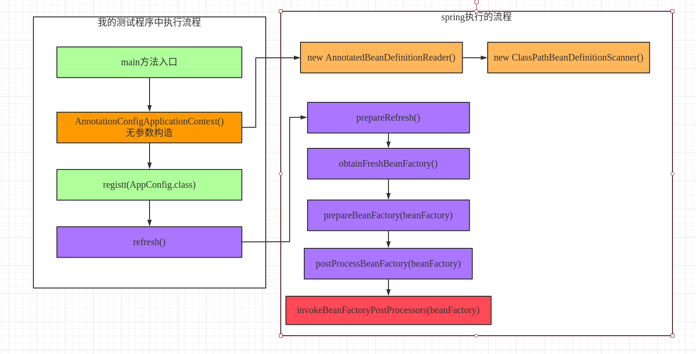
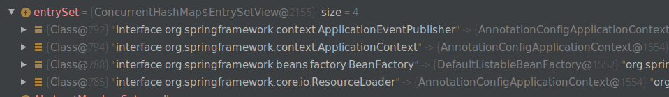

# Spring实现原理

## spring使用set注入的原理

注入接口类：

```java
public class SpringService {
    
}
```

需要注入的Controller类：

```java
public class SpringController {
  
   private SpringService springService;
    
   public void setSpringService(SpringService springService) {
        this.springService = springService;
    }
    
    public SpringService getSpringService() {
        return springService;
    }
    
    void print(){
        System.out.println(springService.toString());
    }
}
```

不适用Set的普通注入方式：

```java
@Test
public void springTheory() throws Exception{
    SpringController springController = new SpringController();
    Class<? extends SpringController> clazz = springController.getClass();
    SpringService springService = new SpringService();
    Field springServiceField = clazz.getDeclaredField("springService");
    springServiceField.setAccessible(true);
    springServiceField.set(springController,springService);
    springController.print();
}
```

spring的set注入原理：

```java
@Test
public void springSetDITheory() throw Exception{
    SpringController springController = new SpringController();
    SpringService springService = new SpringService();
     Class<? extends SpringController> clazz = springController.getClass();
     Field[] fields = clazz.getDeclaredFields();
     Arrays.stream(fields).forEach(System.out::println);
    Field springServiceField = clazz.getDeclaredField("springService");
    //对于私有属性，需要将其设置为可见
     springServiceField.setAccessible(true);
    String name = springServiceField.getName();
     name = name.substring(0,1).toUpperCase()+name.substring(1);
    //set的注入原理
    String setMethodName = "set" + name;
    Method method = clazz.getMethod(setMethodName,SpringService.class);
    method.invoke(springController,springService);
    springController.print();
}
```

## spring的注解注入原理：

自定义注解类：

```java
@Retention(RetentionPolicy.RUNTIME)
@Target(ElementType.FIELD)
public @interface Autowired {
    
}
```

controller的注入：

```java
public class SpringController {

    @Autowired
    private SpringService springService;

    void print(){
        System.out.println(springService.toString());
    }
}
```

测试spring注解原理：

```java
@Test
public void springAnnotationDITheory() throws Exception {
    SpringController springController = new SpringController();
    Class<? extends SpringController> clazz = springController.getClass();
    Field springServiceField = clazz.getDeclaredField("springService");
    springServiceField.setAccessible(true);
    Arrays.stream(clazz.getDeclaredFields()).forEach(field -> {
        System.out.println(field.getName());
        Autowired annotation = field.getAnnotation(Autowired.class);
        if (annotation != null) {
            Class<?> type = field.getType();
            try {
                Object instance = type.getConstructor().newInstance();
                springServiceField.set(springController, instance);
            } catch (InstantiationException | IllegalAccessException | InvocationTargetException | NoSuchMethodException e) {
                e.printStackTrace();
            }
        }
    });
    springController.print();
}
```


`clazz.getFields();`：

```
Returns an array containing {@code Field} objects reflecting all the accessible public fields of the class or interface represented by this {@code Class} object.
```

`clazz.getDeclaredFields();`:

```
Returns an array of {@code Field} objects reflecting all the fields declared by the class or interface represented by this {@code Class} object. This includes public, protected, default (package) access, and private fields, but excludes inherited fields.
```

总结：

一切的框架必须考虑可以扩展性，

- 抽象
- 设计模式：一种可以提高编程的思想

spring给出的扩展：

​	1、在创建容器之前可以做一些事情

​	2、容器初始化之前可以做一些事情

​	3、再不同的阶段发出不同的事情，还可以做些事情

​	4、抽象出各个接口，让你为所欲为

​	5、面向接口编程。

# Spring的上下文?

### 什么是spring的上下文？

spring context是spring执行过程所需的一些数据结构的抽象表达，比如IOC容器的执行，肯定需要一个依赖的上下文，所以spring context就是这个。

### spring context主要包括：

- **DefaultListTableBeanFactory**:

  这个就是常说的IOC容器，其中包括了很多Map，List.Spring帮我们创建的singleon类型的bean就存放在其中一个map中，我们定义的监听器（ApplicationListener）也被放到一个Set集合中。

- **BeanDefinitionRegistry**:

  把一个BeanDefinition放到BeanDefinitionMap中。

- **AnnotationBeanDefinitionReader**:

  针对AnnotationConfigApplicationContext而言。一个BeanDefiniton读取器。

- 扩展点集合：

  存放spring扩展点(主要是BeanFactoryPostProcssor、BeanPostProcessor)接口的List集合。


# Spring 容器初始化过程

尝试理解 Spring Bean 的初始化过程架构：


**总结：架构的设计，保证高内聚，低耦合，扩展性**

如何想在容器实例化的不同阶段做点事情，可以使用观察者模式，每次做完一点事情之后就区找它的观察者是否有实现。

### spring中一些重要概念

**IOC（控制反转）：**
控制反转是从容器的角度在描述，描述完整点：容器控制应用程序，由容器反向的向应用程序注入应用程序所需要的外部资源。

**DI（依赖注入）**：

依赖注入是从应用程序的角度在描述，可以把依赖注入描述完整点：应用程序依赖容器创建并注入它所需要的外部资源；

**Aop**：是运行期增强，

实现原理是：当需要切入的类是接口的话，就使用的是JDK的动态代理实现，如果需要切入的不是接口的时候，使用的是CGLIB的动态代理实现的。

**AspectJ:**

AspectJ是一个面向切面的框架，它扩展了Java语言。AspectJ定义了AOP语法，所以它有一个专门的编译器用来生成遵守Java字节编码规范的Class文件。        

**Spring AOP也是对目标类增强，生成代理类。但是与AspectJ的最大区别在于---Spring AOP的运行时增强，而AspectJ是编译时增强。**

spring中是在BeanPostProcessor中进行增强的。

### BeanFactory

```java
public interface BeanFactory {
	String FACTORY_BEAN_PREFIX = "&";
}
```

& :取地址符，如果&BeanFactory就是取出当前对象的地址，而非当前的对象。

## Bean的初始化流程

- 1、经历一堆的XXXAware把bean需要的spring组建调用setXX给bean
- 2、postProcessBeforeInitialization methods of BeanPostProcessors
- 3、InitializingBean(spring的类)
- 4、init-method(用户可能自己实现的)
- 5、BeanPostProcessor afterXXX
- 6、DispoableBean（spring的类）
- 7、Destory-method（销毁方法）

Spring autowird

spring注入方式有几种：

byname，bytype，no，constructor（是4中注入模型）

注入方式 set和constructor两种。

自动装配：  永远用的是setter和constructor

## 什么是Spring的自动装配？

### Autowiring mode 自动注入模型

什么是自动注入模型：

自动装配模型是一种完成自动装配依赖的手段体现，每一种模型都使用了不同的技术去查找和填充bean；从spring官网上面可以看到spring只提出了4中自动装配模型（严格意义上是三种、因为第一种是no，表示不使用自动装配、使用），这四个模型分别用一个整形来表示，存在spring的beanDefinition当中，任何一个类默认是no这个装配模型，也就是一个被注解的类默认的装配模型是no也就是手动装配；
其中no用0来表示；bytype用2来表示；例如：

- 如果某个类X，假设X的bean对应的beanDefinition当中的autowireMode=2则表示这个类X的自动装配模型为bytype；如果autowireMode=1则表示为byname装配模型；


### IOC（DI）：依赖注入

什么是依赖注入：

**依赖注入是一个过程，主要通过setter和构造方法以及一些变体的方式完成把对象依赖、或者填充上的这个过程，不管手动装配还是自动装配都有这个过程。**


autowird 注入使用的field.set

lazy:

FactoryBean 和普通Bean有什么区别{

​	实例化的顺序不同，储存的地方不同

}

如何把一个对象放到spring容器中？{

​		以下三种方式：

​		FactoryBean,扩展用

​		@Bean 做配置用

​		AnnotationConfigApplicationContext ac = new ..

​		ac.getBeanFactory().registerSingleton("beanName",MyObject object);

​		//比较鸡肋，因spring可能已经初始化完了，有可能你需要的类注入不进来

​		//其他类有依赖？

​		//custom bean 引用了其他spring bean 的类

​		//ac.register(MyObject object)

​		// ac.refresh()

}
https://blog.csdn.net/java_lyvee/article/details/102499560

bean definition
关于beanDefinition 的第一篇笔记  一共三篇 https://blog.csdn.net/java_lyvee/article/details/102633067
https://www.processon.com/view/link/5c15e10ae4b0ed122da86303

https://shimo.im/docs/Nj0bcFUy3SYyYnbI/ 《无标题》，可复制链接后用石墨文档 App 或小程序打开

# BeanDefinition

## RootBeanDefinition

用法：

```java
RootBeanDefinition rootBeanDefinition = new RootBeanDefinition();
rootBeanDefinition.getPropertyValues().add("name","value");
```

## ChildBeanDefinition

```java
ChildBeanDefinition childBeanDefinition = new ChildBeanDefinition("parentName");
childBeanDefinition.getParentName();
```

他的使用必须要有一个传入一个父类bean的parentName名称，

## GenericBeanDefinition


## BeanFactoryPostProcessor

```java
@FunctionalInterface
public interface BeanFactoryPostProcessor {

   /**
    * Modify the application context's internal bean factory after its standard
    * initialization. All bean definitions will have been loaded, but no beans
    * will have been instantiated yet. This allows for overriding or adding
    * properties even to eager-initializing beans.
    * @param beanFactory the bean factory used by the application context
    * @throws org.springframework.beans.BeansException in case of errors
    */
   void postProcessBeanFactory(ConfigurableListableBeanFactory beanFactory) throws BeansException;

}
```

**作用： Modify the application context's internal bean factory after its standard initialization。**

**这是bean工厂后置处理器**

BeanFactoryPostProcessor的执行机制：

- 如果直接实现BeanFactoryPostProcessor的类是spring完成扫描类之后（所谓扫描包括把类变成beanDefinition然后put到beanDefinitionMap中），在实例化bean之前执行。即将对象放入单例常量池之前执行。
- 如果实现的是BeanDefinitionRegistryPostProcessor接口的类，这种也叫bean工厂后置处理器的执行时机是在执行直接实现BeanFactoryPostProcessor的类之前，和对类的扫描，parse，是同期执行。假设我的程序扩展了一个功能，需要在这个时期实现某个功能，则可以实现这个类。

测试

```java

@Component(value = "dx")
public class DX {
	public DX(){
		System.out.println("init DX constructor ");
	}
}
public class DY {

	public DY() {
		System.out.println("init DY constructor");
	}
}
public class DZ {

	public DZ() {
		System.out.println("init DZ constructor");
	}
}
@Component
public class TestBeanFactoryProcessor implements BeanFactoryPostProcessor {

	@Override
	public void postProcessBeanFactory(ConfigurableListableBeanFactory beanFactory) throws BeansException {
		//转化成子类
		DefaultListableBeanFactory defaultlbf = (DefaultListableBeanFactory) beanFactory;

		GenericBeanDefinition gbf = new GenericBeanDefinition();
		gbf.setBeanClass(DY.class);
		//将DY类添加进去
		defaultlbf.registerBeanDefinition("dy",gbf);


		BeanDefinition dx = defaultlbf.getBeanDefinition("dx");

		System.out.println(dx);

		dx.setBeanClassName("com.definition.DZ");

	}
}

public class DefinitionTest {
	public static void main(String[] args) {

		AnnotationConfigApplicationContext ac = new AnnotationConfigApplicationContext();
		ac.register(AppConfig.class);
		ac.refresh();

		RootBeanDefinition rootBeanDefinition = new RootBeanDefinition();
		rootBeanDefinition.getPropertyValues().add("name","value");
		//rootBeanDefinition.
		ChildBeanDefinition childBeanDefinition = new ChildBeanDefinition("bc");
	}
}
```

输出结果：

init DZ constructor
init DY constructor

可以看到此时，我将dx的bean替换成对象DZ了。

因此：spring实例化一个bean是和 一个beanDefinition对象所对应的那个类有直接关系，跟我们提供的类并没有直接关系。

Definition执行流程：



## AnnotatedBeanDefinitionReader

```java
/**
 * Convenient adapter for programmatic registration of bean classes.
 */
```

作用：可以通过编程的方式动态的注册一个bean对象。

- 主要是动态、显示的注册一个bean，
- 具备解析这个类的功能，和扫描解析的这个类的功能相同，

应用场景：

- 可以显示、动态注册一个程序员提供的bean；

- 在初始化spring容器的过程中完成了对配置类的注册和解析功能。

  这里可以有了两种写法：

  ```java
  AnnotationConfigApplicationContext ac = new AnnotationConfigApplicationContext();
  ac.register(AppConfig.class);
  ac.refresh();
  ```

  ```java
  AnnotationConfigApplicationContext ac = new AnnotationConfigApplicationContext(AppConfig.class);
  ```

  对于这两种方法还是有点不同之处的：

  1、第一种是容器初始化之前就可以获取ac对象，

  ​	好处1：这个时候我们可以在容器初始化之前就可以动态注入一个自己的bean，

  ​	好处2：提前得到ac对象，可以来开启或者关闭spring的循环依赖，

  ​	好处3：还可以在程序初始化之前注册自己实例化的BeanDefinition对象

  2、第二种是容器直接初始化完成了，这个过程没法控制。

## ClassPathBeanDefinitionScanner

```java
/**
 * A bean definition scanner that detects bean candidates on the classpath,
 * registering corresponding bean definitions with a given registry ({@code BeanFactory}
 * or {@code ApplicationContext}).
 */
```

ClassPathBeanDefinitionScanner是spring完成扫描的核心类，但是AnnotatedBeanDefinitionReader可以替代他完成相同的注解解析，意思就是通过ClassPathBeanDefinitionScanner扫描出来的类和通过AnnotatedBeanDefinitionReader显示注册的类在spring内部会公用一套相同的解析方法。

例子：

# 问题：

## 为什么@Autowired可以注入AppliactionContext对象？

得到ApplicationContext对象的方法比较多，比如extends WebApplicationObjectSupport也可以获取ApplicationContext对象；

#### 获取AppliationContext的主流方式

**第一种**，在一个bean(注意一定得是bean，被spring容器管理的对象)当中通过@Autowired来注入ApplicationContext对象；代码如下：

```java
@Component
public class DY {
   @Autowired 
   DX dx;
   @Autowired
   ApplicationContext applicationContext;
   public DY() {
      System.out.println("init DY constructor");
   }
}
```

**第二种**，通过实现ApplicationContextAware接口来获取AppliationContext对象；

```java
public class AppConAwareImpl implements ApplicationContextAware {

   private ApplicationContext applicationContext;

   @Override
   public void setApplicationContext(ApplicationContext applicationContext) throws BeansException {
      this.applicationContext = applicationContext;

   }
   public Object getBean(String name){
       //5.2.6之后就没有这个方法了。
      return getApplicationContext().getBean(name);
   }
}
```

#### 为什么需要注入这个ApplicationContext对象呢？

我列举一下官网上说的经典场景吧；

假设类A(单例的)需要注入一个类B（原型的）；如果我们直接写会有问题；

比如你在A类当中的m()方法中返回b，那么无论你调用多少次a.m()；返回的都是同一个b对象；就违背b的原型规则，应该在m方法中每次都返回一个新的b；所以某些场景下b不能直接注入；

```java
//不正确的写法
@Component
public class A{
	
	//注意B是原型的  scope=prototype
	@Autowried;
	B b;
	public B m(){

		//直接返回注入进来的b；肯定有问题
		//返回的永远是A实例化的时候注入的那个bean
		//违背的B设计成原型的初衷
		return b；
	}
}
```

```java
//正确的写法
@Component
public class A{
	@Autowired
	ApplicationContext applicationContext;
	public B m(){
		//每次调用m都是通过spring容器去获取b
		//如果b是原型，每次拿到的都是原型b
		B b= applicationContext.getBean("b");
		return b;
	}
}
```

```
In most application scenarios, most beans in the container are singletons. When a singleton bean needs to collaborate with another singleton bean or a non-singleton bean needs to collaborate with another non-singleton bean, you typically handle the dependency by defining one bean as a property of the other. A problem arises when the bean lifecycles are different. Suppose singleton bean A needs to use non-singleton (prototype) bean B, perhaps on each method invocation on A. The container creates the singleton bean A only once,and thus only gets one opportunity to set the properties. The container cannot provide bean A with a new instance of bean B every time one is needed.
//这段文字已经清楚的说明了为什么要使用ApplicationContext注入。
```

#### 为什么@Autowired能够注入ApplicationContext对象？

完成ApplicationContext的步骤：

1、调用InjectionMetadata.java中的inject方法中的`element.inject(target, beanName, pvs);`方法

```java
public void inject(Object target, @Nullable String beanName, @Nullable PropertyValues pvs) throws Throwable {
   Collection<InjectedElement> checkedElements = this.checkedElements;
   Collection<InjectedElement> elementsToIterate =
         (checkedElements != null ? checkedElements : this.injectedElements);
   if (!elementsToIterate.isEmpty()) {
      //便利所有需要注入属性，这里就是DY和applicationContext
         for (InjectedElement element : elementsToIterate) {
         if (logger.isTraceEnabled()) {
            logger.trace("Processing injected element of bean '" + beanName + "': " + element);
         }
         element.inject(target, beanName, pvs);
      }
   }
}
```

2、继续调用inject方法中的`beanFactory.resolveDependency()`方法，

```java
public Object resolveDependency(DependencyDescriptor descriptor, @Nullable String requestingBeanName,
      @Nullable Set<String> autowiredBeanNames, @Nullable TypeConverter typeConverter) throws BeansException {

 //...省略
   else {
      Object result = getAutowireCandidateResolver().getLazyResolutionProxyIfNecessary(
            descriptor, requestingBeanName);
      if (result == null) {
         result = doResolveDependency(descriptor, requestingBeanName, autowiredBeanNames, typeConverter);
      }
      return result;
   }
}
```

3、继续调用改接口方法实现类中的`doResolveDependency(args...);`方法得到ApplicationContext对象，

```java
@Nullable
public Object doResolveDependency(DependencyDescriptor descriptor, @Nullable String beanName,
      @Nullable Set<String> autowiredBeanNames, @Nullable TypeConverter typeConverter) throws BeansException {

   	//...省略
	//获取的关键
      Map<String, Object> matchingBeans = findAutowireCandidates(beanName, type, descriptor);
      if (matchingBeans.isEmpty()) {
         if (isRequired(descriptor)) {
            raiseNoMatchingBeanFound(type, descriptor.getResolvableType(), descriptor);
         }
         return null;
      }
//...省略
    
}
```

4、继续调用该方法中findAutowireCandidate(args...);

```java
protected Map<String, Object> findAutowireCandidates(
      @Nullable String beanName, Class<?> requiredType, DependencyDescriptor descriptor) {

   String[] candidateNames = BeanFactoryUtils.beanNamesForTypeIncludingAncestors(
         this, requiredType, true, descriptor.isEager());
    //从这里获取当前的bean属性
   Map<String, Object> result = new LinkedHashMap<>(candidateNames.length);
   for (Map.Entry<Class<?>, Object> classObjectEntry : this.resolvableDependencies.entrySet()) {
      Class<?> autowiringType = classObjectEntry.getKey();
      if (autowiringType.isAssignableFrom(requiredType)) {
         Object autowiringValue = classObjectEntry.getValue();
         autowiringValue = AutowireUtils.resolveAutowiringValue(autowiringValue, requiredType);
         if (requiredType.isInstance(autowiringValue)) {
            result.put(ObjectUtils.identityToString(autowiringValue), autowiringValue);
            break;
         }
      }
   }
//...省略
}
```

当代码执行到findAutowireCandidates的时候，传了一个特别重要的参数 `Class requireType`；就是当前注入的属性---也就是ApplicationContext.class。然后便利这个resolvableDependencies:Map对象,接着会把传过来的requireType和遍历出来的autowiringType——当前类型进行比较



这个Map中存放了四个对象，其中包括ApplicationContext，因此直接从这个map中获取这个对象。

那么这个Map集合是什么呢？

```java
/** Map from dependency type to corresponding autowired value. */
private final Map<Class<?>, Object> resolvableDependencies = new ConcurrentHashMap<>(16);
```

其实就是为了其他地方依赖引用而专门在初始化的过程中缓存起来，以供其他地方使用。

该Map对象提供了确切的调用API是在ConfigurableListableBeanFactory接口中定义的：

```java
/**
 * Register a special dependency type with corresponding autowired value.
 * <p>This is intended for factory/context references that are supposed
 * to be autowirable but are not defined as beans in the factory:
 * e.g. a dependency of type ApplicationContext resolved to the
 * ApplicationContext instance that the bean is living in.
 * <p>Note: There are no such default types registered in a plain BeanFactory,
 * not even for the BeanFactory interface itself.
 * @param dependencyType the dependency type to register. This will typically
 * be a base interface such as BeanFactory, with extensions of it resolved
 * as well if declared as an autowiring dependency (e.g. ListableBeanFactory),
 * as long as the given value actually implements the extended interface.
 * @param autowiredValue the corresponding autowired value. This may also be an
 * implementation of the {@link org.springframework.beans.factory.ObjectFactory}
 * interface, which allows for lazy resolution of the actual target value.
 */
void registerResolvableDependency(Class<?> dependencyType, @Nullable Object autowiredValue);
```

Register a special dependency type with corresponding autowired value. 

意思是注册一个特殊的依赖类型 ---- 使用通用的自动装配值。

也就是说把你有一些通用的对象、可能会被别的bean注入，那么你可以调用这个方法吧这个对象放入到一个map当中，以供其他地方使用。

那么spring是什么时候把这四个对象放到Map当中的呢？ ----就是spring在完成初始化的时候

main方法中调用ac.refresh()方法中，调用prepareBeanFactory(beanFactory)方法,

```java
protected void prepareBeanFactory(ConfigurableListableBeanFactory beanFactory) {

	//...省略...
   // BeanFactory interface not registered as resolvable type in a plain factory.
   // MessageSource registered (and found for autowiring) as a bean.
   beanFactory.registerResolvableDependency(BeanFactory.class, beanFactory);
   beanFactory.registerResolvableDependency(ResourceLoader.class, this);
   beanFactory.registerResolvableDependency(ApplicationEventPublisher.class, this);
   beanFactory.registerResolvableDependency(ApplicationContext.class, this);
	//...省略...
}
```

**小总结：注入的普通对象的属性如果是单例，那么spring首先从单例池获取，如果获取到直接实例化的这个Bean，放入单例池中并返回;如果是原型的方式每次注入就是在该对象要使用的时候直接根据beanDefinionMap缓存池中获取，并实例化当前对象。**


做platone智能合约！ a，a变量，两个合约，对应两个同名变量。两个合约隔离，两个合约可以访问同名变量。


