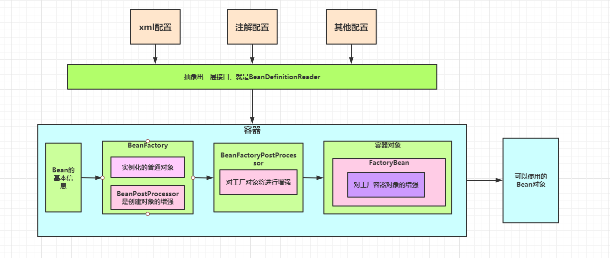

# Spring实现原理

## spring使用set注入的原理

注入接口类：

```java
public class SpringService {
    
}
```

需要注入的Controller类：

```java
public class SpringController {
  
   private SpringService springService;
    
   public void setSpringService(SpringService springService) {
        this.springService = springService;
    }
    
    public SpringService getSpringService() {
        return springService;
    }
    
    void print(){
        System.out.println(springService.toString());
    }
}
```

不适用Set的普通注入方式：

```java
@Test
public void springTheory() throws Exception{
    SpringController springController = new SpringController();
    Class<? extends SpringController> clazz = springController.getClass();
    SpringService springService = new SpringService();
    Field springServiceField = clazz.getDeclaredField("springService");
    springServiceField.setAccessible(true);
    springServiceField.set(springController,springService);
    springController.print();
}
```

spring的set注入原理：

```java
@Test
public void springSetDITheory() throw Exception{
    SpringController springController = new SpringController();
    SpringService springService = new SpringService();
     Class<? extends SpringController> clazz = springController.getClass();
     Field[] fields = clazz.getDeclaredFields();
     Arrays.stream(fields).forEach(System.out::println);
    Field springServiceField = clazz.getDeclaredField("springService");
    //对于私有属性，需要将其设置为可见
     springServiceField.setAccessible(true);
    String name = springServiceField.getName();
     name = name.substring(0,1).toUpperCase()+name.substring(1);
    //set的注入原理
    String setMethodName = "set" + name;
    Method method = clazz.getMethod(setMethodName,SpringService.class);
    method.invoke(springController,springService);
    springController.print();
}
```

## spring的注解注入原理：

自定义注解类：

```java
@Retention(RetentionPolicy.RUNTIME)
@Target(ElementType.FIELD)
public @interface Autowired {
    
}
```

controller的注入：

```java
public class SpringController {

    @Autowired
    private SpringService springService;

    void print(){
        System.out.println(springService.toString());
    }
}
```

测试spring注解原理：

```java
@Test
public void springAnnotationDITheory() throws Exception {
    SpringController springController = new SpringController();
    Class<? extends SpringController> clazz = springController.getClass();
    Field springServiceField = clazz.getDeclaredField("springService");
    springServiceField.setAccessible(true);
    Arrays.stream(clazz.getDeclaredFields()).forEach(field -> {
        System.out.println(field.getName());
        Autowired annotation = field.getAnnotation(Autowired.class);
        if (annotation != null) {
            Class<?> type = field.getType();
            try {
                Object instance = type.getConstructor().newInstance();
                springServiceField.set(springController, instance);
            } catch (InstantiationException | IllegalAccessException | InvocationTargetException | NoSuchMethodException e) {
                e.printStackTrace();
            }
        }
    });
    springController.print();
}
```


`clazz.getFields();`：

```
Returns an array containing {@code Field} objects reflecting all the accessible public fields of the class or interface represented by this {@code Class} object.
```

`clazz.getDeclaredFields();`:

```
Returns an array of {@code Field} objects reflecting all the fields declared by the class or interface represented by this {@code Class} object. This includes public, protected, default (package) access, and private fields, but excludes inherited fields.
```

总结：

一切的框架必须考虑可以扩展性，

- 抽象
- 设计模式：一种可以提高编程的思想

spring给出的扩展：

​	1、在创建容器之前可以做一些事情

​	2、容器初始化之前可以做一些事情

​	3、再不同的阶段发出不同的事情，还可以做些事情

​	4、抽象出各个接口，让你为所欲为

​	5、面向接口编程。

# Spring的上下文?

### 什么是spring的上下文？

spring context是spring执行过程所需的一些数据结构的抽象表达，比如IOC容器的执行，肯定需要一个依赖的上下文，所以spring context就是这个。

### spring context主要包括：

- **DefaultListTableBeanFactory**:

  这个就是常说的IOC容器，其中包括了很多Map，List.Spring帮我们创建的singleon类型的bean就存放在其中一个map中，我们定义的监听器（ApplicationListener）也被放到一个Set集合中。

- **BeanDefinitionRegistry**:

  把一个BeanDefinition放到BeanDefinitionMap中。

- **AnnotationBeanDefinitionReader**:

  针对AnnotationConfigApplicationContext而言。一个BeanDefiniton读取器。

- 扩展点集合：

  存放spring扩展点(主要是BeanFactoryPostProcssor、BeanPostProcessor)接口的List集合。


# Spring 容器初始化过程

尝试理解 Spring Bean 的初始化过程架构：




**总结：架构的设计，保证高内聚，低耦合，扩展性**

如何想在容器实例化的不同阶段做点事情，可以使用观察者模式，每次做完一点事情之后就区找它的观察者是否有实现。

### spring中一些重要概念

**IOC（控制反转）：**
控制反转是从容器的角度在描述，描述完整点：容器控制应用程序，由容器反向的向应用程序注入应用程序所需要的外部资源。

**DI（依赖注入）**：

依赖注入是从应用程序的角度在描述，可以把依赖注入描述完整点：应用程序依赖容器创建并注入它所需要的外部资源；

**Aop**：是运行期增强，

实现原理是：当需要切入的类是接口的话，就使用的是JDK的动态代理实现，如果需要切入的不是接口的时候，使用的是CGLIB的动态代理实现的。

**AspectJ:**

AspectJ是一个面向切面的框架，它扩展了Java语言。AspectJ定义了AOP语法，所以它有一个专门的编译器用来生成遵守Java字节编码规范的Class文件。        

**Spring AOP也是对目标类增强，生成代理类。但是与AspectJ的最大区别在于---Spring AOP的运行时增强，而AspectJ是编译时增强。**

spring中是在BeanPostProcessor中进行增强的。

### BeanFactory

```java
public interface BeanFactory {
	String FACTORY_BEAN_PREFIX = "&";
}
```

& :取地址符，如果&BeanFactory就是取出当前对象的地址，而非当前的对象。

## Bean的初始化流程

- 1、经历一堆的XXXAware把bean需要的spring组建调用setXX给bean
- 2、postProcessBeforeInitialization methods of BeanPostProcessors
- 3、InitializingBean(spring的类)
- 4、init-method(用户可能自己实现的)
- 5、BeanPostProcessor afterXXX
- 6、DispoableBean（spring的类）
- 7、Destory-method（销毁方法）

Spring autowird

spring注入方式有几种：

byname，bytype，no，constructor（是4中注入模型）

注入方式 set和constructor两种。

自动装配：  永远用的是setter和constructor

## 什么是Spring的自动装配？

### Autowiring mode 自动注入模型

什么是自动注入模型：

自动装配模型是一种完成自动装配依赖的手段体现，每一种模型都使用了不同的技术去查找和填充bean；从spring官网上面可以看到spring只提出了4中自动装配模型（严格意义上是三种、因为第一种是no，表示不使用自动装配、使用），这四个模型分别用一个整形来表示，存在spring的beanDefinition当中，任何一个类默认是no这个装配模型，也就是一个被注解的类默认的装配模型是no也就是手动装配；
其中no用0来表示；bytype用2来表示；例如：

- 如果某个类X，假设X的bean对应的beanDefinition当中的autowireMode=2则表示这个类X的自动装配模型为bytype；如果autowireMode=1则表示为byname装配模型；


### IOC（DI）：依赖注入

什么是依赖注入：

**依赖注入是一个过程，主要通过setter和构造方法以及一些变体的方式完成把对象依赖、或者填充上的这个过程，不管手动装配还是自动装配都有这个过程。**


autowird 注入使用的field.set

lazy:

FactoryBean 和普通Bean有什么区别{

​	实例化的顺序不同，储存的地方不同

}

如何把一个对象放到spring容器中？{

​		以下三种方式：

​		FactoryBean,扩展用

​		@Bean 做配置用

​		AnnotationConfigApplicationContext ac = new ..

​		ac.getBeanFactory().registerSingleton("beanName",MyObject object);

​		//比较鸡肋，因spring可能已经初始化完了，有可能你需要的类注入不进来

​		//其他类有依赖？

​		//custom bean 引用了其他spring bean 的类

​		//ac.register(MyObject object)

​		// ac.refresh()

}
https://blog.csdn.net/java_lyvee/article/details/102499560

bean definition
关于beanDefinition 的第一篇笔记  一共三篇 https://blog.csdn.net/java_lyvee/article/details/102633067
https://www.processon.com/view/link/5c15e10ae4b0ed122da86303

https://shimo.im/docs/Nj0bcFUy3SYyYnbI/ 《无标题》，可复制链接后用石墨文档 App 或小程序打开
