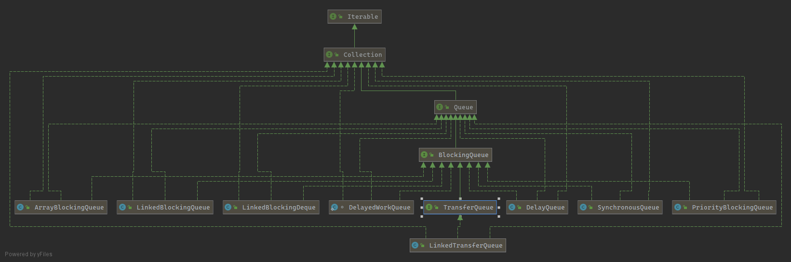

# 线程池

## 队列

### BlockingQueue

BlockingQueue阻塞队列接口的所有实现类和父类图表



#### ArrayBlockingQueue：有界任务队列

底层是数组类型的阻塞队列。

```java
 public static void main(String[] args) {
            try {
                ArrayBlockingQueue<String> arrayBlockingQueue = new ArrayBlockingQueue<>(10);
                //线程安全放入元素
                //Inserts the specified element at the tail of this queue, waiting
                //  for space to become available if the queue is full
                //如果队列已满，就一直等到有空余的空间才插入
                arrayBlockingQueue.put("234");
                //线程不安全的放入元素
                arrayBlockingQueue.add("5656");
                //线程安全的获取元素，如果队列为空，则一直等待到队列不为空再拿去一个数据
                arrayBlockingQueue.take();
                //Inserts the specified element at the tail of this queue, waiting
                //  up to the specified wait time for space to become available if
                //  the queue is full
                //如果队列满的话一直等待特定时间，如果超时没有空间就不插入
                arrayBlockingQueue.offer("666",2, TimeUnit.SECONDS);
                //插入元素，如果队列已满，则不插入
                arrayBlockingQueue.offer("777");
                //线程安全的获取元素，如果队列为空，返回空
                arrayBlockingQueue.poll();
            } catch (InterruptedException e) {
                e.printStackTrace();
            }
        }
```

### LinkedBlockingQueue：无界任务队列

底层是链表类型的阻塞队列

```java
   public static void main(String[] args) {
            try {
                //publicLinkedBlockingQueue() { this(Integer.MAX_VALUE);}
                LinkedBlockingQueue<String> linkedBlockingQueue = new LinkedBlockingQueue<>();
                //线程安全的放入元素
                linkedBlockingQueue.add("123123");
                //如果队列已满，就一直等到有空余的空间才插入
                linkedBlockingQueue.put("vvv");
                //线程安全的获取元素，如果队列为空，则一直等待到队列不为空再拿去一个数据
                linkedBlockingQueue.take();
                //如果队列满的话就插入失败
                linkedBlockingQueue.offer("qeqw");
                //直接获取一个元素，如果队列为空直接返回null
                linkedBlockingQueue.poll();
            } catch (InterruptedException e) {
                e.printStackTrace();
            }
        }
    }
```

LinkedTransferQueue：

TransferQueue是一个继承了BlockingQueue的接口，并且增加若干新的方法。LinkedTransferQueue是TransferQueue接口的实现类，其定义为一个无界的队列，具有先进先出(FIFO)的特性。

有人这样评价它："TransferQueue是是ConcurrentLinkedQueue、SynchronousQueue (公平模式下)、无界的LinkedBlockingQueues等的超集。"

1. transfer(E e)：若当前存在一个正在等待获取的消费者线程，即立刻移交之；否则，会插入当前元素e到队列尾部，并且等待进入阻塞状态，到有消费者线程取走该元素。
2. tryTransfer(E e)：若当前存在一个正在等待获取的消费者线程（使用take()或者poll()函数），使用该方法会即刻转移/传输对象元素e；若不存在，则返回false，并且不进入队列。这是一个不阻塞的操作。
3. tryTransfer(E e, long timeout, TimeUnit unit)：若当前存在一个正在等待获取的消费者线程，会立即传输给它;否则将插入元素e到队列尾部，并且等待被消费者线程获取消费掉；若在指定的时间内元素e无法被消费者线程获取，则返回false，同时该元素被移除。
4. hasWaitingConsumer()：判断是否存在消费者线程。
5. getWaitingConsumerCount()：获取所有等待获取元素的消费线程数量。
6. size()：因为队列的异步特性，检测当前队列的元素个数需要逐一迭代，可能会得到一个不太准确的结果，尤其是在遍历时有可能队列发生更改。
7. 批量操作：类似于addAll，removeAll, retainAll, containsAll, equals, toArray等方法，API不能保证一定会立刻执行。因此，我们在使用过程中，不能有所期待，这是一个具有异步特性的队列。

父类接口是TransferQueue,其中方法transfer()和tryTransfer()的作用是

**注意事项：**

- 无论是transfer还是tryTransfer方法，在>=1个消费者线程等待获取元素时（此时队列为空），都会立刻转交，这属于线程之间的元素交换。注意，这时，元素并没有进入队列。
- 在队列中已有数据情况下，transfer将需要等待前面数据被消费掉，直到传递的元素e被消费线程取走为止。
- 使用transfer方法，工作者线程可能会被阻塞到生产的元素被消费掉为止。
- 消费者线程等待为零的情况下，各自的处理元素入队与否情况有所不同。
- size()方法，需要迭代，可能不太准确，尽量不要调用。

```java
 public static void main(String[] args) {
            try {
                //publicLinkedBlockingQueue() { this(Integer.MAX_VALUE);}
                LinkedTransferQueue<String> transferQueue = new LinkedTransferQueue<>();
                new Thread(()->{
                    for (int i = 0; i < 5; i++) {
                        try {
                            transferQueue.transfer(Thread.currentThread().getName() + "-" + i);
                        } catch (InterruptedException e) {
                            e.printStackTrace();
                        }
                    }
                },"t1").start();
                Thread.sleep(1000);
                new Thread(()->{
                    System.out.println(Arrays.toString(transferQueue.toArray()));
                    for (int i = 0; i < 6; i++) {
                        try {
                            Thread.sleep(1000);
                            System.out.println(transferQueue.poll());
                        } catch (InterruptedException e) {
                            e.printStackTrace();
                        }
                    }
                },"t2").start();
            } catch (InterruptedException e) {
                e.printStackTrace();
            }
        }
//打印结果
/*
[t1-0]
t1-0
t1-1
t1-2
t1-3
t1-4
null
*/
```

DelayQueue


DelayedWorkQueue


### SynchronousQueue：直接提交队列

经典的生产者-消费者模式，操作流程是这样的：

有多个生产者，可以并发生产产品，把产品置入队列中，如果队列满了，生产者就会阻塞；

有多个消费者，并发从队列中获取产品，如果队列空了，消费者就会阻塞；

SynchronousQueue也是一个队列来的，但它的特别之处再于内部没有容器，一个生产线程，当它生产产品（即put的时候），如给当前没有人想要消费产品（即当前没有线程执行take），此生产线程必须阻塞，等待一个消费线程调用take操作，take操作将会唤醒该生产线程，同时消费线程会获取生产线程的产品（即数据传递），这样的一个过程称为一次配对过程（当前也可以先take后put原理是一样的）。

```java
 public static void main(String[] args) throws InterruptedException {
            //DelayedWorkQueue delayedWorkQueue = new DelayedWorkQueue();
            SynchronousQueue queue = new SynchronousQueue<Runnable>();
            new Thread(()->{
                System.out.println("take start");
                for (int i = 0; i < 5; i++) {
                    try {

                        System.out.println(queue.take());
                    } catch (InterruptedException e) {
                        e.printStackTrace();
                    }
                }
            },"t1").start();
            Thread.sleep(1000);
            new Thread(()->{
                System.out.println("put start");
               // System.out.println(Arrays.toString(queue.toArray()));
                for (int i = 0; i < 6; i++) {
                    try {
                        Thread.sleep(1000);
                        queue.put(Thread.currentThread().getName() + "-" + i);
                    } catch (InterruptedException e) {
                        e.printStackTrace();
                    }
                }
            },"t2").start();
        }
```

从结果可以看出，put线程执行queue.put(5) 后就被阻塞了，只有take线程进行了消费，put线程才可以返回。可以认为这是一种线程与线程间一对一传递消息的模型。

ArrayBlockingQueue、LinkedBlockingDeque之类的阻塞队列依赖AQS实现并发操作，SynchronousQueue直接使用CAS实现线程的安全访问，由于源码中充斥着大量的CAS代码，

SynchronousQueue下的公平和非公平：

- 公平：底层实现是TransferQueue，使用的是队列数据结构，公平策略是先入队的先出队，后入队的后出。
- 非公平：底层实现是TransferStack，使用的是栈数据结构，非公平策略是先入栈的后出。

### PriorityBlockingQueue：优先队列

优先级队列PriorityBlockingQueue必须是实现Comparable接口，队列通过这个接口的compare方法确定对象的priority。当前和其他对象比较，如果compare方法返回负数，那么在队列里面的优先级就比较高：

​	**比较规则：当前对象和其他对象做比较，当前优先级大就返回-1，优先级小就返回1**

优先级队列是一个基于堆的无界并发安全的优先级队列。

优先级队列不允许null值，不允许未实现Comparable接口的对象。

优先级中传入的实体对象。

```java
 static class User implements Comparable<User> {
        int priority;
        String username;
        public int getPriority() {
            return priority;
        }
        public void setPriority(int priority) {
            this.priority = priority;
        }
        public String getUsername() {
            return username;
        }
        public void setUsername(String username) {
            this.username = username;
        }
        @Override
        public int compareTo(User o) {
            return this.priority - o.getPriority() > 0 ? 1 : -1;
        }
    }
    static class PriorityQueueTest {
        public static void main(String[] args) {
            PriorityBlockingQueue<User> queue = new PriorityBlockingQueue<>();
            for (int i = 0; i < 10; i++) {
                User user = new User();
                int pr = new Random().nextInt(10);
                user.setPriority(pr);
                user.setUsername("测试数据 - " + i);
                queue.add(user);
            }
            for (int i = 0; i < 10; i++) {
                User poll = queue.poll();
                System.out.println("优先级是：" + poll.getPriority() + "," + poll.getUsername());
            }
//输出可能一种结果
            
/*
优先级是：1,测试数据 - 6
优先级是：2,测试数据 - 9
优先级是：2,测试数据 - 0
优先级是：2,测试数据 - 8
优先级是：2,测试数据 - 1
优先级是：3,测试数据 - 7
优先级是：6,测试数据 - 2
优先级是：8,测试数据 - 3
优先级是：9,测试数据 - 4
优先级是：9,测试数据 - 5 
*/
```

## 线程池

### newFixedThreadPool(int nThreads):

创建一个固定线程大小nThreads的线程池，该线程池中的线程数量始终不变，当由一个新的任务提交时，线程池中有空闲线程，则立即执行，如没有，则新的任务会被暂存到任务队列：LinkedBlockingQueue中，若线程有空闲就去执行队列中的任务。

```java
new ThreadPoolExecutor(nThreads, nThreads,0L, TimeUnit.MILLISECONDS,
                              new LinkedBlockingQueue<Runnable>());
```

### newSingleThreadExecutor():

创建一个只有一个线程大小的的线程池

```java
public static ExecutorService newSingleThreadExecutor() {
    return new FinalizableDelegatedExecutorService
        (new ThreadPoolExecutor(1, 1,0L, TimeUnit.MILLISECONDS,
                                new LinkedBlockingQueue<Runnable>()));
}
```

### newScheduleThreadPool(int corePoolSize):

```java
public ScheduledThreadPoolExecutor(int corePoolSize) {
    super(corePoolSize, Integer.MAX_VALUE,
          DEFAULT_KEEPALIVE_MILLIS, MILLISECONDS,
          new DelayedWorkQueue());
}
```

创建一个corePoolSize的线程池，使用的工作队列是DelayedWorkQueue（延迟队列）

### newCachedThreadPool():

```java
public static ExecutorService newCachedThreadPool() {
    return new ThreadPoolExecutor(0, Integer.MAX_VALUE,
                                  60L, TimeUnit.SECONDS,
                                  new SynchronousQueue<Runnable>());
}
```

该方法返回一个可根据实际情况调整线程数量的线程池，线程池中的数量不确定，但若有空闲线程则可以复用，则会优先使用可复用的线程，。

创建一个最小为0，最大为Integer.MAX_VALUE的可缓存的线程池，使用的工作队列是SynchronousQueue，

### newWorkStealingPool():

JDK 1.8 之后加入的一个新的线程池，底层实现是使用的ForkJoinPool。

```java
public static ExecutorService newWorkStealingPool() {
    return new ForkJoinPool
        (Runtime.getRuntime().availableProcessors(),
         ForkJoinPool.defaultForkJoinWorkerThreadFactory,
         null, true);
}
```

根据电脑cpu的可执行线程数创建对应大小的线程池，具有任务抢占执行的特点。

```java
public ForkJoinPool(int parallelism,
                    ForkJoinWorkerThreadFactory factory,
                    UncaughtExceptionHandler handler,
                    boolean asyncMode) {
    this(parallelism, factory, handler, asyncMode,
         0, MAX_CAP, 1, null, DEFAULT_KEEPALIVE, TimeUnit.MILLISECONDS);
}
```

## 自定义线程池

```java
public ThreadPoolExecutor(int corePoolSize,
                          int maximumPoolSize,
                          long keepAliveTime,
                          TimeUnit unit,
                          BlockingQueue<Runnable> workQueue) {
    this(corePoolSize, maximumPoolSize, keepAliveTime, unit, workQueue,
         Executors.defaultThreadFactory(), defaultHandler);
}
```

```java
public ThreadPoolExecutor(int corePoolSize,
                          int maximumPoolSize,
                          long keepAliveTime,
                          TimeUnit unit,
                          BlockingQueue<Runnable> workQueue,
                          ThreadFactory threadFactory) {
    this(corePoolSize, maximumPoolSize, keepAliveTime, unit, workQueue,
         threadFactory, defaultHandler);
}
```

```java
public ThreadPoolExecutor(int corePoolSize,
                          int maximumPoolSize,
                          long keepAliveTime,
                          TimeUnit unit,
                          BlockingQueue<Runnable> workQueue,
                          RejectedExecutionHandler handler) {
    this(corePoolSize, maximumPoolSize, keepAliveTime, unit, workQueue,
         Executors.defaultThreadFactory(), handler);
}
```

```java
public ThreadPoolExecutor(int corePoolSize,
                          int maximumPoolSize,
                          long keepAliveTime,
                          TimeUnit unit,
                          BlockingQueue<Runnable> workQueue,
                          ThreadFactory threadFactory,
                          RejectedExecutionHandler handler) {
    if (corePoolSize < 0 ||
        maximumPoolSize <= 0 ||
        maximumPoolSize < corePoolSize ||
        keepAliveTime < 0)
        throw new IllegalArgumentException();
    if (workQueue == null || threadFactory == null || handler == null)
        throw new NullPointerException();
    this.corePoolSize = corePoolSize;
    this.maximumPoolSize = maximumPoolSize;
    this.workQueue = workQueue;
    this.keepAliveTime = unit.toNanos(keepAliveTime);
    this.threadFactory = threadFactory;
    this.handler = handler;
}
```

- corePoolSize:指定了线程池中的线程数量
- maximumPoolSize:指定了线程池中的最大线程数
- keepAliveTime：当线程池中线程数量超过corePoolSize时，多余的空闲线程的存活时间，即超过corePoolSize的空闲线程，再多长时间内会被销毁。
- unit:keepAliveTime的单位
- workQueue：任务队列，被提交，但是尚未执行的任务。
- threadFactory：线程工厂，用于创建线程，一般用默认即可。
- handler：拒绝策略。当任务太多来不及处理时，如何拒绝任务。

## 线程池拒绝策略

- AbortPolicy策略：该策略会直接抛异常，阻止系统正常工作
- CallerRunsPolicy策略：只要线程池未关闭，该策略直接再调用者线程中，运行当前被丢弃的任务。显然这样做不会真正的丢弃任务，但是任务提交线程的性能极有可能会急剧下降。
- DiscardOldestPolicy策略：该策略将会丢弃最老的一个请求，也就是即将被执行的一个任务，并尝试再测提交当前任务。
- DiscardPolicy策略：该策略默默地丢弃无法处理的任务，不予处理。

## 扩展线程池

ThreadPoolExecutor是一个可以扩展的线程池，提供了beforeExecute(),afterExecute()，terminated(),三个接口来对线程池进行控制。

