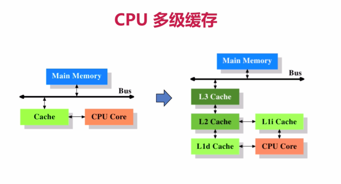
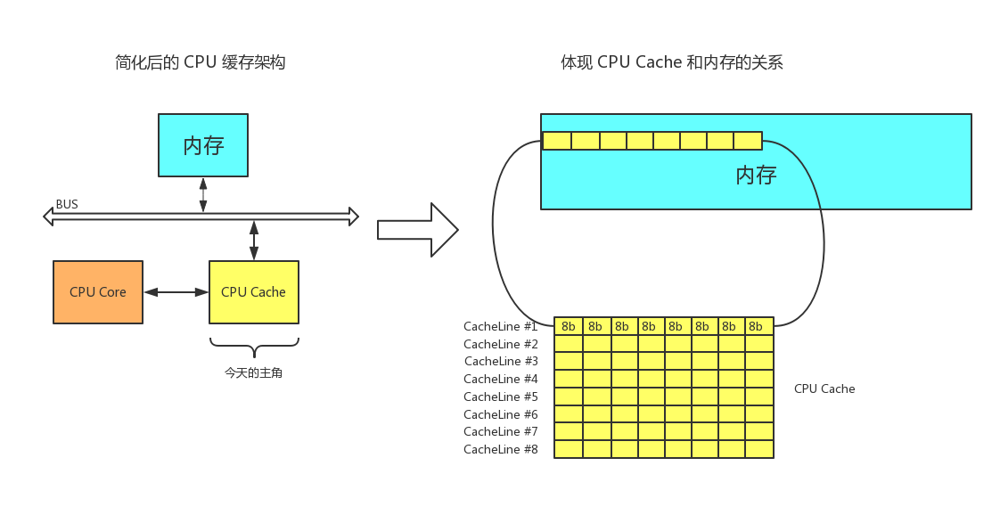
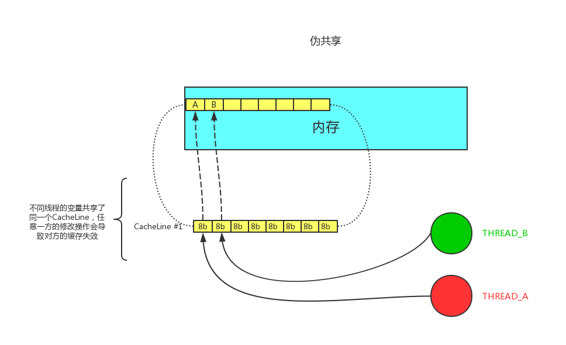
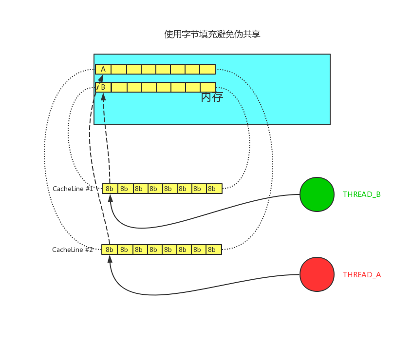
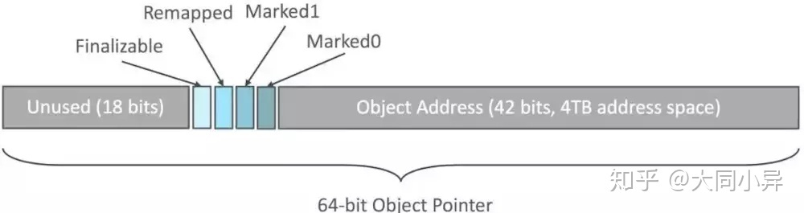

# 

## 程序员必读书籍

- 《编码：隐匿在计算机软硬件背后的语言》
- 《深入理解计算机系统》
- 语言《C程序设计语言》《C Primer Plus》
- 数据结构与算法：leetCode
- 《Java数据结构与算法》《算法》
- 《算法导论》《计算机程序设计艺术》//难
- 操作系统：*Linux内核源码解析*  Linux内核设计与实现 30天自制操作系统
- 网络：机工《TCP/IP详解》卷一
- 编译原理：机工 龙书 《编译原理》 《编程语言实现模式》马语
- 数据库：SQLite源码 Derby - JDK自带数据库

## 缓存行测试

CPU  多级缓存




什么是缓存行？

缓存行：即CacheLine

**操作系统的内存有如下：CPU 有三级缓存，依次 L1 L2 L3 ，最后是主内存 ，越接近CPU的速度越快,则L1速度>L2>L3>主内存**

*CPU缓存(Cache)有很多缓存行(cache line)组成,一个缓存行占64个字节。Java的long类型是8个字节，则一个缓存行能容纳8个long类型的数据。CPU从主内存拉取数据的时候，相邻的数据，会优先放入同一个缓存行中。Long数组的其中一个数据，则其他7个也会被放在同一个缓存行中。当然，读取同一个缓存行的数据，效率非常高。*



缓存行越大，局部性空间效率越高，但读取时间慢

缓存行越小，局部性空间效率越低，但读取时间快

取一个折中值，目前多用：64字节


```java
public class T03_CacheLinePadding {
    public static volatile long[] arr = new long[2];
    public static void main(String[] args) throws Exception {
        Thread t1 = new Thread(()->{
            for (long i = 0; i < 1_000_000_000L; i++) {
                arr[0] = i;
            }
        });
        Thread t2 = new Thread(()->{
            for (long i = 0; i < 1_000_000_000L; i++) {
                arr[1] = i;
            }
        });
        final long start = System.nanoTime();
        t1.start();
        t2.start();
        t1.join();
        t2.join();
        System.out.println((System.nanoTime() - start)/100_0000);
    }
    //结果大概4711
}
```

```java
public class T04_CacheLinePadding {

    public static volatile long[] arr = new long[16];
    public static void main(String[] args) throws Exception {
        Thread t1 = new Thread(()->{
            for (long i = 0; i < 1_000_000_000L; i++) {
                arr[0] = i;
            }
        });

        Thread t2 = new Thread(()->{
            for (long i = 0; i < 1_000_000_000L; i++) {
                arr[8] = i;
            }
        });

        final long start = System.nanoTime();
        t1.start();
        t2.start();
        t1.join();
        t2.join();
        System.out.println((System.nanoTime() - start)/100_0000);
    }
    //结果大概3382
}
```

缓存行对齐：对有些特别敏感的数据，会存在线程高竞争的访问，为了保证不发生伪共享，可以使用缓存行对齐的编程方式

### 伪共享

通常提到缓存行，大多数文章都会提到伪共享问题（正如提到 CAS 便会提到 ABA 问题一般）。

伪共享指的是多个线程同时读写同一个缓存行的不同变量时导致的CPU缓存失效。尽管这些变量之间没有任何关系，但由于在主内存中临近，存在与同一个缓存行之中，他们的互相覆盖会导致频繁的缓存未名中，引发性能下降，伪共享问题难以定位，如果系统设计者不理解CPU缓存架构，甚至永远无法发现 - 原来我的程序可以更快。


### 僵尸进程

```c
#include <stdio.h>
#include <stdlib.h>
#include <unistd.h>
#include <string.h>
#include <assert.h>
#include <sys/types.h>

int main() {
        pid_t pid = fork();

        if (0 == pid) {
                printf("child id is %d\n", getpid());
                printf("parent id is %d\n", getppid());
        } else {
                while(1) {}
        }
}
```

### 孤儿进程

```c
#include <stdio.h>
#include <stdlib.h>
#include <unistd.h>
#include <string.h>
#include <assert.h>
#include <sys/types.h>

int main() {
        pid_t pid = fork();

        if (0 == pid) {
                printf("child ppid is %d\n", getppid());
                sleep(10);
                printf("parent ppid is %d\n", getppid());
        } else {
                printf("parent id is %d\n", getpid());
                sleep(5);
                exit(0);
        }
}

```

### 进程调度

内核kernel2.6之后都采用CFS调度策略：Completely Fair Scheduler

按优先级分配时间片的比例，记录每个进程的执行时间，如果有一个进程执行时间不到它应该分配的比例，则优先执行

默认调度策略：

实时（急诊）优先级分高低 对应是FIFO(First In First Out)是指优先级越高越先执行，该优先级可以分为0-99个优先级，主要指的是一些内核线程之类的，如果优先级一样，则使用RR-（Round Robin）轮询策略。

普通：CFS，多指的是一些用户线程。

# 中断

硬件跟操作系统内核打交道的一种机制，主要有硬件中断，比如（键盘输入，网卡，内存等）和软中断（著名的0x80中断），调用中断之后，系统程序才知道你需要干什么？

系统调用：可以使用0x80或者sysenter原语（最底层硬件的中断）

汇编中（基本就5中寄存器）通过ax寄存器填入调用号，参数通过bx，cx，dx，si，di传入内核，返回值是通过ax返回。

典型的场景：

java都网络 -> jvm read() -> C 库read() -> 内核空间 -> sys_call()(系统调用处理程序) -> sys_read();

## 从汇编角度理解软中断

### 搭建汇编环境

正如图中所述，如果多个线程的变量共享了同一个 CacheLine，任意一方的修改操作都会使得整个 CacheLine 失效（因为 CacheLine 是 CPU 缓存的最小单位），也就意味着，频繁的多线程操作，CPU 缓存将会彻底失效，降级为 CPU core 和主内存的直接交互。
apt-get install nasm

**伪共享问题的解决方法便是字节填充。**



JDK7中，很多采用long padding提高效率

JDK8中加入了@Contended注解

```java
@Retention(RetentionPolicy.RUNTIME)
@Target({ElementType.FIELD, ElementType.TYPE})
public @interface Contended {
    String value() default "";
}
```

并且需要同时开启JVM参数 -XX:-RestrictContended


### 禁止乱序

原子指令，如X86上的“lock”

JVM内存屏障：

LoadLoad屏障：

​	对于这样的语句Load1；LoadLoad; Load2;

### volatile的实现细节

JVM层面：

具体还是lock指令。

StoreStoreBarrier		   LoadLoadBarrier

volatile 写操作			  volatile 读操作

StoreLoadBarrier			LoadStoreBarrier

//修饰对象，有可能是将这个对象有读写改情况。

### hanppens before 

具有8个原则：


### as if serial （看上去像顺序执行）

不管硬件什么顺序，单线程的结果不变，看上去像是serial。

### NUMA：

Non Uniform Memory Access

ZGC：- NUMA aware

分配内存会优先分配该下该线程所在CPU的最近内存

# OS

## 内核分类

微内核 - 弹性部署 5G IoT

宏内核 - PC phone

外核 - 科研 实验中 为应用定制操作系统 (多租户 request-based GC JVM)

## 用户态与内核态

cpu分不同的指令级别

linux内核跑在ring 0级， 用户程序跑在ring 3，对于系统的关键访问，需要经过kernel的同意，保证系统健壮性

内核执行的操作 - > 200多个系统调用 sendfile read write pthread fork 

JVM -> 站在OS老大的角度，就是个普通程序

# 进程 线程 纤程 中断

面试高频：进程和线程有什么区别？

答案：进程就是一个程序运行起来的状态，线程是一个进程中的不同的执行路径。**专业：进程是OS分配资源的基本单位，线程是执行调度的基本单位。**分配资源最重要的是：独立的内存空间，线程调度执行（线程共享进程的内存空间，没有自己独立的内存空间）g

纤程：Fiber 线程中的线程，多个线程对应一个纤程。

优势：

	1. 占有资源很少。操作系统起一个线程需要1M空间，Fiber大概需要4Kb内存，
 	2. 切换简单
 	3. 可以启动很多个10W+

目前2020 3.22支持内置纤程的语言：Kotlin Scala Go Python(lib) Java(Loom纤程)

具体怎么实现的？

跟操作系统的实现类似。内部

### 纤程的 应用场景

纤程 VS 线程池：很短的计算任务，不需要和内存打交到，
```assembly
;hello.asm
;write(int fd, const void *buffer, size_t nbytes)
;fd 文件描述符 file descriptor - linux下一切皆文件

section data
    msg db "Hello", 0xA
    len equ $ - msg

section .text
global _start
_start:

    mov edx, len
    mov ecx, msg
    mov ebx, 1 ;文件描述符1 std_out
    mov eax, 4 ;write函数系统调用号 4
    int 0x80

    mov ebx, 0
    mov eax, 1 ;exit函数系统调用号
    int 0x80
```

编译：nasm -f elf hello.asm -o hello.o

链接:ld -m elf_i386 -o hello hello.o(链接时为了找到程序运行的环境)

一个程序的执行过程，要么处于用户态，要么处于内核态

# 内存管理

## 内存管理的发展历程

DOS时代 - 同一时间只能有一个进程在运行（也有一些特殊算法可以支持多进程）

windows9x - 多个进程装入内存 1：内存不够用 2：互相打扰

为了解决这两个问题，诞生了现在的内存管理系统：虚拟地址 分页装入 软硬件结合寻址

1. 分页（内存不够用），内存中分为固定大小的页框（默认4k），把程序（硬盘上）分成4K大小的块，用到那块，加载那块，加载过程中，如果内存已经满了，会把最不常用的一块放入到swap分区，把最新的一块加载进来，这就是著名的LRU算法。
   1. LRU算法 
   2. Least Recently Uesed
   3. 可以hash表，（保证查找操作O(1),+链表(b=保证排序操作和新增操作O(1))）
   4. 最后的解决方案是hash表 + 双线链表，使得增加，查找，移动数据的时间复杂度都是O(1)。
2. 虚拟内存（解决互相打扰问题）
   1. 为了保证互不影响-让进程工作再虚拟空间，程序中用到的空间地址不在是直接的物理地址，而是虚拟的地址，这样，A进程永远不可能访问到进程B的内存空间
   2. 虚拟空间多大？寻址空间 - 64位系统 2^64，比物理空间大很多，单位是byte
   3. 站再虚拟的角度，进程是个独享整个系统 + CPU
   4. 内存映射：偏移量 + 段的基地址 = 线性地址（虚拟空间）
   5. 线性地址通过OS + MMU（硬件Memory Management Unit）
3. 缺页中断
   1. 穿用到的页面内存中没有，产生缺页异常（中断），由内核处理并加载

# ZGC

算法叫做：Colored Pointer



GC信息记录在指针上，不是记录在头部， immediate memory use这样该空间就可以立即使用。

42位指针 寻址空间4T JDK13 -> 16T 目前为止最大16T 2^44，因为总线的地址就只有48位

CPU如何区分一个立即数和一条指令的？根据总线来区分的

总线内部分为：数据总线 地址总线 控制总线

地址总线目前：48位

颜色指针本质上包含了地址映射的概念。