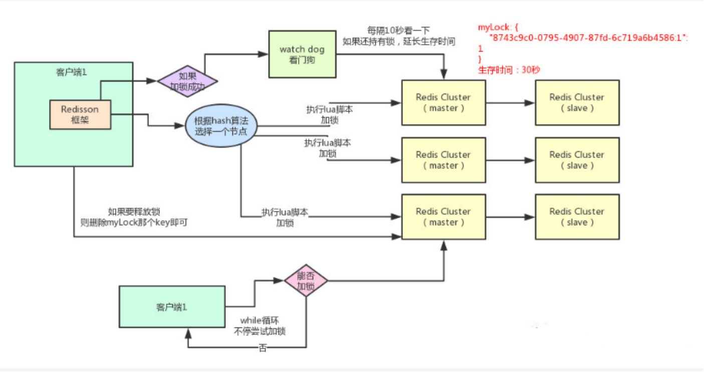

# 分布式锁

## 1、基于Mysql分布式锁实现

**什么是分布式锁**？

当多个进程在同一个系统中，用分布式锁控制多个进程对资源的访问。

**分布式锁应用场景**

1. 传统的单体应用单机部署情况下，可以使用java并发处理相关的API进行互斥控制。
2. 分布式系统后由于多线程，多进程分布在不同机器上，使单机部署情况下的并发控制锁策略失效，为了解决跨JVM互斥机制来控制共享资源的访问，这就是分布式锁的来源；分布式锁应用场景大都是高并发、大流量场景。

## 2、基于Redis分布式锁实现

**redis分布式锁实现**

基于Redisson对redis分布式锁的实现；
（1）加锁机制：根据hash节点选择一个客户端执行lua脚本
（2）锁互斥机制：再来一个客户端执行同样的lua脚本会提示已经存在锁，然后进入循环一直尝试加锁
（3）可重入机制
（4）watch dog自动延期机制
（5）释放锁机制

## 3、基于Zookeeper分布式锁实现

## 4、基于Etcd分布式锁实现